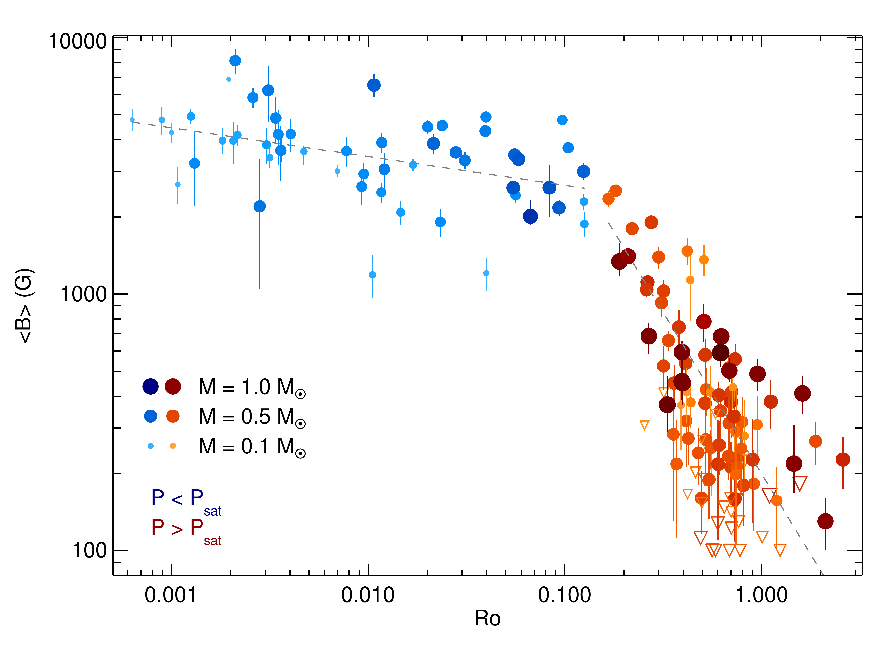
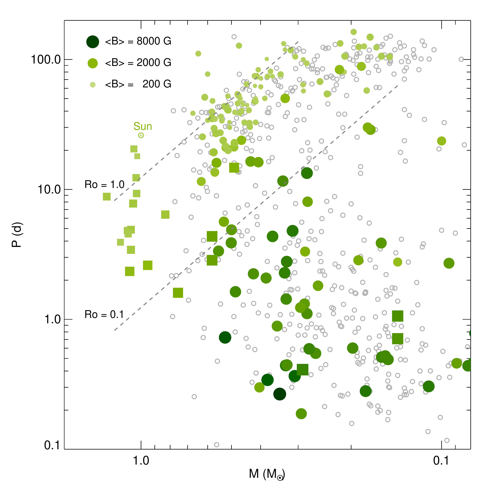
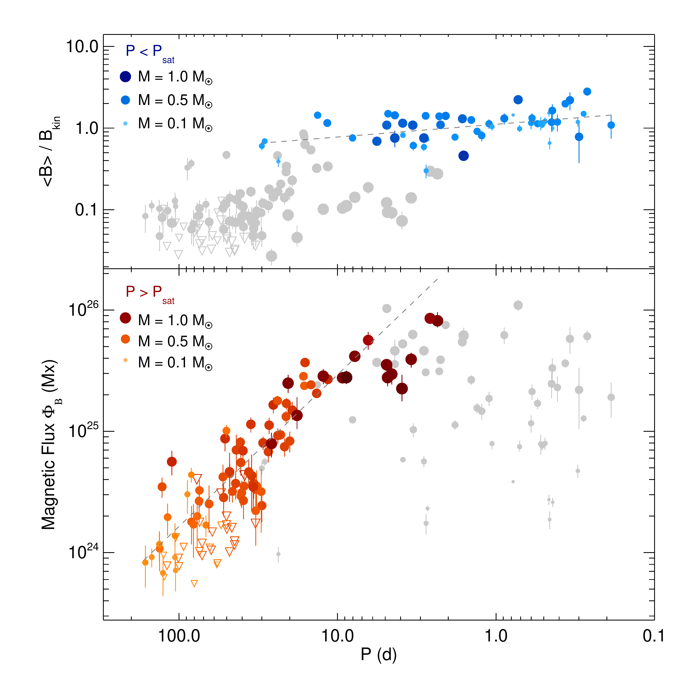

$\newcommand{\ensuremath}{}$
$\newcommand{\xspace}{}$
$\newcommand{\object}[1]{\texttt{#1}}$
$\newcommand{\farcs}{{.}''}$
$\newcommand{\farcm}{{.}'}$
$\newcommand{\arcsec}{''}$
$\newcommand{\arcmin}{'}$

# Magnetism, rotation, and nonthermal emission in cool starsTable
    B.1 is available in electronic form at the CDS via anonymous ftp to
    cdsarc.u-strasbg.fr (130.79.128.5) or via
    http://cdsweb.u-strasbg.fr/cgi-bin/qcat?J/A+A/. MCMC posteriors
    together with all spectral line fits and field component distributions are
    available at http://carmenes.cab.inta-csic.es/.

  _A&A accepted, abstract abbreviated, 20 pages, Table B.1 included in arXiv version, full MCMC posteriors and linefit plots are available at this http URL_

A. Reiners, et al. -- incl., <mark><mark>Th. Henning</mark></mark>, <mark><mark>M. Kürster</mark></mark> 

 **Abstract:** Stellar dynamos generate magnetic fields that are of fundamental     importance to the variability and evolution of Sun-like and low-mass     stars, and for the development of their planetary systems. As a key to     understanding stellar dynamos, empirical relations between stellar     parameters and magnetic fields are required for comparison to ab initio     predictions from dynamo models. We report measurements of surface-average     magnetic fields in 292 M dwarfs from a comparison with radiative transfer     calculations; for 260 of them, this is the first measurement of this     kind. Our data were obtained from more than 15,000 high-resolution     spectra taken during the CARMENES project. They reveal a relation between     average field strength,$\langle B \rangle$, and Rossby number,$Ro$,     resembling the well-studied rotation-activity relation. Among the slowly     rotating stars, we find that magnetic flux,$\Phi_\textrm{B}$, is     proportional to rotation period,$P$, and among the rapidly rotating     stars that average surface fields do not grow significantly beyond the     level set by the available kinetic energy. Furthermore, we find close     relations between nonthermal coronal X-ray emission, chromospheric     H$\alpha$and Ca H\&K emission, and magnetic flux. Taken together, these     relations demonstrate empirically that the rotation-activity relation can     be traced back to a dependence of the magnetic dynamo on rotation.  We     advocate the picture that the magnetic dynamo generates magnetic flux on     the stellar surface proportional to rotation rate with a saturation limit     set by the available kinetic energy, and we provide relations for average     field strengths and nonthermal emission that are independent of the     choice of the convective turnover time. We also find that Ca H\&K     emission saturates at average field strengths of$\langle B \rangle \approx 800$G while H$\alpha$and X-ray emission     grow further with stronger fields in the more rapidly rotating     stars. This is in conflict with the coronal stripping scenario     predicting that in the most rapidly rotating stars coronal plasma would     be cooled to chromospheric temperatures.

**Figure 3. -** \label{fig:BaveRo_diagram} Magnetic field-rotation relation for
    solar-like and low-mass stars. Symbols for stars rotating slower than
    $Ro = 0.13$ are colored red, while those of faster rotators are colored
    blue. Larger and darker symbols indicate higher stellar mass than smaller
    and lighter symbols. The gray dashed lines show linear fits separately for
    the slowly rotating stars ($Ro > 0.13$;
    $\langle B \rangle = 200$ G $\times  Ro^{-1.25}$) and the fast rotators
    ($Ro < 0.13$; $\langle B \rangle =
    2050$ G $\times Ro^{-0.11}$). Downward open triangles show upper limits
    for $\langle B \rangle$.   (*fig:BaveRo_diagram*)

**Figure 2. -** \label{fig:PM-diagram}Period-mass diagram indicating magnetic field
    strength in color and symbol size. Data from this work are shown as
    circles, and other data are shown as squares.  Literature values are from
    \citet{2020A&A...635A.142K} for young Sun-like stars and for seven
    additional targets from \citet{2017NatAs...1E.184S}. The solar datum from
    \citet{2004Natur.430..326T} is annotated. Gray open circles show stars
    with known rotation periods as reported by
    \citet{2017ApJ...834...85N}. Dashed lines show values of the Rossby number
    $Ro = 0.1$ and 1.0, assuming that bolometric luminosity
    $L_\textrm{bol} \propto M^4$ and $\tau \propto L_\textrm{bol}^{-0.5}$ for
    dwarf stars. (*fig:PM-diagram*)

**Figure 4. -** \label{fig:FluxP_diagram}Alternative version of the
    rotation-magnetic field relation. \emph{Top panel:} Ratio of average
    field, $\langle B \rangle$, to kinetic field limit, $B_\textrm{kin}$, as
    function of rotation period. Stars rotating faster than the saturation
    period are colored blue, while other stars are shown in gray. \emph{Bottom
      panel:} Magnetic flux, $\Phi_\textrm{B}$. Stars rotating slower than the
    saturation limit are colored red, while faster rotators are shown in
    gray. Symbols and colors are the same as in
    Fig. \ref{fig:BaveRo_diagram}. See text for details about
    $B_\textrm{kin}$.  (*fig:FluxP_diagram*)

