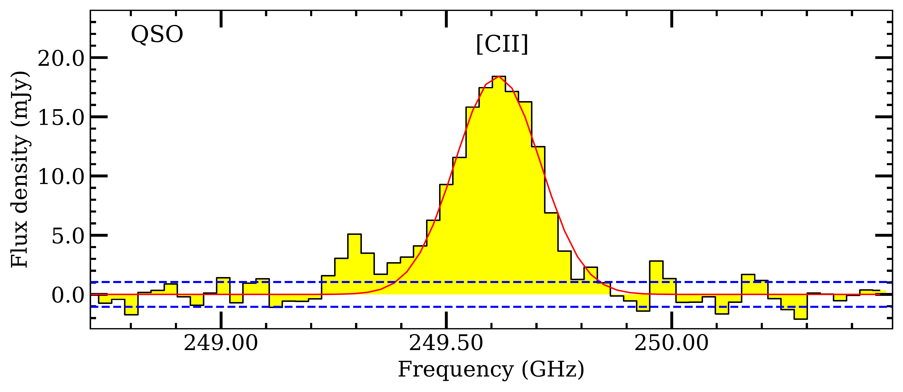
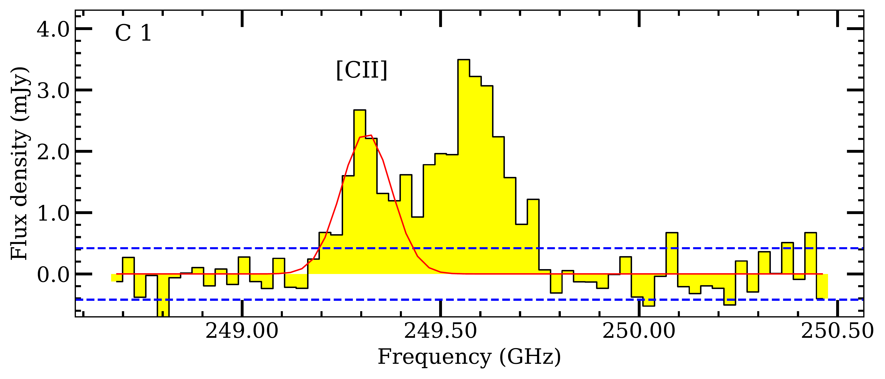
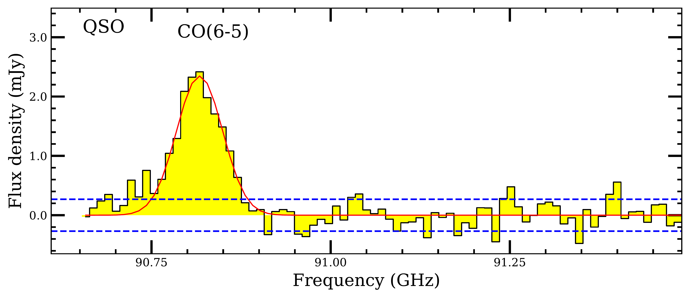
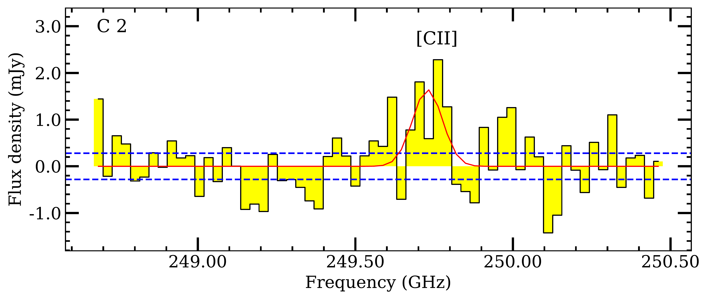
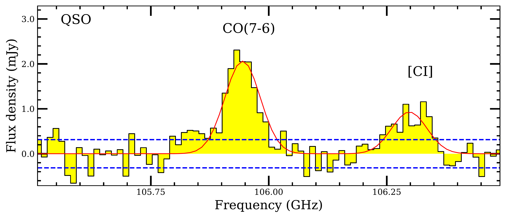
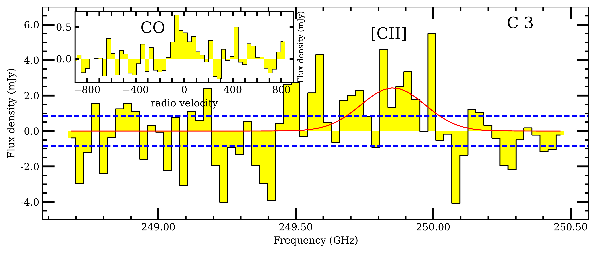
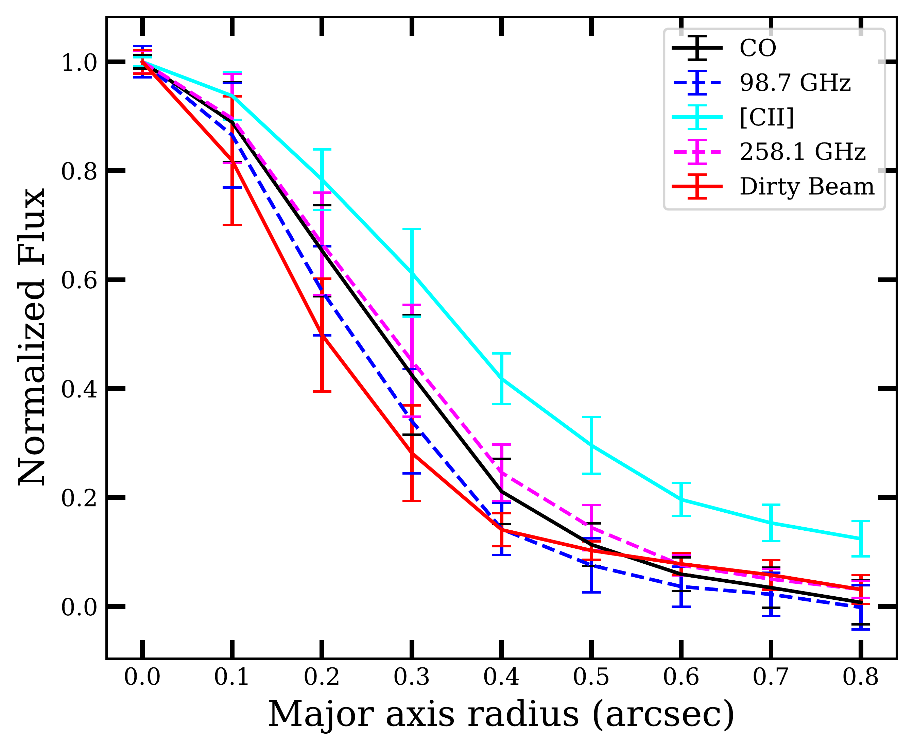
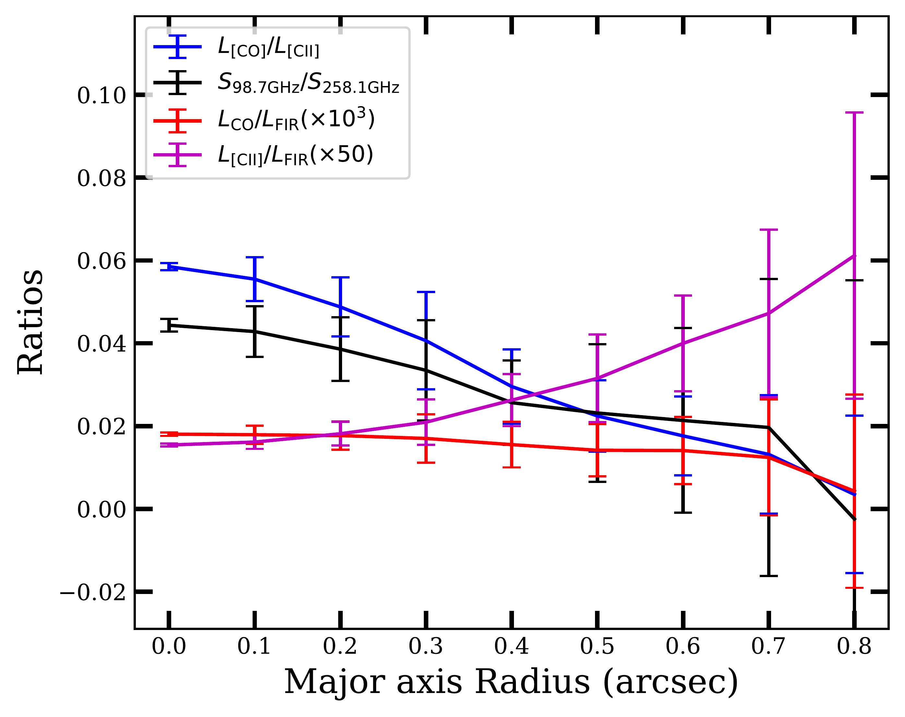
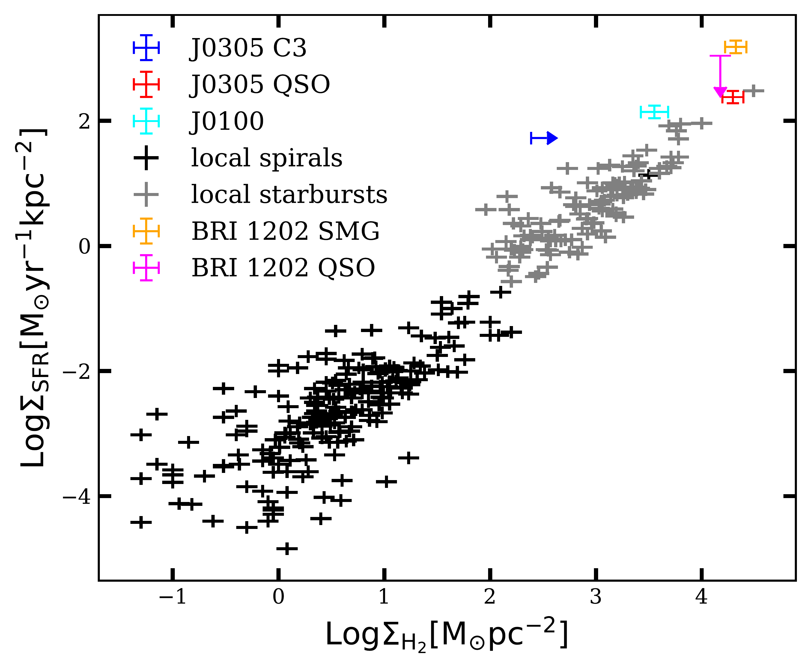
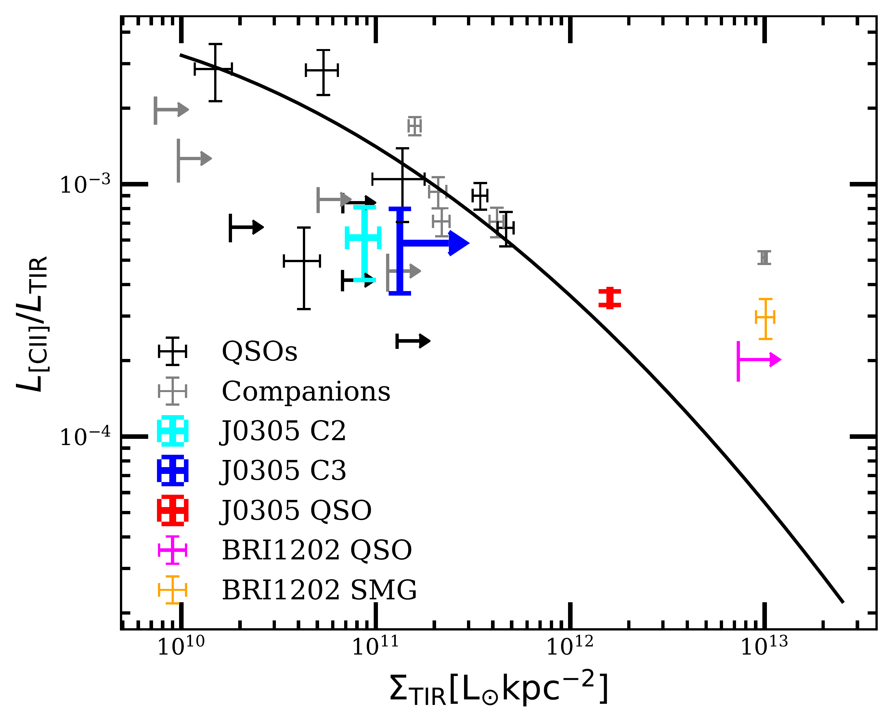

$\newcommand{\ensuremath}{}$
$\newcommand{\xspace}{}$
$\newcommand{\object}[1]{\texttt{#1}}$
$\newcommand{\farcs}{{.}''}$
$\newcommand{\farcm}{{.}'}$
$\newcommand{\arcsec}{''}$
$\newcommand{\arcmin}{'}$
$\newcommand{\ion}[2]{#1#2}$
$\newcommand{\textsc}[1]{\textrm{#1}}$
$\newcommand{\hl}[1]{\textrm{#1}}$
$\newcommand{\footnote}[1]{}$
$\newcommand{\vdag}{(v)^\dagger}$
$\newcommand$
$\newcommand$
$\newcommand{\hii}{\ion{H}{2}}$
$\newcommand{\oiii}{[\ion{O}{3}]_{\rm 88 \mu m}}$
$\newcommand{\oi}{[\ion{O}{1}]_{\rm 146 \mu m}}$
$\newcommand{\lsun}{L_{\sun}}$
$\newcommand{\nele}{n_{e}}$
$\newcommand{\pcubcm}{\rm cm^{-3}}$
$\newcommand{\cotwo}{CO(2-1)}$
$\newcommand{\coone}{CO(1-0)}$
$\newcommand{\ci}{[\ion{C}{1}]_{\rm 369 \mu m} }$
$\newcommand{\cii}{[\ion{C}{2}]_{\rm 158 \mu m} }$
$\newcommand{\cosix}{CO(6-5) }$
$\newcommand{\cosev}{CO(7-6) }$
$\newcommand{\qso}{J0305-3150}$
$\newcommand{\kmps}{\rm km s^{-1}}$
$\newcommand{\mjypb}{\rm mJy  beam^{-1}}$
$\newcommand{\ujypb}{\rm \mu Jy  beam^{-1}}$
$\newcommand{\jykmps}{\rm Jy km s^{-1} }$
$\newcommand{\msun}{\rm M_{\sun}}$

$\newcommand{\ensuremath}{}$
$\newcommand{\xspace}{}$
$\newcommand{\object}[1]{\texttt{#1}}$
$\newcommand{\farcs}{{.}''}$
$\newcommand{\farcm}{{.}'}$
$\newcommand{\arcsec}{''}$
$\newcommand{\arcmin}{'}$
$\newcommand{\ion}[2]{#1#2}$
$\newcommand{\textsc}[1]{\textrm{#1}}$
$\newcommand{\hl}[1]{\textrm{#1}}$
$\newcommand{\footnote}[1]{}$
$\newcommand{\vdag}{(v)^\dagger}$
$\newcommand$
$\newcommand$
$\newcommand{\hii}{\ion{H}{2}}$
$\newcommand{\oiii}{[\ion{O}{3}]_{\rm 88 \mu m}}$
$\newcommand{\oi}{[\ion{O}{1}]_{\rm 146 \mu m}}$
$\newcommand{\lsun}{L_{\sun}}$
$\newcommand{\nele}{n_{e}}$
$\newcommand{\pcubcm}{\rm cm^{-3}}$
$\newcommand{\cotwo}{CO(2-1)}$
$\newcommand{\coone}{CO(1-0)}$
$\newcommand{\ci}{[\ion{C}{1}]_{\rm 369 \mu m} }$
$\newcommand{\cii}{[\ion{C}{2}]_{\rm 158 \mu m} }$
$\newcommand{\cosix}{CO(6-5) }$
$\newcommand{\cosev}{CO(7-6) }$
$\newcommand{\qso}{J0305-3150}$
$\newcommand{\kmps}{\rm km s^{-1}}$
$\newcommand{\mjypb}{\rm mJy  beam^{-1}}$
$\newcommand{\ujypb}{\rm \mu Jy  beam^{-1}}$
$\newcommand{\jykmps}{\rm Jy km s^{-1} }$
$\newcommand{\msun}{\rm M_{\sun}}$

# Spatially resolved molecular interstellar medium in a $z=6.6$ quasar host galaxy

<mark>Appeared on: 2022-04-02</mark> - _12 pages, 6 figures, accepted for publication in ApJ_

<mark>Jianan Li</mark>, et al. -- incl., <mark>Fabian Walter</mark>

**Abstract:** We present high spatial resolution ( $\sim$ 0 $\farcs$ 4, 2.2kpc) observations of the $\cosix$ , $\cosev$ and $\ci$ lines and dust continuum emission from the interstellar medium in the host galaxy of the quasar $\qso$ at $z=6.6$ .These, together with archival $\cii$ data at comparable spatial resolution, enable studies of the spatial distribution and kinematics between the ISM in different phases.When comparing the radial profiles of CO, $\cii$ and the dust continuum, we find that the CO and dust continuum exhibit similar spatial distributions, both of which are less extended than the $\cii$ , indicating that the CO and dust continuum are tracing the same gas component, while the [ CII ] 158um is tracing a more extended one.In addition, we derive the radial profiles of the $\cii$ /CO, $\cii$ /far-infrared (FIR), CO/FIR, and dust continuum $S_{98.7 \rm GHz}/S_{258.1 \rm GHz}$ ratios.We find a decreasing $S_{98.7 \rm GHz}/S_{258.1 \rm GHz}$ ratio with radius, possibly indicating a decrease of dust optical depth with increasing radius.We also detect some of the ISM lines and continuum emission in the companion galaxies previously discovered in the field around $\qso$ .  Through comparing the line-to-line and line-to-FIR ratios, we find no significant differences between the quasar and its companion galaxies.

**Figure 2. -** Left column: Spectra of $\ci$i,  $\cosix$, $\cosev$  for the quasar $\qso$. Data are shown in yellow histograms. The red solid lines are Gaussian profile fits to the spectra with the line centers fixed to the $\ci$i  redshift of $z=6.61391$\citep{venemans19}. The continuum has been subtracted for each of the spectra here displayed. Right column: $\ci$i  spectra for the companion galaxies C1, C2 and C3.  Data are shown in yellow histograms. The red solid lines are Gaussian profile fits to the spectra with the line centers fixed to the $\ci$i  redshift obtained from  $\ci$tet{venemans19}. The blue dashed lines indicate the noise at $\pm$ 1 $\sigma$ level.
The $\ci$i  spectrum of C3 is extracted from an aperture with a radius of 0$\farcs$6.
The spectral channel widths for the quasar and the companion galaxies are 35 $\kmps$.
For the source C3,  we present a stacked spectrum of the $\cosev$  and $\cosix$  lines extracted from the peak positions on the top left of the  $\ci$i  spectrum panel. (*spectra3*)

**Figure 5. -** Left: Radial profiles of different gas and dust continuum tracers. The line fluxes are normalized to the peak pixel fluxes.
Right: Similar as the left panel, but showing the radio profiles of different line ratios.
 (*fig:radial*)

**Figure 6. -** Left:  SFR surface density $vs$ molecular gas surface density for $\qso$  and its companion galaxy C3 (the molecular gas surface densities of C1 and C2 are unable to determine).
Comparison samples include local spiral  ("local spirals") and starburst ("local starbursts") galaxies  from $\ci$tet{kennicutt19} and $\ci$tet{kennicutt21},  the z=4.69 quasar BRI 1202 ("BRI 1202 QSO") and its companion submillimeter galaxy ("BRI 1202  SMG") from $\ci$tet{wagg12} and $\ci$tet{jones16},  and the z=6.33 quasar J0100+2802("J0100") from $\ci$tet{wang19b}. The SFRs of $\qso$  and C3 are calculated using the same formula as that presented in  $\ci$tet{kennicutt21}.
Right: $\ci$i  deficit diagram for the quasar $\qso$  and its companion galaxy C2 and C3 (C1 is not included because of difficulties in constraining the source size).   Assuming the CO lines of C3 to be spatially unresolved, we use the beam size of $\cosix$  as an upper limit for the source size in the TIR surface density estimation of C3.
 "QSOs" and "companions" refer to z$\sim$6 quasar and companion galaxy samples collected from
 $\ci$tet{neelman19} and $\ci$tet{decarli17}.
The black solid line represents the $\ci$i  deficit relation observed in local LIRGs from
$\ci$tet{diaz17}. For the objects in this work and in the comparison samples, the total infrared (TIR) luminosities are estimated from the continuum flux density close to the $\ci$i   line frequency through assuming a modified black body model with temperature of 47K and emissivity of 1.6.
 (*fig:def*)

