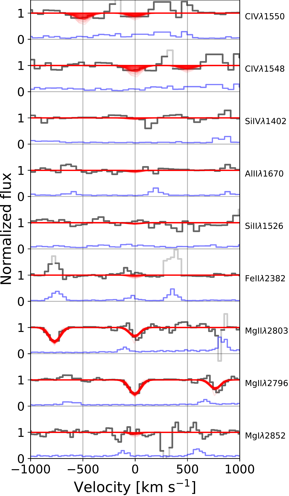
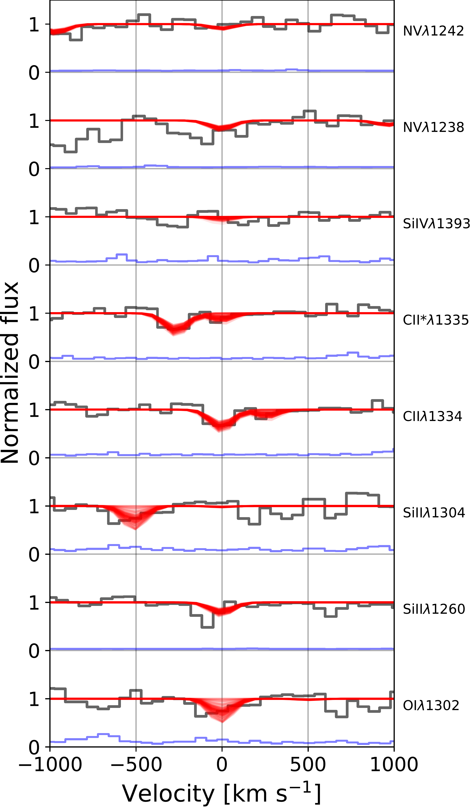
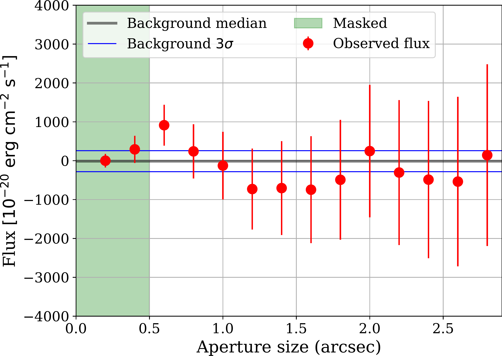

$\newcommand{\ensuremath}{}$
$\newcommand{\xspace}{}$
$\newcommand{\object}[1]{\texttt{#1}}$
$\newcommand{\farcs}{{.}''}$
$\newcommand{\farcm}{{.}'}$
$\newcommand{\arcsec}{''}$
$\newcommand{\arcmin}{'}$
$\newcommand{\ion}[2]{#1#2}$
$\newcommand{\vdag}{(v)^\dagger}$
$\newcommand$
$\newcommand$
$\newcommand{\Lya}{Ly\alpha}$
$\newcommand{\PSOJ}{PSO J083+11}$
$\newcommand{\cii}{\ion{C}{2}}$
$\newcommand{\mgii}{\ion{Mg}{2}}$
$\newcommand{\mgi}{\ion{Mg}{1}}$
$\newcommand{\oi}{\ion{O}{1}}$
$\newcommand{\siii}{\ion{Si}{2}}$
$\newcommand{\alii}{\ion{Al}{2}}$
$\newcommand{\feii}{\ion{Fe}{2}}$
$\newcommand{\civ}{\ion{C}{4}}$
$\newcommand{\hi}{\ion{H}{1}}$

# Staring at the Shadows of Archaic Galaxies: and Metal Absorbers toward a Young z6 Weak-line Quasar

  _22 pages, 12 figures, and 1 table. Accepted for publication in The Astronomical Journal. We welcome the comments from the reader. Related paper: arXiv:2009.07784_

<mark>Irham Taufik Andika</mark>, et al. -- incl., <mark>Knud Jahnke</mark>, <mark>Eduardo Bañados</mark>, <mark>Sarah E. I. Bosman</mark>, <mark>Frederick B. Davies</mark> 

 **Abstract:** We characterize the$\Lya$halo and absorption systems toward$\PSOJ$, a unique$z=6.3401$weak-line quasar, using Gemini/GNIRS, Magellan/FIRE, and VLT/MUSE data.Strong absorptions by hydrogen and several metal lines (e.g.,$\cii$,$\mgii$, and$\oi$) are discovered in the spectrum, which indicates the presence of: (i) a proximate sub-damped$\Lya$(sub-DLA) system at$z=6.314$and (ii) a$\mgii$absorber at$z=2.2305$.To describe the observed damping wing signal, we model the$\Lya$absorption with a combination of a sub-DLA with the neutral hydrogen column density of$\log N_\mathrm{HI} = 20.03 \pm 0.30 \mathrm{cm^{-2}}$and absorption from the intergalactic medium with a neutral fraction of around 10\%.The sub-DLA toward$\PSOJ$has an abundance ratio of[C/O]$=-0.04 \pm 0.33$and metallicity of[O/H]$=-2.19 \pm 0.44$, similar to those of low-redshift metal-poor DLAs.These measurements suggest that the sub-DLA might truncate$\PSOJ$'s proximity zone size and complicate the quasar lifetime measurement.However, this quasar shows no sign of a$\Lya$halo in the MUSE datacube, where the estimated$1\sigma$limit of surface brightness is$2.76 \times 10^{-18} \mathrm{erg s^{-1} cm^{-2} arcsec^{-2}}$at aperture size of 1$\arcsec$, or equivalent to a$\Lya$luminosity of$\leq 43.46$erg s$^{-1}$.This non-detection, while being only weak independent evidence on its own, is at least consistent with a young quasar scenario, as expected for a quasar with a short accretion timescale.

**Figure 4. -** 
		The MUSE + GNIRS spectrum of $\PSOJ$(black line) and its associated shot noise (grey line).
		The median composite spectrum of the low-redshift quasar analogs is shown as a cyan line with the $1\sigma$ dispersion around the median as a light blue region.
		The composite spectrum gives a decent fit to the main features observed in the $\PSOJ$ spectrum redward of the $\Lya$ emission.
		On the other hand, the PCA model to better predict the blue-side of the quasar spectrum and its $1\sigma$ dispersion are denoted with the red line and shaded region, respectively.
		The wavelength range and spectrum used in the PCA fit to predict $\Lya$ is shown with the red dashed line.
        The inset figure shows the zoom-in to the region around $\Lya$.
        The $\mgii$ $\lambda\lambda2796,2803$ doublet and $\mgi$ $\lambda2853$ absorptions at $z=2.2305$ are marked with blue dotted lines.
        The wavelength ranges highlighted with magenta ($\lambda_\mathrm{obs}=$ 8850--8997 \AA) and green ($\lambda_\mathrm{obs}=$ 9100--9200 \AA) colors are the region of interest for creating the $\Lya$ pseudo-narrowband and continuum images, respectively.
	 (*fig:spec_model_wide*)

**Figure 3. -** 
		The velocity stack of the sub-DLA metal absorption lines at $z=6.314$ observed in the continuum-normalized combined MUSE + FIRE spectrum.
		The data are shown as black lines with fitted models superposed in red.
		Note that the width of the red lines corresponds to the model uncertainty (see Section \ref{sec:absline_analysis}).
		Blue curves show a $1\sigma$ shot noise spectrum.
		We use grey lines to show the data in regions with high noise due to skylines.
		The absorptions from $\mgii$ $\lambda\lambda2796,2803$ doublet and  $\cii$ $\lambda1334$ are clearly seen while there is only a marginal detection of $\oi$ $\lambda1302$.
        Finally, the other associated metals like $\siii$, $\alii$, and $\feii$ which one would expect specifically for a strong absorber are not apparent in the spectrum.
	 (*fig:absline*)

**Figure 1. -** The azimuthally averaged radial light profile of $\PSOJ$'s $\Lya$ emission measured from the PSF-subtracted pseudo-narrowband image.
    Tentative detection of the halo flux within a 0$\farcs$6 aperture radius is observed, but there are no apparent extended $\Lya$ emissions beyond this radius.
     (*fig:halo_flux*)

