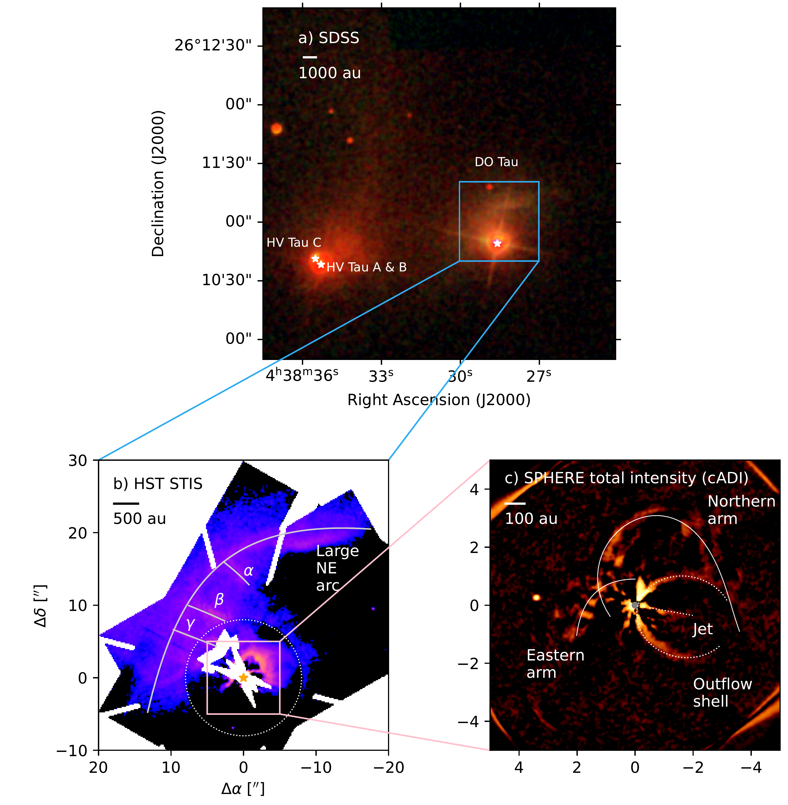
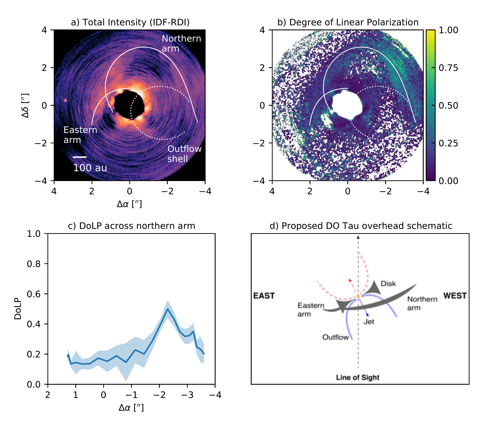
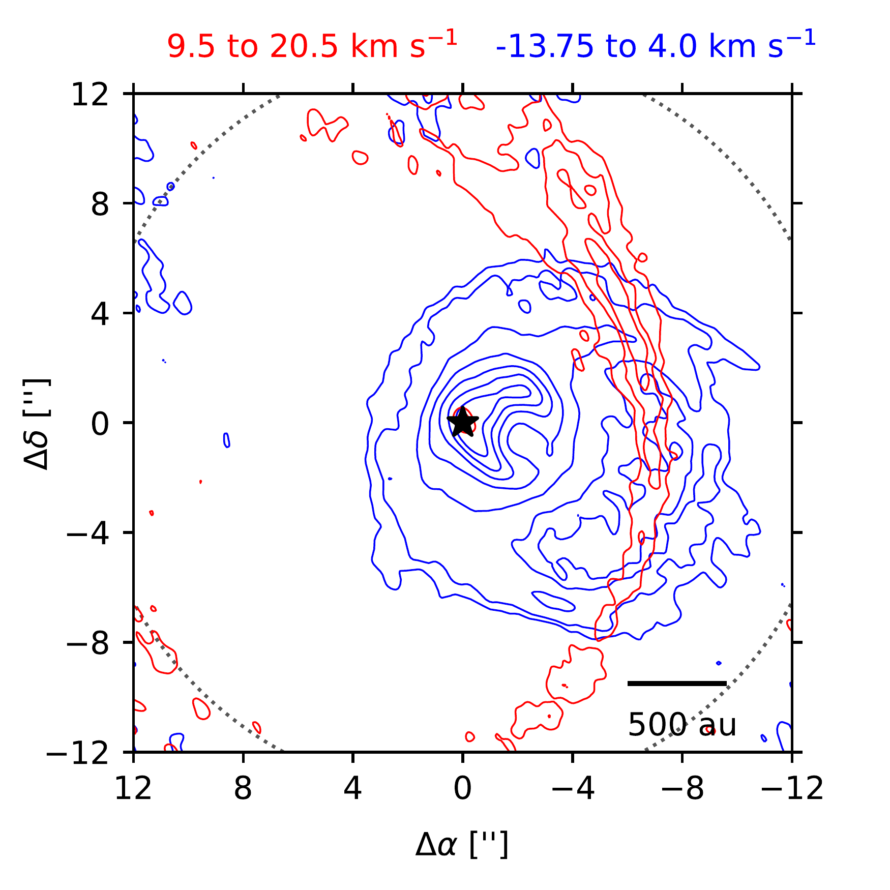

$\newcommand{\ensuremath}{}$
$\newcommand{\xspace}{}$
$\newcommand{\object}[1]{\texttt{#1}}$
$\newcommand{\farcs}{{.}''}$
$\newcommand{\farcm}{{.}'}$
$\newcommand{\arcsec}{''}$
$\newcommand{\arcmin}{'}$
$\newcommand{\ion}[2]{#1#2}$
$\newcommand{\url}[1]{\href{#1}{#1}}$
$\newcommand{\dodoi}[1]{doi:~\href{http://doi.org/#1}{\nolinkurl{#1}}}$
$\newcommand{\doeprint}[1]{\href{http://ascl.net/#1}{\nolinkurl{http://ascl.net/#1}}}$
$\newcommand{\doarXiv}[1]{\href{https://arxiv.org/abs/#1}{\nolinkurl{https://arxiv.org/abs/#1}}}$
$\newcommand{\vdag}{(v)^\dagger}$
$\newcommand$
$\newcommand$
$\newcommand{\}{natexlab}$

$\newcommand{$\ensuremath$}{}$
$\newcommand{$\xspace$}{}$
$\newcommand{$\object$}[1]{\texttt{#1}}$
$\newcommand{$\farcs$}{{.}''}$
$\newcommand{$\farcm$}{{.}'}$
$\newcommand{$\arcsec$}{''}$
$\newcommand{$\arcmin$}{'}$
$\newcommand{$\ion$}[2]{#1#2}$
$\newcommand{$\url$}[1]{\href{#1}{#1}}$
$\newcommand{$\dodoi$}[1]{doi:~\href{http://doi.org/#1}{\nolinkurl{#1}}}$
$\newcommand{$\doeprint$}[1]{\href{http://ascl.net/#1}{\nolinkurl{http://ascl.net/#1}}}$
$\newcommand{$\doarXiv$}[1]{\href{https://arxiv.org/abs/#1}{\nolinkurl{https://arxiv.org/abs/#1}}}$
$\newcommand{$\vdag$}{(v)^\dagger}$
$\newcommand$
$\newcommand$
$\newcommand{\}{natexlab}$

# Disk Evolution Study Through Imaging of Nearby Young Stars(DESTINYS): A Panchromatic View of DO Tau's Complex Kilo-au Environment

 _41 pages, 20 figures, accepted by ApJ, reduced data available at this https URL_

Jane Huang, et al. -- incl., <mark>Paola Pinilla</mark>, <mark>Jonathan P. Williams</mark>

**Abstract:** While protoplanetary disks are often treated as isolated systems in planet formation models, observations increasingly suggest that vigorous interactions between Class II disks and their environments are not rare. DO Tau is a T Tauri star that has previously been hypothesized to have undergone a close encounter with the HV Tau system. As part of the DESTINYS ESO Large Programme, we present new VLT/SPHERE polarimetric observations of DO Tau and combine them with archival HST scattered light images and ALMA observations of CO isotopologues and CS to map a network of complex structures. The SPHERE and ALMA observations show that the circumstellar disk is connected to arms extending out to several hundred au. HST and ALMA also reveal stream-like structures northeast of DO Tau, some of which are at least several thousand au long. These streams appear not to be gravitationally bound to DO Tau, and comparisons with previous Herschel far-IR observations suggest that the streams are part of a bridge-like structure connecting DO Tau and HV Tau. We also detect a fainter redshifted counterpart to a previously known blueshifted CO outflow. While some of DO Tau's complex structures could be attributed to a recent disk-disk encounter, they might be explained alternatively by interactions with remnant material from the star formation process. These panchromatic observations of DO Tau highlight the need to contextualize the evolution of Class II disks by examining processes occurring over a wide range of size scales.

**Figure 6. -** a) SDSS color composite image of DO Tau and HV Tau made from $g$, $r$, and $i$-band images. The blue box shows the relative size of the STIS image shown in part b). The white stars mark the locations of HV Tau A and B, HV Tau C, and DO Tau (only a single star is used to mark HV Tau A and B because of their close proximity). b) HST STIS image of DO Tau, smoothed by convolving with a 2-D Gaussian with a standard deviation of $0.1"$(equal to two pixels). The gray curves mark the locations of the large northeastern arc and the $\alpha$, $\beta$, and $\gamma$ streams. The yellow star shows the location of DO Tau. Pixels falling within the coronagraphic wedges or stellar diffraction spikes are masked. The dotted white circle denotes the region where PSF subtraction was performed with KLIP. The pink box shows the relative size of the SPHERE image in part c). The axes are marked with the angular offsets from DO Tau. c) SPHERE $H-$band total intensity image of DO Tau, produced with cADI and smoothed by convolving with a 2-D Gaussian with a standard deviation of $0.0368"$(equal to three pixels). The solid curves mark the northern and eastern arms, the dotted white curve marks the outflow shell, and the dotted line marks the jet. The gray circle denotes the extent of the coronagraph. Versions of the STIS and SPHERE images with colorbars and no annotations are presented in Appendix \ref{sec:noannotations}. (*fig:SDSS*)

**Figure 8. -** a) SPHERE total intensity image of DO Tau produced with IDF-RDI. The image is binned by a factor of 2 relative to the native IRDIS pixel resolution in order to increase the SNR of the extended structures, which are marked by white curves. The central region is masked because the presence of a disk around the PSF reference star prevents accurate estimates of total intensity at small separations from DO Tau. b) Degree of linear polarization map for DO Tau. Values less than 0 or greater than 1 are masked because they are unphysical. c) DoLP values measured across the northern arm. The blue curve denotes the mean values measured within 6-pixel $\times$ 6-pixel boxes (roughly $0.15"\times0.15"$) centered on points along the white curve corresponding to the northern arm in part b). The shaded region shows the standard deviation measured within each of these boxes. d) A schematic of an overhead view of the different structures traced by SPHERE around DO Tau, showing how various structures are inclined relative to the line of sight. North points out of the page and south points into the page. The structures are not drawn to scale. The redshifted jet and outflow are drawn with dashed curves because they are not detected with SPHERE, but are known to be present based on other observations (see \citealt{2021AA...650A..46E} and Section \ref{sec:molecularlines}.) \label{fig:DoLP} (*fig:DoLP*)

**Figure 1. -** Overlaid integrated intensity maps of the high-velocity $^{12}$CO emission toward DO Tau. No clipping is applied to make these integrated intensity maps because the redshifted outflow emission levels are low in individual channels. The velocity integration ranges are given at the top of the figure. The blue contours, corresponding to the blueshifted emission, are drawn at 75, 150, 400, 700, 1000, 1300, and 1600 mJy beam$^{-1}$ km s$^{-1}$. The red contours, corresponding to the redshifted emission, are drawn at 50, 100, and 150 mJy beam$^{-1}$ km s$^{-1}$. The black star marks the location of DO Tau. The dotted black circle marks the FWHM of the primary beam. Offsets from the phase center (in arcseconds) are marked in the lower left panel. North is up and east is to the left.  \label{fig:outflow} (*fig:outflow*)

