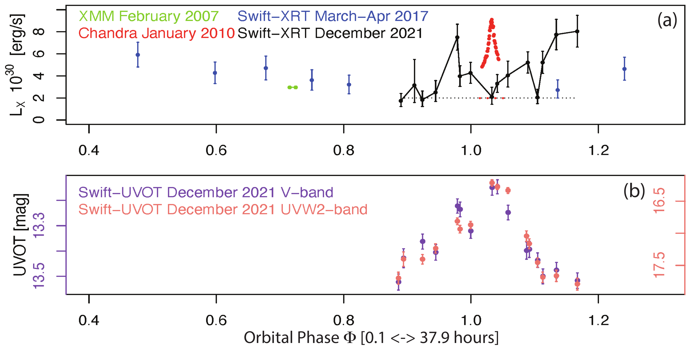

$\newcommand{\ensuremath}{}$
$\newcommand{\xspace}{}$
$\newcommand{\object}[1]{\texttt{#1}}$
$\newcommand{\farcs}{{.}''}$
$\newcommand{\farcm}{{.}'}$
$\newcommand{\arcsec}{''}$
$\newcommand{\arcmin}{'}$
$\newcommand{\ion}[2]{#1#2}$
$\newcommand{\textsc}[1]{\textrm{#1}}$
$\newcommand{\hl}[1]{\textrm{#1}}$
$\newcommand{\vdag}{(v)^\dagger}$
$\newcommand$
$\newcommand$

$\newcommand{\ensuremath}{}$
$\newcommand{\xspace}{}$
$\newcommand{\object}[1]{\texttt{#1}}$
$\newcommand{\farcs}{{.}''}$
$\newcommand{\farcm}{{.}'}$
$\newcommand{\arcsec}{''}$
$\newcommand{\arcmin}{'}$
$\newcommand{\ion}[2]{#1#2}$
$\newcommand{\textsc}[1]{\textrm{#1}}$
$\newcommand{\hl}[1]{\textrm{#1}}$
$\newcommand{\vdag}{(v)^\dagger}$
$\newcommand$
$\newcommand$

# The Young Binary DQ Tau Produces Another X-ray Flare Near Periastron

<mark>Appeared on: 2022-04-04</mark> - _6 pages, 1 figure, 1 table, accepted for publication in RNAAS_

Konstantin V. Getman, et al. -- incl., <mark>Dmitry A. Semenov</mark>, <mark>Sierk E. van Terwisga</mark>

**Abstract:** This work is part of a multi-wavelength program to study the effects of X-ray/UV/optical stellar radiation on the chemistry of the circumbinary disk around the young high-eccentricity binary DQ Tau. ALMA observations for near/around December 5, 2021 periastron were postponed due to bad weather, but supporting Swift-XRT-UVOT TOO observations were successful. These Swift observations along with previous X-ray-optical-mm data show that DQ Tau keeps exhibiting powerful flares near periastron, offering a unique laboratory for studies of flare effects on the gas-phase ion chemistry in protoplanetary disks.

**Figure 1. -** Swift-XRT-UVOT lightcurves near December 05, 2021 periastron passage are compared to previous archived Swift, and _ XMM_/_ Chandra_ X-ray  ([Getman, et. al 2011](https://ui.adsabs.harvard.edu/abs/2011ApJ...730....6G))  data. X-ray "characteristic" level is marked by the dotted lines. X-ray luminosity is for the $[0.5 - 8]$ keV band assuming the new _ Gaia_-based distance $d = 195$ pc.  (*fig1*)

