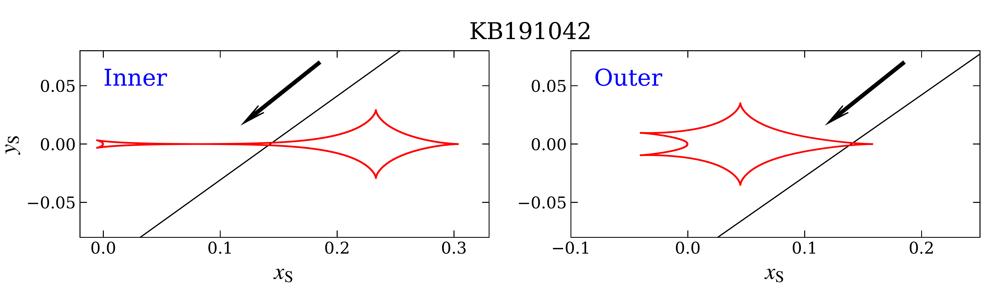
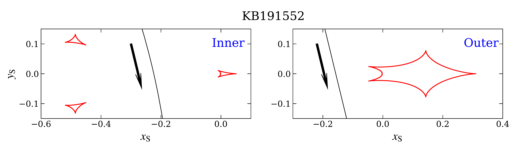
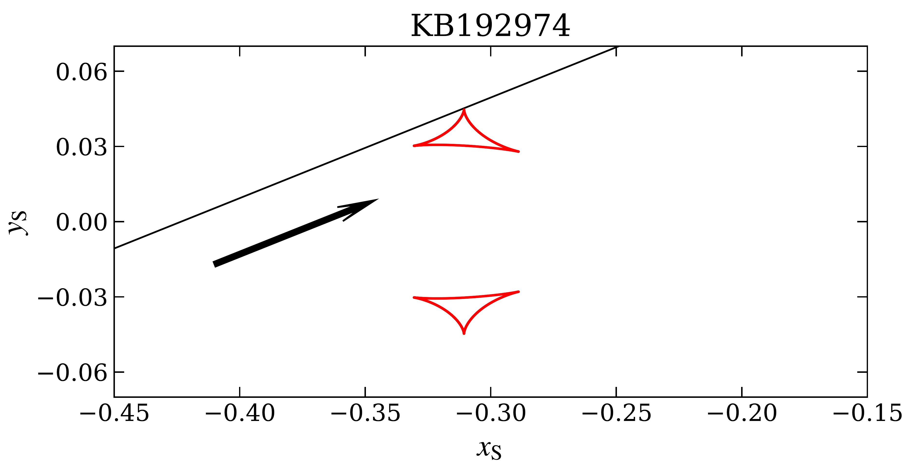

$\newcommand{\ensuremath}{}$
$\newcommand{\xspace}{}$
$\newcommand{\object}[1]{\texttt{#1}}$
$\newcommand{\farcs}{{.}''}$
$\newcommand{\farcm}{{.}'}$
$\newcommand{\arcsec}{''}$
$\newcommand{\arcmin}{'}$
$\newcommand{\ion}[2]{#1#2}$
$\newcommand{\thetae}{\theta_{\rm E}}$
$\newcommand{\teff}{t_{\rm eff}}$
$\newcommand{\Icat}{I_{\rm cat}}$
$\newcommand{\pie}{\vec{\pi}_{\rm E}}$
$\newcommand{\pirel}{\pi_{\rm rel}}$
$\newcommand{\te}{t_{\rm E}}$
$\newcommand{\eventa}{KMT-2019-BLG-1042}$
$\newcommand{\eventb}{KMT-2019-BLG-1552}$
$\newcommand{\eventc}{KMT-2019-BLG-2974}$
$\newcommand{\an}{\theta_{*}}$
$\newcommand{\Sp}{{\it Spitzer}}$
$\newcommand{\hjd}{{\rm HJD}^{\prime}}$
$\newcommand$
$\newcommand$
$\newcommand$
$\newcommand$
$\newcommand$
$\newcommand$
$\newcommand$

$\newcommand{$\ensuremath$}{}$
$\newcommand{$\xspace$}{}$
$\newcommand{$\object$}[1]{$\te$xttt{#1}}$
$\newcommand{$\farcs$}{{.}''}$
$\newcommand{$\farcm$}{{.}'}$
$\newcommand{$\arcsec$}{''}$
$\newcommand{$\arcmin$}{'}$
$\newcommand{$\ion$}[2]{#1#2}$
$\newcommand{$\thetae$}{\theta_{\rm E}}$
$\newcommand{$\teff$}{t_{\rm eff}}$
$\newcommand{$\Icat$}{I_{\rm cat}}$
$\newcommand{$\pie$}{\vec{\pi}_{\rm E}}$
$\newcommand{$\pirel$}{\pi_{\rm rel}}$
$\newcommand{$\te$}{t_{\rm E}}$
$\newcommand{$\eventa$}{KMT-2019-BLG-1042}$
$\newcommand{$\eventb$}{KMT-2019-BLG-1552}$
$\newcommand{$\eventc$}{KMT-2019-BLG-2974}$
$\newcommand{$\an$}{\theta_{*}}$
$\newcommand{$\Sp$}{{\it Spitzer}}$
$\newcommand{$\hjd$}{{\rm HJD}^{\prime}}$
$\newcommand$
$\newcommand$
$\newcommand$
$\newcommand$
$\newcommand$
$\newcommand$
$\newcommand$

#  Systematic KMTNet Planetary Anomaly Search. IV. Complete Statistical Sample of 2019 Prime-Field Microlensing Planets

 _7 figures and 7 tables; submitted_

Weicheng Zang, et al. -- incl., <mark><mark>Chung-Uk Lee</mark></mark>, <mark><mark>Andrew Gould</mark></mark>, <mark><mark>Xiangyu Zhang</mark></mark>, <mark><mark>Seung-Lee Kim</mark></mark>, <mark><mark>Dong-Joo Lee</mark></mark>, <mark><mark>Yongseok Lee</mark></mark>

**Abstract:** We report the complete statistical planetary sample from the prime fields ($\Gamma \geq 2 {\rm hr}^{-1}$) of the 2019 Korea Microlensing Telescope Network (KMTNet) microlensing survey. We develop the optimized KMTNet AnomalyFinder algorithm and apply it to the 2019 KMTNet prime fields. We find a total of 14 homogeneously selected planets and report the analysis of three planetary events, KMT-2019-BLG-(1042,1552,2974). The planet-host mass ratios,$q$, for the three planetary events are$6.34 \times 10^{-4}, 4.89 \times 10^{-3}$and$6.18 \times 10^{-4}$, respectively. A Bayesian analysis indicates the three planets are all cold giant planets beyond the snow line of their host stars. The 14 planets are basically uniform in$\log q$over the range$-5.0 < \log q < -1.5$. This result suggests that the planets below$q_{\rm break} = 1.7 \times 10^{-4}$proposed by the MOA-II survey may be more common than previously believed. This work is an early component of a large project to determine the KMTNet mass-ratio function, and the whole sample of 2016--2019 KMTNet events should contain about 120 planets.

**Figure 2. -** Light curve and models for $\eventa$. The open circles with different colors represent the observed data from different data sets. Different models are shown with different colors. The bottom panels display a close-up of the planetary signal and the residuals to different 2L1S models. (*lc1*)

**Figure 3. -** Caustic topologies for the three planetary events. Each of the first two events have two degenerate solutions, while the third has a unique solution. In each panel, the red lines represent the caustic, the black line represents the source trajectory, and the line with an arrow indicates the direction of the source-lens relative motion. (*cau*)

**Figure 4. -** The observed data and two 2L1S models for $\eventb$. The symbols are similar to those in Figure \ref{lc1}. In the bottom panels, for visual clarity, we bin the daily data for each data set. (*lc2*)

