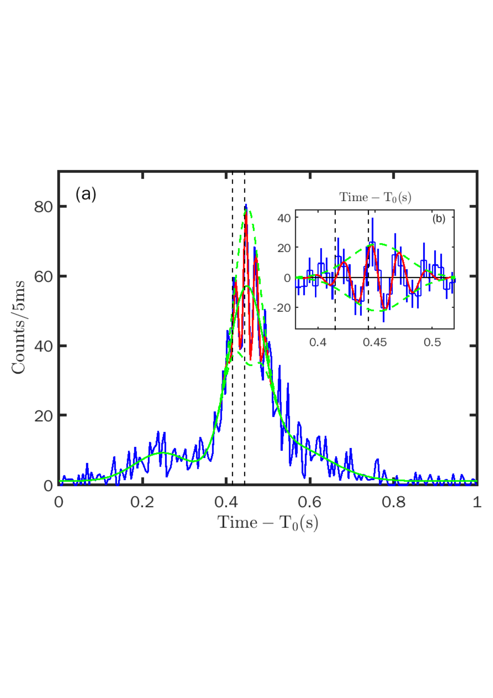
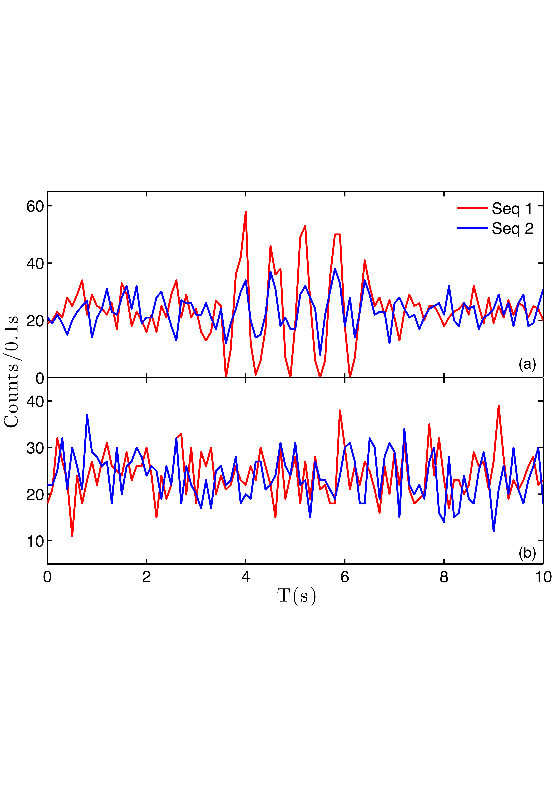
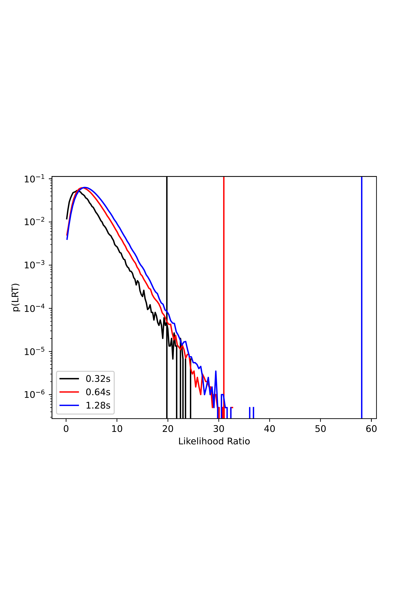

$\newcommand{\ensuremath}{}$
$\newcommand{\xspace}{}$
$\newcommand{\object}[1]{\texttt{#1}}$
$\newcommand{\farcs}{{.}''}$
$\newcommand{\farcm}{{.}'}$
$\newcommand{\arcsec}{''}$
$\newcommand{\arcmin}{'}$
$\newcommand{\ion}[2]{#1#2}$
$\newcommand{\textsc}[1]{\textrm{#1}}$
$\newcommand{\hl}[1]{\textrm{#1}}$
$\newcommand{\vdag}{(v)^\dagger}$
$\newcommand$
$\newcommand$
$\newcommand{\insight}{\textit{Insight}-HXMT}$
$\newcommand{\sgr}{\mbox{SGR~J1935+2154~}}$
$\newcommand{\sgrnos}{\mbox{SGR~J1935+2154}}$
$\newcommand{\modify}[1]{\textcolor{blue}{\textbf{#1}}}$

$\newcommand{\ensuremath}{}$
$\newcommand{\xspace}{}$
$\newcommand{\object}[1]{\texttt{#1}}$
$\newcommand{\farcs}{{.}''}$
$\newcommand{\farcm}{{.}'}$
$\newcommand{\arcsec}{''}$
$\newcommand{\arcmin}{'}$
$\newcommand{\ion}[2]{#1#2}$
$\newcommand{\textsc}[1]{\textrm{#1}}$
$\newcommand{\hl}[1]{\textrm{#1}}$
$\newcommand{\vdag}{(v)^\dagger}$
$\newcommand$
$\newcommand$
$\newcommand{\insight}{\textit{Insight}-HXMT}$
$\newcommand{\sgr}{\mbox{SGR~J1935+2154~}}$
$\newcommand{\sgrnos}{\mbox{SGR~J1935+2154}}$
$\newcommand{\modify}[1]{\textcolor{blue}{\textbf{#1}}}$

# Quasi-periodic oscillations of the X-ray burst from the magnetar SGR J1935+2154 and associated with the fast radio burst FRB 200428

<mark>Appeared on: 2022-04-07</mark> - _17 pages, 13 figures, accepted for publication by ApJ. arXiv admin note: text overlap with arXiv:1212.1011 by other authors. text overlap with arXiv:1212.1011 by other authors_

<mark>Xiaobo Li</mark>, et al. -- incl., <mark>Shuang-Nan Zhang\textsuperscript{*}</mark>, <mark>Bing Zhang</mark>, <mark>Shu Zhang</mark>, <mark>Binbin Zhang</mark>, <mark>Peng Zhang</mark>, <mark>Chengkui Li</mark>, <mark>Tipei Li</mark>, <mark>Li Chen</mark>, <mark>He Gao</mark>, <mark>Chengcheng Guo</mark>, <mark>Bing Li</mark>, <mark>Gang Li</mark>, <mark>Wei Li</mark>, <mark>Xian Li</mark>, <mark>Xufang Li</mark>, <mark>Zhengwei Li</mark>, <mark>Fan Zhang</mark>, <mark>Hongmei Zhang</mark>, <mark>Juan Zhang</mark>, <mark>Wanchang Zhang</mark>, <mark>Wei Zhang</mark>, <mark>Yifei Zhang</mark>, <mark>Yuanhang Zhang</mark>, <mark>Haisheng Zhao</mark>, <mark>Xiaofan Zhao</mark>

**Abstract:** The origin(s) and mechanism(s) of fast radio bursts (FRBs), which are short radio pulses from cosmological distances, have remained a major puzzle since their discovery. We report a strong Quasi-Periodic Oscillation (QPO) of $\sim$ 40 Hz in the X-ray burst from the magnetar \sgr and associated with FRB 200428, significantly detected with the Hard X-ray Modulation Telescope ( _Insight_ -HXMT) and also hinted by the Konus-Wind data. QPOs from magnetar bursts have only been rarely detected; our 3.4 $\sigma$ (p-value is 2.9e-4) detection of the QPO reported here reveals the strongest QPO signal observed from magnetars (except in some very rare giant flares), making this X-ray burst unique among magnetar bursts. The two X-ray spikes coinciding with the two FRB pulses are also among the peaks of the QPO. Our results suggest that at least some FRBs are related to strong oscillation processes of neutron stars.We also show that we may overestimate the significance of the QPO signal and underestimate the errors of QPO parameters if QPO exists only in a fraction of the time series of a X-ray burst which we use to calculate the Leahy-normalized periodogram.

**Figure 2. -** 
Light curve of the X-ray burst in 18--50 keV obtained by $\insight$  /ME with time resolution of 5 ms. The blue line is the light curve after dead time correction. The green line represents the fit result of the burst profile with three Gaussian functions as given in eq. (\ref{eq0}). The red line is the fitted oscillation curve with eq. (\ref{eq2}). The two dashed green lines show the lower and upper envelopes of the amplitude variation of the QPOs described by eq. (\ref{eq_en}). The two vertical dashed lines denote the times of the two radio pulses of FRB 200428. The inset is the light curve around the burst peak with the solid green line subtracted.
 (*fig_MElconly*)

**Figure 11. -** 
Simulated light curves with sinusoidal signals and only white noise. ** Upper panel (a):** simulated light curves with 3 seconds of sinusoidal signals of amplitudes 8 and 24, respectively. ** Lower panel (b):** simulated light curves with only white noise with Poisson expectation value of 24 in each time bin.
 (*fig_sin_lc*)

**Figure 8. -** 
Distributions of likelihood ratio test for 150000, 2000000 and 2000000 simulations of the null hypothesis for 0.32 s (black), 0.64 s (red) and 1.28 s (blue), respectively. The corresponding $H_0$ model is power law, broken power law and broken power law, respectively. The observed values of LRT are indicated as vertical lines. The ratios of the tail area for 0.32 s and 0.64 s are 2.9e-4 and 1e-6, both are indicating that a more complex model including additional Lorentz model may be more appropriate in modeling the periodogram. As for the 1.28 s duration, the tail area is zero and the p-value is an upper limit.
 (*fig_allLRT*)

