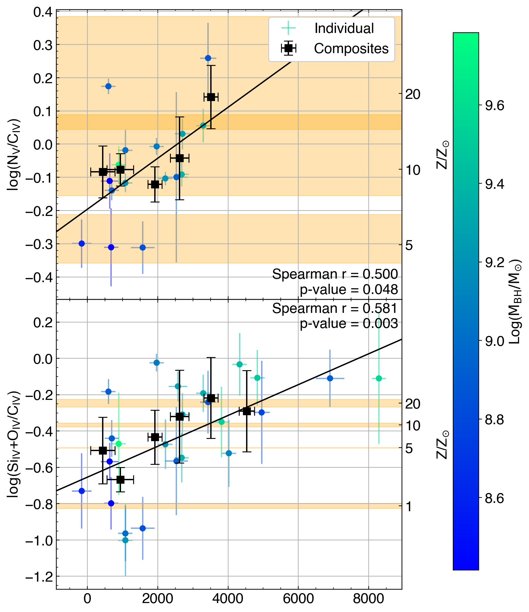
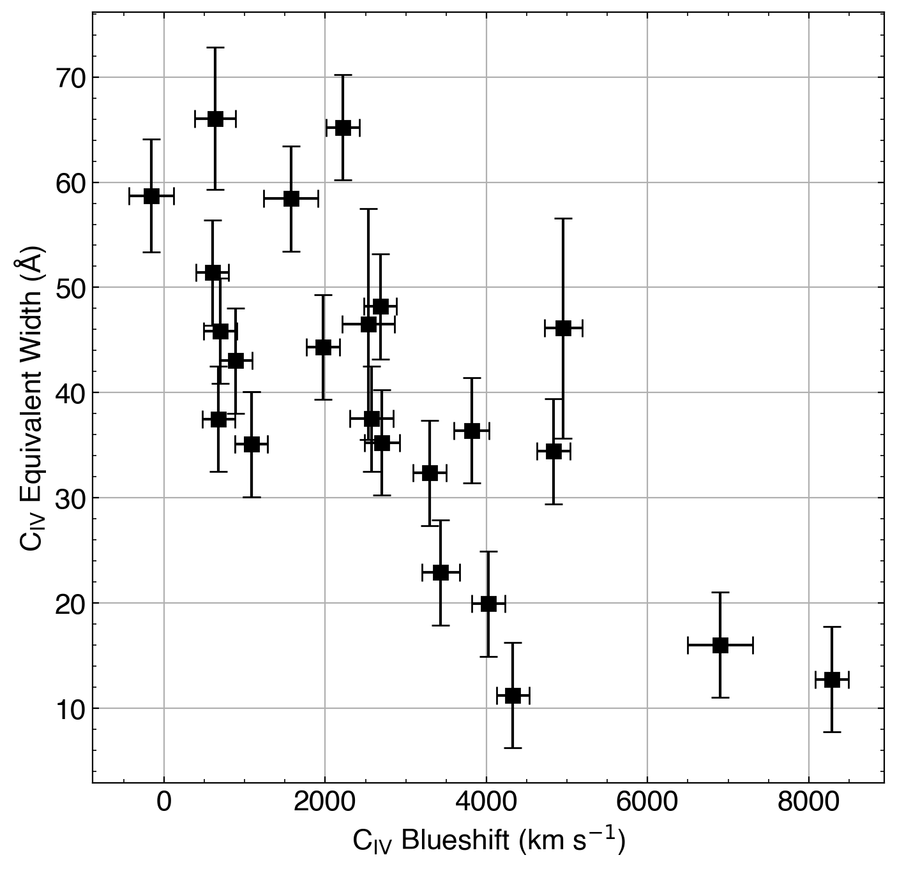
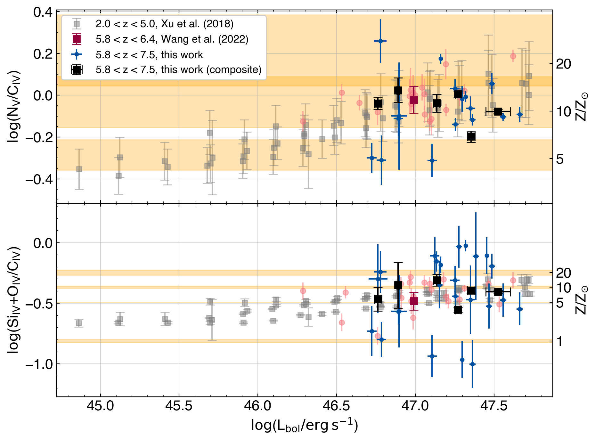
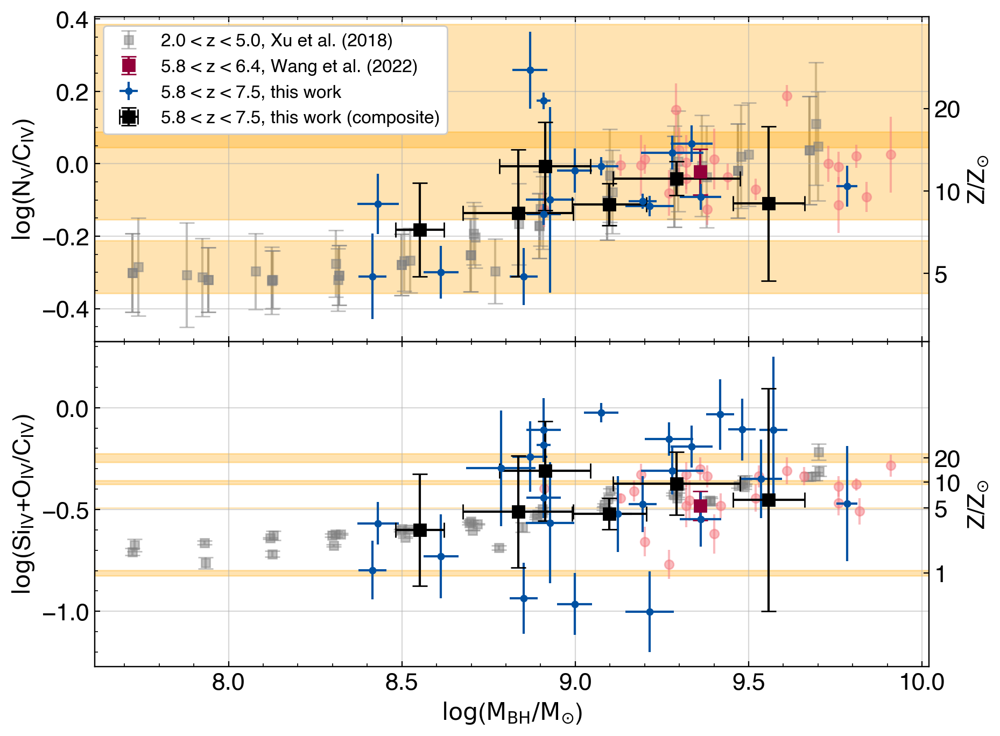

$\newcommand{\ensuremath}{}$
$\newcommand{\xspace}{}$
$\newcommand{\object}[1]{\texttt{#1}}$
$\newcommand{\farcs}{{.}''}$
$\newcommand{\farcm}{{.}'}$
$\newcommand{\arcsec}{''}$
$\newcommand{\arcmin}{'}$
$\newcommand{\ion}[2]{#1#2}$
$\newcommand{\textsc}[1]{\textrm{#1}}$
$\newcommand{\hl}[1]{\textrm{#1}}$
$\newcommand{\footnote}[1]{}$
$\newcommand{\hl}$
$\newcommand{\cii}{C \textsc{ii}]}$
$\newcommand{\ciii}{C \textsc{iii}]}$
$\newcommand{\mgii}{Mg \textsc{ii}}$
$\newcommand{\civ}{C \textsc{iv}}$
$\newcommand{\feii}{Fe \textsc{ii}}$
$\newcommand{\nv}{N \textsc{v}}$
$\newcommand{\niv}{N \textsc{iv}]}$
$\newcommand{\siii}{Si \textsc{ii}}$
$\newcommand{\siiii}{Si \textsc{iii}}$
$\newcommand{\siiv}{Si \textsc{iv}}$
$\newcommand{\oiv}{O \textsc{iv}}$
$\newcommand{\heii}{He \textsc{ii}}$
$\newcommand{\oi}{O \textsc{i}]}$
$\newcommand{\oii}{O \textsc{ii}]}$
$\newcommand{\oiii}{O \textsc{iii}]}$
$\newcommand{\alii}{Al \textsc{ii}}$
$\newcommand{\aliii}{Al \textsc{iii}}$
$\newcommand{\lya}{Ly \textsc{\alpha}}$
$\newcommand{\ciiil}{C \textsc{iii}] \lambda1909}$
$\newcommand{\mgiil}{Mg \textsc{ii} \lambda2799}$
$\newcommand{\civl}{C \textsc{iv} \lambda1549}$
$\newcommand{\nvl}{N \textsc{v} \lambda1240}$
$\newcommand{\nivl}{N \textsc{iv}] \lambda1486}$
$\newcommand{\siiil}{Si \textsc{ii} \lambda1263}$
$\newcommand{\siiiil}{Si \textsc{iii} \lambda1887}$
$\newcommand{\siivl}{Si \textsc{iv} \lambda1398}$
$\newcommand{\oivl}{O \textsc{iv} \lambda1402}$
$\newcommand{\heiil}{He \textsc{ii} \lambda1640}$
$\newcommand{\oiiil}{O \textsc{iii}] \lambda1663}$
$\newcommand{\aliil}{Al \textsc{ii} \lambda1671}$
$\newcommand{\aliiil}{Al \textsc{iii} \lambda1857}$
$\newcommand{\lyal}{Ly \textsc{\alpha} \lambda1216}$
$\newcommand{\nvciv}{\nv/\civ}$
$\newcommand{\siivoivciv}{(\siiv+\oiv)/\civ}$
$\newcommand{\oiiialiiciv}{(\oiii+\alii)/\civ}$
$\newcommand{\aliiiciv}{\aliii/\civ}$
$\newcommand{\siiiiciv}{\siiii/\civ}$
$\newcommand{\ciiiciv}{\ciii/\civ}$
$\newcommand{\angstrom}{\mbox{\normalfontÅ}}$
$\newcommand{\orcidChrisO}{\href{https://orcid.org/0000-0003-0017-349X}{\orcidicon}}$
$\newcommand{\orcidChrisW}{\href{https://orcid.org/0000-0002-4569-016X}{\orcidicon}}$
$\newcommand{\orcidSamuel}{\href{https://orcid.org/0000-0001-9372-4611}{\orcidicon}}$
$\newcommand{\orcidFuyan}{\href{https://orcid.org/0000-0002-1620-0897}{\orcidicon}}$
$\newcommand{\orcidChiara}{\href{https://orcid.org/0000-0002-5941-5214}{\orcidicon}}$
$\newcommand{\orcidJT}{\href{https://orcid.org/0000-0002-4544-8242}{\orcidicon}}$
$\newcommand{\orcidOnoue}{\href{https://orcid.org/0000-0003-2984-6803}{\orcidicon}}$
$\newcommand{\orcidValentina}{\href{https://orcid.org/0000-0003-3693-3091}{\orcidicon}}$
$\newcommand{\orcidManuela}{\href{https://orcid.org/0000-0002-4314-021X}{\orcidicon}}$
$\newcommand{\orcidjinyi}{\href{https://orcid.org/0000-0001-5287-4242}{\orcidicon}}$
$\newcommand{\orcidfanxiaohui}{\href{https://orcid.org/0000-0003-3310-0131}{\orcidicon}}$
$\newcommand{\orcidACE}{\href{https://orcid.org/0000-0003-2895-6218}{\orcidicon}}$
$\newcommand{\orcidFeige}{\href{https://orcid.org/0000-0002-7633-431X}{\orcidicon}}$
$\newcommand{\orcidEPF}{\href{https://orcid.org/0000-0002-6822-2254}{\orcidicon}}$
$\newcommand{\orcidSarahBosman}{\href{https://orcid.org/$
$0000-0001-8582-7012}{\orcidicon}}$
$\newcommand{\orcidYongda}{\href{https://orcid.org/$
$0000-0003-3307-7525}{\orcidicon}}$
$\newcommand{\orcidFabian}{\href{https://orcid.org/0000-0003-4793-7880}{\orcidicon}}$
$\newcommand{\orcidGeorgeB}{\href{https://orcid.org/0000-0003-2344-263X}{\orcidicon}}$
$\newcommand{\orcidGuido}{\href{https://orcid.org/0000-0002-6830-9093}{\orcidicon}}$
$\newcommand{\orcidEduardo}{\href{https://orcid.org/0000-0002-2931-7824}{\orcidicon}}$
$\newcommand{\thebibliography}{\DeclareRobustCommand{\VAN}[3]{##3}\VANthebibliography}$

$\newcommand{\ensuremath}{}$
$\newcommand{\xspace}{}$
$\newcommand{\object}[1]{\texttt{#1}}$
$\newcommand{\farcs}{{.}''}$
$\newcommand{\farcm}{{.}'}$
$\newcommand{\arcsec}{''}$
$\newcommand{\arcmin}{'}$
$\newcommand{\ion}[2]{#1#2}$
$\newcommand{\textsc}[1]{\textrm{#1}}$
$\newcommand{\hl}[1]{\textrm{#1}}$
$\newcommand{\footnote}[1]{}$
$\newcommand{\hl}$
$\newcommand{\cii}{C \textsc{ii}]}$
$\newcommand{\ciii}{C \textsc{iii}]}$
$\newcommand{\mgii}{Mg \textsc{ii}}$
$\newcommand{\civ}{C \textsc{iv}}$
$\newcommand{\feii}{Fe \textsc{ii}}$
$\newcommand{\nv}{N \textsc{v}}$
$\newcommand{\niv}{N \textsc{iv}]}$
$\newcommand{\siii}{Si \textsc{ii}}$
$\newcommand{\siiii}{Si \textsc{iii}}$
$\newcommand{\siiv}{Si \textsc{iv}}$
$\newcommand{\oiv}{O \textsc{iv}}$
$\newcommand{\heii}{He \textsc{ii}}$
$\newcommand{\oi}{O \textsc{i}]}$
$\newcommand{\oii}{O \textsc{ii}]}$
$\newcommand{\oiii}{O \textsc{iii}]}$
$\newcommand{\alii}{Al \textsc{ii}}$
$\newcommand{\aliii}{Al \textsc{iii}}$
$\newcommand{\lya}{Ly \textsc{\alpha}}$
$\newcommand{\ciiil}{C \textsc{iii}] \lambda1909}$
$\newcommand{\mgiil}{Mg \textsc{ii} \lambda2799}$
$\newcommand{\civl}{C \textsc{iv} \lambda1549}$
$\newcommand{\nvl}{N \textsc{v} \lambda1240}$
$\newcommand{\nivl}{N \textsc{iv}] \lambda1486}$
$\newcommand{\siiil}{Si \textsc{ii} \lambda1263}$
$\newcommand{\siiiil}{Si \textsc{iii} \lambda1887}$
$\newcommand{\siivl}{Si \textsc{iv} \lambda1398}$
$\newcommand{\oivl}{O \textsc{iv} \lambda1402}$
$\newcommand{\heiil}{He \textsc{ii} \lambda1640}$
$\newcommand{\oiiil}{O \textsc{iii}] \lambda1663}$
$\newcommand{\aliil}{Al \textsc{ii} \lambda1671}$
$\newcommand{\aliiil}{Al \textsc{iii} \lambda1857}$
$\newcommand{\lyal}{Ly \textsc{\alpha} \lambda1216}$
$\newcommand{\nvciv}{\nv/\civ}$
$\newcommand{\siivoivciv}{(\siiv+\oiv)/\civ}$
$\newcommand{\oiiialiiciv}{(\oiii+\alii)/\civ}$
$\newcommand{\aliiiciv}{\aliii/\civ}$
$\newcommand{\siiiiciv}{\siiii/\civ}$
$\newcommand{\ciiiciv}{\ciii/\civ}$
$\newcommand{\angstrom}{\mbox{\normalfontÅ}}$
$\newcommand{\orcidChrisO}{\href{https://orcid.org/0000-0003-0017-349X}{\orcidicon}}$
$\newcommand{\orcidChrisW}{\href{https://orcid.org/0000-0002-4569-016X}{\orcidicon}}$
$\newcommand{\orcidSamuel}{\href{https://orcid.org/0000-0001-9372-4611}{\orcidicon}}$
$\newcommand{\orcidFuyan}{\href{https://orcid.org/0000-0002-1620-0897}{\orcidicon}}$
$\newcommand{\orcidChiara}{\href{https://orcid.org/0000-0002-5941-5214}{\orcidicon}}$
$\newcommand{\orcidJT}{\href{https://orcid.org/0000-0002-4544-8242}{\orcidicon}}$
$\newcommand{\orcidOnoue}{\href{https://orcid.org/0000-0003-2984-6803}{\orcidicon}}$
$\newcommand{\orcidValentina}{\href{https://orcid.org/0000-0003-3693-3091}{\orcidicon}}$
$\newcommand{\orcidManuela}{\href{https://orcid.org/0000-0002-4314-021X}{\orcidicon}}$
$\newcommand{\orcidjinyi}{\href{https://orcid.org/0000-0001-5287-4242}{\orcidicon}}$
$\newcommand{\orcidfanxiaohui}{\href{https://orcid.org/0000-0003-3310-0131}{\orcidicon}}$
$\newcommand{\orcidACE}{\href{https://orcid.org/0000-0003-2895-6218}{\orcidicon}}$
$\newcommand{\orcidFeige}{\href{https://orcid.org/0000-0002-7633-431X}{\orcidicon}}$
$\newcommand{\orcidEPF}{\href{https://orcid.org/0000-0002-6822-2254}{\orcidicon}}$
$\newcommand{\orcidSarahBosman}{\href{https://orcid.org/$
$0000-0001-8582-7012}{\orcidicon}}$
$\newcommand{\orcidYongda}{\href{https://orcid.org/$
$0000-0003-3307-7525}{\orcidicon}}$
$\newcommand{\orcidFabian}{\href{https://orcid.org/0000-0003-4793-7880}{\orcidicon}}$
$\newcommand{\orcidGeorgeB}{\href{https://orcid.org/0000-0003-2344-263X}{\orcidicon}}$
$\newcommand{\orcidGuido}{\href{https://orcid.org/0000-0002-6830-9093}{\orcidicon}}$
$\newcommand{\orcidEduardo}{\href{https://orcid.org/0000-0002-2931-7824}{\orcidicon}}$
$\newcommand{\thebibliography}{\DeclareRobustCommand{\VAN}[3]{##3}\VANthebibliography}$

# Chemical Abundance of $z\sim6$ Quasar Broad-Line Regions in the XQR-30 Sample

<mark>Appeared on: 2022-04-07</mark> - _MNRAS accepted, 24 pages, 17 figures, 4 tables_

Samuel Lai, et al. -- incl., <mark><mark>Sarah E.I. Bosman</mark></mark>, <mark><mark>Fabian Walter</mark></mark>

**Abstract:** The elemental abundances in the broad-line regions of high-redshift quasars trace the chemical evolution in the nuclear regions of massive galaxies in the early universe. In this work, we study metallicity-sensitive broad emission-line flux ratios in rest-frame UV spectra of 25 high-redshift (5.8 < z < 7.5) quasars observed with the VLT/X-shooter and Gemini/GNIRS instruments, ranging over $\log\left({\rm{M}_{\rm{BH}}/\rm{M}_{\odot}}\right)= 8.4-9.8$ in black hole mass and $\log\left(\rm{L}_{\rm{bol}}/\rm{erg   s}^{-1}\right)= 46.7-47.7$ in bolometric luminosity. We fit individual spectra and composites generated by binning across quasar properties: bolometric luminosity, black hole mass, and blueshift of the $\civ$ line, finding no redshift evolution in the emission-line ratios by comparing our high-redshift quasars to lower-redshift (2.0 < z < 5.0) results presented in the literature. Using $\texttt{Cloudy}$ -based locally optimally-emitting cloud photoionisation model relations between metallicity and emission-line flux ratios, we find the observable properties of the broad emission lines to be consistent with emission from gas clouds with metallicity that are at least 2-4 times solar. Our high-redshift measurements also confirm that the blueshift of the $\civ$ emission line is correlated with its equivalent width, which influences line ratios normalised against $\civ$ . When accounting for the $\civ$ blueshift, we find that the rest-frame UV emission-line flux ratios do not correlate appreciably with the black hole mass or bolometric luminosity.

**Figure 3. -** $\nv$civ and $\siiv$oivciv flux ratios as a function of the $\civ$ blueshift of quasars in the sample. Blueshift composites are presented in black while individual fits are mapped onto a blue-green gradient scaled to the black hole mass. The minimum $\civ$ blueshift error is 200 km s$^{-1}$ based on the 1Å wavelength bins, but the contribution from the systemic redshift error is added in quadrature for an average total of 230 km s$^{-1}$ uncertainty. The Spearman correlation coefficients and p-values are derived from the fits to individual quasars. $\hl${The orange shaded space indicates a range of line ratios which are consistent with the metallicity indicated in the secondary axis based on photoionisation calculations with different ionizing SEDs}. The overlapping region in the $\nv$civ plot indicates a sub-space of parameters which is consistent with both $\rm{Z} = 10 \rm{Z}_{\odot}$ and $\rm{Z} = 20 \rm{Z}_{\odot}$. The line ratio correlation with the $\civ$ blueshift is more significant than the correlation with black hole mass or bolometric luminosity. (*fig:blueshift_line_ratio_results*)

**Figure 1. -** $\civ$ equivalent width as a function of $\civ$ blueshift. There is a moderate anti-correlation between these two quantities, implying that weaker $\civ$ lines are more strongly blueshifted and stronger lines are less blueshifted. The outlier with high EW and blueshift is J1216+4519. Its SNR is low ($\sim 7$ per pixel) which is reflected by the large error in EW. (*fig:CIV_blueshift_ew*)

**Figure 9. -** $\nv$civ and $\siiv$oivciv flux ratios as a function of the quasar bolometric luminosity (left) and virially estimated black hole mass (right). The low-redshift sample (2.0 < $z$ < 5.0) indicated in grey is from  ([Xu, et. al (2018)](https://ui.adsabs.harvard.edu/abs/2018MNRAS.480..345X))  while another higher-redshift comparison sample indicated in red is sourced from  ([ and Wang (2022)](https://ui.adsabs.harvard.edu/abs/2022ApJ...925..121W)) . Our sample is presented in blue and black. Square points with capped error bars indicate composites while circular points indicate individual fits. Not all individual quasars involved in the composites are plotted. The single red square denotes the composite from  ([ and Wang (2022)](https://ui.adsabs.harvard.edu/abs/2022ApJ...925..121W)) . The black hole masses in this study and in  ([ and Wang (2022)](https://ui.adsabs.harvard.edu/abs/2022ApJ...925..121W))  are estimated with single-epoch virial estimates using the $\mgii$ emission line, while the  ([Xu, et. al (2018)](https://ui.adsabs.harvard.edu/abs/2018MNRAS.480..345X))  study uses the $\civ$ emission line. $\hl${The orange shaded space indicates a range of line ratios which are consistent with the metallicity indicated in the secondary axis based on photoionisation calculations with different ionizing SEDs}. The overlapping region in the $\nv$civ plot indicates a range of line ratios which is consistent with both $\rm{Z} = 10 \rm{Z}_{\odot}$ and $\rm{Z} = 20 \rm{Z}_{\odot}$\citep[e.g.][]{Hamann_2002, Nagao_2006}. Metallicity values larger than 10 Z$_{\odot}$ are extrapolated. (*fig:line_ratio_Lbol_Mbh*)

