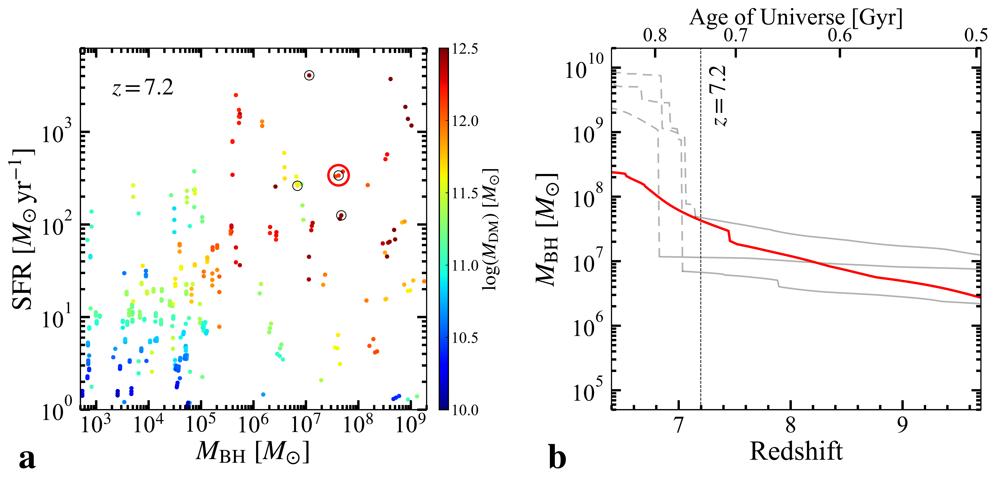
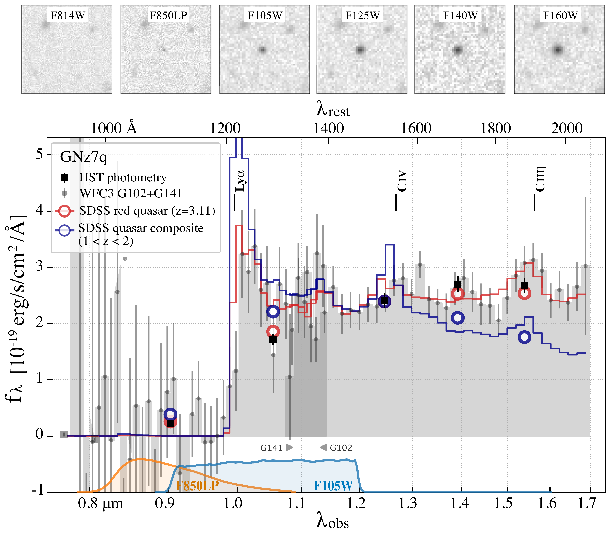
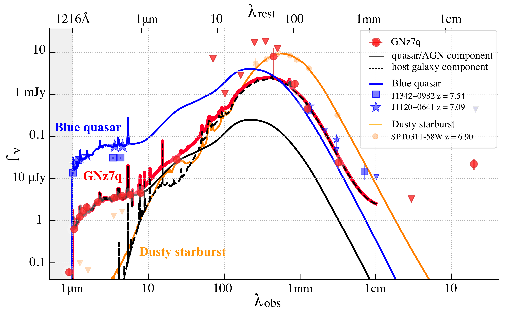

$\newcommand{\ensuremath}{}$
$\newcommand{\xspace}{}$
$\newcommand{\object}[1]{\texttt{#1}}$
$\newcommand{\farcs}{{.}''}$
$\newcommand{\farcm}{{.}'}$
$\newcommand{\arcsec}{''}$
$\newcommand{\arcmin}{'}$
$\newcommand{\ion}[2]{#1#2}$
$\newcommand{\textsc}[1]{\textrm{#1}}$
$\newcommand{\hl}[1]{\textrm{#1}}$
$\newcommand{\hi}{\mbox{H {\scshape i}} }$
$\newcommand{\hii}{\mbox{H {\scshape ii}} }$
$\newcommand{\oiii}{[O {\sc iii}]}$
$\newcommand{\oii}{[O {\sc ii}]}$
$\newcommand{\cii}{[C {\sc ii}]}$
$\newcommand{\ci}{[C {\sc i}](2-1)}$
$\newcommand{\nii}{[N {\sc ii}]}$
$\newcommand{\ciii}{C {\sc iii}]}$
$\newcommand{\civ}{C {\sc iv}}$
$\newcommand{\siiv}{Si {\sc iv}}$
$\newcommand{\lya}{Ly\alpha}$
$\newcommand{\mum}{\mum}$
$\newcommand{\dv}{\Delta v_{\rm Ly\alpha}}$
$\newcommand{\ew}{EW_{\rm 0}}$
$\newcommand{\lsun}{L_{\rm \odot}}$
$\newcommand{\msun}{M_{\rm \odot}}$
$\newcommand{\ltir}{L_{\rm TIR}}$
$\newcommand{\nhi}{N_{\rm HI}}$
$\newcommand{\loiii}{L_{\rm[OIII]}}$
$\newcommand{\llya}{L_{\rm Ly\alpha}}$
$\newcommand{\luv}{L_{\rm UV}}$
$\newcommand{\zph}{z_{\rm ph}}$
$\newcommand{\muv}{M_{\rm UV}}$
$\newcommand{\td}{T_{\rm d}}$
$\newcommand{\bd}{\beta_{\rm d}}$
$\newcommand{\md}{M_{\rm dust}}$
$\newcommand{\zoiii}{z_{\rm[OIII]}}$
$\newcommand{\zlya}{z_{\rm Ly\alpha}}$
$\newcommand{\zsun}{Z_{\rm \odot}}$
$\newcommand{\mdyn}{M_{\rm dyn}}$
$\newcommand{\mgas}{M_{\rm gas}}$
$\newcommand{\mmol}{M_{\rm H_{\rm 2}}}$
$\newcommand{\matom}{M_{\rm H_{\rm I}}}$
$\newcommand{\lir}{L_{\rm IR}}$
$\newcommand{\lirs}{L_{\rm IR,SF}}$
$\newcommand{\lira}{L_{\rm IR,AGN}}$
$\newcommand{\targname}{GNz7q}$
$\newcommand{\tcr}{\textcolor{black}}$
$\newcommand{\tcb}{\textcolor{black}}$
$\newcommand{\tcm}{\textcolor{magenta}}$

$\newcommand{\ensuremath}{}$
$\newcommand{\xspace}{}$
$\newcommand{\object}[1]{\texttt{#1}}$
$\newcommand{\farcs}{{.}''}$
$\newcommand{\farcm}{{.}'}$
$\newcommand{\arcsec}{''}$
$\newcommand{\arcmin}{'}$
$\newcommand{\ion}[2]{#1#2}$
$\newcommand{\textsc}[1]{\textrm{#1}}$
$\newcommand{\hl}[1]{\textrm{#1}}$
$\newcommand{\hi}{\mbox{H {\scshape i}} }$
$\newcommand{\hii}{\mbox{H {\scshape ii}} }$
$\newcommand{\oiii}{[O {\sc iii}]}$
$\newcommand{\oii}{[O {\sc ii}]}$
$\newcommand{\cii}{[C {\sc ii}]}$
$\newcommand{\ci}{[C {\sc i}](2-1)}$
$\newcommand{\nii}{[N {\sc ii}]}$
$\newcommand{\ciii}{C {\sc iii}]}$
$\newcommand{\civ}{C {\sc iv}}$
$\newcommand{\siiv}{Si {\sc iv}}$
$\newcommand{\lya}{Ly\alpha}$
$\newcommand{\mum}{\mum}$
$\newcommand{\dv}{\Delta v_{\rm Ly\alpha}}$
$\newcommand{\ew}{EW_{\rm 0}}$
$\newcommand{\lsun}{L_{\rm \odot}}$
$\newcommand{\msun}{M_{\rm \odot}}$
$\newcommand{\ltir}{L_{\rm TIR}}$
$\newcommand{\nhi}{N_{\rm HI}}$
$\newcommand{\loiii}{L_{\rm[OIII]}}$
$\newcommand{\llya}{L_{\rm Ly\alpha}}$
$\newcommand{\luv}{L_{\rm UV}}$
$\newcommand{\zph}{z_{\rm ph}}$
$\newcommand{\muv}{M_{\rm UV}}$
$\newcommand{\td}{T_{\rm d}}$
$\newcommand{\bd}{\beta_{\rm d}}$
$\newcommand{\md}{M_{\rm dust}}$
$\newcommand{\zoiii}{z_{\rm[OIII]}}$
$\newcommand{\zlya}{z_{\rm Ly\alpha}}$
$\newcommand{\zsun}{Z_{\rm \odot}}$
$\newcommand{\mdyn}{M_{\rm dyn}}$
$\newcommand{\mgas}{M_{\rm gas}}$
$\newcommand{\mmol}{M_{\rm H_{\rm 2}}}$
$\newcommand{\matom}{M_{\rm H_{\rm I}}}$
$\newcommand{\lir}{L_{\rm IR}}$
$\newcommand{\lirs}{L_{\rm IR,SF}}$
$\newcommand{\lira}{L_{\rm IR,AGN}}$
$\newcommand{\targname}{GNz7q}$
$\newcommand{\tcr}{\textcolor{black}}$
$\newcommand{\tcb}{\textcolor{black}}$
$\newcommand{\tcm}{\textcolor{magenta}}$

# \flushleftA dusty compact object bridging galaxies and quasars at cosmic dawn

<mark>Appeared on: 2022-04-13</mark> - _49 pages, 15 figures, 2 tables. Authors' version. Published in the 14 April issue of Nature_

S. Fujimoto, et al. -- incl., <mark><mark>F. Walter</mark></mark>

**Abstract:** Understanding how super-massive black holes form and grow in the early Universe has become a major challenge \cite{volonteri2012,inayoshi2020} since the discovery of luminous quasars only 700 million years after the Big Bang \cite{mortlock2011, banados2018} .Simulations indicate an evolutionary sequence of dust-reddened quasars emerging from heavily dust-obscured starbursts that then transition to unobscured luminous quasars by expelling gas and dust \cite{hopkins2008} .Although the last phase has been identified out to a redshift of 7.6, \cite{wang2021} a transitioning quasar has not been found at similar redshifts owing to their faintness at optical and near-infrared wavelengths. Here we report observations of an ultraviolet compact object, \targname , associated with a dust-enshrouded starburst at a redshift of \boldmath $ z=7.1899\pm0.0005$ .The host galaxy ismore luminous in dust emission than any other known object at this epoch, forming 1,600 solar masses of stars per year within a centralradius of 480 parsec. A red point source in the far-ultraviolet is identified in deep, high-resolution imaging and slitless spectroscopy. \targname is extremely faint in X-rays, which indicates the emergence of a uniquely ultraviolet compact star-forming region or a Compton-thick super-Eddington black-hole accretion disk at the dusty starburst core.In the latter case, the observed properties are consistent with predictions from cosmological simulations \cite{ginolfi2019} and suggest that \targname is an antecedent to unobscured luminous quasars at later epochs.

**Figure 4. -** \small\textbf{$|$
SFR and $M_{\rm BH}$ relations for progenitors of luminous quasars in a cosmological simulation}.
**a.** SFR and BH masses predicted by the semi-analytical model GQd$\ci$te{valiante2016} for selected $z = 7.2$ progenitors of a luminous quasar at $z=6.4$.
Each system is represented by a circle colour-coded by the dark matter halo mass ($M_{\rm DM}$).
The four black circles mark systems that have X-ray, optical, and host galaxy properties similar to $\targname$(See Methods).
**b.**
BH mass assembly history for the systems marked with the black circles in panel ** a**.
At $z = 7.2$, one of them has already grown to $4.0\times10^{7} M_{\odot}$(red circle in panel a) and thereafter it continues to grow by gas accretion and mergers with other BHs to form a SMBH of $M_{\rm BH}=2.5\times10^{8} M_{\odot}$ at $z=6.4$(red line).
The other systems also have relatively low-mass BHs, down to $\sim10^{6.5-7.5} M_{\odot}$ at $z=7.2$(grey lines), but these systems undergo mergers with galaxies hosting more massive BHs.
As a result, these BHs are not the most massive progenitors of the final SMBH, which grows to $\sim10^{9.3-10}$$M_{\odot}$ by $z=6.4$ through gas accretion and mergers with other BH progenitors (grey dashed line).
The black vertical line indicates the redshift of $\targname$.
 (*fig:simulation*)

**Figure 1. -** \small$\tcb${
**$|$ \boldmath *Hubble Space Telescope* near-infrared images and spectrum of $\targname$.**
The spectrum and photometry show a strong Lyman break at $\lambda_\mathrm{obs}\sim1.0 \mu\mathrm{m}$.
The top panels show the _HST_ image cutouts ($5"\times5"$).
The source is unresolved in all deep _HST_ images up to the reddest filter available at $1.6 \mu\mathrm{m}$ (WFC3/IR F160W).
In the bottom panel, the black squares and gray dots respectively show the broadband photometry and the slitless spectrum binned by a factor of 4 relative to the nominal pixel scale.
The error bars denote 1$\sigma$ uncertainties.
The labeled black bars indicate the expected wavelengths for the main emission lines based on the $\cii$ 158-$\mu$m line redshift of $\targname$ at $z=7.1899$.
The blue curve represents a composite spectrum of SDSS optically luminous blue quasars$\ci$te{selsing2016} at $1<z<2$, while the red curve shows a red quasar at $z=3.11$ ($\tcb${SDSS spec-6839-56425-146})$\ci$te{sdss_dr12} whose FUV spectrum resembles that of $\targname$.
Both of the lower-$z$ quasar spectra are shifted to $z=7.1899$, normalized at 1.2 $\mu$m, and binned to the same spectral resolution as the $\targname$ spectrum.
The large open circles show the quasar templates integrated through the _HST_ filter passbands.
The bandpasses of the ACS/F850LP and WFC3/F105W filters shown at the bottom straddle the spectral break, explaining the faint detection in the former and the suppressed flux density relative to the continuum in the latter.} (*fig:grism*)

**Figure 2. -** \small$\tcb${
\textbf{$|$
\boldmath
The spectral energy distribution of $\targname$ from optical to radio wavelengths.}
Photometry is shown for data from _HST_ (0.8--1.6$\mu$m), _Spitzer_ (3.6--24$\mu$m), _Herschel_ (80--500$\mu$m), JCMT (450 and 850$\mu$m), NOEMA (1 and 3 mm) and VLA (3 and 20 cm) in the GOODS-North field (Extended Data Table 1).}
Triangles indicate 3$\sigma$ upper limits.
The sum of the best-fit quasar/AGN (black solid) and galaxy (black dashed) templates is shown as a red curve.
The radio detection at 20 cm is consistent with the enormous implied SFR of the host galaxy (see Methods).
For comparison, we also show the SEDs of other source populations at similar redshifts: optically-luminous blue quasars at $z=7.54$(J1342+0928$\ci$te{banados2018}; blue squares) and $z=7.08$(J1120+0641$\ci$te{mortlock2011}; blue stars), and a dusty starburst at $z=6.90$(SPT0311-58W$\ci$te{marrone2018}; orange circles).
The blue curve is drawn with the quasar/AGN template normalized to J1120+6410's rest-frame UV emission.
The orange curve is the best-fit SED for SPT0311-58W, taken from the  literature$\ci$te{marrone2018}.
The SED of $\targname$ falls between these two categories of the dusty starburst and the blue quasar, representing a transient phase between them.
 (*fig:full_sed*)

