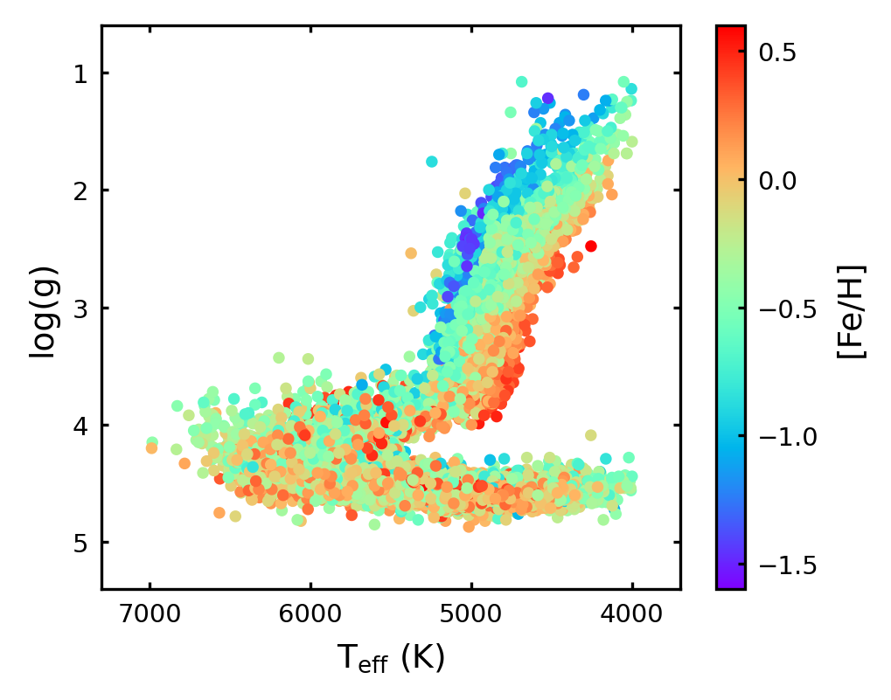
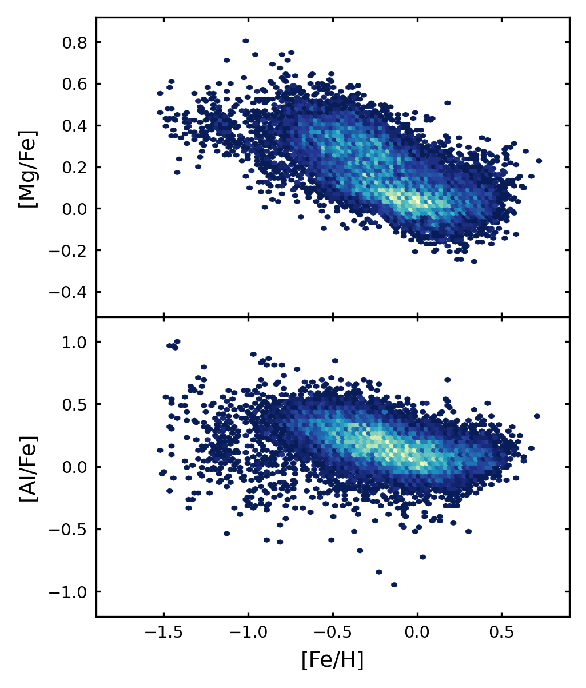
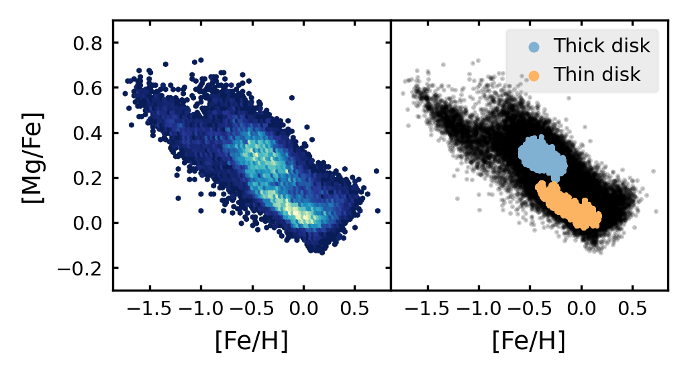
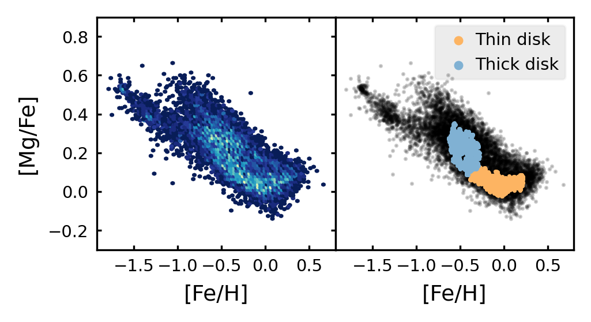

$\newcommand{\ensuremath}{}$
$\newcommand{\xspace}{}$
$\newcommand{\object}[1]{\texttt{#1}}$
$\newcommand{\farcs}{{.}''}$
$\newcommand{\farcm}{{.}'}$
$\newcommand{\arcsec}{''}$
$\newcommand{\arcmin}{'}$
$\newcommand{\ion}[2]{#1#2}$
$\newcommand{\textsc}[1]{\textrm{#1}}$
$\newcommand{\hl}[1]{\textrm{#1}}$
$\newcommand{\footnote}[1]{}$

$\newcommand{\ensuremath}{}$
$\newcommand{\xspace}{}$
$\newcommand{\object}[1]{\texttt{#1}}$
$\newcommand{\farcs}{{.}''}$
$\newcommand{\farcm}{{.}'}$
$\newcommand{\arcsec}{''}$
$\newcommand{\arcmin}{'}$
$\newcommand{\ion}[2]{#1#2}$
$\newcommand{\textsc}[1]{\textrm{#1}}$
$\newcommand{\hl}[1]{\textrm{#1}}$
$\newcommand{\footnote}[1]{}$

# The Gaia-ESO Survey:\\Chemical evolution of Mg and Al in the Milky Way with Machine--Learning$\thanks{Based on observations made with the ESO/VLT, at Paranal Observatory, under program 188.B-3002 (The Gaia-ESO Public Spectroscopic Survey, PIs G. Gilmore and S. Randich). Also based on observations under programs 171.0237 and 073.0234}$

<mark>Appeared on: 2022-08-18</mark> - _Submitted to A&A_

M. Ambrosch, et al. -- incl., <mark><mark>G. Guiglion</mark></mark>, <mark><mark>M. Bergemann</mark></mark>

**Abstract:** To take full advantage of upcoming large-scale spectroscopic surveys, it will be necessary to parameterize millions of stellar spectra in an efficient way. Machine--learning methods, and especially convolutional neural networks, will be one of the main tools for achieving this task. We aim to prepare the machine--learning ground for the next generation of spectroscopic surveys, such as 4MOST and WEAVE. Our goal is to show that convolutional neural networks can predict accurate stellar labels from relevant spectral features in a physically meaningful way. The predicted labels can be used to investigate properties of the Milky Way galaxy. We built a neural network and trained it on GIRAFFE spectra with associated stellar labels from the sixth internal Gaia-ESO data release. Our network architecture contains several convolutional layers that allow the network to identify absorption features in the input spectra. Internal uncertainty is estimated from multiple network models. We used $_t-distributed Stochastic Neighbor Embedding_$ to remove bad spectra from our training sample. Our neural network predicts the atmospheric parameters $_T_$ $\textsubscript{eff}$ and log( $_g_$ ) as well as the chemical abundances [ Mg/Fe ] , [ Al/Fe ] , and [ Fe/H ] for 30 115 stellar spectra. The internal uncertainty is 24 K for $_T_$ $\textsubscript{eff}$ , 0.03 for log( $_g_$ ), 0.02 dex for [ Mg/Fe ] , 0.03 dex for [ Al/Fe ] , and 0.02 dex for [ Fe/H ] . The network gradients reveal that the network is inferring the labels in a physically meaningful way from spectral features. We validated our methodology using benchmark stars and  recovered the properties of different stellar populations in the Milky Way galaxy. Such a study provides very good insights into the application of machine--learning for the analysis of large-scale spectroscopic surveys, such as WEAVE and 4MIDABLE-LR and -HR (4MOST Milky Way disk and bulge low- and high-resolution). The community will have to put a substantial effort in building proactive training sets for machine--learning methods to minimize the possible systematics.

**Figure 1. -** Kiel diagram containing the stars that will be used to train and test our neural network. The color-coding indicates the metallicity gradient in the giant branch stars. (*fig:kiel GES*)

**Figure 2. -** Density plots of [Mg/Fe] vs. [Fe/H](top panel) and [Al/Fe] vs. [Fe/H](bottom panel) for the 14 696  stars in the training and test sets. Brighter colors indicate a higher density of data points. (*fig:MgAl_Fe_hist2d*)

**Figure 10. -** Top panel: Density map of the [Mg/Fe] vs. [Fe/H] distribution of our CNN results for the training+test sample. Brighter colors indicate a higher density of data points. Thin and thick disk populations found by the HDBSCAN algorithm are shown on the right. The two populations correspond to the two separate dense regions on the left panel. Bottom: same plot but for the observed sample composed of 15 419 stars with 20 $\le$ S/N $\le$ 30. (*fig:disks*)

