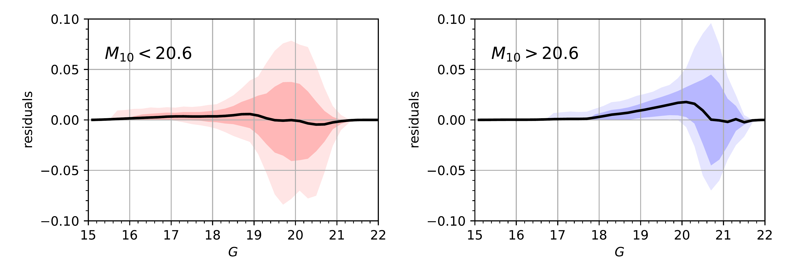
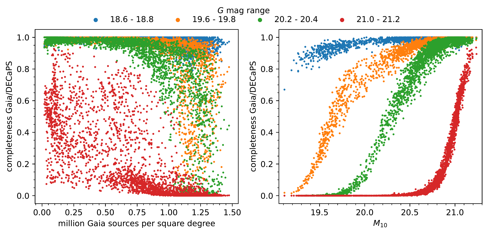
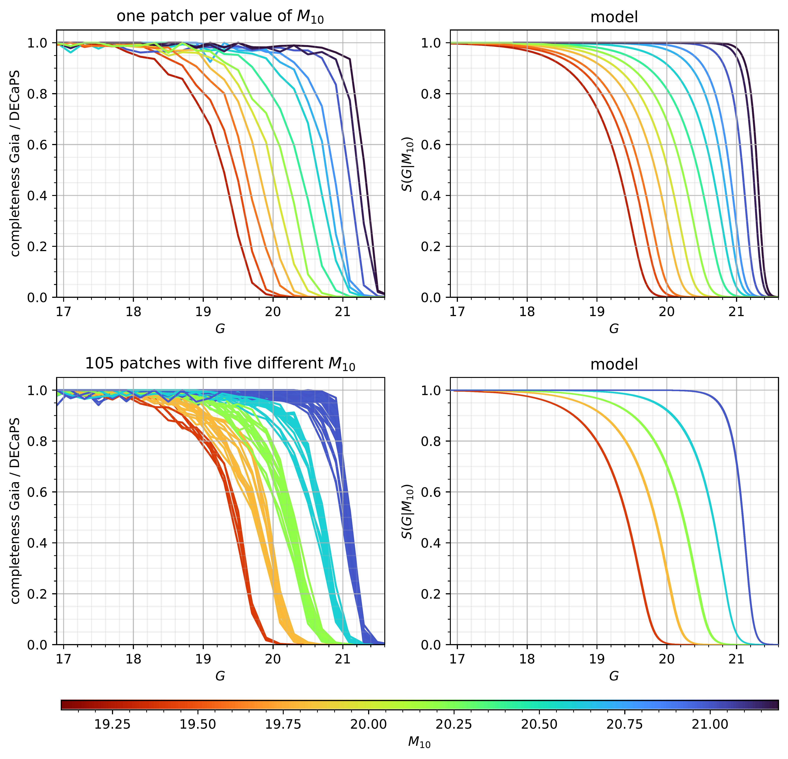

$\newcommand{\ensuremath}{}$
$\newcommand{\xspace}{}$
$\newcommand{\object}[1]{\texttt{#1}}$
$\newcommand{\farcs}{{.}''}$
$\newcommand{\farcm}{{.}'}$
$\newcommand{\arcsec}{''}$
$\newcommand{\arcmin}{'}$
$\newcommand{\ion}[2]{#1#2}$
$\newcommand{\textsc}[1]{\textrm{#1}}$
$\newcommand{\hl}[1]{\textrm{#1}}$
$\newcommand{\Gaia}{{\it Gaia}\xspace}$
$\newcommand{\cat}{\ensuremath{\mathcal{C}}}$
$\newcommand{\vq}{\ensuremath{\mathbf{q}}}$
$\newcommand{ça}{Center for Computational Astrophysics, Flatiron Institute, 162 Fifth Ave, New York, NY 10010, USA}$
$\newcommand{çpp}{Center for Cosmology and Particle Physics, Department of Physics, New~York~University, 726~Broadway, New~York, NY 10003, USA}$
$\newcommand{\mpia}{Max-Planck-Institut für Astronomie, Königstuhl 17, D-69117 Heidelberg, Germany}$
$\newcommand{\leiden}{Leiden Observatory, Leiden University, Niels Bohrweg 2, 2333 CA Leiden, The Netherlands}$
$\newcommand{\cambridge}{Institute of Astronomy, University of Cambridge, Madingley Road, Cambridge CB3 0HA, United Kingdom}$
$\newcommand{\oxford}{Magdalen College, Oxford University, Oxford OX1 4AU, United Kingdom }$
$\newcommand{\torino}{INAF - Osservatorio Astrofisico di Torino, Strada Osservatorio 20, Pino Torinese 10025 Torino, Italy}$
$\newcommand{\monash}{School of Physics and Astronomy, Monash University, VIC 3800, Australia}$
$\newcommand{\harvard}{Department of Physics, Harvard University, 17 Oxford St., Cambridge, MA 02138, USA}$
$\newcommand{\CFA}{Harvard-Smithsonian Center for Astrophysics, 60 Garden St., Cambridge, MA 02138, USA}$
$\newcommand{\Monash}{School of Physics \& Astronomy, Monash University, Clayton 3800, Victoria, Australia}$
$\newcommand{\AstroTD}{Centre of Excellence for Astrophysics in Three Dimensions (ASTRO-3D), Melbourne, Victoria, Australia}$

$\newcommand{\ensuremath}{}$
$\newcommand{\xspace}{}$
$\newcommand{\object}[1]{\texttt{#1}}$
$\newcommand{\farcs}{{.}''}$
$\newcommand{\farcm}{{.}'}$
$\newcommand{\arcsec}{''}$
$\newcommand{\arcmin}{'}$
$\newcommand{\ion}[2]{#1#2}$
$\newcommand{\textsc}[1]{\textrm{#1}}$
$\newcommand{\hl}[1]{\textrm{#1}}$
$\newcommand{\Gaia}{{\it Gaia}\xspace}$
$\newcommand{\cat}{\ensuremath{\mathcal{C}}}$
$\newcommand{\vq}{\ensuremath{\mathbf{q}}}$
$\newcommand{ça}{Center for Computational Astrophysics, Flatiron Institute, 162 Fifth Ave, New York, NY 10010, USA}$
$\newcommand{çpp}{Center for Cosmology and Particle Physics, Department of Physics, New~York~University, 726~Broadway, New~York, NY 10003, USA}$
$\newcommand{\mpia}{Max-Planck-Institut für Astronomie, Königstuhl 17, D-69117 Heidelberg, Germany}$
$\newcommand{\leiden}{Leiden Observatory, Leiden University, Niels Bohrweg 2, 2333 CA Leiden, The Netherlands}$
$\newcommand{\cambridge}{Institute of Astronomy, University of Cambridge, Madingley Road, Cambridge CB3 0HA, United Kingdom}$
$\newcommand{\oxford}{Magdalen College, Oxford University, Oxford OX1 4AU, United Kingdom }$
$\newcommand{\torino}{INAF - Osservatorio Astrofisico di Torino, Strada Osservatorio 20, Pino Torinese 10025 Torino, Italy}$
$\newcommand{\monash}{School of Physics and Astronomy, Monash University, VIC 3800, Australia}$
$\newcommand{\harvard}{Department of Physics, Harvard University, 17 Oxford St., Cambridge, MA 02138, USA}$
$\newcommand{\CFA}{Harvard-Smithsonian Center for Astrophysics, 60 Garden St., Cambridge, MA 02138, USA}$
$\newcommand{\Monash}{School of Physics \& Astronomy, Monash University, Clayton 3800, Victoria, Australia}$
$\newcommand{\AstroTD}{Centre of Excellence for Astrophysics in Three Dimensions (ASTRO-3D), Melbourne, Victoria, Australia}$

# An empirical model of the \Gaia DR3 selection function

<mark>Appeared on: 2022-08-19</mark> - _submitted to A&A_

<mark><mark>Tristan Cantat-Gaudin</mark></mark>, et al. -- incl., <mark><mark>Morgan Fouesneau</mark></mark>, <mark><mark>Hans-Walter Rix</mark></mark>, <mark><mark>Anthony G. A. Brown</mark></mark>, <mark><mark>Gregory M. Green</mark></mark>

**Abstract:** Interpreting and modelling astronomical catalogues requires an understanding of the catalogues' completeness or selection function: objects of what properties had a chance to end up in the catalogue. Here we set out to empirically quantify the completeness of the overall \Gaia DR3 catalogue. This task is not straightforward because \Gaia is the all-sky optical survey with the highest angular resolution to date and no consistent "ground truth" exists to allow direct comparisons.  However, well-characterised deeper imaging enables an empirical assessment of \Gaia 's $G$ -band completeness across parts of the sky.  On this basis, we devised a simple analytical completeness model of \Gaia as a function of the observed $G$ magnitude and position over the sky, which accounts for both the effects of crowding and the complex \Gaia scanning law. Our model only depends on a single quantity: the median magnitude $M_{10}$ in a patch of the sky of catalogued sources with \texttt{astrometric\_matched\_transits} $\leq 10$ . $M_{10}$ reflects elementary completeness decisions in the \Gaia pipeline and is computable from the \Gaia DR3 catalogue itself and therefore applicable across the whole sky. We calibrate our model using the Dark Energy Camera Plane Survey (DECaPS) and test its predictions against Hubble Space Telescope observations of globular clusters. We find that our model predicts \Gaia 's completeness values to a few per cent ( _ RMS_ ) across the sky. We make the model available as a part of the \texttt{gaiasf} Python package built and maintained by the GaiaUnlimited project \thanks{\url{https://github.com/gaia-unlimited/gaiasf}} .

**Figure 7. -**  Mean completeness residuals, i.e. model predicted minus observed completeness,  as a function of magnitude, for patches in two different ranges of $M_{10}$. The shaded areas correspond to the 16th to 84th percentile and 5th to 95th percentile intervals. Expectedly, the residuals are highest near 50\% completeness and smaller in the highly complete or dramatically incomplete regime.
     (*fig:residuals_tworanges*)

**Figure 3. -**  Completeness of $\Gaia$ relative to the DECaPS survey, which is taken as "ground truth", in four magnitude ranges, computed in 3000 distinct patches across the DECaPS footprint. This completeness is shown as a function of $\Gaia$ source density (left) or $M_{10}$(right):  $\Gaia$ source density is a poor predictor of completeness, while the $M_{10}$ parameter --  the median magnitude of catalogued sources with  \texttt{astrometric\_matched\_transits}$\leq 10$ in a surrounding patch of the sky --  is an excellent completeness predictor. $M_{10}$ combines the impact of source density and scanning law, as demonstrated e.g. in Figure \ref{fig:mapM10}.
     (*fig:c_vs_M10_magRanges*)

**Figure 5. -** $\Gaia$'s catalogue completeness $S(G | M_{10})$ as a function of $G$ magnitude for a given completeness parameter $M_{10}$. Top left: empirically determined $\Gaia$$G$ completeness derived from the comparison with DECaPS photometry in thirteen DECaPS patches that are each colour-coded by their $M_{10}$. Top right: model completeness, from Eq. \ref{eq:sigmoid}, for the corresponding $M_{10}$ values. Bottom left: empirically-determined completeness derived from from the comparison with DECaPS photometry in 105 DECaPS patches with $M_{10}$=19.4, 19.8,20.2, 20.6, and 21 (within 0.01 mag). The dispersion at a given $M_{10}$ corresponds to the scatter seen in Fig. \ref{fig:c_vs_M10_magRanges}(right panel) and the residuals in Fig. \ref{fig:residuals_tworanges}. Bottom right: model completeness for these five values of $M_{10}$.
     (*fig:obs_and_model*)

