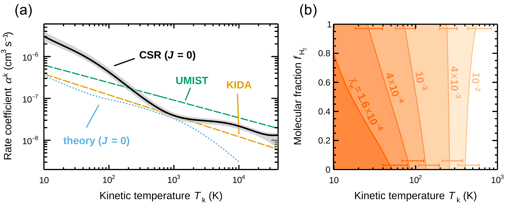

$\newcommand{\ensuremath}{}$
$\newcommand{\xspace}{}$
$\newcommand{\object}[1]{\texttt{#1}}$
$\newcommand{\farcs}{{.}''}$
$\newcommand{\farcm}{{.}'}$
$\newcommand{\arcsec}{''}$
$\newcommand{\arcmin}{'}$
$\newcommand{\ion}[2]{#1#2}$
$\newcommand{\textsc}[1]{\textrm{#1}}$
$\newcommand{\hl}[1]{\textrm{#1}}$
$\newcommand{\footnote}[1]{}$
$\newcommand{\vdag}{(v)^\dagger}$
$\newcommand$
$\newcommand$
$\newcommand$

$\newcommand{\ensuremath}{}$
$\newcommand{\xspace}{}$
$\newcommand{\object}[1]{\texttt{#1}}$
$\newcommand{\farcs}{{.}''}$
$\newcommand{\farcm}{{.}'}$
$\newcommand{\arcsec}{''}$
$\newcommand{\arcmin}{'}$
$\newcommand{\ion}[2]{#1#2}$
$\newcommand{\textsc}[1]{\textrm{#1}}$
$\newcommand{\hl}[1]{\textrm{#1}}$
$\newcommand{\footnote}[1]{}$
$\newcommand{\vdag}{(v)^\dagger}$
$\newcommand$
$\newcommand$
$\newcommand$

# Experimental determination of the dissociative recombination rate coefficient for rotationally-cold CH$^{+}$ and its implications for the diffuse cloud chemistry

<mark>Appeared on: 2022-08-31</mark> - _Main paper: PDFLaTeX with 7 pages, 3 figures. Appendix starting on page 7: PDFLaTeX with 11 pages, 2 figures, 4 tables. This article has been accepted by The Astrophysical Journal_

Daniel Paul, et al. -- incl., <mark>Holger Kreckel</mark>

**Abstract:** Observations of CH $^+$ are used to trace the physical properties of diffuse clouds, but this requires an accurate understanding of the underlying CH $^+$ chemistry. Until this work, the most uncertain reaction in that chemistry was dissociative recombination (DR) of CH $^+$ . Using an electron-ion merged-beams experiment at the Cryogenic Storage Ring, we have determined the DR rate coefficient of the CH $^+$ electronic, vibrational, and rotational ground state applicable for different diffuse cloud conditions. Our results reduce the previously unrecognized order-of-magnitude uncertainty in the CH $^+$ DR rate coefficient to $\sim \pm 20\%$ and are applicable at all temperatures relevant to diffuse clouds, ranging from quiescent gas to gas locally heated by processes such as shocks and turbulence. Based on a simple chemical network, we find that DR can be an important destruction mechanism at temperatures relevant to quiescent gas. As the temperature increases locally, DR can continue to be important up to temperatures of $ \sim\SI{600}{K} $ if there is also a corresponding increase in the electron fraction of the gas. Our new CH $^+$ DR rate coefficient data will increase the reliability of future studies of diffuse cloud physical properties via CH $^+$ abundance observations.

**Figure 4. -** CH$^{+}$ DR kinetic temperature rate coefficient and its relevance for the CH$^{+}$ destruction in diffuse interstellar clouds. (a) The thick solid line shows the experimentally determined $ J=0 $ kinetic temperature rate coefficient of this work. The one-sigma error band in gray represents the quadrature sum of all systematic uncertainties.  The dashed lines indicate rate coefficients from the UMIST (\citealt{McElroy2013}, upper line) and KIDA (\citealt{Wakelam2012}, lower line) astrochemistry databases. The calculated $ J=0 $ rate coefficient of \citet{Mezei2019} is drawn as dotted line. (b) Diffuse cloud parameter ranges where DR is the dominant CH$^+$ destruction process (colored) for a standard electron fraction ($ \chi_{\mathrm{e}}=\SI{1.6e-4}  $) and for enhanced values of $ \chi_{\mathrm{e}} $ as given. One-sigma error bars for $ f_\mathrm{H_2}=1 $ and $ f_\mathrm{H_2}=0 $ are shown at the top and bottom of the figure, respectively. They were calculated from the combined systematic uncertainties for the rate coefficients $ \alpha_\mathrm{H} $($\sim50\%$, \cite{Plasil2011}), $ \alpha_\mathrm{H_2} $($\sim20\%$, \cite{Gerlich2011}), and $ \alpha^\mathrm{k}_{J=0} $($ \sim20\% $, this work). (*fig:plasmarate*)

**Figure 2. -** (a) Schematic of the CSR experimental setup for DR measurements of CH$^+$  and probing of its internal level populations. See text for details. (b) Measured relative $ J $-level populations in the CSR for storage times of $ \SI[parse-numbers=false]{60-80}{s} $ with statistical one-sigma error bars. (c) Relative $ J $-level populations predicted in TSR for a thermal equilibrium at $ T=\SI{300}{K} $. (*fig:setup*)

**Figure 3. -** Merged-beams DR rate coefficient (blue line) for the CH$^{+}$ ground state $X^1\Sigma^+ (v=0,J=0)$ with the statistical one-sigma uncertainties (blue shaded area). The one-sigma uncertainty of the absolute scale is $ \pm13 \% $. The room-temperature TSR results of \citet{Amitay1996}, which have a $ \pm50 \% $ absolute scaling systematic uncertainty, are shown by the gray squares. The symbols and lines on top of the figure indicate the full width at half maximum (FWHM) energy resolution $ \Delta E $ of the CSR and TSR measurements. The divergence of the CSR from the TSR data for $ E_\mathrm{d}\gtrsim\SI{10}{eV} $ is due to contribution from dissociative excitation (see text). The data behind the TSR and CSR graphs are both available. The latter are part of Figure \ref{fig:ratecoeffmeas}(b). (*fig:ratecoeff*)

