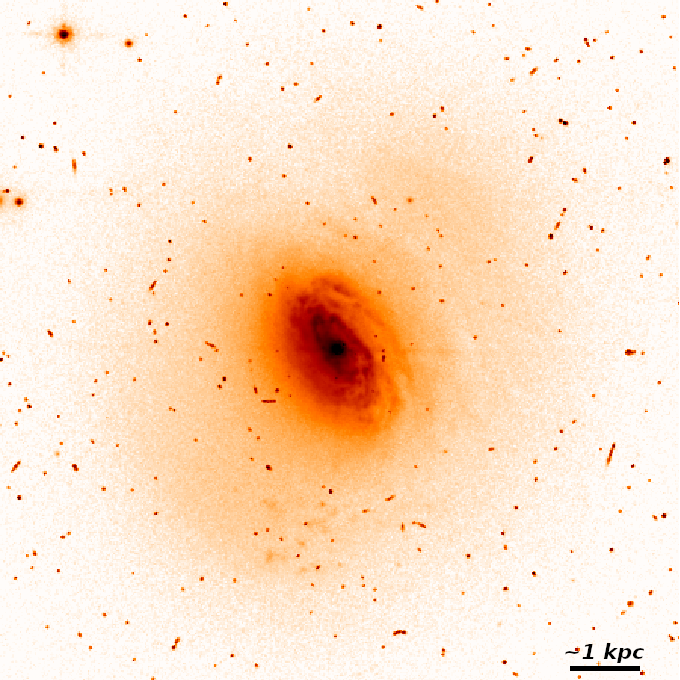
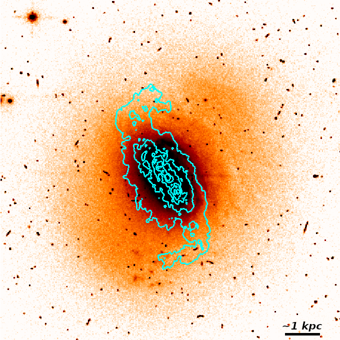
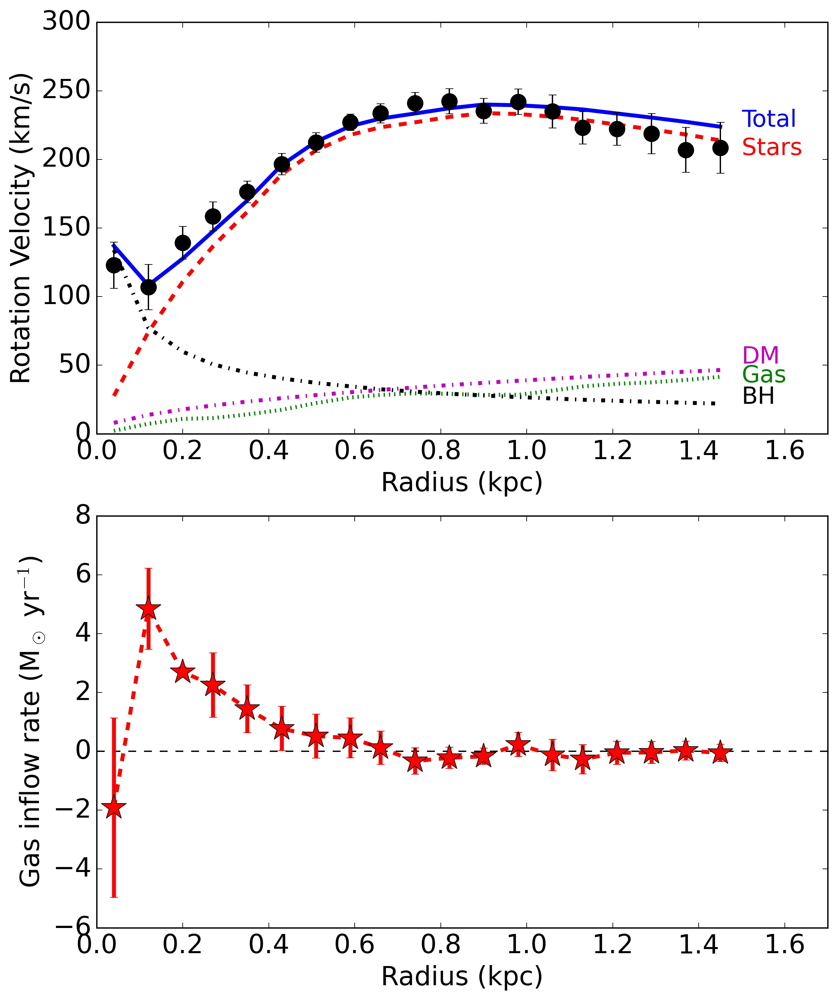
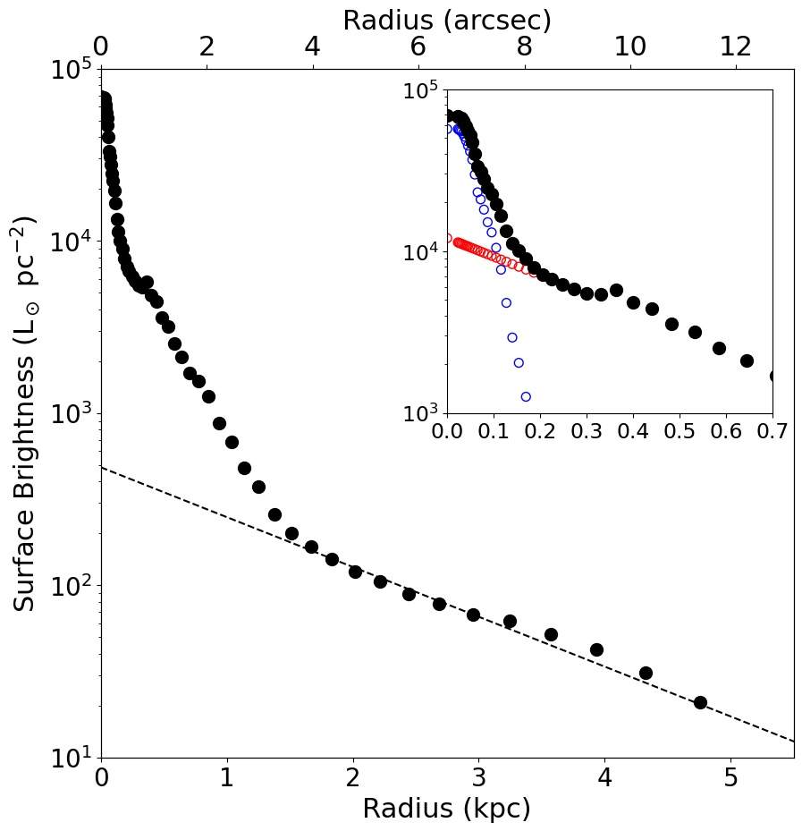

$\newcommand{\ensuremath}{}$
$\newcommand{\xspace}{}$
$\newcommand{\object}[1]{\texttt{#1}}$
$\newcommand{\farcs}{{.}''}$
$\newcommand{\farcm}{{.}'}$
$\newcommand{\arcsec}{''}$
$\newcommand{\arcmin}{'}$
$\newcommand{\ion}[2]{#1#2}$
$\newcommand{\textsc}[1]{\textrm{#1}}$
$\newcommand{\hl}[1]{\textrm{#1}}$
$\newcommand{\kms}{\ensuremath{\mathrm{km} \mathrm{s}^{-1}}}$
$\newcommand{\MLsun}{\ensuremath{\mathrm{M}_{\odot}/\mathrm{L}_{\odot}}}$
$\newcommand{\Lsun}{\ensuremath{\mathrm{L}_{\odot}}}$
$\newcommand{\Msun}{\ensuremath{\mathrm{M}_{\odot}}}$
$\newcommand{\lumdens}{\ensuremath{\mathrm{L}_{\odot} \mathrm{pc}^{-2}}}$
$\newcommand{\surfdens}{\ensuremath{\mathrm{M}_{\odot} \mathrm{pc}^{-2}}}$
$\newcommand{\XCO}{\ensuremath{X_\mathrm{CO}}}$
$\newcommand{\hi }{{\rm H} {\small\rm I}}$
$\newcommand{\thebibliography}{\DeclareRobustCommand{\VAN}[3]{##3}\VANthebibliography}$

$\newcommand{\ensuremath}{}$
$\newcommand{\xspace}{}$
$\newcommand{\object}[1]{\texttt{#1}}$
$\newcommand{\farcs}{{.}''}$
$\newcommand{\farcm}{{.}'}$
$\newcommand{\arcsec}{''}$
$\newcommand{\arcmin}{'}$
$\newcommand{\ion}[2]{#1#2}$
$\newcommand{\textsc}[1]{\textrm{#1}}$
$\newcommand{\hl}[1]{\textrm{#1}}$
$\newcommand{\kms}{\ensuremath{\mathrm{km} \mathrm{s}^{-1}}}$
$\newcommand{\MLsun}{\ensuremath{\mathrm{M}_{\odot}/\mathrm{L}_{\odot}}}$
$\newcommand{\Lsun}{\ensuremath{\mathrm{L}_{\odot}}}$
$\newcommand{\Msun}{\ensuremath{\mathrm{M}_{\odot}}}$
$\newcommand{\lumdens}{\ensuremath{\mathrm{L}_{\odot} \mathrm{pc}^{-2}}}$
$\newcommand{\surfdens}{\ensuremath{\mathrm{M}_{\odot} \mathrm{pc}^{-2}}}$
$\newcommand{\XCO}{\ensuremath{X_\mathrm{CO}}}$
$\newcommand{\hi }{{\rm H} {\small\rm I}}$
$\newcommand{\thebibliography}{\DeclareRobustCommand{\VAN}[3]{##3}\VANthebibliography}$

# WISDOM Project - XIII. Feeding molecular gas to the supermassive black hole in the starburst AGN-host galaxy Fairall 49

<mark>Appeared on: 2022-09-01</mark> - _19 pages, 13 figures, accepted for publication in MNRAS_

Federico Lelli, et al. -- incl., <mark><mark>Mark D. Smith</mark></mark>

**Abstract:** The mm-Wave Interferometric Survey of Dark Object Masses (WISDOM) is probing supermassive black holes (SMBHs) in galaxies across the Hubble sequence via molecular gas dynamics. We present the first WISDOM study of a luminous infrared galaxy with an active galactic nuclei (AGN): Fairall 49. We use new ALMA observations of the CO( $2-1$ ) line with a spatial resolution of $\sim$ 80 pc together with ancillary HST imaging. We reach the following results: (1) The CO kinematics are well described by a regularly rotating gas disk with a radial inflow motion, suggesting weak feedback on the cold gas from both AGN and starburst activity; (2) The dynamically inferred SMBH mass is $1.6\pm0.4\mathrm{(rnd)}\pm0.8 \mathrm{(sys)}\times 10^{8}$ \Msun assuming that we have accurately subtracted the AGN and starburst light contributions, which have a luminosity of $\sim$ 10 $^9$ L $_\odot$ ; (3) The SMBH mass agrees with the SMBH $-$ stellar mass relation but is $\sim$ 50 times higher than previous estimates from X-ray variability; (4) The dynamically inferred molecular gas mass is 30 times smaller than that inferred from adopting the Galactic CO-to-H $_2$ conversion factor ( $\XCO$ ) for thermalised gas, suggesting low values of \XCO ; (5) the molecular gas inflow rate increases steadily with radius and may be as high as $\sim$ 5 $M_\odot$ yr $^{-1}$ . This work highlights the potential of using high-resolution CO data to estimate, in addition to SMBH masses, the X $_{\rm CO}$ factor and gas inflow rates in nearby galaxies.

**Figure 6. -** HST/WFPC2 image of Fairall 49 in the F606W filter. The two panels show the same HST image but use a different color stretching to highlight different features in the galaxy. The left panel shows the inner spiral disk, while the right panel highlights the outer asymmetric stellar distribution superimposed with the CO(2-1) emission (cyan contours). Contours increase from 0.14 ($\sim$3$\sigma$) to 8 mJy beam$^{-1}$ km s$^{-1}$. The bar to the bottom-right corner equals $\sim$2.5$"$, corresponding to $\sim$1 kpc for the assumed distance of 86.7 Mpc. North is up; East is left. (*fig:HST*)

**Figure 3. -** _Top panel:_ The observed rotation curve (black dots with errorbars) is fitted with a mass model (blue solid line) that considers the gravitational contributions of stars (red dashed line), gas (green dotted line), black hole (black dash-dotted line) and DM halo (purple dash-dotted line). _Bottom panel:_ gas inflow rate considering the molecular gas mass from the mass model. The error bars comprise the uncertainties on $V_{\rm rad}$ only; the uncertainties on $M_{\rm gas}$ have a systematic effect, shifting the inner peak up and down (see Eq. \ref{eq:inflow}). (*fig:massmodel*)

**Figure 1. -** Surface brightness profile of Fairall 49 from the HST/WFPC2 image in the F606W filter. The dashed line shows an exponential fit to the outer parts. The inset zooms at small radii ($R<0.7$ kpc): the blue circles corresponds to the inner HSB component that is likely dominated by the AGN and/or starburst emission, the red circles shows the inward exponential extrapolation of the stellar component. See text for details. (*fig:sbp*)

