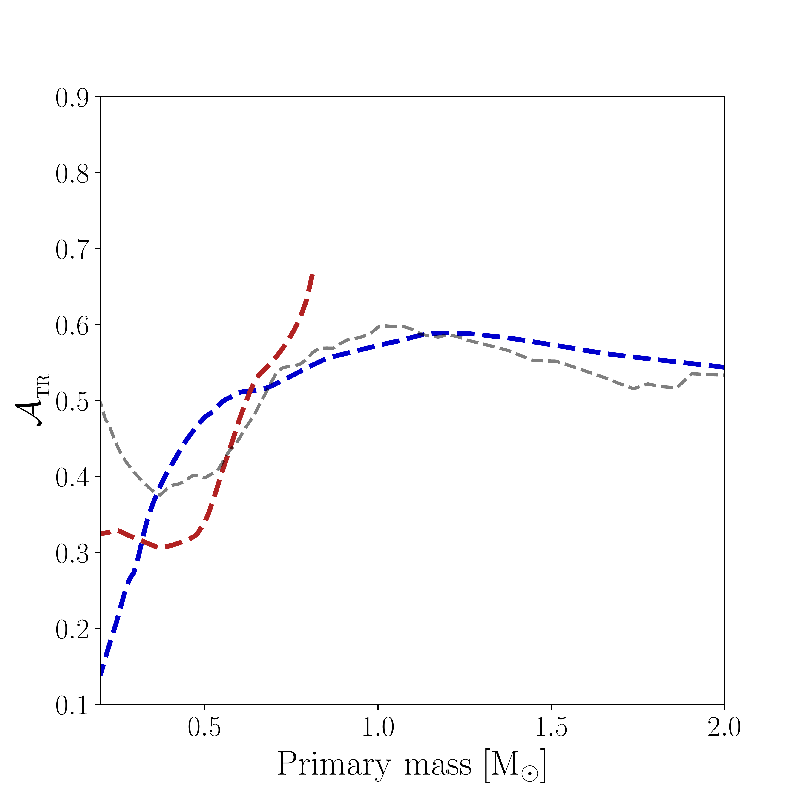

$\newcommand{\ensuremath}{}$
$\newcommand{\xspace}{}$
$\newcommand{\object}[1]{\texttt{#1}}$
$\newcommand{\farcs}{{.}''}$
$\newcommand{\farcm}{{.}'}$
$\newcommand{\arcsec}{''}$
$\newcommand{\arcmin}{'}$
$\newcommand{\ion}[2]{#1#2}$
$\newcommand{\textsc}[1]{\textrm{#1}}$
$\newcommand{\hl}[1]{\textrm{#1}}$
$\newcommand$
$\newcommand{\var}[1]{\DTLfetch{main_data}{thekey}{#1}{thevalue}}$
$\newcommand$
$\newcommand{\qmin}{\mathcal{Q}}$
$\newcommand{\red}[1]{\textcolor{red}{#1}}$
$\newcommand{\thebibliography}{\DeclareRobustCommand{\VAN}[3]{##3}\VANthebibliography}$

$\newcommand{$\ensuremath$}{}$
$\newcommand{$\xspace$}{}$
$\newcommand{$\object$}[1]{\texttt{#1}}$
$\newcommand{$\farcs$}{{.}''}$
$\newcommand{$\farcm$}{{.}'}$
$\newcommand{$\arcsec$}{''}$
$\newcommand{$\arcmin$}{'}$
$\newcommand{$\ion$}[2]{#1#2}$
$\newcommand{$\textsc$}[1]{\textrm{#1}}$
$\newcommand{$\hl$}[1]{\textrm{#1}}$
$\newcommand$
$\newcommand{$\var$}[1]{\DTLfetch{main_data}{thekey}{#1}{thevalue}}$
$\newcommand$
$\newcommand{$\qmin$}{\mathcal{Q}}$
$\newcommand{$\red$}[1]{\textcolor{red}{#1}}$
$\newcommand{$\thebibliography$}{\DeclareRobustCommand{\VAN}[3]{##3}\VANthebibliography}$

#  astrometric orbits. I. A sample of binaries with probable compact companions

<mark>Appeared on: 2022-09-05</mark> - _Submitted to MNRAS; 12 pages, 13 figures_

Sahar Shahaf, et al. -- incl., <mark><mark>Hans-Walter Rix</mark></mark>

**Abstract:** In preparation for the release of the astrometric orbits of{\it Gaia},\citet[][]{shahaf19}proposed a triage technique to identify astrometric binaries with compact companions based on their astrometric semi-major axis, parallax, and primary mass. The technique requires the knowledge of the appropriate mass-luminosity relation to rule out single or close-binary main-sequence companions. The recent publication of the\textit{Gaia}DR3 astrometric orbits used a schematic version of this approach, identifying$735$astrometric binaries that might have compact companions. In this communication, we return to the triage of the DR3 astrometric binaries with more careful analysis, estimating the probability for its astrometric secondary to be a compact object or a main-sequence close binary. We compile a sample of$\var{N_class3}$systems with highly-probable non-luminous massive companions, which is smaller but cleaner than the sample reported in\textit{Gaia}DR3. The new sample includes$8$candidates to be black-hole systems with compact-object masses larger than$2.4$\solarmass. The orbital-eccentricity--secondary-mass diagram of the other$169$systems suggests a tentative separation between the white-dwarf and the neutron-star binaries. Most white-dwarf binaries are characterized by small eccentricities of about$0.1$and masses of$0.6$\solarmass, while the neutron star binaries display typical eccentricities of$0.4$and masses of$1.3$\solarmass.

**Figure 2. -** Orbital eccentricity versus secondary mass for the class-III sample.  We set the upper boundary of the mass axis at $2.1$$\solarmass$, for clarity. Lines represent the central regions of the fitted Gaussian mixture model (see text). Systems identified as members of the WD and NS clusters appear as white and blue circles, respectively. Lines follow a constant $\ln$-likelihood level of $-0.5$, based on the fitted Gaussian mixture model, and highlight the main loci of the secondary-mass--eccentricity distribution. Centres of the three Gaussian components are plotted as black "+" signs. (*fig:co_e-m*)

**Figure 8. -** Maximum $\mathcal{A}$ for an MS secondary (dotted line) and an MS close-binary companion (dashed line) as a function of primary mass, based on \citet{mamajek13} observed MLR. Black circles and squares show the maximum values of Fig. \ref{fig:amrf_curve1}. Purple and light-blue stripes illustrate the expected $\mathcal{A}$ of white dwarfs, at $0.45{-}0.75 \solarmass$, and neutron stars, at $1.4{-}2.1  \solarmass$ companions, respectively. Note that their position does not depend on the period or the parallax of the system. The figure suggests that since some white-dwarf and most neutron-star companions are expected to reside above the corresponding maximum $\mathcal{A}$, they can be identified as such.Impact of stellar age and metallicity on  $\mathcal{A}_{$\textsc${tr}}$. Class-III limiting value, $\mathcal{A}_{$\textsc${tr}}$, as a function of the primary mass. Dashed red and blue lines represent the MIST-based limits for old and young stellar populations, respectively. Grey dashed line represents the limit obtained from the empirical MLR of \citet{mamajek13}(dashed), which were used in the \textit{NSS}. Grey solid line is the limiting curve adopted by this work. See Section \ref{sec: age metallicity based limits} and Appendix \ref{APP: Atr}. \newline\newline\newline (*fig:amrf_curve*)

**Figure 3. -** Secondary-mass histogram of the class-III sample. The most prominent peak, at ${\sim}0.6$$\solarmass$ corresponds to WD secondaries in the sample, and another, less prominent peak, is located at ${\sim}1.3$$\solarmass$. We set the upper boundary of the mass axis at $2.1$$\solarmass$, for clarity. As a result, $8$ additional systems with secondary masses larger than $2.4$$\solarmass$ are not shown. Lines represent the marginal distributions derived from a Gaussian-mixture model that was fitted to the secondary-mass--eccentricity diagram (see Section \ref{sec: m2-e}). The overlap between the two classes is small, as only one bin shares points from both classes, with two WDs and one NS.
         (*fig:hist_m2*)

