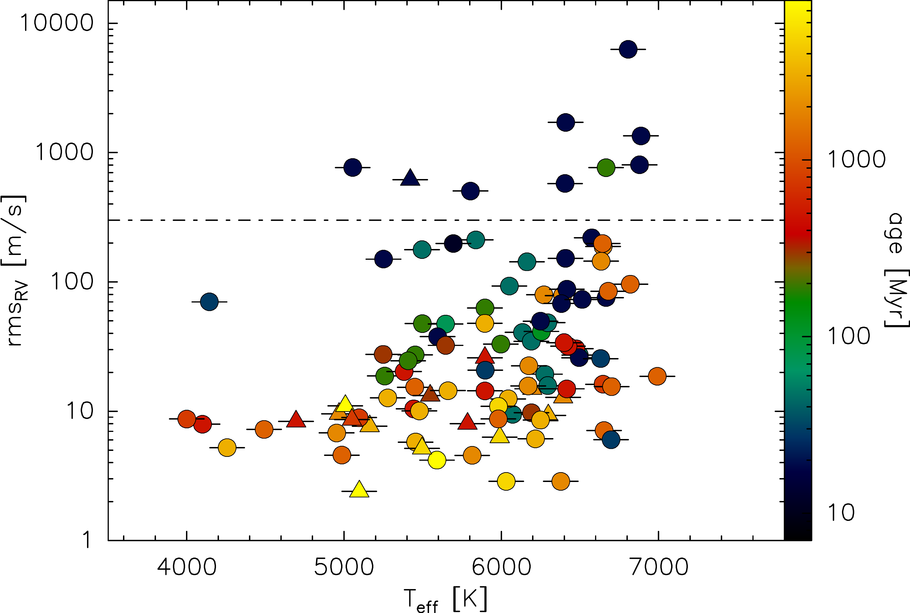
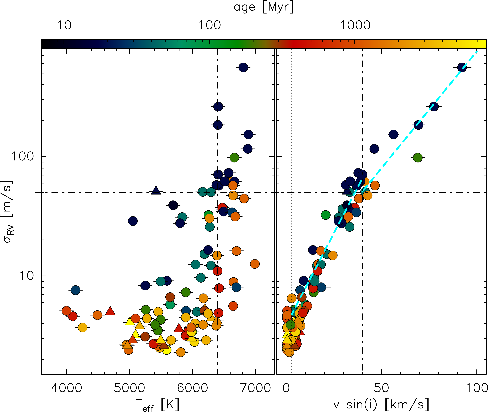
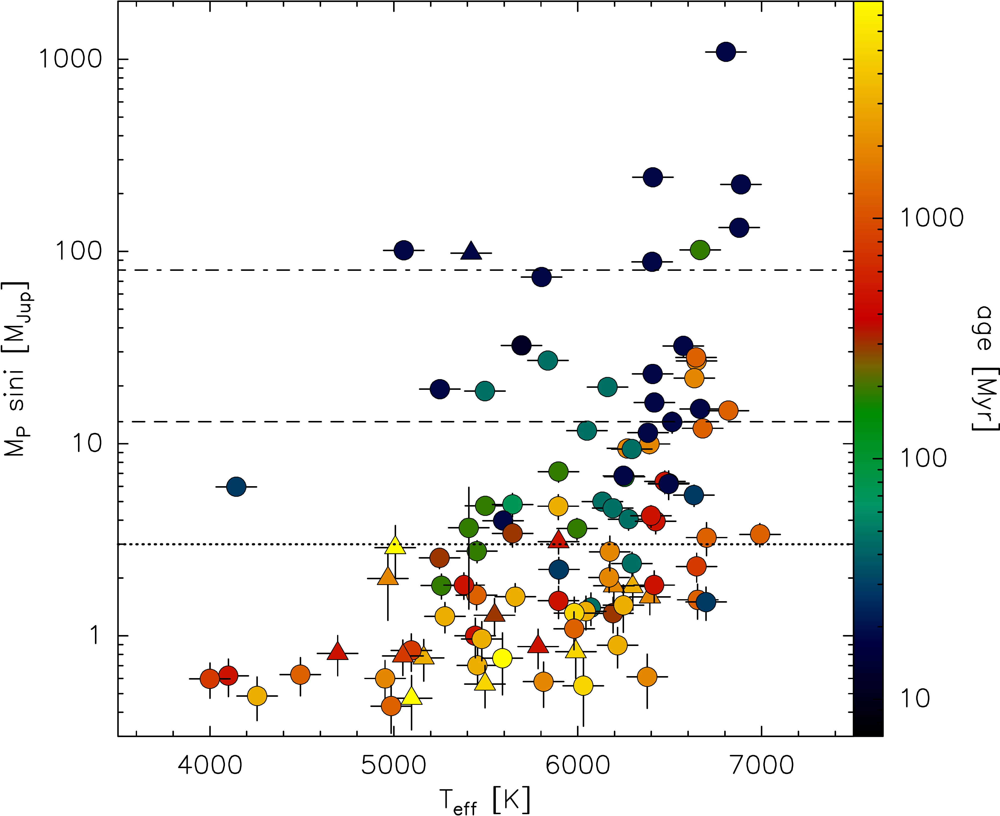

$\newcommand{\ensuremath}{}$
$\newcommand{\xspace}{}$
$\newcommand{\object}[1]{\texttt{#1}}$
$\newcommand{\farcs}{{.}''}$
$\newcommand{\farcm}{{.}'}$
$\newcommand{\arcsec}{''}$
$\newcommand{\arcmin}{'}$
$\newcommand{\ion}[2]{#1#2}$
$\newcommand{\textsc}[1]{\textrm{#1}}$
$\newcommand{\hl}[1]{\textrm{#1}}$
$\newcommand{\footnote}[1]{}$
$\newcommand{\amu}[1]{{\leavevmode\color{dark-blue} #1}}$
$\newcommand{\trifon}[2]{{\leavevmode\color{dark-green} #1}}$
$\newcommand{\sr}[1]{{\leavevmode\color{medium-blue} #1}}$

$\newcommand{\ensuremath}{}$
$\newcommand{\xspace}{}$
$\newcommand{\object}[1]{\texttt{#1}}$
$\newcommand{\farcs}{{.}''}$
$\newcommand{\farcm}{{.}'}$
$\newcommand{\arcsec}{''}$
$\newcommand{\arcmin}{'}$
$\newcommand{\ion}[2]{#1#2}$
$\newcommand{\textsc}[1]{\textrm{#1}}$
$\newcommand{\hl}[1]{\textrm{#1}}$
$\newcommand{\footnote}[1]{}$
$\newcommand{\amu}[1]{{\leavevmode\color{dark-blue} #1}}$
$\newcommand{\trifon}[2]{{\leavevmode\color{dark-green} #1}}$
$\newcommand{\sr}[1]{{\leavevmode\color{medium-blue} #1}}$

# RVSPY - Radial Velocity Survey for Planets around Young stars

<mark>Appeared on: 2022-09-02</mark> - _24 pages, 14 figures, 4 tables; Accepted for publication in A&A_

<mark>Olga V. Zakhozhay</mark>, et al. -- incl., <mark>Andre Müller</mark>, <mark>Martin Kürster</mark>, <mark>Alexey Pavlov</mark>, <mark>Trifon Trifonov</mark>

**Abstract:** The occurrence rate and period distribution of (giant) planets around young stars is still not as well constrained as for older main-sequence stars. This is mostly due to the intrinsic activity-related complications and the avoidance of young stars in many large planet search programmes. Yet, dynamical restructuring processes in planetary systems may last significantly longer than the actual planet formation phase and may well extend long into the debris disc phase, such that the planet populations around young stars may differ from those observed around main-sequence stars. We introduce our Radial Velocity Survey for Planets around Young stars (RVSPY), which is closely related to the $\mbox{NaCo-ISPY}$ direct imaging survey, characterise our target stars, and search for substellar companions at orbital separations smaller than a few au from the host star. We used the FEROS spectrograph, mounted to the MPG/ESO 2.2 m telescope in Chile, to obtain high signal-to-noise spectra and time series of precise radial velocities (RVs) of 111 stars, most of which are surrounded by debris discs. Our target stars have spectral types between early F and late K, a median age of 400 Myr, and a median distance of 45 pc. During the initial reconnaissance phase of our survey, we determined stellar parameters and used high-cadence observations to characterise the intrinsic stellar activity, searched for hot companions with orbital periods of up to 10 days, and derived the detection thresholds for longer-period companions. In our analysis we, have included archival spectroscopic data, spectral energy distribution, and data for photometric time series from the TESS mission. For all target stars we determined their basic stellar parameters and present the results of the high-cadence RV survey and activity characterisation. We have achieved a median single-measurement RV precision of 6 m/s and derived the short-term intrinsic RV scatter of our targets (median 23 m/s), which is mostly caused by stellar activity and decays with an age from >100 m/s at <20 Myr to <20 m/s at >500 Myr.We analysed time series periodograms of the high-cadence RV data and the shape of the individual cross-correlation functions. We discovered six previously unknown close companions with orbital periods between 10 and 100 days, three of which are low-mass stars, and three are in the brown dwarf mass regime. We detected no hot companion with an orbital period <10 days down to a median mass limit of $\sim$ 1 M $_{\rm Jup}$ for stars younger than 500 Myr, which is still compatible with the established occurrence rate of such companions around main-sequence stars.We found significant RV periodicities between 1.3 and 4.5 days for 14 stars, which are, however, all caused by rotational modulation due to starspots. We also analysed the data for TESS photometric time series and found significant periodicities for most of the stars. For 11 stars, the photometric periods are also clearly detected in the RV data.We also derived stellar rotation periods ranging from 1 to 10 days for 91 stars, mostly from the TESS data.From the intrinsic activity-related short-term RV jitter, we derived the expected mass-detection thresholds for longer-period companions, and selected 84 targets for the longer-term RV monitoring. $\looseness$ =-4

**Figure 6. -** 
Intrinsic rms scatter of the RVs in the 2-week high-cadence data vs. (spectroscopic) effective stellar temperature, $T_{\rm eff}$, with age encoded in colour. Stars marked as triangles do not have significant IR excess (see Sect. \ref{ssec:targets:sel}).
The horizontal dashed-dotted line marks the approximate boundary above which we consider RV exoplanet searches not feasible (although we use a mass detection threshold in the end; see Sect. \ref{sec:dis:prospects} and Fig. \ref{fig:Mp_vs_Teff}).
 (*fig:rmsrv_teff*)

**Figure 8. -** 
Relation between single-measurement RV precision, $\sigma_{RV}$, and $T_{\rm eff}$(_ left_) and $v\sin(i)$(_ right_). Stellar ages are colour-coded. Stars marked as triangles do not have significant IR excess (see Sect. \ref{ssec:targets:sel}).
Horizontal dashed-dotted lines mark the anticipated threshold value for the RV precision of $\sigma_{RV}=50$ m/s for our longer-term survey (Sect. \ref{ssec:obs:strat}). Vertical dashed-dotted lines indicate the values of $T_{\rm eff}=6400$ K (left panel) and $v\sin(i)=40$ km/s (right panel), above which many target are no longer compatible with our $\sigma_{RV}\leq50$ m/s single-measurement RV-precision goal. The vertical dotted line on the right panel marks the lower sensitivity limit (3 km/s) of our $v\sin(i)$ measurements (Sect. \ref{ssec:res:par}). The light-blue dashed lines in the right panel show the best linear fits to the correlation between $v\sin(i)$ and $\log(\sigma_{RV})$ for $v\sin(i)\leq40$ km/s and $v\sin(i)\geq40$ km/s.
 (*fig:vsini*)

**Figure 11. -** 
Mass detection limits for hypothetical companions with $P=1$ yr that induce an RV amplitude three times larger than the activity-jitter rms derived from the high-cadence observations, plotted vs. host star (spectroscopic) $T_{\rm eff}$. Ages are coded in colour. Stars marked as triangles do not have a significant IR excess (see Sect. \ref{ssec:targets:sel}).
The horizontal dashed-dotted line marks the approximate boundary between the low-mass stellar and substellar regimes and the dashed line marks the approximate boundary between the planetary and brown-dwarf mass regimes. The dotted line marks 3 M$_{\rm Jup}$.
 (*fig:Mp_vs_Teff*)

