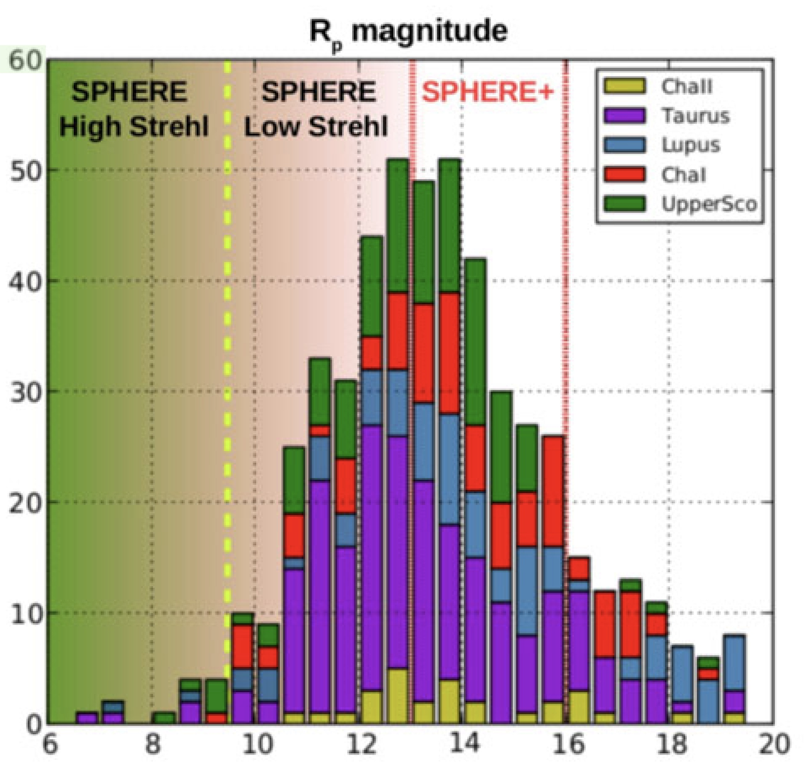
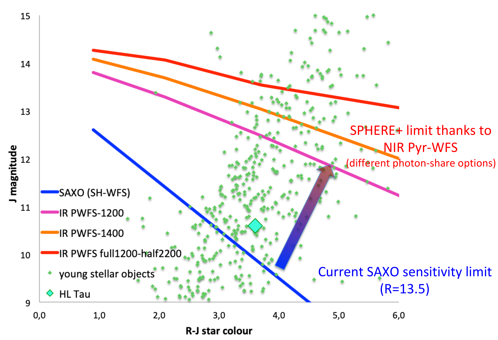
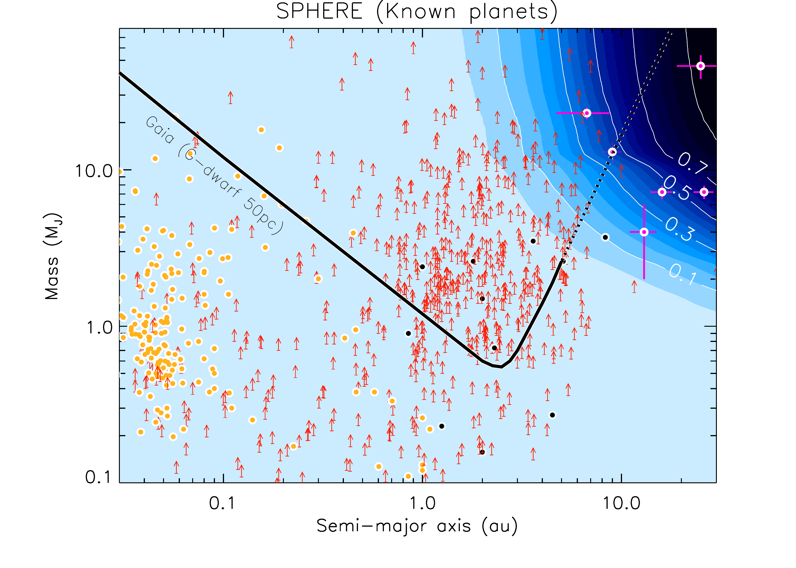
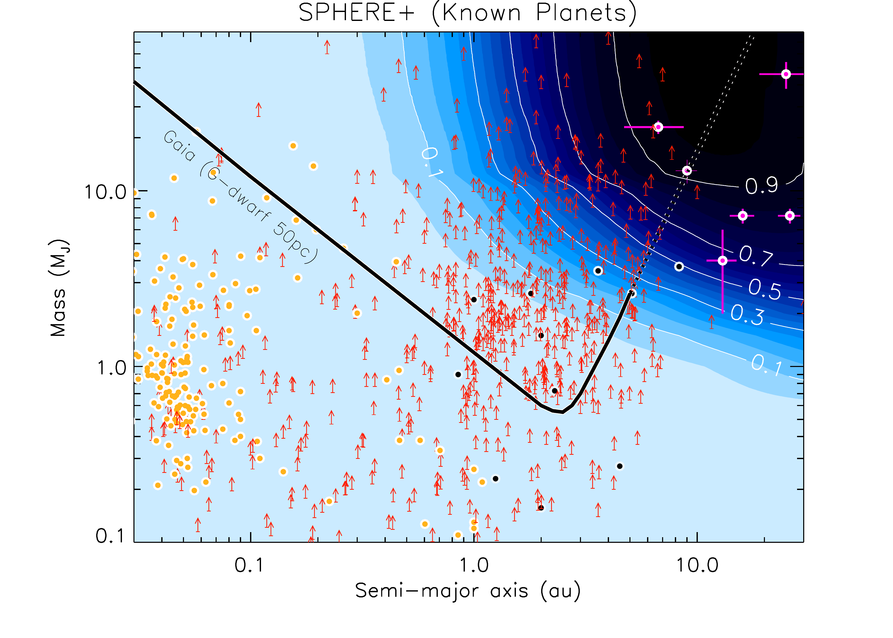
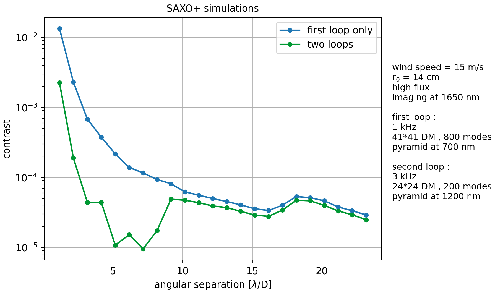
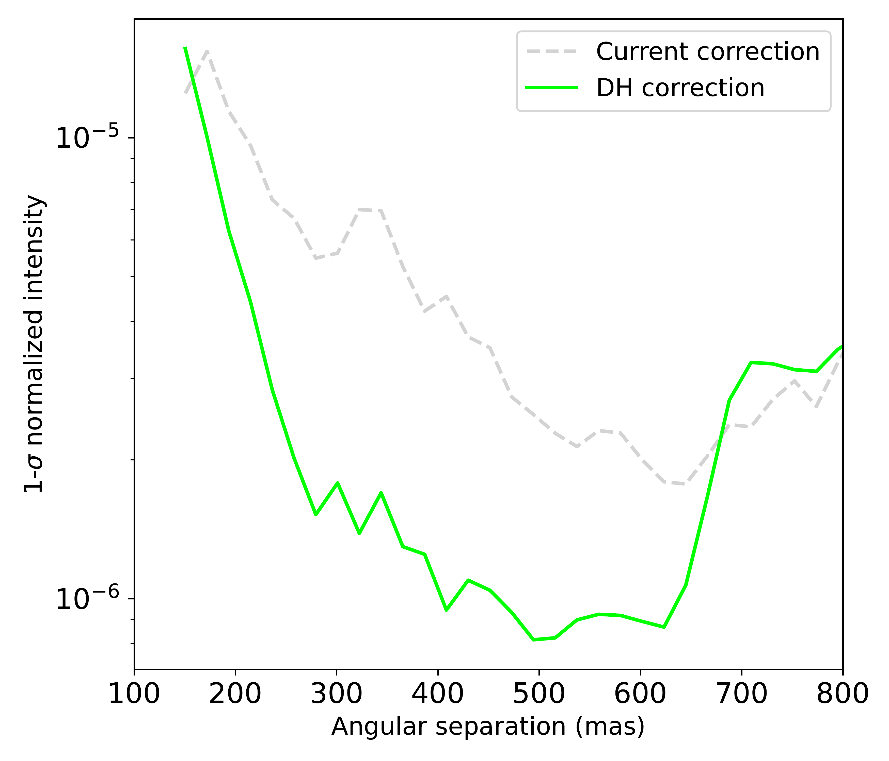

$\newcommand{\ensuremath}{}$
$\newcommand{\xspace}{}$
$\newcommand{\object}[1]{\texttt{#1}}$
$\newcommand{\farcs}{{.}''}$
$\newcommand{\farcm}{{.}'}$
$\newcommand{\arcsec}{''}$
$\newcommand{\arcmin}{'}$
$\newcommand{\ion}[2]{#1#2}$
$\newcommand{\textsc}[1]{\textrm{#1}}$
$\newcommand{\hl}[1]{\textrm{#1}}$
$\newcommand{\baselinestretch}{1.0}$

$\newcommand{$\ensuremath$}{}$
$\newcommand{$\xspace$}{}$
$\newcommand{$\object$}[1]{\texttt{#1}}$
$\newcommand{$\farcs$}{{.}''}$
$\newcommand{$\farcm$}{{.}'}$
$\newcommand{$\arcsec$}{''}$
$\newcommand{$\arcmin$}{'}$
$\newcommand{$\ion$}[2]{#1#2}$
$\newcommand{$\textsc$}[1]{\textrm{#1}}$
$\newcommand{$\hl$}[1]{\textrm{#1}}$
$\newcommand{$\baselinestretch$}{1.0}$

# Upgrading the high contrast imaging facility SPHERE: science drivers and instrument choices

<mark>Appeared on: 2022-09-07</mark> - _To appear in the Proceedings of the SPIE Astronomical Telescopes + Instrumentation (2022), 13 pages, 6 figure_

A. Boccaletti, et al. -- incl., <mark><mark>E. Stadler</mark></mark>, <mark><mark>M. Langlois</mark></mark>, <mark><mark>M. Feldt</mark></mark>

**Abstract:** SPHERE+ is a proposed upgrade of the SPHERE instrument at the VLT, which is intended to boost the current performances of detection and characterization for exoplanets and disks. SPHERE+ will also serve as a demonstrator for the future planet finder (PCS) of the European ELT. The main science drivers for SPHERE+ are 1/ to access the bulk of the young giant planet population down to the snow line ($3-10$au), to bridge the gap with complementary techniques (radial velocity, astrometry); 2/ to observe fainter and redder targets in the youngest ($1-10$Myr) associations compared to those observed with SPHERE to directly study the formation of giant planets in their birth environment; 3/ to improve the level of characterization of exoplanetary atmospheres by increasing the spectral resolution in order to break degeneracies in giant planet atmosphere models. Achieving these objectives requires to increase the bandwidth of the xAO system (from$\sim$1 to 3 kHz) as well as the sensitivity in the infrared (2 to 3 mag). These features will be brought by a second stage AO system optimized in the infrared with a pyramid wavefront sensor. As a new science instrument, a medium resolution integral field spectrograph will provide a spectral resolution from 1000 to 5000 in the J and H bands. This paper gives an overview of the science drivers, requirements and key instrumental trade-off that were done for SPHERE+ to reach the final selected baseline concept.

**Figure 2. -** Left: histogram of target's R magnitude  for several young star associations, indicating the performance of SPHERE and those expected with SPHERE+. Right: Magnitude color diagram of actual targets in star forming regions observable with ALMA (including the famous HL Tau) overlaid with the AO sensitivity of SAXO (blue line) and the sensitivity expected with an IR Pyramid WFS for several assumptions for the spectral range. (*fig:redtargets*)

**Figure 1. -** SPHERE (\textit{Left}) and expected SPHERE+ (\textit{Right}) detection probabilities from the SHINE sample of young ($\sim 100$ Myr), nearby ($\sim 50$ pc) stars compared to the current population of exoplanets detected with all techniques: transit (\textit{yellow} dot), radial velocity (\textit{red} arrow), $\mu$-lensing (\textit{black} dot), and direct imaging (\textit{pink} dot). The \textit{Gaia} detection limits that will be available with the Data Release 4 for a solar-type star at 50 pc are overlaid.  (*fig:bridge*)

**Figure 4. -** Left: simulated 5$\sigma$ contrast with SAXO (blue) and SAXO+ (green) for a typical set of atmospheric conditions. Right: 1$\sigma$ contrast obtained with the dark hole technique on sky with SPHERE (green line) as compared to the nominal case (grey line). (*fig:simulsaxoplus*)

