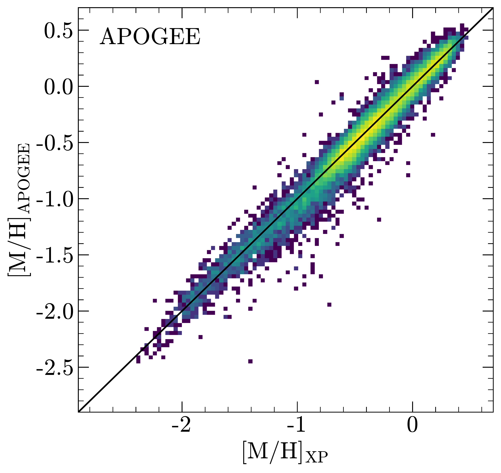
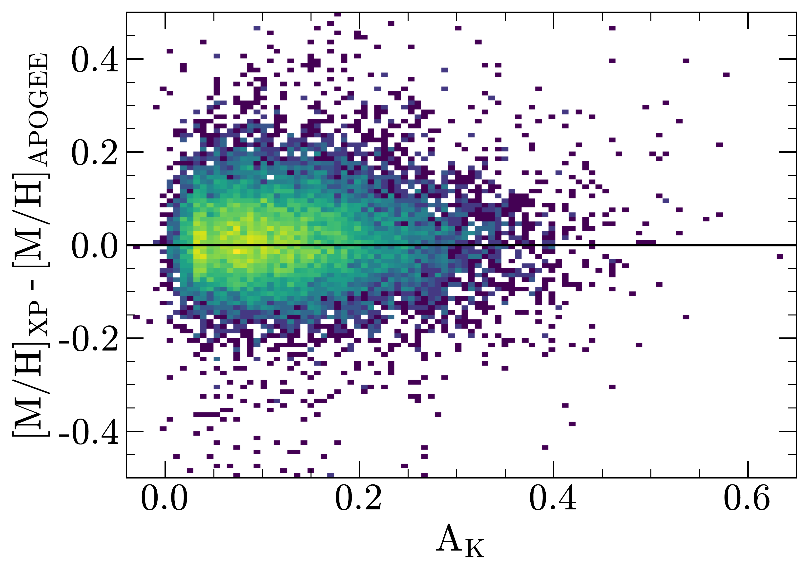
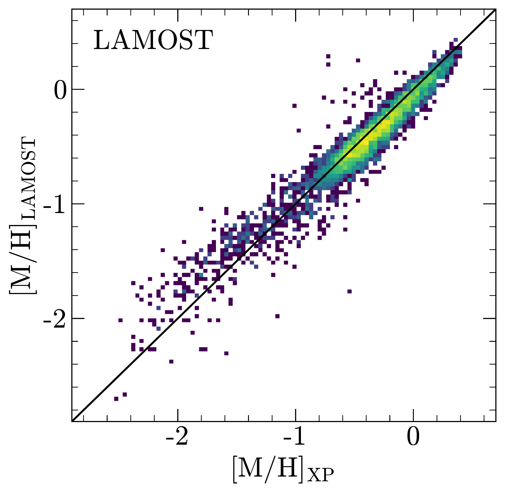
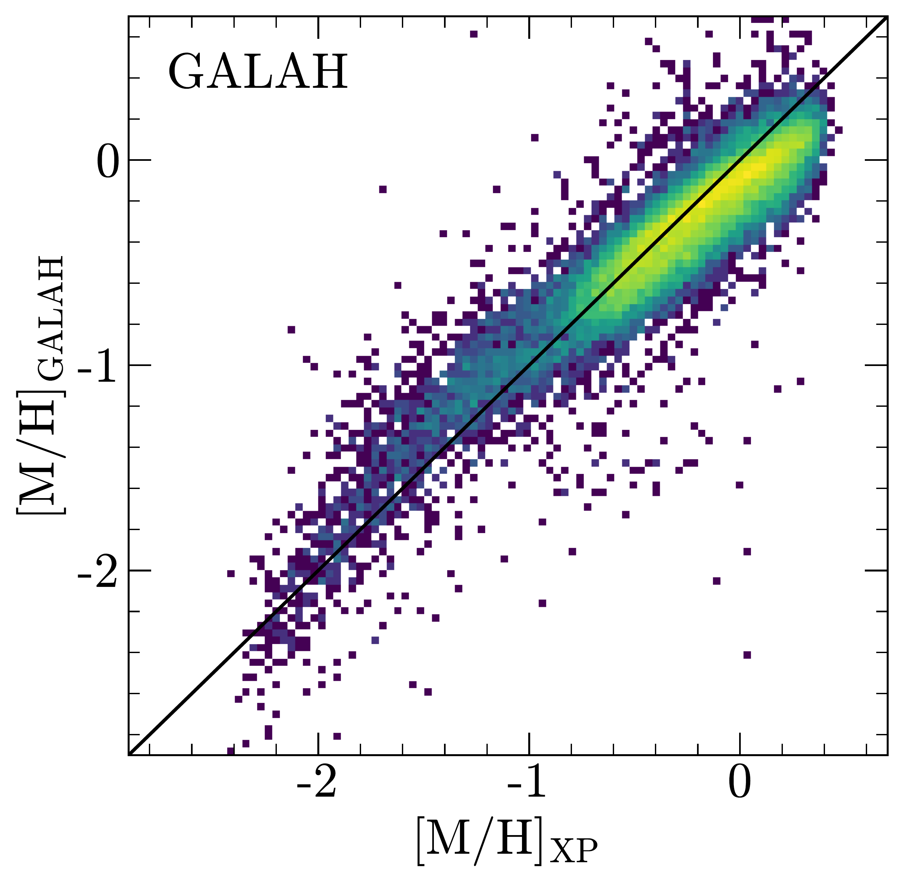
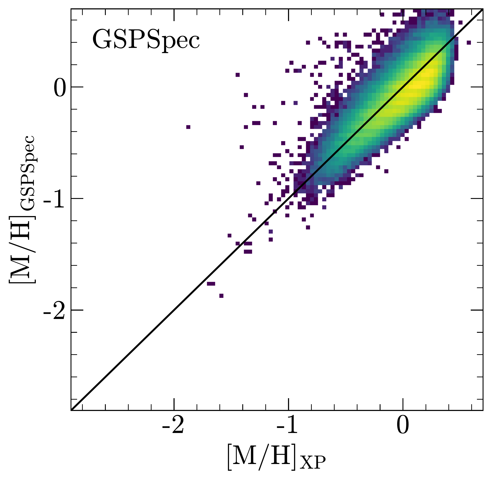
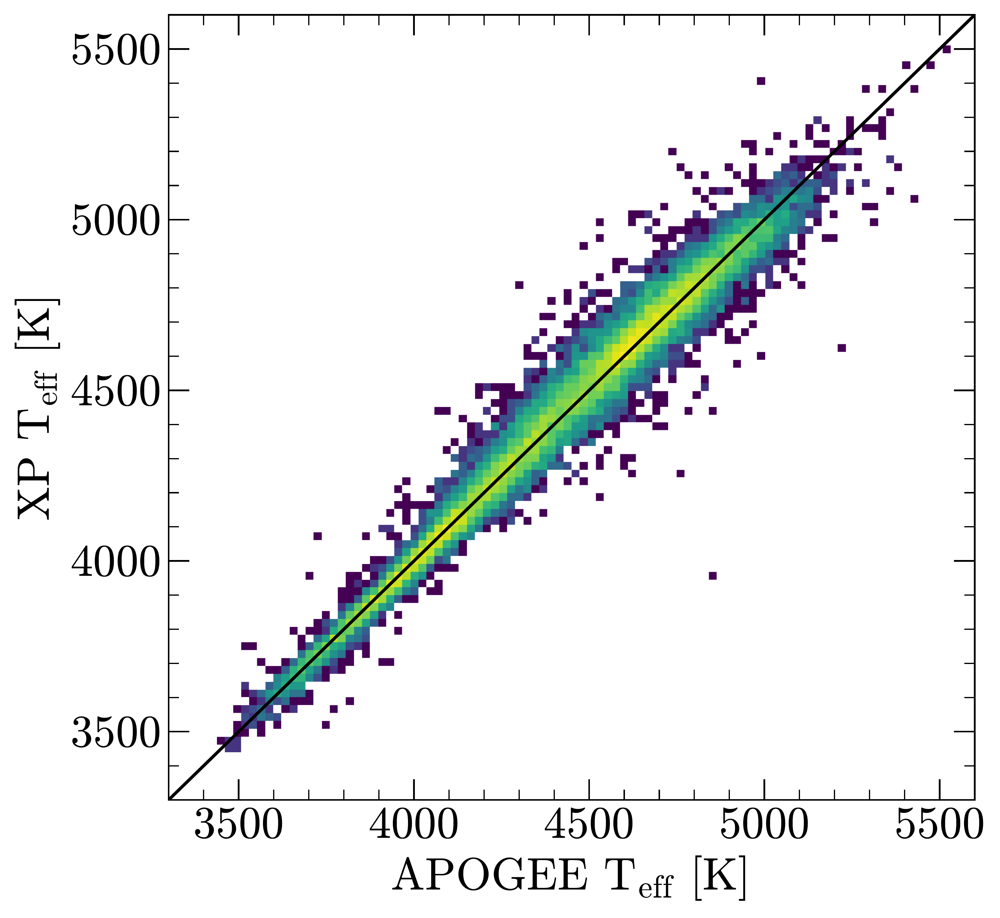
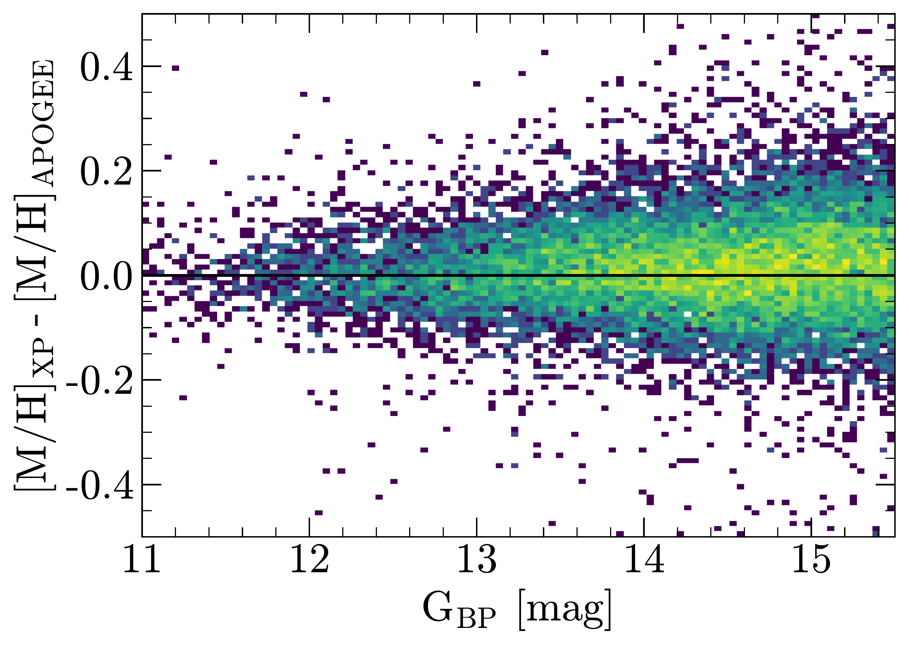

$\newcommand{\ensuremath}{}$
$\newcommand{\xspace}{}$
$\newcommand{\object}[1]{\texttt{#1}}$
$\newcommand{\farcs}{{.}''}$
$\newcommand{\farcm}{{.}'}$
$\newcommand{\arcsec}{''}$
$\newcommand{\arcmin}{'}$
$\newcommand{\ion}[2]{#1#2}$
$\newcommand{\textsc}[1]{\textrm{#1}}$
$\newcommand{\hl}[1]{\textrm{#1}}$
$\newcommand{\vdag}{(v)^\dagger}$
$\newcommand$
$\newcommand$
$\newcommand{\insitu}{{\it in situ}}$
$\newcommand{\MH}{\ensuremath{\mathrm{[M/H]}}}$
$\newcommand{\Teff}{\ensuremath{\mathrm{T}_{\rm eff}}}$
$\newcommand{\aFe}{\ensuremath{\mathrm{[\alpha/M]}}}$
$\newcommand{\GBP}{\ensuremath{G_\mathrm{BP}}}$

$\newcommand{$\ensuremath$}{}$
$\newcommand{$\xspace$}{}$
$\newcommand{$\object$}[1]{\texttt{#1}}$
$\newcommand{$\farcs$}{{.}''}$
$\newcommand{$\farcm$}{{.}'}$
$\newcommand{$\arcsec$}{''}$
$\newcommand{$\arcmin$}{'}$
$\newcommand{$\ion$}[2]{#1#2}$
$\newcommand{$\textsc$}[1]{\textrm{#1}}$
$\newcommand{$\hl$}[1]{\textrm{#1}}$
$\newcommand{$\vdag$}{(v)^\dagger}$
$\newcommand$
$\newcommand$
$\newcommand{$\insitu$}{{\it in situ}}$
$\newcommand{$\MH$}{$\ensuremath${\mathrm{[M/H]}}}$
$\newcommand{$\Teff$}{$\ensuremath${\mathrm{T}_{\rm eff}}}$
$\newcommand{$\aFe$}{$\ensuremath${\mathrm{[\alpha/M]}}}$
$\newcommand{$\GBP$}{$\ensuremath${G_\mathrm{BP}}}$

# The Poor Old Heart of the Milky Way

<mark>Appeared on: 2022-09-08</mark> - _21 pages, 9 figures, submitted to ApJ_

<mark>Hans-Walter Rix</mark>, et al. -- incl., <mark>Ren\'e Andrae</mark>, <mark>Morgan Fouesneau</mark>

**Abstract:** Massive disk galaxies like our Milky Way should host an ancient, metal-poor, and centrally concentrated stellar population. This population reflects the star formation and enrichment in the few most massive progenitor components that coalesced at high redshift to form the\emph{proto-Galaxy}. While metal-poor stars are known to reside in the inner few kiloparsecs of our Galaxy, current data do not yet provide a comprehensive picture of such a metal-poor "heart" of the Milky Way. We use information from Gaia DR3, especially the XP spectra, to construct a sample of 2 million bright ($\GBP<15.5$mag) giant stars within$30^\circ$of the Galactic Center with robust$\MH$estimates,$\delta$\MH$\lesssim 0.1$. For most sample members we can calculate orbits based on Gaia RVS velocities and astrometry. This sample reveals an extensive, ancient, and metal-poor population that includes$\sim 18,000$stars with$-2.7<$\MH$<-1.5$, representing a stellar mass of$\gtrsim 5\times 10^7$M$_\odot$. The spatial distribution of these$\MH<-1.5$stars has a Gaussian extent of only$\sigma_{\mathrm{R_{GC}}} \sim 2.7$kpc around the Galactic center, with most of these orbits being confined to the inner Galaxy.  At high orbital eccentricities, there is clear evidence for\emph{accreted}halo stars in their pericentral orbit phase.Stars with$\MH< -2$show no net rotation, whereas those with$\MH\sim -1$are rotation dominated.Most of the tightly bound stars show$[\alpha/\text{Fe}]$-enhancement and[Al/Fe]--[Mn/Fe]abundance patterns expected for an origin in the more massive portions of the proto-Galaxy.These central, metal-poor stars most likely predate the oldest part of the disk ($\tau_{\text{age}}\approx 12.5$Gyrs), which implies that they formed at$z\gtrsim 5$, forging the proto-Milky Way.

**Figure 1. -** Top: Validation of our $\MH$ estimates from \textit{Gaia} XP data as function of actual [M/H] from APOGEE.
Bottom: (In-)sensitivity of $\MH$ estimates to extinction, $A_K$. The Y-axis shows the difference between $\MH$ estimates based on XP spectra and APOGEE as a function of APOGEE's $A_K$. There is no evidence for any systematic trend of $\Delta$\MH$$ with $A_K$ to an extinction level that corresponds to $A_V \approx 3$. (*fig:MH_validation*)

**Figure 3. -** Cross-validation of our $\MH$$_{\text{XP}}$  estimates against three external spectroscopic data sets, LAMOST \citep[here][]{Xiang2019} , GALAH \citep{GALAH_DR3} and {\tt GSP-Spec}\citep{Recio-Blanco-RVS-abundances}. This cross-validation supports the precision and robustness of our $\MH$$_{\text{XP}}$ estimates. (*fig:MH_cross_validation*)

**Figure 2. -** Top: Validation of our T$_{\text{eff}}$(XP) estimates against the T$_{\text{eff}}$ from SDSS DR17 APOGEE. The XP predictions match the APOGEE values within a median $\Delta$T$_{eff}=32$ K, and with a mean difference of only 3 K. Bottom: Validation of our $\MH$ estimates as a function of G$_{\text{BP}}$ magnitude, with $\Delta$\MH$ \equiv $\MH$_{\text{XP}} - $\MH$_{\text{APOGEE}}$, showing that the quality of the estimate depends somewhat on G$_{\text{BP}}$, as expected, but is overall unbiased. (*fig:BP_validation*)

