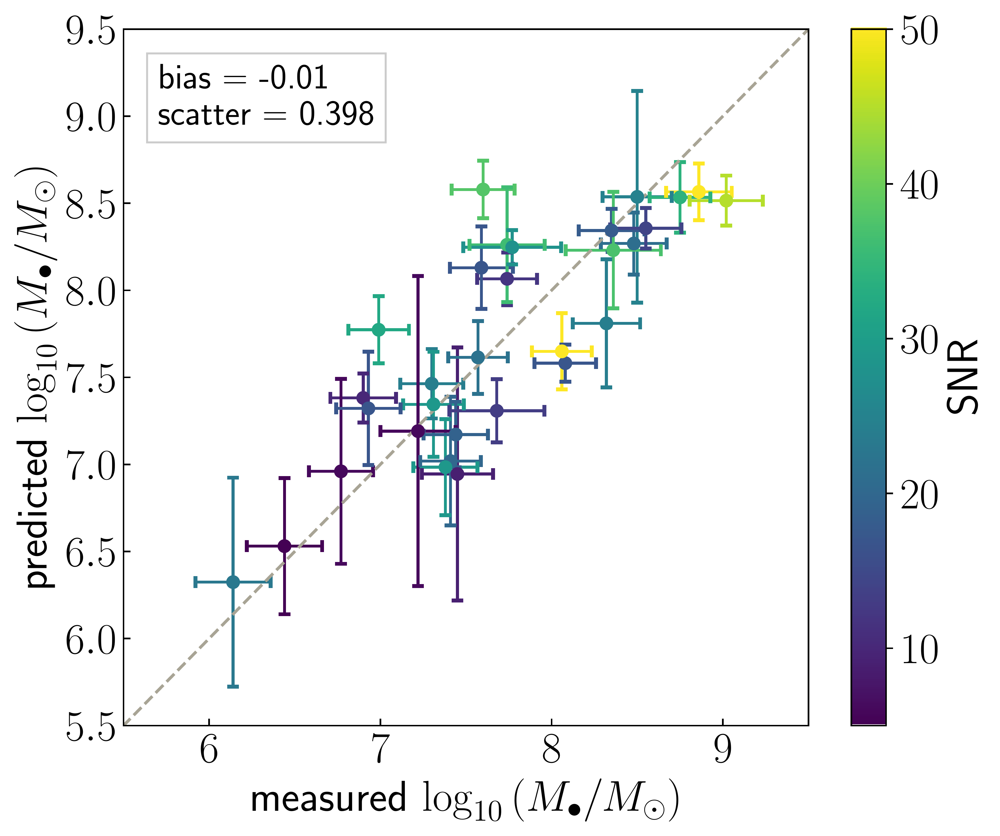
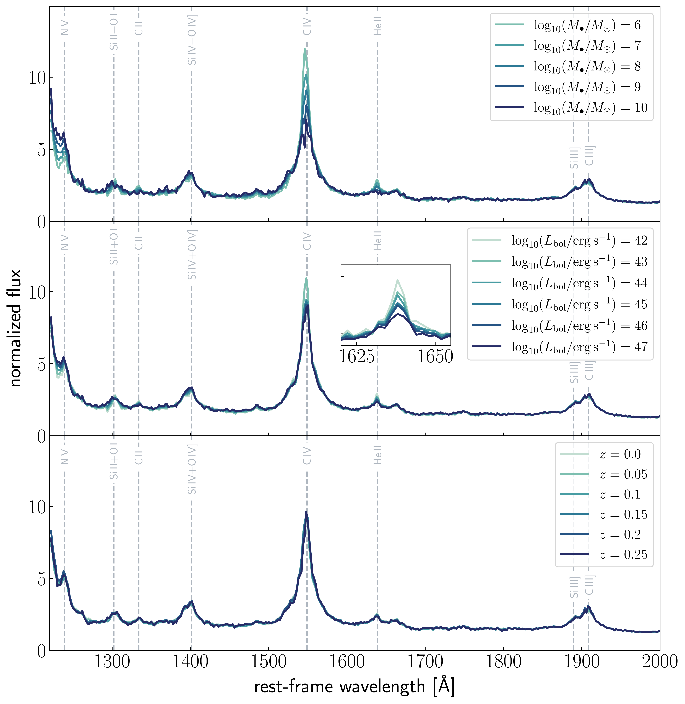
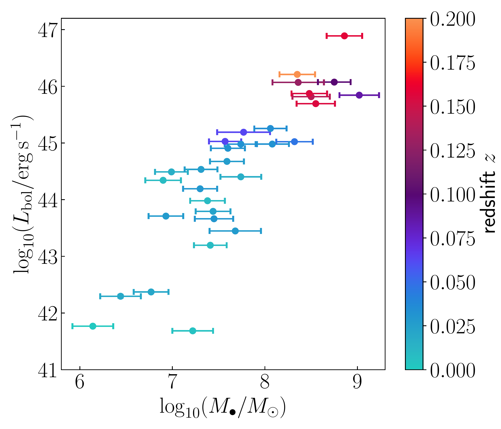

$\newcommand{\ensuremath}{}$
$\newcommand{\xspace}{}$
$\newcommand{\object}[1]{\texttt{#1}}$
$\newcommand{\farcs}{{.}''}$
$\newcommand{\farcm}{{.}'}$
$\newcommand{\arcsec}{''}$
$\newcommand{\arcmin}{'}$
$\newcommand{\ion}[2]{#1#2}$
$\newcommand{\textsc}[1]{\textrm{#1}}$
$\newcommand{\hl}[1]{\textrm{#1}}$
$\newcommand$
$\newcommand{\lya}{Ly\alpha }$
$\newcommand{\lyb}{Ly\beta }$
$\newcommand{\lyc}{Ly\gamma }$
$\newcommand{\taueff}{\tau_{\rm eff} }$
$\newcommand{\cmpch}{cMpc h^{-1} }$
$\newcommand{\kms}{km s^{-1}}$
$\newcommand{\oi}{\ion{O}{1}}$
$\newcommand{\heii}{\ion{He}{2}}$
$\newcommand{\cii}{[\ion{C}{2}]}$
$\newcommand{\civ}{\ion{C}{4}}$
$\newcommand{\mgii}{\ion{Mg}{2}}$
$\newcommand{\siiv}{\ion{Si}{4}}$
$\newcommand{\siii}{\ion{Si}{2}}$
$\newcommand{\oiii}{[\ion{O}{3}]}$
$\newcommand{\co}{\rm CO (6-5)}$
$\newcommand{\het}{heteroscedasticity}$
$\newcommand{\ha}{H\alpha }$
$\newcommand{\hb}{H\beta }$
$\newcommand{\msr}{M_\bullet-\sigma_\ast~relation}$

$\newcommand{$\ensuremath$}{}$
$\newcommand{$\xspace$}{}$
$\newcommand{$\object$}[1]{\texttt{#1}}$
$\newcommand{$\farcs$}{{.}''}$
$\newcommand{$\farcm$}{{.}'}$
$\newcommand{$\arcsec$}{''}$
$\newcommand{$\arcmin$}{'}$
$\newcommand{$\ion$}[2]{#1#2}$
$\newcommand{$\textsc$}[1]{\textrm{#1}}$
$\newcommand{$\hl$}[1]{\textrm{#1}}$
$\newcommand$
$\newcommand{$\lya$}{Ly\alpha }$
$\newcommand{$\lyb$}{Ly\beta }$
$\newcommand{$\lyc$}{Ly\gamma }$
$\newcommand{$\taueff$}{\tau_{\rm eff} }$
$\newcommand{$\cmpch$}{cMpc h^{-1} }$
$\newcommand{$\kms$}{km s^{-1}}$
$\newcommand{$\oi$}{$\ion${O}{1}}$
$\newcommand{$\heii$}{$\ion${He}{2}}$
$\newcommand{$\cii$}{[$\ion${C}{2}]}$
$\newcommand{$\civ$}{$\ion${C}{4}}$
$\newcommand{$\mgii$}{$\ion${Mg}{2}}$
$\newcommand{$\siiv$}{$\ion${Si}{4}}$
$\newcommand{$\siii$}{$\ion${Si}{2}}$
$\newcommand{$\oi$ii}{[$\ion${O}{3}]}$
$\newcommand{$\co$}{\rm CO (6-5)}$
$\newcommand{$\het$}{heteroscedasticity}$
$\newcommand{$\ha$}{H\alpha }$
$\newcommand{$\hb$}{H\beta }$
$\newcommand{$\msr$}{M_\bullet-\sigma_\ast~relation}$

#  A Generative Model for Quasar Spectra

<mark>Appeared on: 2022-09-08</mark> - _accepted for publication in ApJ_

Anna--Christina~Eilers, et al. -- incl., <mark>Frederick~B.~Davies</mark>

**Abstract:** \noindentWe build a multi-output generative model for quasar spectra and the properties of their black hole engines, based on a Gaussian process latent-variable model.This model treats every quasar as a vector of latent properties such that the spectrum and all physical properties of the quasar are associated with non-linear functions of those latent parameters; the Gaussian process kernel functions define priors on the function space.Our generative model is trained with a justifiable likelihood function that allows us to treat heteroscedastic noise and missing data correctly, which is crucial for all astrophysical applications.It can predict simultaneously unobserved spectral regions, as well as the physical properties of quasars in held-out test data.We apply the model to rest-frame ultraviolet and optical quasar spectra for which precise black hole masses (based on reverberation mapping measurements) are available.Unlike reverberation-mapping studies, which require multi-epoch data, our model predicts black hole masses from single-epoch spectra, even with limited spectral coverage.We demonstrate the capabilities of the model by predicting black hole masses and unobserved spectral regions. We find that we predict black hole masses at close to the best possible accuracy.

**Figure 2. -** Cross-validation of the GPLVM with $Q=16$ latent dimensions. Predicted compared to measured black hole masses for all quasars in our data set, colored by the SNR of the single-epoch quasar spectrum. Note that we use only two labels for the quasars here, i.e. $L=2$, namely black hole mass and bolometric luminosity.  (*fig:1to1*)

**Figure 5. -** Spectral dependencies on various quasar properties, i.e. black hole mass (\textit{top}), bolometric luminosity (\textit{middle}) and redshift (\textit{bottom}). The inset panel shows the expected spectral changes due to the Baldwin effect.  (*fig:dependencies*)

**Figure 1. -** Black hole masses and bolometric luminosities colored by redshift of 31 quasars in our data sample, which have reliable black hole mass measurements based on the RM technique.  (*fig:parent_sample*)

