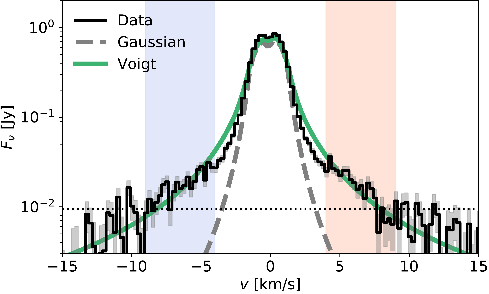
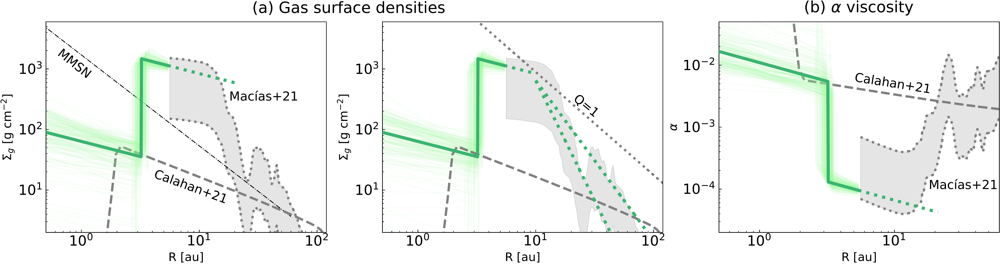

$\newcommand{\ensuremath}{}$
$\newcommand{\xspace}{}$
$\newcommand{\object}[1]{\texttt{#1}}$
$\newcommand{\farcs}{{.}''}$
$\newcommand{\farcm}{{.}'}$
$\newcommand{\arcsec}{''}$
$\newcommand{\arcmin}{'}$
$\newcommand{\ion}[2]{#1#2}$
$\newcommand{\textsc}[1]{\textrm{#1}}$
$\newcommand{\hl}[1]{\textrm{#1}}$
$\newcommand{\vdag}{(v)^\dagger}$
$\newcommand$
$\newcommand$
$\newcommand{\co}{{\rm ^{12}CO} J=3-2 }$
$\newcommand{\kms}{{\rm km s^{-1}}}$
$\newcommand{\mJB}{{\rm mJy {beam}^{-1}}}$
$\newcommand{\gcmt}{{\rm g {cm}^{-2}}}$

$\newcommand{$\ensuremath$}{}$
$\newcommand{$\xspace$}{}$
$\newcommand{$\object$}[1]{\texttt{#1}}$
$\newcommand{$\farcs$}{{.}''}$
$\newcommand{$\farcm$}{{.}'}$
$\newcommand{$\arcsec$}{''}$
$\newcommand{$\arcmin$}{'}$
$\newcommand{$\ion$}[2]{#1#2}$
$\newcommand{$\textsc$}[1]{\textrm{#1}}$
$\newcommand{$\hl$}[1]{\textrm{#1}}$
$\newcommand{$\vdag$}{(v)^\dagger}$
$\newcommand$
$\newcommand$
$\newcommand{$\co$}{{\rm ^{12}CO} J=3-2 }$
$\newcommand{$\kms$}{{\rm km s^{-1}}}$
$\newcommand{$\mJB$}{{\rm mJy {beam}^{-1}}}$
$\newcommand{$\gcmt$}{{\rm g {cm}^{-2}}}$

# Discovery of Line Pressure Broadening and Direct Constraint on Gas Surface Density in a Protoplanetary Disk

<mark>Appeared on: 2022-09-09</mark> - _12 pages, 5 figures, accepted for publication in ApJL_

Tomohiro C. Yoshida, et al. -- incl., <mark>Takahiro Ueda</mark>

**Abstract:** The gas surface density profile of protoplanetary disks is one of the most fundamental physical properties to understanding planet formation.However, it is challenging to determine the surface dunsity profile observationally, because the H$_2$emission cannot be observed in low-temperature regions.We analyzed the Atacama Large Millimeter/submillimeter Array (ALMA) archival data of the$\co$line toward the protoplanetary disk around TW Hya, and discovered extremely broad line wings due to the pressure broadening.In conjunction with a previously reported optically thin CO isotopologue line, the pressure broadened line wings enabled us to directly determine the midplane gas density for the first time.The gas surface density at$\sim5$au from the{ central star}reaches$\sim 10^3 {\rm g cm^{-2}}$, which suggests that the{ inner region of the}disk has enough mass to form a Jupiter-mass planet.{ Additionally, the gas surface density drops at the inner cavity by $\sim2$ orders of magnitude compared to outside the cavity.}We also found a low CO abundance of$\sim 10^{-6}$with respect to H$_2$, even inside the CO snowline, which suggests conversion of CO to less volatile species.Combining{ our results with}previous studies, the gas surface density jumps at$r\sim 20$au, suggesting that the inner region ($3<r<20$au) might be the magnetorotational instability dead zone.This study sheds light on direct gas-surface-density constraint without assuming the CO/H$_2$ratio using ALMA.

**Figure 2. -** (a) uv-distance vs. azimuthally averaged complex visibilities (black circles). The green points and gray dotted lines indicate the best-fitted model and the cavity-sized uniform disk model, respectively.
    (b) Averaged intensity maps with Briggs weighting (robust = 0) for the red- and blue-shifted line wings in the color scale and the black solid contour with 3 $\sigma$ and 5 $\sigma$($\sigma = 0.38 $\mJB$$). The maps with natural weighting are shown in Figure \ref{fig:comparison}.
    (c) 233 GHz continuum maps of \citet{tsuk19}.
    (d) Centroid velocity map.
    The white dashed circles in panel (b), (c), and (d) indicate the inner cavity radius \citep{andr16}. The gray solid contour shows the dust continuum emission \citep{tsuk19}. The contour starts from the brightness temperature of 10 K with an interval of 5 K.
    \label{fig:all} (*fig:all*)

**Figure 1. -**  Integrated spectrum of the $\co$ line in the $0$\farcs$ 2$ aperture (black solid line) with the uncertainty (gray shaded area) and a $3\sigma$ noise level (black dotted line).
    The gray dashed line indicates synthetic spectra of the \citet{huan18} model with a Gaussian line profile, while the green solid line shows the best-fit model results using the Voigt line profile (see Section \ref{sec:mod}).
    Blue- and red-masked ranges are used to create the averaged visibilities for each wing.
    $v$ denotes the velocity shift from the systemic velocity.
    \label{fig:spec} (*fig:spec*)

**Figure 5. -** { (a) Radial profiles of the gas surface density. The green solid lines show the best-fit model. The models with parameters randomly selected from the posterior distributions are plotted in light green. The MMSN model and the \citet{cala21} model are also shown in gray lines.
    The gray dotted lines indicate the gas surface density converted from the dust surface density of \citet{maci21}, assuming a gas-to-dust surface density ratio of 10 and 100. In the right panel, we also show the gas surface density when the Toomre Q equals unity, and the gas surface density profiles starting from $r=10$ au of the best-fit profile with fixing the total gas masses to 0.023 $M_\odot$ or 0.06 $M_\odot$.
    (b) The $\alpha$ viscosity parameter for each gas surface density profile, assuming a steady accretion disk. }\label{fig:radprof} (*fig:radprof*)

