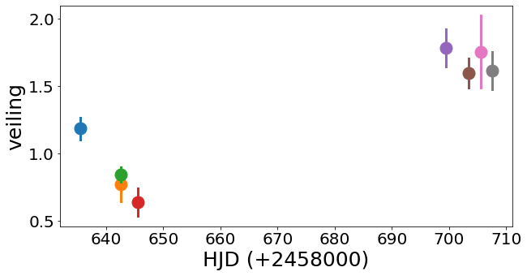
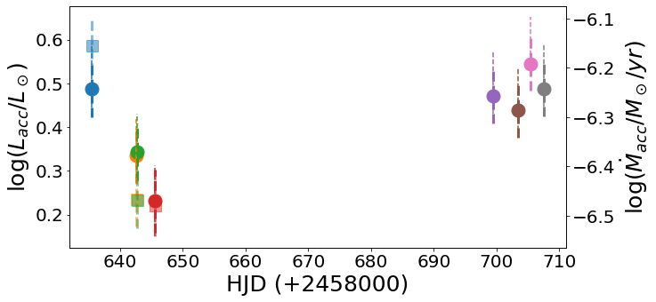
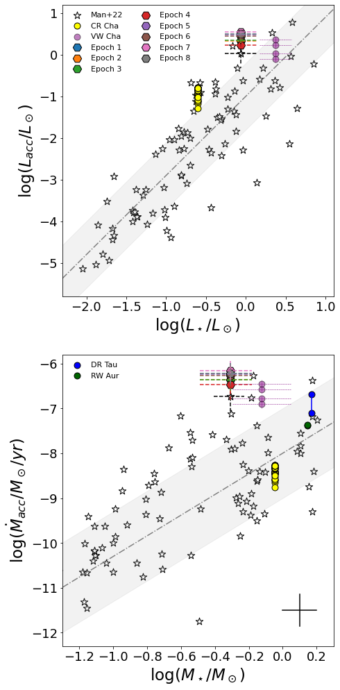
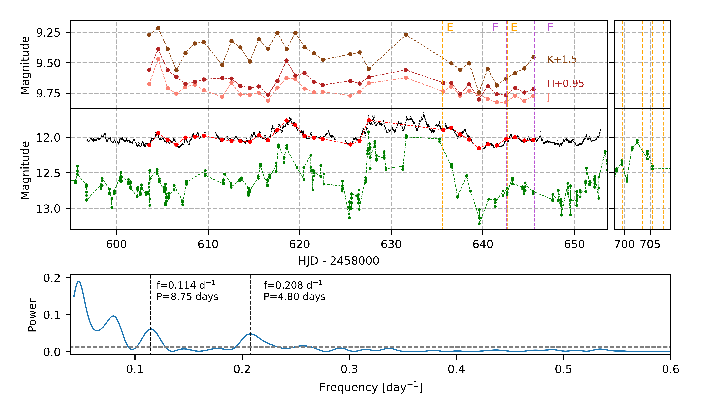

$\newcommand{\ensuremath}{}$
$\newcommand{\xspace}{}$
$\newcommand{\object}[1]{\texttt{#1}}$
$\newcommand{\farcs}{{.}''}$
$\newcommand{\farcm}{{.}'}$
$\newcommand{\arcsec}{''}$
$\newcommand{\arcmin}{'}$
$\newcommand{\ion}[2]{#1#2}$
$\newcommand{\textsc}[1]{\textrm{#1}}$
$\newcommand{\hl}[1]{\textrm{#1}}$
$\newcommand{\vdag}{(v)^\dagger}$
$\newcommand$
$\newcommand$
$\newcommand{\avWX}{2.75\pm0.75}$
$\newcommand{\lsun}{\mbox{L}_\odot}$
$\newcommand{\rsun}{\mbox{R}_\odot}$
$\newcommand{\msun}{\mbox{M}_\odot}$
$\newcommand{\lacc}{L_{\rm acc}}$
$\newcommand{\macc}{\dot{M}_{\rm acc}}$
$\newcommand{\lstar}{L_\star}$
$\newcommand{\mstar}{M_\star}$
$\newcommand{\rstar}{R_\star}$
$\newcommand{\teff}{T_{\rm eff}}$
$\newcommand{\lbol}{L_{\rm bol}}$
$\newcommand{\zsg}[1]{\textcolor{green}{[GZs: #1]}}$

$\newcommand{\ensuremath}{}$
$\newcommand{\xspace}{}$
$\newcommand{\object}[1]{\texttt{#1}}$
$\newcommand{\farcs}{{.}''}$
$\newcommand{\farcm}{{.}'}$
$\newcommand{\arcsec}{''}$
$\newcommand{\arcmin}{'}$
$\newcommand{\ion}[2]{#1#2}$
$\newcommand{\textsc}[1]{\textrm{#1}}$
$\newcommand{\hl}[1]{\textrm{#1}}$
$\newcommand{\vdag}{(v)^\dagger}$
$\newcommand$
$\newcommand$
$\newcommand{\avWX}{2.75\pm0.75}$
$\newcommand{\lsun}{\mbox{L}_\odot}$
$\newcommand{\rsun}{\mbox{R}_\odot}$
$\newcommand{\msun}{\mbox{M}_\odot}$
$\newcommand{\lacc}{L_{\rm acc}}$
$\newcommand{\macc}{\dot{M}_{\rm acc}}$
$\newcommand{\lstar}{L_\star}$
$\newcommand{\mstar}{M_\star}$
$\newcommand{\rstar}{R_\star}$
$\newcommand{\teff}{T_{\rm eff}}$
$\newcommand{\lbol}{L_{\rm bol}}$
$\newcommand{\zsg}[1]{\textcolor{green}{[GZs: #1]}}$

# Accretion and extinction variations in the low-mass pre-main sequence binary system WX Cha

<mark>Appeared on: 2022-09-09</mark> - __

Eleonora Fiorellino, et al.

**Abstract:** Light curves of young star systems show photometric variability due to different kinematic, and physical processes.  One of the main contributors to the photometric variability is the changing mass accretion rate, which regulates the interplay between the forming young star and the protoplanetary disk.  We collected high-resolution spectroscopy in eight different epochs, as well as ground-based and space-borne multi-epoch optical and infrared photometry of WX Cha, an M0 binary system, with an almost edge-on disk ( $i =87^\circ$ ) in the Chamaeleon I star-forming region.  Spectroscopic observations cover 72 days, the ground-based optical monitoring covers 42 days while space-borne TESS photometry extends for 56 days.  The multi-wavelength light curves exhibit quasi-periodic variability of $0.35-0.53$ mag in the near-infrared, and of 1.3 mag in $g$ band. We studied the variability of selected emission lines that trace the accretion, computed the accretion luminosity and the mass accretion rate using empirical relations and obtained values between $\lacc \sim 1.6   \lsun   -   3.2   \lsun$ and $\macc \sim 3.31 \times 10^{-7}  \msun/{\rm yr}   -   7.76 \times 10^{-7}$ $\msun/$ yr.  Our results show that WX Cha is accreting at a rate larger than what is typical for T Tauri stars in the same star-forming region with the same stellar parameters. We theorize that this is due to the higher disk mass of WX Cha than what is usual for stars with similar stellar mass, and to the binary nature of the system.  Daily changes in the accretion luminosity and in the extinction can explain the photometric variability.

**Figure 3. -** _ Top_: Absolute veiling measurements for WX Cha.
    _ Bottom_: The accretion luminosity and the mass accretion rate as a function of the time. The filled circles represent accretion rates computed by using the mean value ($A_V = 3.4 \pm 0.2$). The filled squares represent the accretion rates computed by using the exact value of the extinction for that epoch (see Tab. \ref{tab:Av}). (*fig:veiling*)

**Figure 4. -** _ Top_: Accretion luminosity as a function of the stellar luminosity. _ Bottom_: Mass accretion rate as a function of the stellar mass. Black stars show Cha I CTTS sample \citep[][]{manaraPPVII}. In particular, the star with error bar corresponds to WX Cha.
    Yellow, purple, blue and dark green circles correspond to CR Cha, VW Cha, DR Tau, and RW Tau accretion rates \citep[][respectively]{zsidi2022, zsidi2022vwcha, giannini2022, facchini2016}. WX Cha accretion rates computed in this work are shown in hexagons, each epoch is identified by the a different color as labelled in the legend. The black cross on the bottom-right of the plot represent the uncertainty for Cha I CTTS sources. The uncertainties smaller than the symbol size are not presented. Dashed-dotted lines and the grey regions represent the best fit of Cha I sources and the relative $1\sigma$ dispersion.  (*fig:acc_stellarpar*)

**Figure 6. -** The 2019 (top panel) TESS light curve is indicated with black dots, and the contemporaneous ASAS SN $g$ band light curve is shown with green points. SMARTS $I$-band (red), $J$(pink), $H$(bordeaux), and $K$(brown) light curves are also added.
    Vertical dashed lines correspond to epochs when ESPRESSO (orange) and FEROS (magenta) spectra were taken. Since Epoch 2 (FEROS) and 3 (ESPRESSO) were taken during the same night, so these epochs are superimposed in the figure.
    The blue line (bottom panel) shows the Lomb-Scargle periodogram obtained using the 2019 TESS data. Points of the same light curve are linked with dashed lines only to help the reader follow each light curve. Horizontal lines represent false alarm probabilities of 1\%, and 0.01\%, respectively. (*fig:lc_period*)

