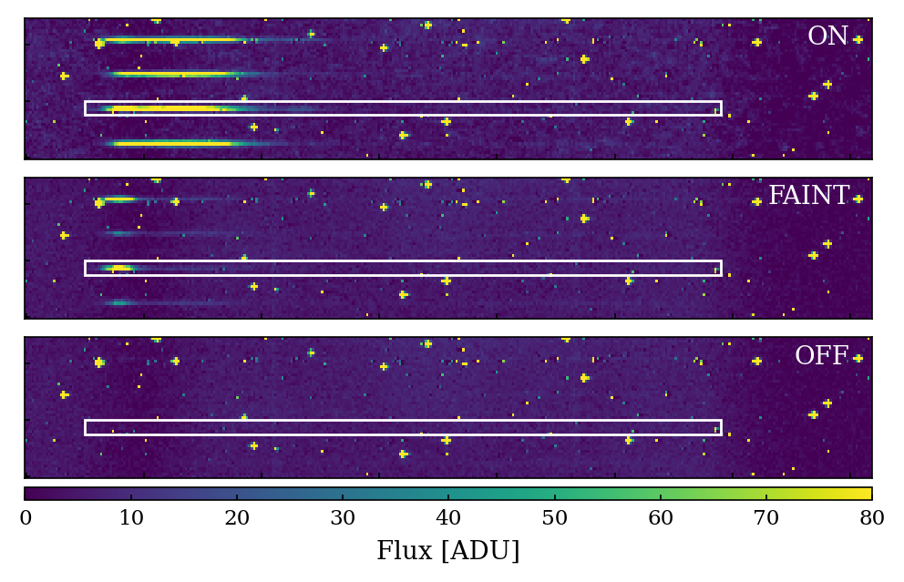
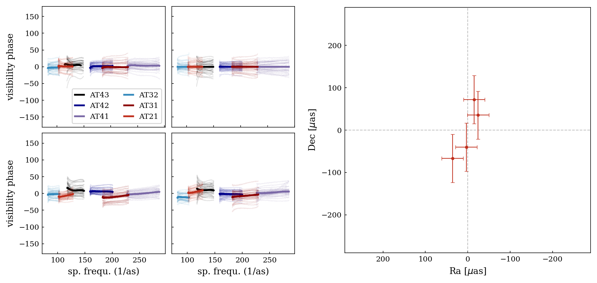
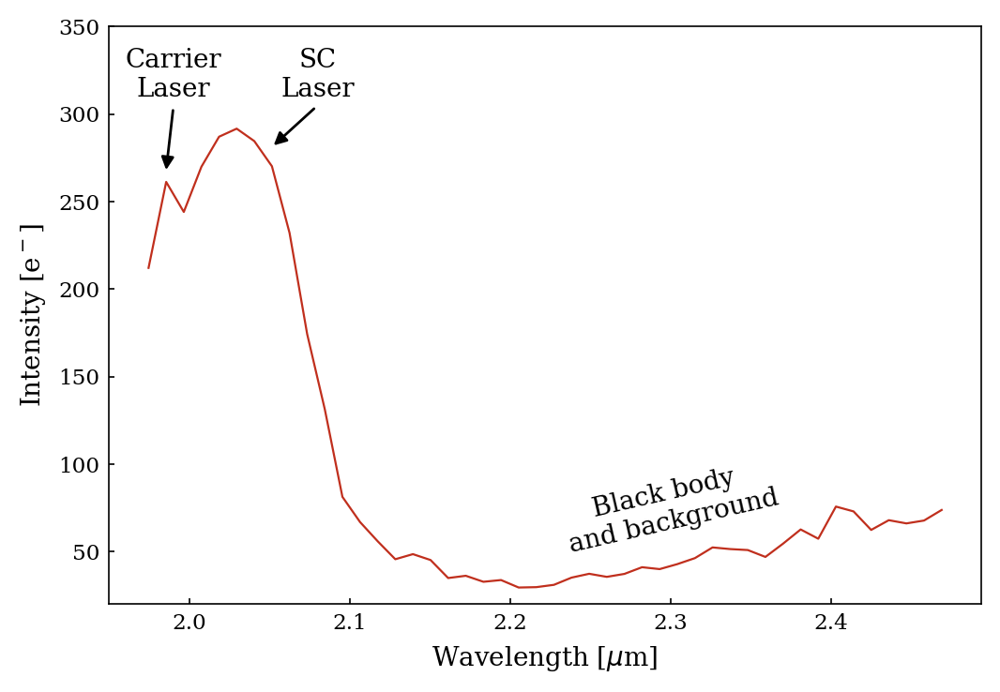

$\newcommand{\ensuremath}{}$
$\newcommand{\xspace}{}$
$\newcommand{\object}[1]{\texttt{#1}}$
$\newcommand{\farcs}{{.}''}$
$\newcommand{\farcm}{{.}'}$
$\newcommand{\arcsec}{''}$
$\newcommand{\arcmin}{'}$
$\newcommand{\ion}[2]{#1#2}$
$\newcommand{\textsc}[1]{\textrm{#1}}$
$\newcommand{\hl}[1]{\textrm{#1}}$
$\newcommand{\footnote}[1]{}$
$\newcommand{\GP}{GRAVITY^+}$
$\newcommand{\baselinestretch}{1.0}$

$\newcommand{\ensuremath}{}$
$\newcommand{\xspace}{}$
$\newcommand{\object}[1]{\texttt{#1}}$
$\newcommand{\farcs}{{.}''}$
$\newcommand{\farcm}{{.}'}$
$\newcommand{\arcsec}{''}$
$\newcommand{\arcmin}{'}$
$\newcommand{\ion}[2]{#1#2}$
$\newcommand{\textsc}[1]{\textrm{#1}}$
$\newcommand{\hl}[1]{\textrm{#1}}$
$\newcommand{\footnote}[1]{}$
$\newcommand{\GP}{GRAVITY^+}$
$\newcommand{\baselinestretch}{1.0}$

# GRAVITY faint: reducing noise sources in GRAVITY$^+$ with a fast metrology attenuation system

<mark>Appeared on: 2022-09-12</mark> - _Proceeding of SPIE Astronomical Telescopes + Instrumentation 2022_

F. Widmann, et al. -- incl., <mark><mark>L. Kreidberg</mark></mark>

**Abstract:** With the upgrade from GRAVITY to GRAVITY+ the instrument will evolve to an all-sky interferometer that can observe faint targets, such as high redshift AGN. Observing the faintest targets requires reducing the noise sources in GRAVITY as much as possible. The dominant noise source, especially in the blue part of the spectrum, is the backscattering of the metrology laser light onto the detector. To reduce this noise we introduce two new metrology modes. With a combination of small hardware changes and software adaptations, we can dim the metrology laser during the observation without losing the phase referencing. For single beam targets, we can even turn off the metrology laser for the maximum SNR on the detector. These changes lead to a SNR improvement of over a factor of two averaged over the whole spectrum and up to a factor of eight in the part of the spectrum currently dominated by laser noise.

**Figure 3. -** Cut out from the detector image of a dark frame in all three modes. Top: metrology on, where clear backscattering can be seen in left part of the spectra. Middle: metrology faint, with only a small peak from the carrier laser remaining. Bottom: metrology off, no spectra visible anymore. The white rectangle in all plots shows a typical extraction region for a spectrum. (*fig:met_det*)

**Figure 7. -** First test of an astrometric measurement with GRAVITY-faint. The left plots show the visibility phase over 4 exposures of \SI{2}{\min} each, with the average phase as a bold line and the phase per DIT shaded out. The right plot shows the astrometry of the four files, relative to the calibrated phase center. (*fig:gfaint_pos*)

**Figure 2. -** Measured intensity on a \SI{10}{\second} dark frame in medium resolution with an indication for the dominant sources over the spectrum. (*fig:intensity*)

