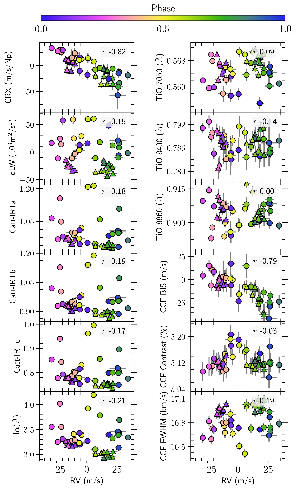
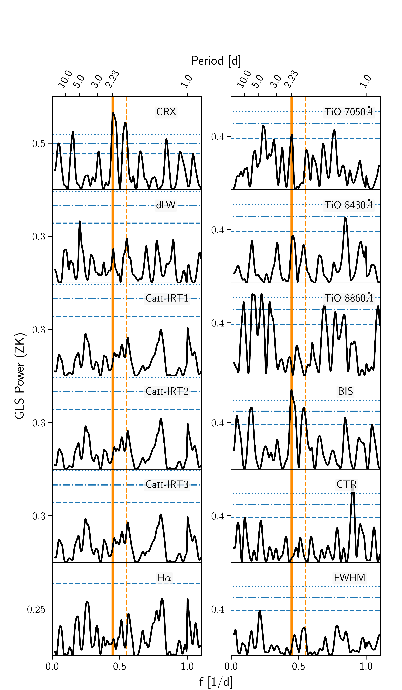
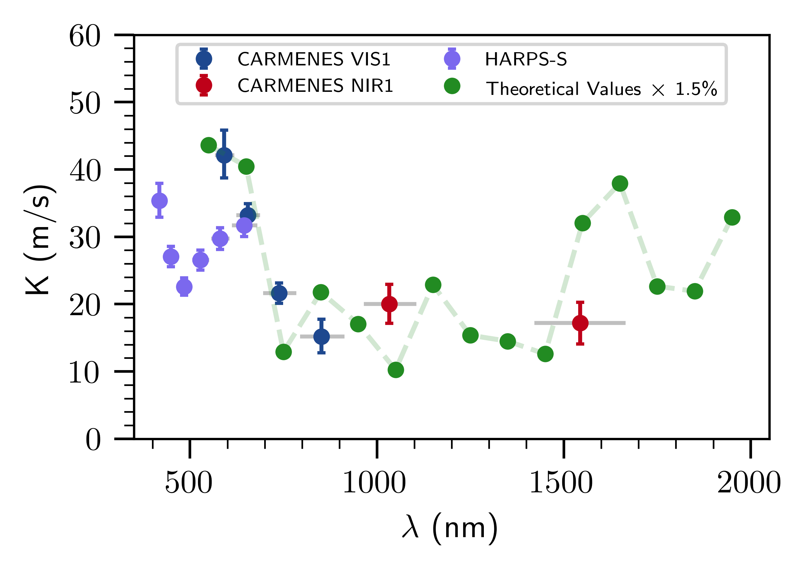
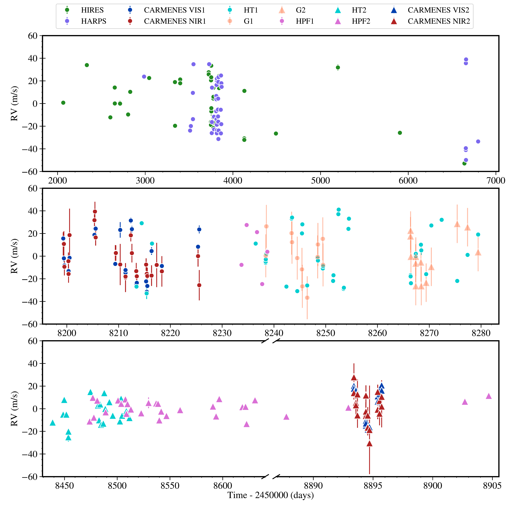

$\newcommand{\ensuremath}{}$
$\newcommand{\xspace}{}$
$\newcommand{\object}[1]{\texttt{#1}}$
$\newcommand{\farcs}{{.}''}$
$\newcommand{\farcm}{{.}'}$
$\newcommand{\arcsec}{''}$
$\newcommand{\arcmin}{'}$
$\newcommand{\ion}[2]{#1#2}$
$\newcommand{\textsc}[1]{\textrm{#1}}$
$\newcommand{\hl}[1]{\textrm{#1}}$
$\newcommand{\footnote}[1]{}$
$\newcommand{\juliet}{\texttt{juliet}}$
$\newcommand{\serval}{\texttt{serval}}$
$\newcommand{\george}{\texttt{george}}$
$\newcommand{\exostriker}{\texttt{Exo-Striker}}$
$\newcommand{\tess}{TESS}$
$\newcommand{\gaia}{\textit{Gaia}}$
$\newcommand{\jwst}{JWST}$
$\newcommand{\au}{au}$
$\newcommand{\XX}{\textbf{\textcolor{red}{XX}}}$
$\newcommand{\addref}[1]{(add ref)}$
$\newcommand{\person}[2]{\textcolor{magenta}{\bf @#1: #2}}$
$\newcommand{\TODO}[1]{\textcolor{magenta}{\textsc{todo:} \textit{#1}}}$
$\newcommand{\CHANGE}[1]{\textcolor{red}{\textbf{#1}}}$
$\newcommand$
$\newcommand{\abs}[1]{|#1|}$
$\newcommand{\ms}{m s^{-1}}$
$\newcommand{\mearth}{M_\oplus}$
$\newcommand{\rearth}{R_\oplus}$

$\newcommand{\ensuremath}{}$
$\newcommand{\xspace}{}$
$\newcommand{\object}[1]{\texttt{#1}}$
$\newcommand{\farcs}{{.}''}$
$\newcommand{\farcm}{{.}'}$
$\newcommand{\arcsec}{''}$
$\newcommand{\arcmin}{'}$
$\newcommand{\ion}[2]{#1#2}$
$\newcommand{\textsc}[1]{\textrm{#1}}$
$\newcommand{\hl}[1]{\textrm{#1}}$
$\newcommand{\footnote}[1]{}$
$\newcommand{\juliet}{\texttt{juliet}}$
$\newcommand{\serval}{\texttt{serval}}$
$\newcommand{\george}{\texttt{george}}$
$\newcommand{\exostriker}{\texttt{Exo-Striker}}$
$\newcommand{\tess}{TESS}$
$\newcommand{\gaia}{\textit{Gaia}}$
$\newcommand{\jwst}{JWST}$
$\newcommand{\au}{au}$
$\newcommand{\XX}{\textbf{\textcolor{red}{XX}}}$
$\newcommand{\addref}[1]{(add ref)}$
$\newcommand{\person}[2]{\textcolor{magenta}{\bf @#1: #2}}$
$\newcommand{\TODO}[1]{\textcolor{magenta}{\textsc{todo:} \textit{#1}}}$
$\newcommand{\CHANGE}[1]{\textcolor{red}{\textbf{#1}}}$
$\newcommand$
$\newcommand{\abs}[1]{|#1|}$
$\newcommand{\ms}{m s^{-1}}$
$\newcommand{\mearth}{M_\oplus}$
$\newcommand{\rearth}{R_\oplus}$

# The CARMENES search for exoplanets around M dwarfs

<mark>Appeared on: 2022-09-13</mark> - _27 pages, 11 figures_

D. Kossakowski, et al. -- incl., <mark>M. Kürster</mark>, <mark>T. Trifonov</mark>, <mark>M. Pérez-Torres</mark>, <mark>A. Pavlov</mark>

**Abstract:** A challenge with radial-velocity (RV) data is disentangling the origin of signals either due to a planetary companion or to stellar activity. In fact, the existence of a planetary companion has been proposed, as well as contested, around the relatively bright, nearby M3.0 V star AD Leo at the same period as the stellar rotation of 2.23 d. We further investigate the nature of this signal. We introduce new CARMENES optical and near-IR RV data and an analysis in combination with archival data taken by HIRES and HARPS, along with more recent data from HARPS-N, GIANO-B, and HPF. Additionally, we address the confusion concerning the binarity of AD Leo. We consider possible correlations between the RVs and various stellar activity indicators accessible with CARMENES. We additionally applied models within a Bayesian framework to determine whether a Keplerian model, a red-noise quasi-periodic model using a Gaussian process, or a mixed model would explain the observed data best. We also exclusively focus on spectral lines potentially associated with stellar activity. The CARMENES RV data agree with the previously reported periodicity of 2.23 d, correlate with some activity indicators, and exhibit chromaticity.  However, when considering the entire RV data set, we find that a mixed model composed of a stable and a variable component performs best. Moreover, when recomputing the RVs using only spectral lines insensitive to activity, there appears to be some residual power at the period of interest. We therefore conclude that it is not possible to determinedly prove that there is no planet orbiting in synchronization with the stellar rotation given our data, current tools, machinery, and knowledge of how stellar activity affects RVs. We do rule out planets more massive than 27 M $_{\oplus}$ (= 0.084 M $_\textnormal{Jup}$ ). Likewise, we exclude any binary companion around AD Leo with M $\sin{i}$ greater than 3--6 M $_\textnormal{Jup}$ on orbital periods $<14$ yr.

**Figure 11. -** Correlation plots with the RVs (_left_) and GLS periodograms (_right_) of the various stellar activity indicators from the CARMENES VIS spectroscopic data for AD Leo. For the correlation plots, the circles and triangles represent the first and second subset of CARMENES VIS data, respectively. Data points are color-coded with the rotation phase. The Pearson-$r$ correlation coefficient combining both subsets is shown within each panel (R). For the periodograms, only the first season of the CARMENES VIS data was considered for plotting. The orange vertical solid and dashed lines represent the rotation period at $P=2.23$ d and its daily alias at 1.81 d. The horizontal dotted, dot-dashed, and dashed blue lines represent the 10 \%, 1 \%, and 0.1 \% FAP levels. (*fig:carmvisactivity*)

**Figure 3. -** Radial-velocity semi-amplitudes as a function of wavelength for the wavelength chunks from HARPS and the CARMENES VIS and NIR spectographs. The gray horizontal lines for each data point correspond to the wavelength coverage considered when recomputing the RV for the wavelength chunk. The green dots connected by a dashed line represent the theoretical values of a 1.5\% spot coverage on a 3700 K, $v \sin{i}$ of 5 k$\ms$ star with a temperature difference of 200 K taken from \cite{Reiners2010}. The theoretical values are binned in 2 to serve as a better comparison to the wavelength bins provided by the real data. (*fig:Kvswavelength*)

**Figure 7. -** Time series of all RVs with instrumental offsets accounted for. The RV uncertainties are included, though many are too small to be seen in the plots. The HIRES and HARPS data span a large time range and the rest of the data come in $\sim$12 years later after the time when the majority of the previous data were taken. The time axis is interrupted in several places, and stretched differently between the individual sections. Additionally, the majority of HIRES and HARPS time series are overlapping each other. Four of the HARPS-N data overlap with CARMENES data; and the GIANO-B data are taken all within the first observing run for HARPS-N. The first season of HPF data overlaps with the HARPS-N and GIANO-B data sets whereas the HPF second season overlaps with the HARPS-N and CARMENES second season. (*fig:allrv_timeseries*)

