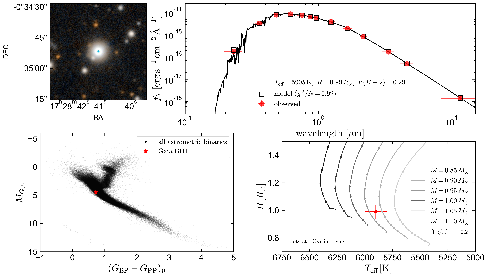

$\newcommand{\ensuremath}{}$
$\newcommand{\xspace}{}$
$\newcommand{\object}[1]{\texttt{#1}}$
$\newcommand{\farcs}{{.}''}$
$\newcommand{\farcm}{{.}'}$
$\newcommand{\arcsec}{''}$
$\newcommand{\arcmin}{'}$
$\newcommand{\ion}[2]{#1#2}$
$\newcommand{\textsc}[1]{\textrm{#1}}$
$\newcommand{\hl}[1]{\textrm{#1}}$
$\newcommand{\footnote}[1]{}$
$\newcommand{\shrug}[1][]{$
$\begin{tikzpicture}[baseline,x=0.8\ht\strutbox,y=0.8\ht\strutbox,line width=0.125ex,#1]$
$\newcommand{\arm}{(-2.5,0.95) to (-2,0.95) (-1.9,1) to (-1.5,0) (-1.35,0) to (-0.8,0)}$
$\draw \arm;$
$\draw[xscale=-1] \arm;$
$\newcommand{\headpart}{(0.6,0) arc[start angle=-40, end angle=40,x radius=0.6,y radius=0.8]}$
$\draw \headpart;$
$\draw[xscale=-1] \headpart;$
$\newcommand{\eye}{(-0.075,0.15) .. controls (0.02,0) .. (0.075,-0.15)}$
$\draw[shift={(-0.3,0.8)}] \eye;$
$\draw[shift={(0,0.85)}] \eye;$
$\draw (-0.1,0.2) to [out=15,in=-100] (0.4,0.95);$
$\end{tikzpicture}}$
$\newcommand{\red}[1]{\textcolor{red}{#1}}$
$\newcommand{\blue}[1]{\textcolor{blue}{#1}}$
$\newcommand{\xmark}{\ding{55}}$
$\newcommand{\cmark}{\ding{51}}$
$\newcommand{\thebibliography}{\DeclareRobustCommand{\VAN}[3]{##3}\VANthebibliography}$
$\newcommand{\arm}{(-2.5,0.95) to (-2,0.95) (-1.9,1) to (-1.5,0) (-1.35,0) to (-0.8,0)}$
$\newcommand{\headpart}{(0.6,0) arc[start angle=-40, end angle=40,x radius=0.6,y radius=0.8]}$
$\newcommand{\eye}{(-0.075,0.15) .. controls (0.02,0) .. (0.075,-0.15)}$
$\newcommand{\}{mn}$
$\newcommand{\}{mn}$
$\newcommand{\}{mn}$
$\newcommand{\}{mn}$
$\newcommand{\}{mn}$
$\newcommand{\}{mn}$
$\newcommand{\}{mn}$
$\newcommand{\@}{tempa}$
$\newcommand{\@}{tempa }$
$\newcommand{\@}{tempb }$
$\newcommand{\@}{tempc$
$  }$
$\newcommand{\@}{tempb }$

$\newcommand{\ensuremath}{}$
$\newcommand{\xspace}{}$
$\newcommand{\object}[1]{\texttt{#1}}$
$\newcommand{\farcs}{{.}''}$
$\newcommand{\farcm}{{.}'}$
$\newcommand{\arcsec}{''}$
$\newcommand{\arcmin}{'}$
$\newcommand{\ion}[2]{#1#2}$
$\newcommand{\textsc}[1]{\textrm{#1}}$
$\newcommand{\hl}[1]{\textrm{#1}}$
$\newcommand{\footnote}[1]{}$
$\newcommand{\shrug}[1][]{$
$\begin{tikzpicture}[baseline,x=0.8\ht\strutbox,y=0.8\ht\strutbox,line width=0.125ex,#1]$
$\newcommand{\arm}{(-2.5,0.95) to (-2,0.95) (-1.9,1) to (-1.5,0) (-1.35,0) to (-0.8,0)}$
$\draw \arm;$
$\draw[xscale=-1] \arm;$
$\newcommand{\headpart}{(0.6,0) arc[start angle=-40, end angle=40,x radius=0.6,y radius=0.8]}$
$\draw \headpart;$
$\draw[xscale=-1] \headpart;$
$\newcommand{\eye}{(-0.075,0.15) .. controls (0.02,0) .. (0.075,-0.15)}$
$\draw[shift={(-0.3,0.8)}] \eye;$
$\draw[shift={(0,0.85)}] \eye;$
$\draw (-0.1,0.2) to [out=15,in=-100] (0.4,0.95);$
$\end{tikzpicture}}$
$\newcommand{\red}[1]{\textcolor{red}{#1}}$
$\newcommand{\blue}[1]{\textcolor{blue}{#1}}$
$\newcommand{\xmark}{\ding{55}}$
$\newcommand{\cmark}{\ding{51}}$
$\newcommand{\thebibliography}{\DeclareRobustCommand{\VAN}[3]{##3}\VANthebibliography}$
$\newcommand{\arm}{(-2.5,0.95) to (-2,0.95) (-1.9,1) to (-1.5,0) (-1.35,0) to (-0.8,0)}$
$\newcommand{\headpart}{(0.6,0) arc[start angle=-40, end angle=40,x radius=0.6,y radius=0.8]}$
$\newcommand{\eye}{(-0.075,0.15) .. controls (0.02,0) .. (0.075,-0.15)}$
$\newcommand{\}{mn}$
$\newcommand{\}{mn}$
$\newcommand{\}{mn}$
$\newcommand{\}{mn}$
$\newcommand{\}{mn}$
$\newcommand{\}{mn}$
$\newcommand{\}{mn}$
$\newcommand{\@}{tempa}$
$\newcommand{\@}{tempa }$
$\newcommand{\@}{tempb }$
$\newcommand{\@}{tempc$
$  }$
$\newcommand{\@}{tempb }$

# A Sun-like star orbiting a black hole

<mark>Appeared on: 2022-09-14</mark> - _30 pages, 15 figures, 1-2 black holes. Accepted to MNRAS_

<mark><mark>Kareem El-Badry</mark></mark>, et al. -- incl., <mark><mark>Hans-Walter Rix</mark></mark>, <mark><mark>Rhys Seeburger</mark></mark>, <mark><mark>Jennifer Wojno</mark></mark>

**Abstract:** We report discovery of a bright, nearby ( $G = 13.8;  d = 480 \rm pc$ ) Sun-like star orbiting a dark object. We identified the system as a black hole candidate via its astrometric orbital solution from the $_ Gaia_$ mission. Radial velocities validated and refined the $_ Gaia_$ solution, and spectroscopy ruled out significant light contributions from another star. Joint modeling of radial velocities and astrometry constrains the companion mass to $M_2 = 9.62\pm 0.18 M_{\odot}$ . The spectroscopic orbit alone sets a minimum companion mass of $M_2>5 M_{\odot}$ ; if the companion were a $5 M_{\odot}$ star, it would be $500$ times more luminous than the entire system. These constraints are insensitive to the mass of the luminous star, which appears as a slowly-rotating G dwarf ( $T_{\rm eff}=5850 \rm K$ , $\log g = 4.5$ , $M=0.93 M_{\odot}$ ), with near-solar metallicity ( $\rm[Fe/H] = -0.2$ ) and an unremarkable abundance pattern. We find no plausible astrophysical scenario that can explain the orbit and does not involve a black hole. The orbital period, $P_{\rm orb}=185.6$ days, is longer than that of any known stellar-mass black hole binary. The system's modest eccentricity ( $e=0.45$ ), high metallicity, and thin-disk Galactic orbit suggest that it was born in the Milky Way disk with at most a weak natal kick. How the system formed is uncertain. Common envelope evolution can only produce the system's wide orbit under extreme and likely unphysical assumptions. Formation models involving triples or dynamical assembly in an open cluster may be more promising. This is the nearest known black hole by a factor of 3, and its discovery suggests the existence of a sizable population of dormant black holes in binaries. Future $_ Gaia_$ releases will likely facilitate the discovery of dozens more.

**Figure 2. -** Properties of the luminous star. Upper left shows a 45 arcsecond wide $z$/$g$ PanSTARRS postage stamp centered on the source. Upper right shows the broadband SED and a single-star fit. Red points show observed photometry; open black squares show the integrated fluxes predicted for the model spectrum (black line). Lower left compares the source to the rest of the _ Gaia_ astrometric binary sample on the color-magnitude diagram. Lower right compares the temperature and radius measured from the SED to single-star MIST evolutionary models with [Fe/H] = -0.2 (as measured from spectroscopy), which suggest a mass of $M_\star \approx 0.93 M_{\odot}$.  (*fig:mosaic*)

**Figure 3. -** Radial velocities. Points with error bars are measurements; gray lines are draws from the posterior when jointly fitting these RVs and the _ Gaia_ astrometric constraints. Top panel shows all available RVs, including observations by the LAMOST survey in 2017 and 2019; bottom panel highlights our follow-up in 2022. The best-fit solution has a period of 186 days, eccentricity 0.45, and RV semi-amplitude of $67 \rm km s^{-1}$. Together with the inclination constraint from astrometry, this implies a companion mass of $9.62\pm 0.18 M_{\odot}$.  (*fig:rvfig*)

**Figure 1. -** Number of sources in _ Gaia_ DR3 in which a $10 M_{\odot}$ dark companion could be detected. Black line shows the cuts employed in DR3 (Equations \ref{eq:cut} and \ref{eq:acut}), which remove most short-period binaries. Dashed red line corresponds to simply requiring $a_0/\sigma_{a_0} > 10$ and $\varpi/\sigma_{\varpi} > 10$; this results in a much larger searchable volume at short periods. Binaries with periods near 1 year are excluded, being difficult to detect with astrometry.   (*fig:volume_different_cuts*)

