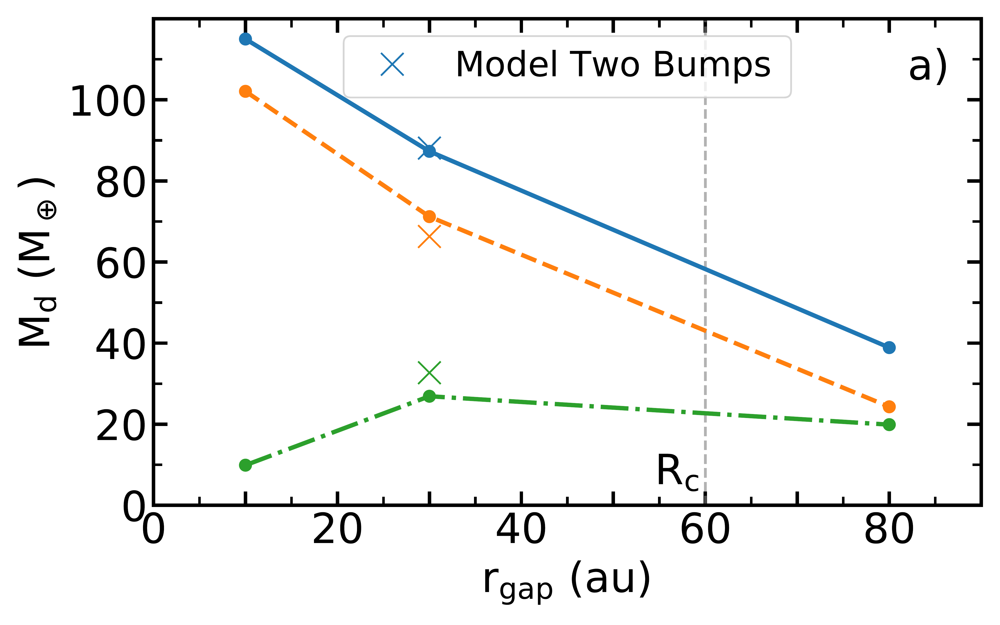

$\newcommand{\ensuremath}{}$
$\newcommand{\xspace}{}$
$\newcommand{\object}[1]{\texttt{#1}}$
$\newcommand{\farcs}{{.}''}$
$\newcommand{\farcm}{{.}'}$
$\newcommand{\arcsec}{''}$
$\newcommand{\arcmin}{'}$
$\newcommand{\ion}[2]{#1#2}$
$\newcommand{\textsc}[1]{\textrm{#1}}$
$\newcommand{\hl}[1]{\textrm{#1}}$
$\newcommand{\footnote}[1]{}$
$\newcommand$

$\newcommand{\ensuremath}{}$
$\newcommand{\xspace}{}$
$\newcommand{\object}[1]{\texttt{#1}}$
$\newcommand{\farcs}{{.}''}$
$\newcommand{\farcm}{{.}'}$
$\newcommand{\arcsec}{''}$
$\newcommand{\arcmin}{'}$
$\newcommand{\ion}[2]{#1#2}$
$\newcommand{\textsc}[1]{\textrm{#1}}$
$\newcommand{\hl}[1]{\textrm{#1}}$
$\newcommand{\footnote}[1]{}$
$\newcommand$

# The impact of dynamic pressure bumps on the observational properties of protoplanetary disks

<mark>Appeared on: 2022-09-16</mark> - _22 pages, 15 figures. To be published in Astronomy & Astrophysics_

<mark><mark>Jochen Stadler</mark></mark>, et al. -- incl., <mark><mark>Matías Gárate</mark></mark>

**Abstract:** Over the last years, large (sub-)millimetre surveys of protoplanetary disks in different star forming regions have well constrained the demographics of disks, such as their millimetre luminosities, spectral indices, and disk radii. Additionally, several high-resolution observations have revealed an abundance of substructures in the disk's dust continuum. The most prominent are ring like structures, which are likely caused by pressure bumps trapping dust particles. The origins and characteristics of these pressure bumps, nevertheless, need to be further investigated. The purpose of this work is to study how dynamic pressure bumps affect observational properties of protoplanetary disks. We further aim to differentiate between the planetary- versus zonal flow-origin of pressure bumps. We perform one-dimensional gas and dust evolution simulations, setting up models with varying pressure bump features, including their amplitude and location, growth time, and number of bumps. We subsequently run radiative transfer calculations to obtain synthetic images, from which we obtain the different quantities of observations. We find that the outermost pressure bump determines the disk's dust size across different millimetre wavelengths and confirm that the observed dust masses of disks with optically thick inner bumps ( $<40$ au) are underestimated by up to an order of magnitude. Our modelled dust traps need to form early (< 0.1 Myr), fast (on viscous timescales), and must be long lived (> Myr) to obtain the observed high millimetre luminosities and low spectral indices of disks. While the planetary bump models can reproduce these observables irrespectively of the opacity prescription, the highest opacities are needed for the dynamic bump model, which mimics zonal flows in disks, to be in line with observations. Our findings favour the planetary- over the zonal flow-origin of pressure bumps and support the idea that planet formation already occurs in early class 0-1 stages of circumstellar disks. The determination of the disk's effective size through its outermost pressure bump also delivers a possible answer to why disks in recent low-resolution surveys appear to have the same sizes across different millimetre wavelengths.

**Figure 3. -** Size-luminosity relations and spectral indices dependent on disk sizesSize-luminosity relations and spectral indices dependent on disk sizes. In **a) + b)** the fluxes are divided by the cosine of the inclination (i = 20°).  The plotted 68\% emission disk radii are found to decrease from low (0.30") to high (0.04") resolution for all models irrespective of wavelength which is highlighted by lines connecting both radii. The grey dashed lines show the relations for Lupus at $\lambda=$1.3 mm and $\lambda=$3.0 mm found by  ([Tazzari, Clarke and Testi (2021)]()) , where the grey area represents the 68\% confidence interval around the median. **c)** Spectral index ($\alpha_\mathrm{1.3-3.0mm}$) over disk effective size (R$_\mathrm{d, 68\%}$) at $\lambda=$1.3 mm with 0.30" resolution, black dots show Lupus data also from  ([Tazzari, Clarke and Testi (2021)]()) . (*fig:Tazzari_relations*)

**Figure 8. -** Dust mass and optical depth parameter plots. \textsl{(Upper)} Total dust mass (blue), dust mass for grains larger than 0.1 mm (orange) and observed dust mass (green) plotted over the gap location, bump amplitude and bump growth time (from a) - c)). \textsl{(Lower)} Absorption and observed peak optical depth also in dependence on bump model parameters. The _Inner Bump_ model reaches $\tau_\mathrm{abs}=35$ which is why we used a logarithmic scale in subplot a) (*fig:Mdust_tau_effect*)

**Figure 2. -** Surface density and dust masses plots of dynamic bumps models. **a)** Gas (dashed line) and dust (solid line) surface densities at 1 Myr of evolution for the different dynamic bumps models and the model without any bumps for comparison. **b)** Total dust mass of each model over the disk lifetime. (*fig:dynamic_bumps*)

