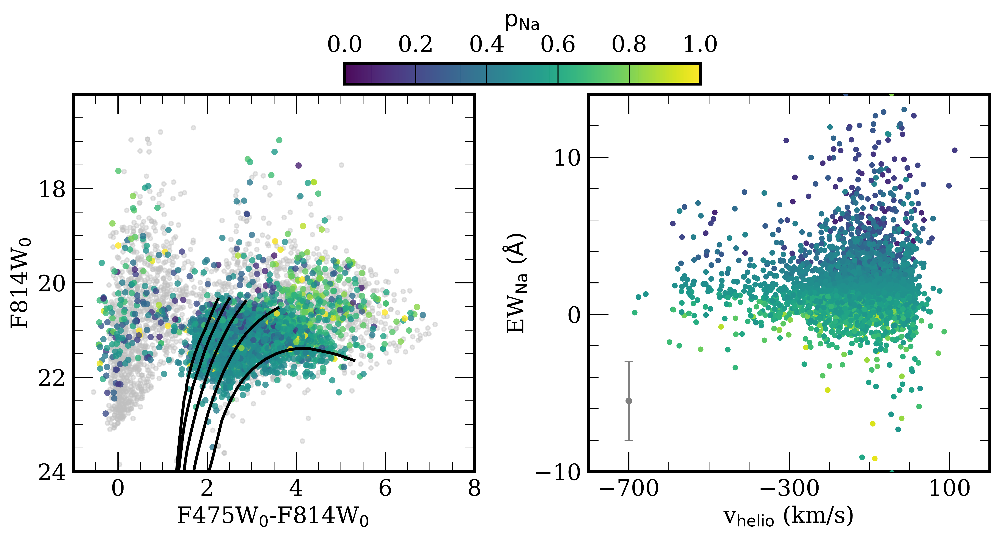
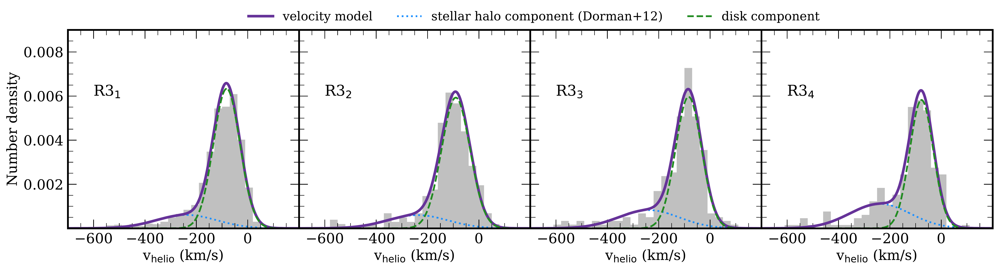

$\newcommand{\ensuremath}{}$
$\newcommand{\xspace}{}$
$\newcommand{\object}[1]{\texttt{#1}}$
$\newcommand{\farcs}{{.}''}$
$\newcommand{\farcm}{{.}'}$
$\newcommand{\arcsec}{''}$
$\newcommand{\arcmin}{'}$
$\newcommand{\ion}[2]{#1#2}$
$\newcommand{\textsc}[1]{\textrm{#1}}$
$\newcommand{\hl}[1]{\textrm{#1}}$
$\newcommand{\nsplash}{6405}$
$\newcommand{\fkickedupdiskdorman}{5.2\% \pm 1.2\%}$
$\newcommand{\fmrtotstat}{6.5\% \pm 1.4\%}$
$\newcommand{\fmrtot}{5.5\%}$
$\newcommand{\fkickedupdiskexcess}{6.8\% \pm 0.4\%}$
$\newcommand{\fdisktotstat}{75.0\% \pm 4.5\%}$
$\newcommand{\fehphotshiftfourtotwelve}{-0.26}$
$\newcommand{\medfehphotneshelf}{-0.16}$
$\newcommand{\medfehphotminhalo}{-0.15}$
$\newcommand{\fehphotshiftnoinnerfield}{-0.29}$
$\newcommand{\frachostnbody}{98.9\%}$
$\newcommand{\ndiskrgb}{2443}$
$\newcommand{\nhalorgb}{657}$
$\newcommand{\nmixedrgb}{436}$
$\newcommand{\fehphotdiskrgbmr}{-0.10}$
$\newcommand{\fehphotdiskrgbmp}{-0.89}$
$\newcommand{\fehphotdiskrgbmrsig}{0.23}$
$\newcommand{\fehphotdiskrgbmpsig}{0.53}$
$\newcommand{\fehphotdiskrgbmrfrac}{70\%}$
$\newcommand{\fehphotdiskrgbmpfrac}{30\%}$
$\newcommand{\fehphothalorgbmr}{-0.16}$
$\newcommand{\fehphothalorgbmp}{-0.88}$
$\newcommand{\fehphothalorgbmrsig}{0.22}$
$\newcommand{\fehphothalorgbmpsig}{0.45}$
$\newcommand{\fehphothalorgbmrfrac}{50\%}$
$\newcommand{\fehphothalorgbmpfrac}{50\%}$
$\newcommand{\percentsupersolarhalo}{14\%}$
$\newcommand{\fcontamhalo}{12.5\%}$
$\newcommand{\fcontamdisk}{11.0\%}$
$\newcommand{\fehphotmedhalorgbcontamcorr}{-0.49^{+0.003}_{-0.009}}$
$\newcommand{\fehphotmeddiskrgbcontamcorr}{-0.16^{+0.002}_{-0.004}}$
$\newcommand{\fehphotavghalorgbcontamcorr}{-0.57 \pm 0.003}$
$\newcommand{\fehphotavgdiskrgbcontamcorr}{-0.30 \pm 0.003}$
$\newcommand{\gradientdisk}{-0.0190}$
$\newcommand{\gradientdiskerr}{0.0002}$
$\newcommand{\gradienthalo}{-0.0051}$
$\newcommand{\gradienthaloerr}{0.0004}$
$\newcommand{\interceptdisk}{+0.060}$
$\newcommand{\interceptdiskerr}{0.005}$
$\newcommand{\intercepthalo}{-0.279}$
$\newcommand{\intercepthaloerr}{0.004}$
$\newcommand{\gradientdisklowext}{-0.0220}$
$\newcommand{\gradientdisklowexterr}{0.0004}$
$\newcommand{\gradienthalolowext}{-0.0075}$
$\newcommand{\gradienthalolowexterr}{0.0004}$
$\newcommand{\interceptdisklowext}{+0.119}$
$\newcommand{\interceptdisklowexterr}{0.005}$
$\newcommand{\intercepthalolowext}{-0.242}$
$\newcommand{\intercepthalolowexterr}{0.006}$
$\newcommand{\gradientdiskdust}{-0.0185}$
$\newcommand{\gradientdiskdusterr}{0.0002}$
$\newcommand{\gradienthalodust}{-0.0090}$
$\newcommand{\gradienthalodusterr}{0.0003}$
$\newcommand{\interceptdiskdust}{+0.084}$
$\newcommand{\interceptdiskdusterr}{0.003}$
$\newcommand{\intercepthalodust}{-0.200}$
$\newcommand{\intercepthalodusterr}{0.004}$
$\newcommand{\gradientdiskfid}{-0.019^{+0.001}_{-0.003}}$
$\newcommand{\fracmrhalofid}{55.1\%}$
$\newcommand{\fracmrhalocontamcorr}{49.2\%}$
$\newcommand{\fracmrhalocontambydisk}{5.9\%}$
$\newcommand{\fracpkickfid}{29.4\%}$
$\newcommand{\fracpkickcontamcorr}{25.6\%}$
$\newcommand{\fracpkickcontam}{3.8\%}$
$\newcommand{\muvhalomr}{-266.3}$
$\newcommand{\muverrhalomr}{5.6}$
$\newcommand{\muxhalomr}{-0.12}$
$\newcommand{\muxerrhalomr}{0.02}$
$\newcommand{\sigvhalomr}{46.0}$
$\newcommand{\sigverrhalomr}{4.7}$
$\newcommand{\sigxhalomr}{0.19}$
$\newcommand{\sigxerrhalomr}{0.02}$
$\newcommand{\rhalomr}{0.26}$
$\newcommand{\rerrhalomr}{0.10}$
$\newcommand{\fmrhalo}{0.26}$
$\newcommand{\fmrerrhalo}{0.03}$
$\newcommand{\muvhalomp}{-322.9}$
$\newcommand{\muverrhalomp}{6.7}$
$\newcommand{\sigvhalomp}{139.3}$
$\newcommand{\sigverrhalomp}{4.5}$
$\newcommand{\muxhalomp}{-0.66}$
$\newcommand{\muxerrhalomp}{0.03}$
$\newcommand{\sigxhalomp}{0.51}$
$\newcommand{\sigxerrhalomp}{0.02}$
$\newcommand{\rhalomp}{0.08}$
$\newcommand{\rerrhalomp}{0.04}$
$\newcommand{\admeddiskall}{61.7^{+0.8}_{-0.7}}$
$\newcommand{\admedmixedall}{61.1^{+1.9}_{-1.5}}$
$\newcommand{\admedhaloall}{66.2^{+0.8}_{-2.1}}$
$\newcommand{\admedhalomrall}{63.1^{+3.4}_{-2.6}}$
$\newcommand{\percentmrhalo}{72.3\%}$
$\newcommand{\percentmrdisk}{80.0\%}$
$\newcommand{\percentmrmixed}{84.2\%}$
$\newcommand{\admeddisk}{68.2^{+1.0}_{-0.6}}$
$\newcommand{\admedmixed}{74.8^{+0.8}_{-1.6}}$
$\newcommand{\admedhalo}{75.2^{+1.4}_{-1.2}}$
$\newcommand{\admedhalomr}{77.9^{+1.2}_{-1.1}}$
$\newcommand{\addiskhalodiffsig}{2.9}$
$\newcommand{\addiskmixeddiffsig}{2.5}$
$\newcommand{\adhalomrdiffsig}{1.1}$
$\newcommand{\adhalomrdiffsigrest}{1.7}$
$\newcommand{\addiskhalodiffsigall}{1.6}$
$\newcommand{\fehphotmeddiskrgb}{-0.19}$
$\newcommand{\fehphotmedmixedrgb}{-0.16}$
$\newcommand{\fehphotmedhalorgb}{-0.41}$
$\newcommand{\fehphotmeddiskagb}{-0.07}$
$\newcommand{\fehphotmedmixedagb}{+0.14}$
$\newcommand{\fehphotmedhaloagb}{+0.01}$
$\newcommand{\verrmed}{7.1}$
$\newcommand{\nblended}{7}$
$\newcommand{\ngoodrv}{247}$
$\newcommand{\meddeltaewna}{2.5}$
$\newcommand{\nmembersplash}{4930}$
$\newcommand{\meanewand}{0.54}$
$\newcommand{\stdewand}{1.00}$
$\newcommand{\meanewmw}{2.27}$
$\newcommand{\stdewmw}{1.96}$
$\newcommand{\percentnonasplash}{51.6\%}$
$\newcommand{\muhaloone}{-258.2}$
$\newcommand{\muhalotwo}{-268.7}$
$\newcommand{\muhalothree}{-238.8}$
$\newcommand{\sighaloone}{134.4}$
$\newcommand{\sighalotwo}{135.3}$
$\newcommand{\sighalothree}{117.5}$
$\newcommand{\percentdisksplash}{70.9}$
$\newcommand{\percenthalosplash}{17.1}$
$\newcommand{\percentmixedsplash}{12.0}$
$\newcommand{\medradneone}{6.3}$
$\newcommand{\medradnetwo}{10.3}$
$\newcommand{\medradnethree}{14.4}$
$\newcommand{\fehphotmedallrgb}{-0.18}$
$\newcommand{\fehphotmedlowextrgb}{-0.21}$
$\newcommand{\fehphotdiffagblowext}{-0.01}$
$\newcommand{\fehphotdiffrgbcorr}{-0.03}$
$\newcommand{\fehphotdiffagbcorr}{-0.15}$
$\newcommand{\sigmaavmed}{0.30}$
$\newcommand{\diskscaleheight}{0.77}$
$\newcommand{\ngiantslowext}{2706}$
$\newcommand{\nrgblowext}{2080}$
$\newcommand{\fracoldagb}{67.5\%}$
$\newcommand{\nagbdustcorr}{556}$
$\newcommand{\nrgbdustcorr}{3536}$
$\newcommand{\fehphoterrmed}{0.03}$
$\newcommand{\medrederr}{0.004}$
$\newcommand{\medblueerr}{0.015}$
$\newcommand{\difffehphotrgb}{-0.22}$
$\newcommand{\difffehphotagb}{+0.48}$
$\newcommand{\nrgbsplashmwcorr}{3910}$
$\newcommand{\nrgbsplashmwcorrrheb}{3389}$
$\newcommand{\ewna}{EW_{\rm Na}}$
$\newcommand{\fehphot}{[Fe/H]_{\rm phot}}$
$\newcommand{\loggphot}{\log g_{\rm phot}}$
$\newcommand{\teffphot}{T_{\rm eff,phot}}$
$\newcommand{\logg}{\log g}$
$\newcommand{\teff}{T_{\rm eff}}$
$\newcommand{\feh}{[Fe/H]}$
$\newcommand{\alphafe}{[\alpha/Fe]}$
$\newcommand{\vhelio}{v_{\rm helio}}$
$\newcommand{\rproj}{R_{\rm proj}}$
$\newcommand{\fehphotinit}{[Fe/H]_{\rm phot, init}}$
$\newcommand{\fehphoterr}{\delta[Fe/H]_{\rm phot}}$
$\newcommand{\ewsum}{\Sigma{\rm Ca}}$
$\newcommand{\fehcat}{[Fe/H]_{\rm spec}}$
$\newcommand{\avdal}{A_{V, {\rm Dal}}}$
$\newcommand{\sigav}{\sigma_V}$
$\newcommand{\fred}{f_{\rm red}}$
$\newcommand{\pdisk}{p_{\rm disk}}$
$\newcommand{\Msun}{M_{\odot}}$
$\newcommand{\kms}{km s^{-1}}$

$\newcommand{$\ensuremath$}{}$
$\newcommand{$\xspace$}{}$
$\newcommand{$\object$}[1]{\texttt{#1}}$
$\newcommand{$\farcs$}{{.}''}$
$\newcommand{$\farcm$}{{.}'}$
$\newcommand{$\arcsec$}{''}$
$\newcommand{$\arcmin$}{'}$
$\newcommand{$\ion$}[2]{#1#2}$
$\newcommand{$\textsc$}[1]{\textrm{#1}}$
$\newcommand{$\hl$}[1]{\textrm{#1}}$
$\newcommand{$\nsplash$}{6405}$
$\newcommand{$\fkickedupdiskdorman$}{5.2\% \pm 1.2\%}$
$\newcommand{$\fmrtotstat$}{6.5\% \pm 1.4\%}$
$\newcommand{$\fmrtot$}{5.5\%}$
$\newcommand{$\fkickedupdiskexcess$}{6.8\% \pm 0.4\%}$
$\newcommand{$\fdisktotstat$}{75.0\% \pm 4.5\%}$
$\newcommand{$\fehphotshiftfourtotwelve$}{-0.26}$
$\newcommand{$\medfehphotneshelf$}{-0.16}$
$\newcommand{$\medfehphotminhalo$}{-0.15}$
$\newcommand{$\fehphotshiftnoinnerfield$}{-0.29}$
$\newcommand{$\frachostnbody$}{98.9\%}$
$\newcommand{$\ndiskrgb$}{2443}$
$\newcommand{$\nhalorgb$}{657}$
$\newcommand{$\nmixedrgb$}{436}$
$\newcommand{$\fehphotdiskrgbmr$}{-0.10}$
$\newcommand{$\fehphotdiskrgbmp$}{-0.89}$
$\newcommand{$\fehphotdiskrgbmr$sig}{0.23}$
$\newcommand{$\fehphotdiskrgbmp$sig}{0.53}$
$\newcommand{$\fehphotdiskrgbmr$frac}{70\%}$
$\newcommand{$\fehphotdiskrgbmp$frac}{30\%}$
$\newcommand{$\fehphothalorgbmr$}{-0.16}$
$\newcommand{$\fehphothalorgbmp$}{-0.88}$
$\newcommand{$\fehphothalorgbmr$sig}{0.22}$
$\newcommand{$\fehphothalorgbmp$sig}{0.45}$
$\newcommand{$\fehphothalorgbmr$frac}{50\%}$
$\newcommand{$\fehphothalorgbmp$frac}{50\%}$
$\newcommand{$\percentsupersolarhalo$}{14\%}$
$\newcommand{$\fcontamhalo$}{12.5\%}$
$\newcommand{$\fcontamdisk$}{11.0\%}$
$\newcommand{$\fehphotmedhalorgbcontamcorr$}{-0.49^{+0.003}_{-0.009}}$
$\newcommand{$\fehphotmeddiskrgbcontamcorr$}{-0.16^{+0.002}_{-0.004}}$
$\newcommand{$\fehphotavghalorgbcontamcorr$}{-0.57 \pm 0.003}$
$\newcommand{$\fehphotavgdiskrgbcontamcorr$}{-0.30 \pm 0.003}$
$\newcommand{$\gradientdisk$}{-0.0190}$
$\newcommand{$\gradientdisk$err}{0.0002}$
$\newcommand{$\gradienthalo$}{-0.0051}$
$\newcommand{$\gradienthalo$err}{0.0004}$
$\newcommand{$\interceptdisk$}{+0.060}$
$\newcommand{$\interceptdisk$err}{0.005}$
$\newcommand{$\intercepthalo$}{-0.279}$
$\newcommand{$\intercepthalo$err}{0.004}$
$\newcommand{$\gradientdisk$lowext}{-0.0220}$
$\newcommand{$\gradientdisk$lowexterr}{0.0004}$
$\newcommand{$\gradienthalo$lowext}{-0.0075}$
$\newcommand{$\gradienthalo$lowexterr}{0.0004}$
$\newcommand{$\interceptdisk$lowext}{+0.119}$
$\newcommand{$\interceptdisk$lowexterr}{0.005}$
$\newcommand{$\intercepthalo$lowext}{-0.242}$
$\newcommand{$\intercepthalo$lowexterr}{0.006}$
$\newcommand{$\gradientdisk$dust}{-0.0185}$
$\newcommand{$\gradientdisk$dusterr}{0.0002}$
$\newcommand{$\gradienthalo$dust}{-0.0090}$
$\newcommand{$\gradienthalo$dusterr}{0.0003}$
$\newcommand{$\interceptdisk$dust}{+0.084}$
$\newcommand{$\interceptdisk$dusterr}{0.003}$
$\newcommand{$\intercepthalo$dust}{-0.200}$
$\newcommand{$\intercepthalo$dusterr}{0.004}$
$\newcommand{$\gradientdisk$fid}{-0.019^{+0.001}_{-0.003}}$
$\newcommand{$\fracmrhalofid$}{55.1\%}$
$\newcommand{$\fracmrhalocontamcorr$}{49.2\%}$
$\newcommand{$\fracmrhalocontambydisk$}{5.9\%}$
$\newcommand{$\fracpkickfid$}{29.4\%}$
$\newcommand{$\fracpkickcontamcorr$}{25.6\%}$
$\newcommand{$\fracpkickcontam$}{3.8\%}$
$\newcommand{$\muvhalomr$}{-266.3}$
$\newcommand{$\muverrhalomr$}{5.6}$
$\newcommand{$\muxhalomr$}{-0.12}$
$\newcommand{$\muxerrhalomr$}{0.02}$
$\newcommand{$\sigvhalomr$}{46.0}$
$\newcommand{$\sigverrhalomr$}{4.7}$
$\newcommand{$\sigxhalomr$}{0.19}$
$\newcommand{$\sigxerrhalomr$}{0.02}$
$\newcommand{$\rhalomr$}{0.26}$
$\newcommand{$\rerrhalomr$}{0.10}$
$\newcommand{$\fmrhalo$}{0.26}$
$\newcommand{$\fmrerrhalo$}{0.03}$
$\newcommand{$\muvhalomp$}{-322.9}$
$\newcommand{$\muverrhalomp$}{6.7}$
$\newcommand{$\sigvhalomp$}{139.3}$
$\newcommand{$\sigverrhalomp$}{4.5}$
$\newcommand{$\muxhalomp$}{-0.66}$
$\newcommand{$\muxerrhalomp$}{0.03}$
$\newcommand{$\sigxhalomp$}{0.51}$
$\newcommand{$\sigxerrhalomp$}{0.02}$
$\newcommand{$\rhalomp$}{0.08}$
$\newcommand{$\rerrhalomp$}{0.04}$
$\newcommand{$\admeddiskall$}{61.7^{+0.8}_{-0.7}}$
$\newcommand{$\admedmixedall$}{61.1^{+1.9}_{-1.5}}$
$\newcommand{$\admedhaloall$}{66.2^{+0.8}_{-2.1}}$
$\newcommand{$\admedhalomrall$}{63.1^{+3.4}_{-2.6}}$
$\newcommand{$\percentmrhalo$}{72.3\%}$
$\newcommand{$\percentmrdisk$}{80.0\%}$
$\newcommand{$\percentmrmixed$}{84.2\%}$
$\newcommand{$\admeddisk$}{68.2^{+1.0}_{-0.6}}$
$\newcommand{$\admedmixed$}{74.8^{+0.8}_{-1.6}}$
$\newcommand{$\admedhalo$}{75.2^{+1.4}_{-1.2}}$
$\newcommand{$\admedhalo$mr}{77.9^{+1.2}_{-1.1}}$
$\newcommand{$\addiskhalodiffsig$}{2.9}$
$\newcommand{$\addiskmixeddiffsig$}{2.5}$
$\newcommand{$\adhalomrdiffsig$}{1.1}$
$\newcommand{$\adhalomrdiffsig$rest}{1.7}$
$\newcommand{$\addiskhalodiffsig$all}{1.6}$
$\newcommand{$\fehphotmeddiskrgb$}{-0.19}$
$\newcommand{$\fehphotmedmixedrgb$}{-0.16}$
$\newcommand{$\fehphotmedhalorgb$}{-0.41}$
$\newcommand{$\fehphotmeddiskagb$}{-0.07}$
$\newcommand{$\fehphotmedmixedagb$}{+0.14}$
$\newcommand{$\fehphotmedhaloagb$}{+0.01}$
$\newcommand{$\verrmed$}{7.1}$
$\newcommand{$\nblended$}{7}$
$\newcommand{$\ngoodrv$}{247}$
$\newcommand{$\meddeltaewna$}{2.5}$
$\newcommand{$\nmembersplash$}{4930}$
$\newcommand{$\meanewand$}{0.54}$
$\newcommand{$\stdewand$}{1.00}$
$\newcommand{$\meanewmw$}{2.27}$
$\newcommand{$\stdewmw$}{1.96}$
$\newcommand{$\percentnonasplash$}{51.6\%}$
$\newcommand{$\muhaloone$}{-258.2}$
$\newcommand{$\muhalotwo$}{-268.7}$
$\newcommand{$\muhalothree$}{-238.8}$
$\newcommand{$\sighaloone$}{134.4}$
$\newcommand{$\sighalotwo$}{135.3}$
$\newcommand{$\sighalothree$}{117.5}$
$\newcommand{$\percentdisksplash$}{70.9}$
$\newcommand{$\percenthalosplash$}{17.1}$
$\newcommand{$\percentmixedsplash$}{12.0}$
$\newcommand{$\medradneone$}{6.3}$
$\newcommand{$\medradnetwo$}{10.3}$
$\newcommand{$\medradnethree$}{14.4}$
$\newcommand{$\fehphotmedallrgb$}{-0.18}$
$\newcommand{$\fehphotmedlowextrgb$}{-0.21}$
$\newcommand{$\fehphotdiffagblowext$}{-0.01}$
$\newcommand{$\fehphotdiffrgbcorr$}{-0.03}$
$\newcommand{$\fehphotdiffagbcorr$}{-0.15}$
$\newcommand{$\sigmaavmed$}{0.30}$
$\newcommand{$\diskscaleheight$}{0.77}$
$\newcommand{$\ngiantslowext$}{2706}$
$\newcommand{$\nrgblowext$}{2080}$
$\newcommand{$\fracoldagb$}{67.5\%}$
$\newcommand{$\nagbdustcorr$}{556}$
$\newcommand{$\nrgbdustcorr$}{3536}$
$\newcommand{$\fehphoterrmed$}{0.03}$
$\newcommand{$\medrederr$}{0.004}$
$\newcommand{$\medblueerr$}{0.015}$
$\newcommand{$\difffehphotrgb$}{-0.22}$
$\newcommand{$\difffehphotagb$}{+0.48}$
$\newcommand{$\nrgbsplashmwcorr$}{3910}$
$\newcommand{$\nrgbsplashmwcorr$rheb}{3389}$
$\newcommand{$\ewna$}{EW_{\rm Na}}$
$\newcommand{$\fehphot$}{[Fe/H]_{\rm phot}}$
$\newcommand{$\loggphot$}{\log g_{\rm phot}}$
$\newcommand{$\teffphot$}{T_{\rm eff,phot}}$
$\newcommand{$\logg$}{\log g}$
$\newcommand{$\teff$}{T_{\rm eff}}$
$\newcommand{$\feh$}{[Fe/H]}$
$\newcommand{$\alphafe$}{[\alpha/Fe]}$
$\newcommand{$\vhelio$}{v_{\rm helio}}$
$\newcommand{$\rproj$}{R_{\rm proj}}$
$\newcommand{$\fehphot$init}{[Fe/H]_{\rm phot, init}}$
$\newcommand{$\fehphot$err}{\delta[Fe/H]_{\rm phot}}$
$\newcommand{$\ewsum$}{\Sigma{\rm Ca}}$
$\newcommand{$\feh$cat}{[Fe/H]_{\rm spec}}$
$\newcommand{$\avdal$}{A_{V, {\rm Dal}}}$
$\newcommand{$\sigav$}{\sigma_V}$
$\newcommand{$\fred$}{f_{\rm red}}$
$\newcommand{$\pdisk$}{p_{\rm disk}}$
$\newcommand{$\Msun$}{M_{\odot}}$
$\newcommand{$\kms$}{km s^{-1}}$

# Resolved SPLASH Chemodynamics in Andromeda's PHAT Stellar Halo and Disk: On the Nature of the Inner Halo Along the Major Axis

<mark>Appeared on: 2022-09-19</mark> - _Submitted to AJ. Conclusions on page 20. 18 figures, 2 tables, 4 appendices_

Ivanna Escala, et al. -- incl., <mark><mark>Lara Cullinane</mark></mark>, <mark><mark>Benjamin F. Williams</mark></mark>

**Abstract:** Stellar kinematics and metallicity are key to exploring formation scenarios for galactic disks and halos. In this work, we characterized the relationship between kinematics and photometric metallicityalong the line-of-sight to M31's disk.We combined optical HST/ACS photometry from the Panchromatic Hubble Andromeda Treasury (PHAT) survey with Keck/DEIMOSspectrafrom the Spectroscopic and Photometric Landscape of Andromeda's Stellar Halo (SPLASH) survey. The resulting sample of$\nrgbdustcorr$individual red giant branch stars spans 4--19 projected kpc, making it a useful probe of both the disk and inner halo.We separated these stars into disk and halo populations by modeling the line-of-sight velocity distributions as a function of position across the disk region, where$\percentdisksplash$\%stars have a high likelihood of belonging to the disk and$\percenthalosplash$\%to the halo. Although stellar halos are typically thought to be metal-poor, the kinematically identified halo contains a significant population of stars ($\fracpkickfid$)with disk-like metallicity ($\fehphot$$\sim$\fehphotdiskrgbmr).This metal-rich halo population lags the gaseous disk to a similar extent as the rest of the halo, indicating that it does not correspond to a canonical thick disk. Itsproperties are inconsistent with those of tidal debris originating from the Giant Stellar Stream merger event.Moreover, the halo is chemically distinct from the phase-mixed component previously identified along the minor axis (i.e., away from the disk), implying contributions from different formation channels. These metal-rich halo stars provide direct chemodynamicalevidence in favor of the previously suggested "kicked-up" disk population in M31's inner stellar halo.

**Figure 4. -** $\fehphot$init distributions for all RGB stars (gray filled histogram) and RGB stars located in low extinction regions of the disk (black open histogram). We measured $\fehphot$init using 4 Gyr PARSEC RGB isochrones on the foreground-reddening corrected optical CMD (Section \ref{sec:phot_params}).
    We define low extinction regions using $f_{\rm red} \times A_{V, {\rm Dal}} < 0.25$(\citealt{Gregersen2015}). The median $\fehphot$init for all (low extinction) RGB stars is shown as a gray (black) arrow, where [Fe/H]$_{\rm phot, init, med}$ = $\fehphotmedallrgb$($\fehphotmedlowextrgb$). This implies that most RGB stars in SPLASH are located in front of the dust layer and not significantly reddened.
     (*fig:mdf_lowext*)

**Figure 8. -** 
    Membership determination for SPLASH targets with successful radial velocity measurements \citep{Dorman2012,Dorman2015} along the line-of-sight to M31's disk (Section \ref{sec:members}). (Left) Foreground-extinction-corrected (F475W, F814W) PHAT v2 CMD (\citealt{Dalcanton2012,Williams2014}; Section \ref{sec:phot}, \ref{sec:zinit}) for stars with (colored points) and without (grey points) Na I $\lambda$8190 doublet equivalent width ($\ewna$) measurements. We show 12 Gyr PARSEC RGB isochrones \citep{Marigo2017} with $\fehphot$ = $-2.0, -1.5, -1.0, -0.5$, 0 for reference, assuming $m-M = 24.45 \pm 0.05$\citep{Dalcanton2012}.
    Stars with $p_{\rm Na} \leq 0.25$, which are $\geq$3 times more likely to belong to the MW foreground than M31, are classified as non-members. We also exclude stars with colors bluer than the most metal-poor RGB isochrone. (Right) $\ewna$ versus heliocentric velocity ($\vhelio$).
    We show the median uncertainty in $\ewna$($\delta$\ewna = $\meddeltaewna$\AA) as a gray errorbar.
    Stars with $p_{\rm Na} \leq 0.25$ preferentially have blue colors or lie above the TRGB and have more positive $\vhelio$, all of which are properties characteristic of MW foreground dwarfs.
     (*fig:members*)

**Figure 9. -** Heliocentric velocity distributions for region R3 (Section \ref{sec:disk_regions}). From left to right, the panels show the velocity distribution in each subregion (grey histograms; Figure \ref{fig:disk_regions}; Table \ref{tab:vmodel}), where R3$_1$ straddles the major axis and R3$_4$ is the most distant from the major axis. We also show the fitted velocity model for each subregion (thick purple lines; Section \ref{sec:disk_model}), which is composed of a stellar halo component \citep{Dorman2012} with fixed mean and dispersion but variable fractional contribution (dotted blue lines) and a disk component (dashed green lines). Figures \ref{fig:ne1} and \ref{fig:ne2} show the velocity distributions and models for R1 and R2. In general, the trends between the disk component velocity and $\Delta$P.A.\@ follow that expected for an inclined rotating disk, approaching M31's systemic velocity ($-300$\kms) with increasing $\Delta$P.A. \citep{Dorman2012}. The stellar halo component also becomes more dominant with increasing $\Delta$P.A.\@ (*fig:ne3*)

