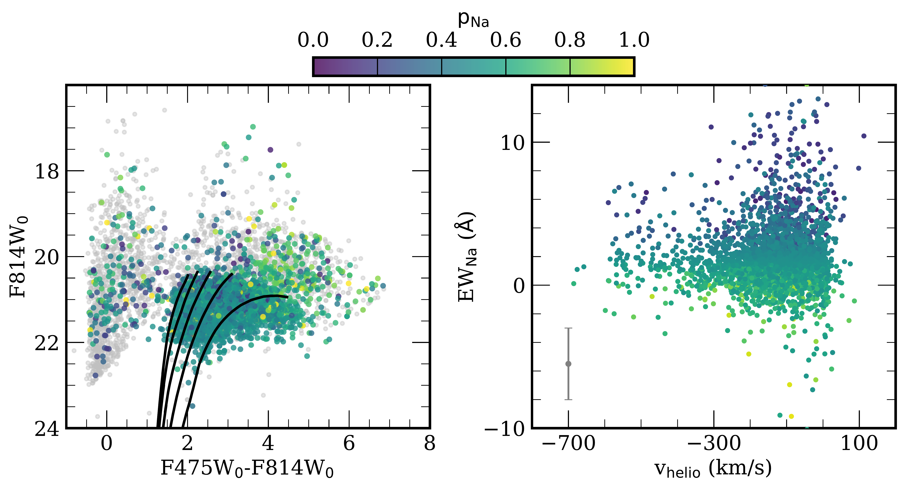
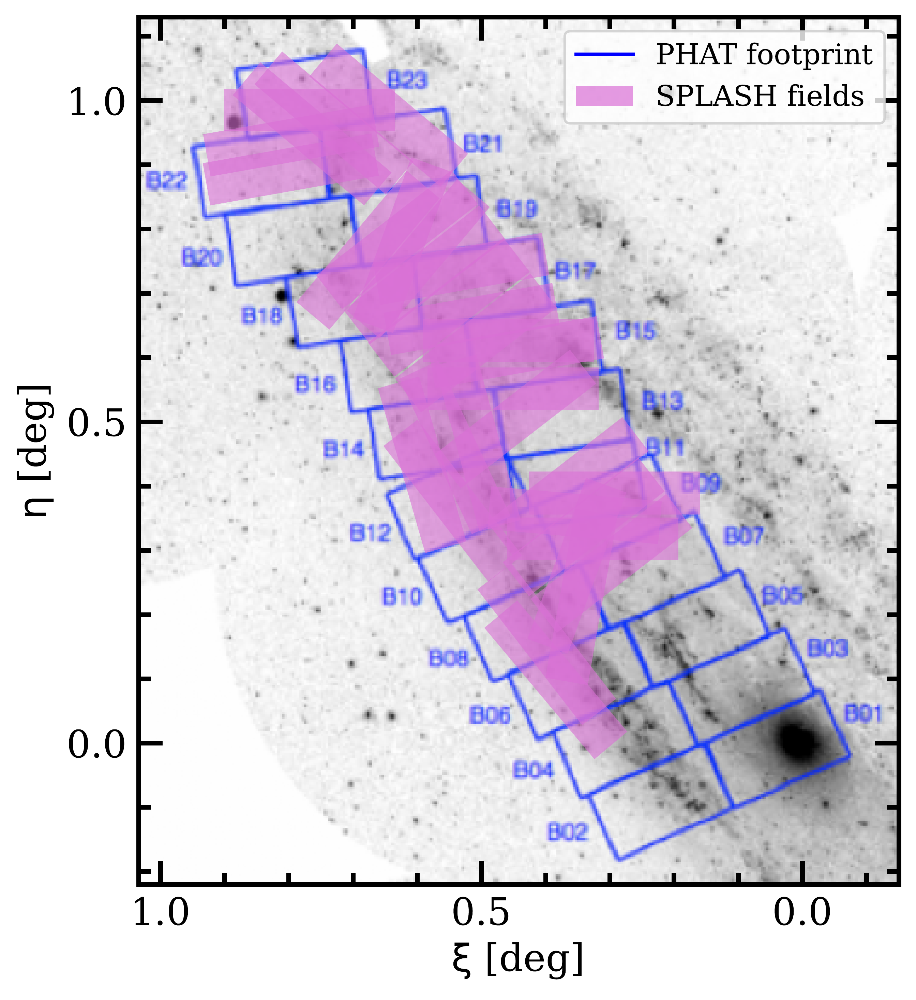
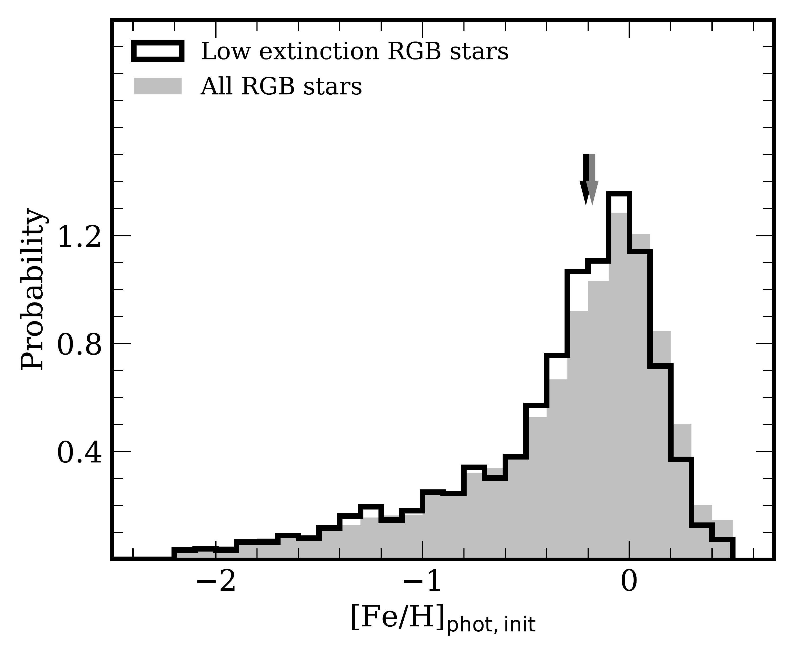

$\newcommand{\ensuremath}{}$
$\newcommand{\xspace}{}$
$\newcommand{\object}[1]{\texttt{#1}}$
$\newcommand{\farcs}{{.}''}$
$\newcommand{\farcm}{{.}'}$
$\newcommand{\arcsec}{''}$
$\newcommand{\arcmin}{'}$
$\newcommand{\ion}[2]{#1#2}$
$\newcommand{\textsc}[1]{\textrm{#1}}$
$\newcommand{\hl}[1]{\textrm{#1}}$
$\newcommand{\footnote}[1]{}$
$\newcommand{\nsplash}{6405}$
$\newcommand{\fkickedupdiskdorman}{5.2\% \pm 1.2\%}$
$\newcommand{\fmrtot}{4.6\%}$
$\newcommand{\fkickedupdiskexcess}{5.7\% \pm 0.2\%}$
$\newcommand{\fdisktotstat}{74.9\% \pm 4.5\%}$
$\newcommand{\fehphotshiftfourtotwelve}{-0.26}$
$\newcommand{\medfehphotneshelf}{-0.16}$
$\newcommand{\medfehphotminhalo}{-0.15}$
$\newcommand{\fehphotshiftnoinnerfield}{-0.29}$
$\newcommand{\frachostnbody}{98.9\%}$
$\newcommand{\ndiskrgb}{2500}$
$\newcommand{\nhalorgb}{554}$
$\newcommand{\nmixedrgb}{458}$
$\newcommand{\fehphotdiskrgbmr}{-0.10}$
$\newcommand{\fehphotdiskrgbmp}{-0.90}$
$\newcommand{\fehphotdiskrgbmrsig}{0.23}$
$\newcommand{\fehphotdiskrgbmpsig}{0.54}$
$\newcommand{\fehphotdiskrgbmrfrac}{71\%}$
$\newcommand{\fehphotdiskrgbmpfrac}{29\%}$
$\newcommand{\fehphothalorgbmr}{-0.18}$
$\newcommand{\fehphothalorgbmp}{-0.89}$
$\newcommand{\fehphothalorgbmrsig}{0.22}$
$\newcommand{\fehphothalorgbmpsig}{0.44}$
$\newcommand{\fehphothalorgbmrfrac}{48\%}$
$\newcommand{\fehphothalorgbmpfrac}{52\%}$
$\newcommand{\fcontamhalo}{7.4\%}$
$\newcommand{\fcontamdisk}{7.8\%}$
$\newcommand{\fehphotmedhalorgbcontamcorr}{-0.50^{+0.003}_{-0.002}}$
$\newcommand{\fehphotmeddiskrgbcontamcorr}{-0.17^{+0.001}_{-0.003}}$
$\newcommand{\fehphotavghalorgbcontamcorr}{-0.58 \pm 0.002}$
$\newcommand{\fehphotavgdiskrgbcontamcorr}{-0.31 \pm 0.002}$
$\newcommand{\gradientdisk}{-0.0176}$
$\newcommand{\gradientdiskerr}{0.0002}$
$\newcommand{\gradienthalo}{-0.0029}$
$\newcommand{\gradienthaloerr}{0.0004}$
$\newcommand{\interceptdisk}{+0.037}$
$\newcommand{\interceptdiskerr}{0.004}$
$\newcommand{\intercepthalo}{-0.335}$
$\newcommand{\intercepthaloerr}{0.005}$
$\newcommand{\gradientdisklowext}{-0.0200}$
$\newcommand{\gradientdisklowexterr}{0.0003}$
$\newcommand{\gradienthalolowext}{-0.0031}$
$\newcommand{\gradienthalolowexterr}{0.0005}$
$\newcommand{\interceptdisklowext}{+0.092}$
$\newcommand{\interceptdisklowexterr}{0.005}$
$\newcommand{\intercepthalolowext}{-0.318}$
$\newcommand{\intercepthalolowexterr}{0.007}$
$\newcommand{\gradientdiskdust}{-0.0200}$
$\newcommand{\gradientdiskdusterr}{0.0002}$
$\newcommand{\gradienthalodust}{-0.0055}$
$\newcommand{\gradienthalodusterr}{0.0004}$
$\newcommand{\interceptdiskdust}{+0.092}$
$\newcommand{\interceptdiskdusterr}{0.004}$
$\newcommand{\intercepthalodust}{-0.269}$
$\newcommand{\intercepthalodusterr}{0.005}$
$\newcommand{\gradientdiskfid}{-0.018^{+0.003}_{-0.001}}$
$\newcommand{\gradienthalofid}{-0.003^{+0.003}_{-0.001}}$
$\newcommand{\fracmrhalofid}{52.9\%}$
$\newcommand{\fracmrhalocontamcorr}{49.3\%}$
$\newcommand{\fracmrhalocontambydisk}{3.6\%}$
$\newcommand{\fracpkickfid}{28.9\%}$
$\newcommand{\fracpkickcontamcorr}{26.7\%}$
$\newcommand{\fracpkickcontam}{2.2\%}$
$\newcommand{\muvhalomr}{-280.9}$
$\newcommand{\muverrhalomr}{6.1}$
$\newcommand{\muxhalomr}{-0.15}$
$\newcommand{\muxerrhalomr}{0.03}$
$\newcommand{\sigvhalomr}{42.9}$
$\newcommand{\sigverrhalomr}{4.9}$
$\newcommand{\sigxhalomr}{0.20}$
$\newcommand{\sigxerrhalomr}{0.02}$
$\newcommand{\rhalomr}{0.25}$
$\newcommand{\rerrhalomr}{0.12}$
$\newcommand{\fmrhalo}{0.26}$
$\newcommand{\fmrerrhalo}{0.03}$
$\newcommand{\muvhalomp}{-347.1}$
$\newcommand{\muverrhalomp}{7.4}$
$\newcommand{\sigvhalomp}{141.0}$
$\newcommand{\sigverrhalomp}{4.9}$
$\newcommand{\muxhalomp}{-0.69}$
$\newcommand{\muxerrhalomp}{0.03}$
$\newcommand{\sigxhalomp}{0.50}$
$\newcommand{\sigxerrhalomp}{0.02}$
$\newcommand{\rhalomp}{0.04}$
$\newcommand{\rerrhalomp}{0.05}$
$\newcommand{\admeddiskall}{61.0^{+0.9}_{-0.8}}$
$\newcommand{\admedmixedall}{57.6^{+3.5}_{-2.6}}$
$\newcommand{\admedhaloall}{66.4^{+1.5}_{-2.2}}$
$\newcommand{\admedhalomrall}{63.8^{+2.9}_{-1.2}}$
$\newcommand{\admedhalompall}{67.9^{+1.0}_{-2.0}}$
$\newcommand{\percentmrhalo}{71.8\%}$
$\newcommand{\percentmrdisk}{79.5\%}$
$\newcommand{\percentmrmixed}{84.7\%}$
$\newcommand{\admeddisk}{68.7^{+0.9}_{-0.8}}$
$\newcommand{\admedmixed}{75.1^{+3.2}_{-1.4}}$
$\newcommand{\admedhalo}{74.6^{+1.4}_{-1.1}}$
$\newcommand{\admedhalomr}{77.4^{+0.9}_{-3.6}}$
$\newcommand{\admedhalomp}{73.4^{+1.6}_{-4.6}}$
$\newcommand{\addiskhalodiffsig}{2.9}$
$\newcommand{\addiskmixeddiffsig}{2.7}$
$\newcommand{\adhalomrdiffsigdiskall}{1.3}$
$\newcommand{\adhalomrdiffsigdiskonaxis}{1.9}$
$\newcommand{\adhalomrdiffsigrest}{1}$
$\newcommand{\addiskhalodiffsigall}{1.8}$
$\newcommand{\fehphotmeddiskrgb}{-0.19}$
$\newcommand{\fehphotmedmixedrgb}{-0.16}$
$\newcommand{\fehphotmedhalorgb}{-0.46}$
$\newcommand{\verrmed}{7.1}$
$\newcommand{\meddeltaewna}{2.5}$
$\newcommand{\nmembersplash}{4844}$
$\newcommand{\meanewand}{0.54}$
$\newcommand{\stdewand}{1.00}$
$\newcommand{\meanewmw}{2.27}$
$\newcommand{\stdewmw}{1.96}$
$\newcommand{\percentnonasplash}{51.6\%}$
$\newcommand{\nremovecmd}{1443}$
$\newcommand{\nremovena}{118}$
$\newcommand{\fracgiantnoew}{43.6\%}$
$\newcommand{\fracrgbnowew}{34.9\%}$
$\newcommand{\fmwcontam}{0.2\%}$
$\newcommand{\muhaloone}{-258.2}$
$\newcommand{\muhalotwo}{-268.7}$
$\newcommand{\muhalothree}{-238.8}$
$\newcommand{\sighaloone}{134.4}$
$\newcommand{\sighalotwo}{135.3}$
$\newcommand{\sighalothree}{117.5}$
$\newcommand{\percentdisksplash}{72.6}$
$\newcommand{\percenthalosplash}{14.4}$
$\newcommand{\percentmixedsplash}{13.0}$
$\newcommand{\medradneone}{6.3}$
$\newcommand{\medradnetwo}{10.3}$
$\newcommand{\medradnethree}{14.4}$
$\newcommand{\fehphotmedallrgb}{-0.18}$
$\newcommand{\fehphotmedlowextrgb}{-0.21}$
$\newcommand{\fehphotdiffrgbcorr}{-0.04}$
$\newcommand{\sigmaavmed}{0.30}$
$\newcommand{\diskscaleheight}{0.77}$
$\newcommand{\nrgblowext}{2054}$
$\newcommand{\nrgbdustcorr}{3512}$
$\newcommand{\fehphoterrmed}{0.03}$
$\newcommand{\medrederr}{0.004}$
$\newcommand{\medblueerr}{0.015}$
$\newcommand{\difffehphotrgb}{-0.22}$
$\newcommand{\nrgbsplashmwcorr}{3874}$
$\newcommand{\ewna}{EW_{\rm Na}}$
$\newcommand{\fehphot}{[Fe/H]_{\rm phot}}$
$\newcommand{\loggphot}{\log g_{\rm phot}}$
$\newcommand{\teffphot}{T_{\rm eff,phot}}$
$\newcommand{\logg}{\log g}$
$\newcommand{\teff}{T_{\rm eff}}$
$\newcommand{\feh}{[Fe/H]}$
$\newcommand{\alphafe}{[\alpha/Fe]}$
$\newcommand{\vhelio}{v_{\rm helio}}$
$\newcommand{\rproj}{R_{\rm proj}}$
$\newcommand{\fehphotinit}{[Fe/H]_{\rm phot, init}}$
$\newcommand{\fehphoterr}{\delta[Fe/H]_{\rm phot}}$
$\newcommand{\ewsum}{\Sigma{\rm Ca}}$
$\newcommand{\fehcat}{[Fe/H]_{\rm spec}}$
$\newcommand{\avdal}{A_{V, {\rm Dal}}}$
$\newcommand{\sigav}{\sigma_V}$
$\newcommand{\fred}{f_{\rm red}}$
$\newcommand{\pdisk}{p_{\rm disk}}$
$\newcommand{\Msun}{M_{\odot}}$
$\newcommand{\kms}{km s^{-1}}$

$\newcommand{\ensuremath}{}$
$\newcommand{\xspace}{}$
$\newcommand{\object}[1]{\texttt{#1}}$
$\newcommand{\farcs}{{.}''}$
$\newcommand{\farcm}{{.}'}$
$\newcommand{\arcsec}{''}$
$\newcommand{\arcmin}{'}$
$\newcommand{\ion}[2]{#1#2}$
$\newcommand{\textsc}[1]{\textrm{#1}}$
$\newcommand{\hl}[1]{\textrm{#1}}$
$\newcommand{\footnote}[1]{}$
$\newcommand{\nsplash}{6405}$
$\newcommand{\fkickedupdiskdorman}{5.2\% \pm 1.2\%}$
$\newcommand{\fmrtot}{4.6\%}$
$\newcommand{\fkickedupdiskexcess}{5.7\% \pm 0.2\%}$
$\newcommand{\fdisktotstat}{74.9\% \pm 4.5\%}$
$\newcommand{\fehphotshiftfourtotwelve}{-0.26}$
$\newcommand{\medfehphotneshelf}{-0.16}$
$\newcommand{\medfehphotminhalo}{-0.15}$
$\newcommand{\fehphotshiftnoinnerfield}{-0.29}$
$\newcommand{\frachostnbody}{98.9\%}$
$\newcommand{\ndiskrgb}{2500}$
$\newcommand{\nhalorgb}{554}$
$\newcommand{\nmixedrgb}{458}$
$\newcommand{\fehphotdiskrgbmr}{-0.10}$
$\newcommand{\fehphotdiskrgbmp}{-0.90}$
$\newcommand{\fehphotdiskrgbmrsig}{0.23}$
$\newcommand{\fehphotdiskrgbmpsig}{0.54}$
$\newcommand{\fehphotdiskrgbmrfrac}{71\%}$
$\newcommand{\fehphotdiskrgbmpfrac}{29\%}$
$\newcommand{\fehphothalorgbmr}{-0.18}$
$\newcommand{\fehphothalorgbmp}{-0.89}$
$\newcommand{\fehphothalorgbmrsig}{0.22}$
$\newcommand{\fehphothalorgbmpsig}{0.44}$
$\newcommand{\fehphothalorgbmrfrac}{48\%}$
$\newcommand{\fehphothalorgbmpfrac}{52\%}$
$\newcommand{\fcontamhalo}{7.4\%}$
$\newcommand{\fcontamdisk}{7.8\%}$
$\newcommand{\fehphotmedhalorgbcontamcorr}{-0.50^{+0.003}_{-0.002}}$
$\newcommand{\fehphotmeddiskrgbcontamcorr}{-0.17^{+0.001}_{-0.003}}$
$\newcommand{\fehphotavghalorgbcontamcorr}{-0.58 \pm 0.002}$
$\newcommand{\fehphotavgdiskrgbcontamcorr}{-0.31 \pm 0.002}$
$\newcommand{\gradientdisk}{-0.0176}$
$\newcommand{\gradientdiskerr}{0.0002}$
$\newcommand{\gradienthalo}{-0.0029}$
$\newcommand{\gradienthaloerr}{0.0004}$
$\newcommand{\interceptdisk}{+0.037}$
$\newcommand{\interceptdiskerr}{0.004}$
$\newcommand{\intercepthalo}{-0.335}$
$\newcommand{\intercepthaloerr}{0.005}$
$\newcommand{\gradientdisklowext}{-0.0200}$
$\newcommand{\gradientdisklowexterr}{0.0003}$
$\newcommand{\gradienthalolowext}{-0.0031}$
$\newcommand{\gradienthalolowexterr}{0.0005}$
$\newcommand{\interceptdisklowext}{+0.092}$
$\newcommand{\interceptdisklowexterr}{0.005}$
$\newcommand{\intercepthalolowext}{-0.318}$
$\newcommand{\intercepthalolowexterr}{0.007}$
$\newcommand{\gradientdiskdust}{-0.0200}$
$\newcommand{\gradientdiskdusterr}{0.0002}$
$\newcommand{\gradienthalodust}{-0.0055}$
$\newcommand{\gradienthalodusterr}{0.0004}$
$\newcommand{\interceptdiskdust}{+0.092}$
$\newcommand{\interceptdiskdusterr}{0.004}$
$\newcommand{\intercepthalodust}{-0.269}$
$\newcommand{\intercepthalodusterr}{0.005}$
$\newcommand{\gradientdiskfid}{-0.018^{+0.003}_{-0.001}}$
$\newcommand{\gradienthalofid}{-0.003^{+0.003}_{-0.001}}$
$\newcommand{\fracmrhalofid}{52.9\%}$
$\newcommand{\fracmrhalocontamcorr}{49.3\%}$
$\newcommand{\fracmrhalocontambydisk}{3.6\%}$
$\newcommand{\fracpkickfid}{28.9\%}$
$\newcommand{\fracpkickcontamcorr}{26.7\%}$
$\newcommand{\fracpkickcontam}{2.2\%}$
$\newcommand{\muvhalomr}{-280.9}$
$\newcommand{\muverrhalomr}{6.1}$
$\newcommand{\muxhalomr}{-0.15}$
$\newcommand{\muxerrhalomr}{0.03}$
$\newcommand{\sigvhalomr}{42.9}$
$\newcommand{\sigverrhalomr}{4.9}$
$\newcommand{\sigxhalomr}{0.20}$
$\newcommand{\sigxerrhalomr}{0.02}$
$\newcommand{\rhalomr}{0.25}$
$\newcommand{\rerrhalomr}{0.12}$
$\newcommand{\fmrhalo}{0.26}$
$\newcommand{\fmrerrhalo}{0.03}$
$\newcommand{\muvhalomp}{-347.1}$
$\newcommand{\muverrhalomp}{7.4}$
$\newcommand{\sigvhalomp}{141.0}$
$\newcommand{\sigverrhalomp}{4.9}$
$\newcommand{\muxhalomp}{-0.69}$
$\newcommand{\muxerrhalomp}{0.03}$
$\newcommand{\sigxhalomp}{0.50}$
$\newcommand{\sigxerrhalomp}{0.02}$
$\newcommand{\rhalomp}{0.04}$
$\newcommand{\rerrhalomp}{0.05}$
$\newcommand{\admeddiskall}{61.0^{+0.9}_{-0.8}}$
$\newcommand{\admedmixedall}{57.6^{+3.5}_{-2.6}}$
$\newcommand{\admedhaloall}{66.4^{+1.5}_{-2.2}}$
$\newcommand{\admedhalomrall}{63.8^{+2.9}_{-1.2}}$
$\newcommand{\admedhalompall}{67.9^{+1.0}_{-2.0}}$
$\newcommand{\percentmrhalo}{71.8\%}$
$\newcommand{\percentmrdisk}{79.5\%}$
$\newcommand{\percentmrmixed}{84.7\%}$
$\newcommand{\admeddisk}{68.7^{+0.9}_{-0.8}}$
$\newcommand{\admedmixed}{75.1^{+3.2}_{-1.4}}$
$\newcommand{\admedhalo}{74.6^{+1.4}_{-1.1}}$
$\newcommand{\admedhalomr}{77.4^{+0.9}_{-3.6}}$
$\newcommand{\admedhalomp}{73.4^{+1.6}_{-4.6}}$
$\newcommand{\addiskhalodiffsig}{2.9}$
$\newcommand{\addiskmixeddiffsig}{2.7}$
$\newcommand{\adhalomrdiffsigdiskall}{1.3}$
$\newcommand{\adhalomrdiffsigdiskonaxis}{1.9}$
$\newcommand{\adhalomrdiffsigrest}{1}$
$\newcommand{\addiskhalodiffsigall}{1.8}$
$\newcommand{\fehphotmeddiskrgb}{-0.19}$
$\newcommand{\fehphotmedmixedrgb}{-0.16}$
$\newcommand{\fehphotmedhalorgb}{-0.46}$
$\newcommand{\verrmed}{7.1}$
$\newcommand{\meddeltaewna}{2.5}$
$\newcommand{\nmembersplash}{4844}$
$\newcommand{\meanewand}{0.54}$
$\newcommand{\stdewand}{1.00}$
$\newcommand{\meanewmw}{2.27}$
$\newcommand{\stdewmw}{1.96}$
$\newcommand{\percentnonasplash}{51.6\%}$
$\newcommand{\nremovecmd}{1443}$
$\newcommand{\nremovena}{118}$
$\newcommand{\fracgiantnoew}{43.6\%}$
$\newcommand{\fracrgbnowew}{34.9\%}$
$\newcommand{\fmwcontam}{0.2\%}$
$\newcommand{\muhaloone}{-258.2}$
$\newcommand{\muhalotwo}{-268.7}$
$\newcommand{\muhalothree}{-238.8}$
$\newcommand{\sighaloone}{134.4}$
$\newcommand{\sighalotwo}{135.3}$
$\newcommand{\sighalothree}{117.5}$
$\newcommand{\percentdisksplash}{72.6}$
$\newcommand{\percenthalosplash}{14.4}$
$\newcommand{\percentmixedsplash}{13.0}$
$\newcommand{\medradneone}{6.3}$
$\newcommand{\medradnetwo}{10.3}$
$\newcommand{\medradnethree}{14.4}$
$\newcommand{\fehphotmedallrgb}{-0.18}$
$\newcommand{\fehphotmedlowextrgb}{-0.21}$
$\newcommand{\fehphotdiffrgbcorr}{-0.04}$
$\newcommand{\sigmaavmed}{0.30}$
$\newcommand{\diskscaleheight}{0.77}$
$\newcommand{\nrgblowext}{2054}$
$\newcommand{\nrgbdustcorr}{3512}$
$\newcommand{\fehphoterrmed}{0.03}$
$\newcommand{\medrederr}{0.004}$
$\newcommand{\medblueerr}{0.015}$
$\newcommand{\difffehphotrgb}{-0.22}$
$\newcommand{\nrgbsplashmwcorr}{3874}$
$\newcommand{\ewna}{EW_{\rm Na}}$
$\newcommand{\fehphot}{[Fe/H]_{\rm phot}}$
$\newcommand{\loggphot}{\log g_{\rm phot}}$
$\newcommand{\teffphot}{T_{\rm eff,phot}}$
$\newcommand{\logg}{\log g}$
$\newcommand{\teff}{T_{\rm eff}}$
$\newcommand{\feh}{[Fe/H]}$
$\newcommand{\alphafe}{[\alpha/Fe]}$
$\newcommand{\vhelio}{v_{\rm helio}}$
$\newcommand{\rproj}{R_{\rm proj}}$
$\newcommand{\fehphotinit}{[Fe/H]_{\rm phot, init}}$
$\newcommand{\fehphoterr}{\delta[Fe/H]_{\rm phot}}$
$\newcommand{\ewsum}{\Sigma{\rm Ca}}$
$\newcommand{\fehcat}{[Fe/H]_{\rm spec}}$
$\newcommand{\avdal}{A_{V, {\rm Dal}}}$
$\newcommand{\sigav}{\sigma_V}$
$\newcommand{\fred}{f_{\rm red}}$
$\newcommand{\pdisk}{p_{\rm disk}}$
$\newcommand{\Msun}{M_{\odot}}$
$\newcommand{\kms}{km s^{-1}}$

# Resolved SPLASH Chemodynamics in Andromeda's PHAT Stellar Halo and Disk: On the Nature of the Inner Halo Along the Major Axis

<mark>Appeared on: 2022-09-16</mark> - _Accepted by AJ. Conclusions on page 21. 19 figures, 2 tables, 5 appendices_

Ivanna Escala, et al. -- incl., <mark>J. Leigh Wojno</mark>

**Abstract:** Stellar kinematics and metallicity are key to exploring formation scenarios for galactic disks and halos. In this work, we characterized the relationship between kinematics and photometric metallicityalong the line-of-sight to M31's disk.We combined optical HST/ACS photometry from the Panchromatic Hubble Andromeda Treasury (PHAT) survey with Keck/DEIMOSspectrafrom the Spectroscopic and Photometric Landscape of Andromeda's Stellar Halo (SPLASH) survey. The resulting sample of $\nrgbdustcorr$ individual red giant branch stars spans 4--19 projected kpc, making it a useful probe of both the disk and inner halo.We separated these stars into disk and halo populations by modeling the line-of-sight velocity distributions as a function of position across the disk region, where $\sim$ 73 \% stars have a high likelihood of belonging to the disk and $\sim$ 14 \% to the halo. Although stellar halos are typically thought to be metal-poor, the kinematically identified halo contains a significant population of stars ( $\sim$ 29 \% )with disk-like metallicity ( $\fehphot$ $\sim$ $\fehphotdiskrgbmr$ ).This metal-rich halo population lags the gaseous disk to a similar extent as the rest of the halo, indicating that it does not correspond to a canonical thick disk. Itsproperties are inconsistent with those of tidal debris originating from the Giant Stellar Stream merger event.Moreover, the halo is chemically distinct from the phase-mixed component previously identified along the minor axis (i.e., away from the disk), implying contributions from different formation channels. These metal-rich halo stars provide direct chemodynamicalevidence in favor of the previously suggested "kicked-up" disk population in M31's inner stellar halo.

**Figure 9. -** 
    Membership determination for SPLASH targets with successful radial velocity measurements \citep{Dorman2012,Dorman2013,Dorman2015} along the line-of-sight to M31's disk (Section \ref{sec:members}). (Left) Foreground-extinction-corrected (F475W, F814W) PHAT v2 CMD (\citealt{Dalcanton2012,Williams2014}; Section \ref{sec:phot}, \ref{sec:zinit}) for stars with (colored points) and without (grey points) Na I $\lambda$8190 doublet equivalent width ($\ewna$) measurements. We show \edit1{4} Gyr PARSEC RGB isochrones \citep{Marigo2017} with $\fehphot$ = $-2.0, -1.5, -1.0, -0.5$, 0 for reference, assuming $m-M = 24.45 \pm 0.05$\citep{Dalcanton2012}.
    Stars with $p_{\rm Na} \leq 0.25$, which are $\geq$3 times more likely to belong to the MW foreground than M31, are classified as non-members. We also exclude stars with colors bluer than the most metal-poor RGB isochrone. (Right) $\ewna$ versus heliocentric velocity ($\vhelio$).
    We show the median uncertainty in $\ewna$($\delta$\ewna = $\meddeltaewna$ Å) as a gray errorbar.
    Stars with $p_{\rm Na} \leq 0.25$ preferentially have blue colors or lie above the TRGB and have more positive $\vhelio$, all of which are properties characteristic of MW foreground dwarfs.
     (*fig:members*)

**Figure 1. -** Location of DEIMOS fields from SPLASH (magenta patches; Section \ref{sec:splash}; \citealt{Dorman2012,Dorman2013,Dorman2015}) in M31-centric coordinates. The approximate size and orientation of each field is represented by a 16' $\times$ 4' rectangle. The outline of the PHAT footprint (Section \ref{sec:phot}; \citealt{Dalcanton2012}) is shown as blue lines.
    The NUV image of M31 is from the PHAT archive and was taken by GALEX. (*fig:fields*)

**Figure 4. -** $\fehphot$init distributions for all RGB stars (gray filled histogram) and RGB stars located in low extinction regions of the disk (black open histogram). We measured $\fehphot$init using 4 Gyr PARSEC RGB isochrones on the foreground-reddening corrected optical CMD (Section \ref{sec:phot_params}).
    We define low extinction regions using $f_{\rm red} \times A_{V, {\rm Dal}} < 0.25$(\citealt{Gregersen2015}). The median $\fehphot$init for all (low extinction) RGB stars is shown as a gray (black) arrow, where [Fe/H]$_{\rm phot, init, med}$ = $\fehphotmedallrgb$($\fehphotmedlowextrgb$). This implies that most RGB stars in SPLASH are located in front of the dust layer and not significantly reddened.
     (*fig:mdf_lowext*)

