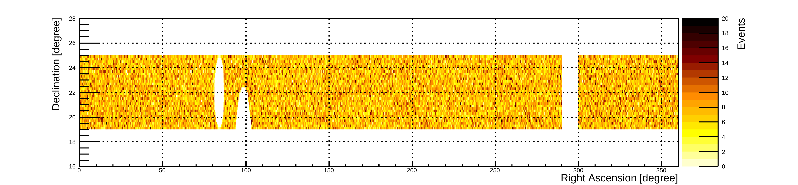

 is shown (see *Constraining Astrophysical Models - IceCube Neutrino Spectrum*) for both $p\gamma$ and $pp$ interactions. (*fig:ul_mc*)

**Figure 3. -** Map of the Diffuse Gamma-Ray Background strip, centered on the Crab Nebula's declination. The Crab Nebula, Geminga and the Galactic Plane have been removed, resulting in a 0.57 sr area. (*fig:DGRB_strip*)

