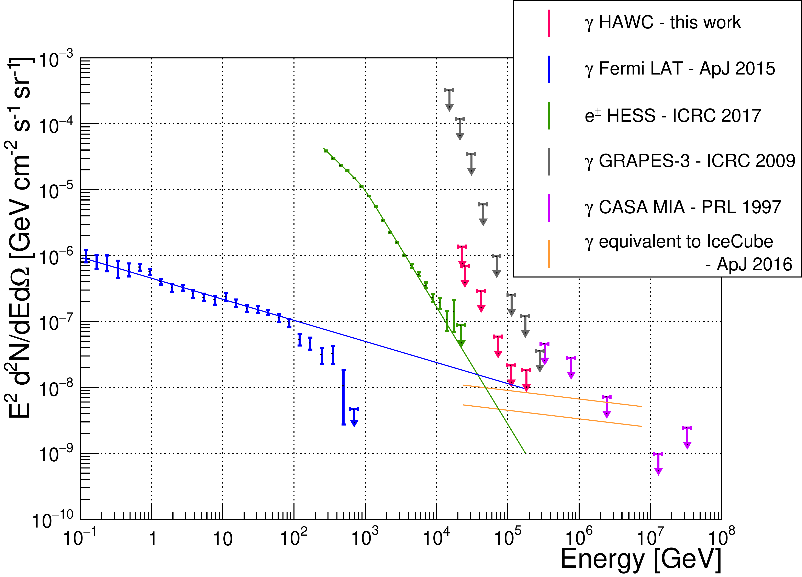

$\newcommand{\ensuremath}{}$
$\newcommand{\xspace}{}$
$\newcommand{\object}[1]{\texttt{#1}}$
$\newcommand{\farcs}{{.}''}$
$\newcommand{\farcm}{{.}'}$
$\newcommand{\arcsec}{''}$
$\newcommand{\arcmin}{'}$
$\newcommand{\ion}[2]{#1#2}$
$\newcommand{\textsc}[1]{\textrm{#1}}$
$\newcommand{\hl}[1]{\textrm{#1}}$

$\newcommand{$\ensuremath$}{}$
$\newcommand{$\xspace$}{}$
$\newcommand{$\object$}[1]{\texttt{#1}}$
$\newcommand{$\farcs$}{{.}''}$
$\newcommand{$\farcm$}{{.}'}$
$\newcommand{$\arcsec$}{''}$
$\newcommand{$\arcmin$}{'}$
$\newcommand{$\ion$}[2]{#1#2}$
$\newcommand{$\textsc$}[1]{\textrm{#1}}$
$\newcommand{$\hl$}[1]{\textrm{#1}}$

# Limits on the Diffuse Gamma-Ray Background above 10 TeV with HAWC

<mark>Appeared on: 2022-09-20</mark> - _8 pages, 3 figures_

HAWC Collaboration, et al. -- incl., <mark><mark>R. Alfaro</mark></mark>, <mark><mark>R. Diaz Hernandez</mark></mark>, <mark><mark>S. Hernandez</mark></mark>, <mark><mark>A. Lara</mark></mark>, <mark><mark>W.H. Lee</mark></mark>, <mark><mark>J.T. Linnemann</mark></mark>

**Abstract:** The high-energy Diffuse Gamma-Ray Background (DGRB) is expected to be produced by unresolved isotropically distributed astrophysical objects, potentially including dark matter annihilation or decay emissions in galactic or extragalactic structures. The DGRB has only been observed below 1 TeV; above this energy, upper limits have been reported. Observations or stringent limits on the DGRB above this energy could have significant multi-messenger implications, such as constraining the origin of TeV-PeV astrophysical neutrinos detected by IceCube. The High Altitude Water Cherenkov (HAWC) Observatory, located in central Mexico at 4100 m above sea level, is sensitive to gamma rays from a few hundred GeV to several hundred TeV and continuously observes a wide field-of-view (2 sr). With its high-energy reach and large area coverage, HAWC is well-suited to notably improve searches for the DGRB at TeV energies. In this work, strict cuts have been applied to the HAWC dataset to better isolate gamma-ray air showers from background hadronic showers. The sensitivity to the DGRB was then verified using 535 days of Crab data and Monte Carlo simulations, leading to new limits above 10 TeV on the DGRB as well as prospective implications for multi-messenger studies.

**Figure 1. -** Number of observed and expected events in the Crab RoI with respect to PINCness for the $\hat{E}/\mathcal{B}$ bin $g$/7. The expected number of events is the sum of the simulated gamma events from the Crab plus the $\text{DGRB}_\text{scaled}$, which is the average number of events from the DGRB strip found in  $2.22\times10^{-4}$ sr (the size of the Crab RoI). (*fig:pinc_diff*)

**Figure 2. -** Limits on the DGRB using 535 days of HAWC data compared to the diffuse electron/positron flux observed by HESS \citep{hess1_graph,hess2_graph}. Also shown is the observed DGRB by the Fermi-LAT \citep{fermi_graph}, as well as previous high-energy limits by GRAPES \citep{grapes_graph} and CASA-MIA \citep{casa-mia_graph}. The lines represent several astrophysical models which will be discussed in \emph{Constraining Astrophysical Models}. The gamma-ray flux corresponding to the IceCube $\nu_\mu+\overline{\nu}_\mu$ astrophysical flux \citep{icecube} is shown (see \emph{Constraining Astrophysical Models - IceCube Neutrino Spectrum}) for both $p\gamma$ and $pp$ interactions. (*fig:ul_mc*)

**Figure 3. -** Map of the Diffuse Gamma-Ray Background strip, centered on the Crab Nebula's declination. The Crab Nebula, Geminga and the Galactic Plane have been removed, resulting in a 0.57 sr area. (*fig:DGRB_strip*)

