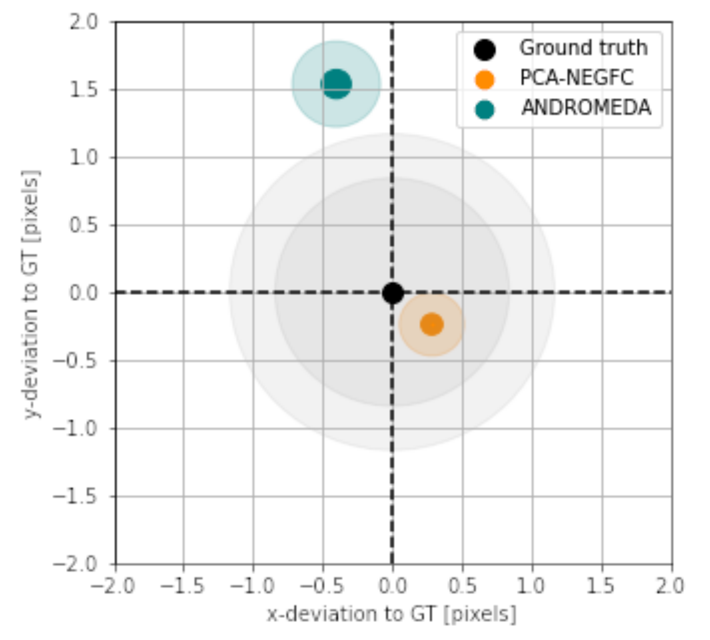
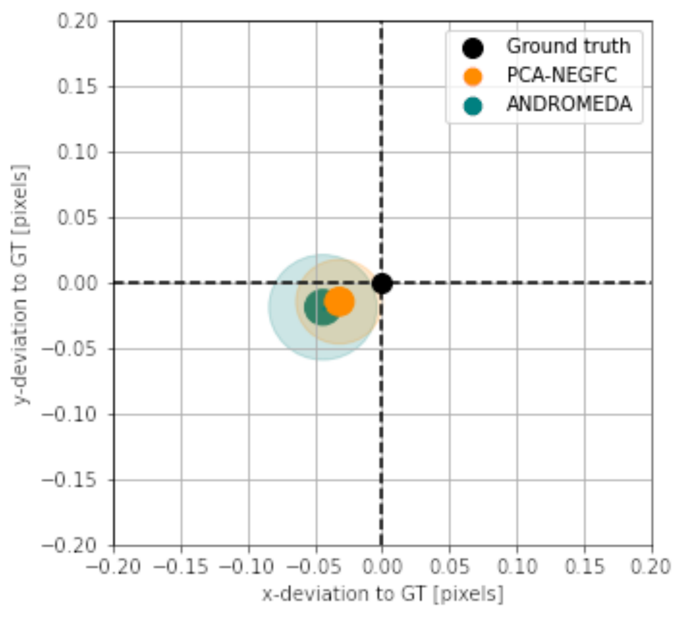
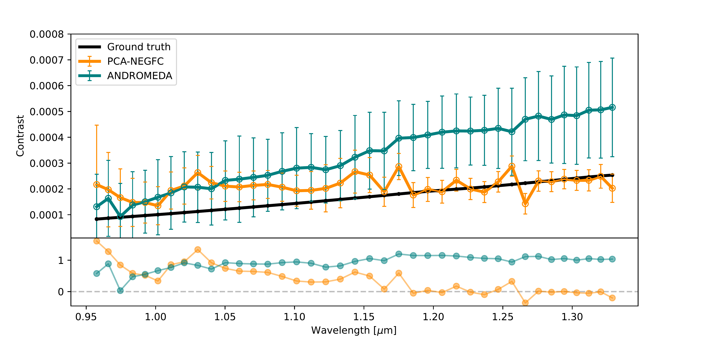
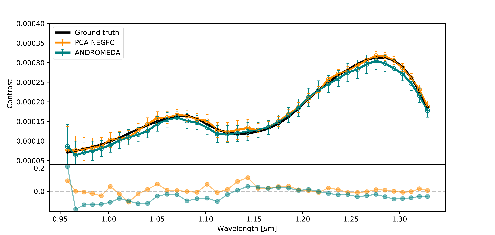

$\newcommand{\ensuremath}{}$
$\newcommand{\xspace}{}$
$\newcommand{\object}[1]{\texttt{#1}}$
$\newcommand{\farcs}{{.}''}$
$\newcommand{\farcm}{{.}'}$
$\newcommand{\arcsec}{''}$
$\newcommand{\arcmin}{'}$
$\newcommand{\ion}[2]{#1#2}$
$\newcommand{\textsc}[1]{\textrm{#1}}$
$\newcommand{\hl}[1]{\textrm{#1}}$
$\newcommand{\tbd}[1]{\textcolor{red}{#1}}$
$\newcommand{\baselinestretch}{1.0}$

$\newcommand{$\ensuremath$}{}$
$\newcommand{$\xspace$}{}$
$\newcommand{$\object$}[1]{\texttt{#1}}$
$\newcommand{$\farcs$}{{.}''}$
$\newcommand{$\farcm$}{{.}'}$
$\newcommand{$\arcsec$}{''}$
$\newcommand{$\arcmin$}{'}$
$\newcommand{$\ion$}[2]{#1#2}$
$\newcommand{$\textsc$}[1]{\textrm{#1}}$
$\newcommand{$\hl$}[1]{\textrm{#1}}$
$\newcommand{$\tbd$}[1]{\textcolor{red}{#1}}$
$\newcommand{$\baselinestretch$}{1.0}$

# Exoplanet Imaging Data Challenge, phase II: Characterization of exoplanet signals in high-contrast images

<mark>Appeared on: 2022-09-20</mark> - _Submitted to SPIE Astronomical Telescopes + Instrumentation 2022, Adaptive Optics Systems VIII, Paper 12185-4_

F. Cantalloube, et al. -- incl., <mark><mark>E. Nasedkin</mark></mark>, <mark><mark>M. Samland Ruffio J.-B.i</mark></mark>

**Abstract:** Today, there exists a wide variety of algorithms dedicated to high-contrast imaging, especially for the detection and characterisation of exoplanet signals. These algorithms are tailored to address the very high contrast between the exoplanet signal(s), which can be more than two orders of magnitude fainter than the bright starlight residuals in coronagraphic images. The starlight residuals are inhomogeneously distributed and follow various timescales that depend on the observing conditions and on the target star brightness. Disentangling the exoplanet signals within the starlight residuals is therefore challenging, and new post-processing algorithms are striving to achieve more accurate astrophysical results.The Exoplanet Imaging Data Challenge is a community-wide effort to develop, compare and evaluate algorithms using a set of benchmark high-contrast imaging datasets. After a first phase ran in 2020 and focused on the detection capabilities of existing algorithms, the focus of this ongoing second phase is to compare the characterisation capabilities of state-of-the-art techniques. The characterisation of planetary companions is two-fold: the astrometry (estimated position with respect to the host star) and spectrophotometry (estimated contrast with respect to the host star, as a function of wavelength).The goal of this second phase is to offer a platform for the community to benchmark techniques in a fair, homogeneous and robust way, and to foster collaborations.

**Figure 2. -** Example injection procedure for the training data set `sphere0'. Top panel: Median of the image cube at the shortest wavelength with the position of the two injections `b' and `c' indicated by colored circles (left) and their injected spectra of the two planetary signals (middle), sampled at the SPHERE-IFS spectral resolving power (right).
    Bottom panel: Airmass factor used for the whole observing sequence (left); extracted spectrum of the non-coronagraphic PSF (middle); stellar SED model used for the target star (right), sampled at the SPHERE-IFS spectral resolving power. (*fig:sph0*)

**Figure 5. -** Astrometry estimations of the injected planets using PCA-NEGFC (orange) and ANDROMEDA (blue), relative to the ground truth (black) in Cartesian coordinates. The size of the symbols corresponds to the 1-sigma uncertainty (averaged in x- and y- direction) and the shaded area to the 3-sigma uncertainty. The two centered grey shaded areas represent the size of a half resolution element ($0.5\lambda/D$) for the shortest and largest wavelengths of the spectro-imager.
    Left: Planet 'b' ($155 \mathrm{mas}$). Right: Planet 'c' ($616 \mathrm{mas}$). (*fig:astro*)

**Figure 6. -** Spectro-photometry estimations of the injected planets using PCA-NEGFC (orange line) and ANDROMEDA (blue line), compared to the ground truth (black line), as well as the residuals normalized by the ground truth (bottom panel). The error bars displayed correspond to the 3-sigma uncertainties on the photometry estimation.
    Top: Planet 'b' (Blackbody spectrum).
    Bottom: Planet 'c' (HR8799e-like spectrum). (*fig:phot*)

