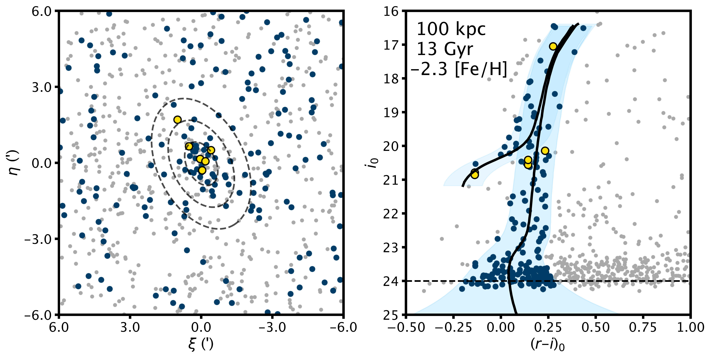
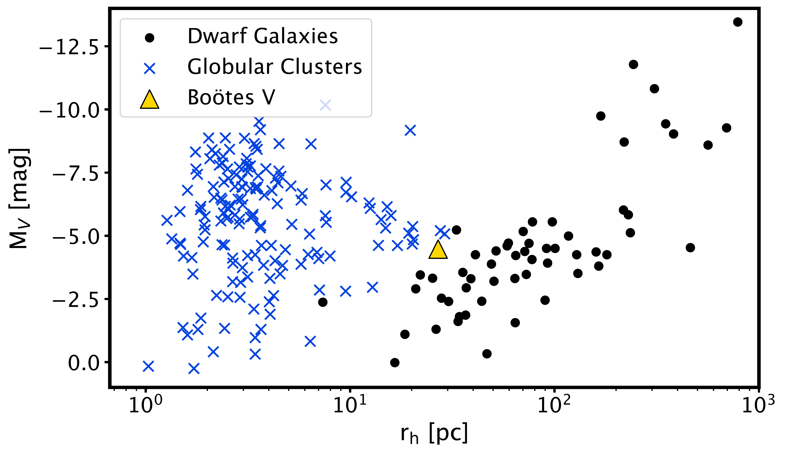

$\newcommand{\ensuremath}{}$
$\newcommand{\xspace}{}$
$\newcommand{\object}[1]{\texttt{#1}}$
$\newcommand{\farcs}{{.}''}$
$\newcommand{\farcm}{{.}'}$
$\newcommand{\arcsec}{''}$
$\newcommand{\arcmin}{'}$
$\newcommand{\ion}[2]{#1#2}$
$\newcommand{\textsc}[1]{\textrm{#1}}$
$\newcommand{\hl}[1]{\textrm{#1}}$
$\newcommand{\vdag}{(v)^\dagger}$
$\newcommand$
$\newcommand$
$\newcommand{\chg}[1]{\textbf{#1}}$
$\newcommand{\warn}[1]{\textcolor{red}{\textbf{#1}}}$
$\newcommand{\plot}[1]{\textit{#1}:}$
$\newcommand{\code}[1]{\texttt{#1}}$
$\newcommand{\rh}{r_{\text{h}}}$
$\newcommand{\ebv}{E(B-V)}$
$\newcommand{\Rv}{R_{V}}$
$\newcommand{\Msun}{\textup{M}_\odot}$
$\newcommand{\Lsun}{\textup{L}_\odot}$
$\newcommand{\sqdeg}{deg^2}$
$\newcommand{\kms}{km s^{-1}}$
$\newcommand{\boov}{Boötes V}$
$\newcommand{\tabspace}{\vspace{2pt}}$
$\newcommand{\ubar}[1]{\underaccent{\bar}{#1}}$
$\newcommand{\ii}{{~\sc ii}}$
$\newcommand{\ie}{{i.e., }}$
$\newcommand{\eg}{{e.g., }}$

$\newcommand{\ensuremath}{}$
$\newcommand{\xspace}{}$
$\newcommand{\object}[1]{\texttt{#1}}$
$\newcommand{\farcs}{{.}''}$
$\newcommand{\farcm}{{.}'}$
$\newcommand{\arcsec}{''}$
$\newcommand{\arcmin}{'}$
$\newcommand{\ion}[2]{#1#2}$
$\newcommand{\textsc}[1]{\textrm{#1}}$
$\newcommand{\hl}[1]{\textrm{#1}}$
$\newcommand{\vdag}{(v)^\dagger}$
$\newcommand$
$\newcommand$
$\newcommand{\chg}[1]{\textbf{#1}}$
$\newcommand{\warn}[1]{\textcolor{red}{\textbf{#1}}}$
$\newcommand{\plot}[1]{\textit{#1}:}$
$\newcommand{\code}[1]{\texttt{#1}}$
$\newcommand{\rh}{r_{\text{h}}}$
$\newcommand{\ebv}{E(B-V)}$
$\newcommand{\Rv}{R_{V}}$
$\newcommand{\Msun}{\textup{M}_\odot}$
$\newcommand{\Lsun}{\textup{L}_\odot}$
$\newcommand{\sqdeg}{deg^2}$
$\newcommand{\kms}{km s^{-1}}$
$\newcommand{\boov}{Boötes V}$
$\newcommand{\tabspace}{\vspace{2pt}}$
$\newcommand{\ubar}[1]{\underaccent{\bar}{#1}}$
$\newcommand{\ii}{{~\sc ii}}$
$\newcommand{\ie}{{i.e., }}$
$\newcommand{\eg}{{e.g., }}$

# Discovery of a new Local Group Dwarf Galaxy Candidate in UNIONS: Boötes V

<mark>Appeared on: 2022-09-17</mark> - _13 pages, 7 figures, 3 tables. Accepted for publication in the AAS Journals. Please note that this paper was submitted in coordination with the work of William Cerny et al. 2022. These authors independently discovered this same satellite so our two research groups have coordinated the submission of these discovery papers_

<mark>Simon E.T. Smith</mark>, et al.

**Abstract:** We present the discovery of \boov , a new ultra-faint dwarf galaxy candidate. This satellite is detected as a resolved overdensity of stars during an ongoing search for new Local Group dwarf galaxy candidates in the UNIONS photometric dataset.    It has a physical half-light radius of 26.9 $^{+7.5}_{-5.4}$ pc, a $V$ -band magnitude of $-$ 4.5 $\pm$ 0.4 mag, and resides at a heliocentric distance of approximately 100 kpc. We use Gaia DR3 astrometry to identify member stars, characterize the systemic proper motion, and confirm the reality of this faint stellar system.    The brightest star in this system was followed up using Gemini GMOS-N long-slit spectroscopy and is measured to have a metallicity of [ Fe/H ] $=$ $-$ 2.85 $\pm$ 0.10 dex and a heliocentric radial velocity of $v_r$ = 5.1 $\pm$ 13.4 \kms . \boov is larger (in terms of scale radius), more distant, and more metal-poor than the vast majority of globular clusters. It is likely that \boov is an ultra-faint dwarf galaxy, though future spectroscopic studies will be necessary to definitively classify this object.

**Figure 2. -** $\plot${Left} 8$\arcmin$$\times$ 8$\arcmin$ cutout from CFIS-r imaging tiles. Bright sources with diffraction spikes are likely Milky Way foreground stars. The clustering of stars and light in the centre of this image is $\boov$. $\plot${Upper Right} Smoothed spatial density plot of all stellar sources on the 8$\arcmin$$\times$ 8$\arcmin$ tile. No stellar population filtering has been applied to the stars in this smoothed distribution. $\plot${Lower Right} Smoothed spatial density plot of all galaxies in the 8$\arcmin$$\times$ 8$\arcmin$ tile, normalized with respect to the stellar density. There are many more galaxies than stars in this field of view, but there is no discernible overdensity. (*fig:tile+den*)

**Figure 3. -** $\plot${Left} Sky positions of all stars in a 12$\arcmin$$\times$ 12 $\arcmin$ region about $\boov$, projected onto the tangent plane centered at RA, Dec = (14h 15m 38.6s, +32\textdegree 54$\arcmin$ 42$\arcsec$). Dark blue sources are those that meet the isochrone selection criterion (Right). Yellow points are stars identified in Gaia DR3 as sources with complete astrometric information, and are selected as high confidence (probability $>$ 90\%) members by our maximum-likelihood membership selection algorithm (see Section \ref{subsec:gaia}). The concentric black ellipses indicate 1 $\times$, 3 $\times$, and 5 $\times$ the half-light radius ($\rh$) as determined by the MCMC fit (see Section \ref{subsec:structural}).
    $\plot${Right} Color-magnitude diagram of extinction-corrected CFIS-r and Pan-STARRS-i for all stellar sources in a 12$\arcmin$$\times$ 12$\arcmin$ region about $\boov$. We overlay an old (13 Gyr), metal-poor ([Fe/H] = $-$2.3) isochrone, shifted to a distance of 100 kpc. We use a broad color selection criterion, selecting all stars with $(r-i)_0 \leq 0.1$ from the isochrone and we add, in quadrature, the empirical photometric errors from each band. Stars consistent with this selection criterion are highlighted in dark blue.
     (*fig:cmdselect*)

**Figure 1. -** Absolute V-band magnitude ($M_V$) vs. half-light radius ($\rh$) plane showing both the dwarf galaxy (black markers) and globular cluster (blue Xs) populations. We show both candidate and spectroscopically confirmed dwarf galaxies within 300 kpc of the Milky Way. $\boov$ is shown as a yellow triangle. (*fig:rhMv*)

