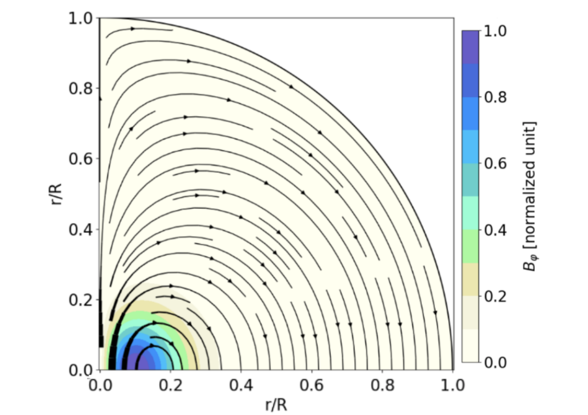
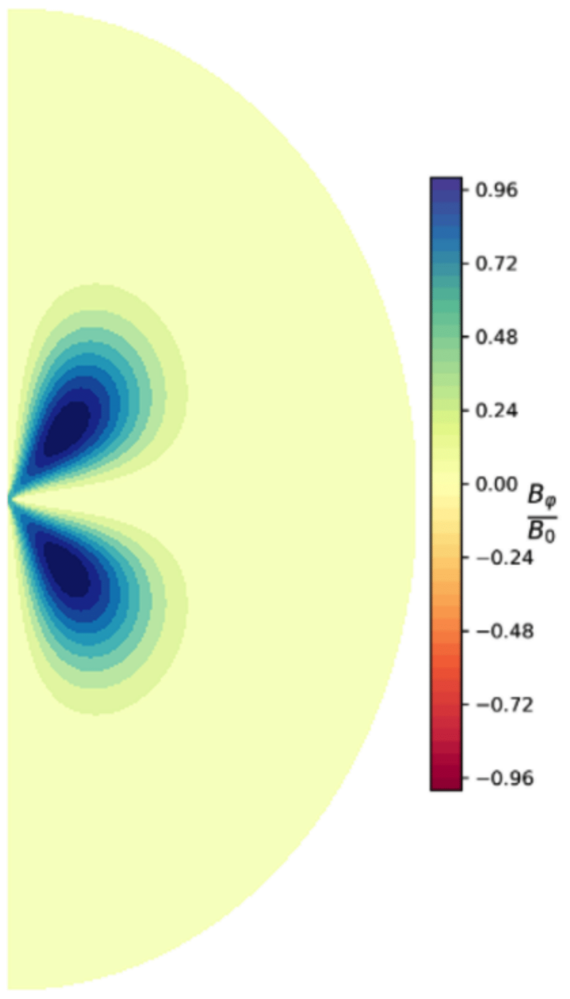
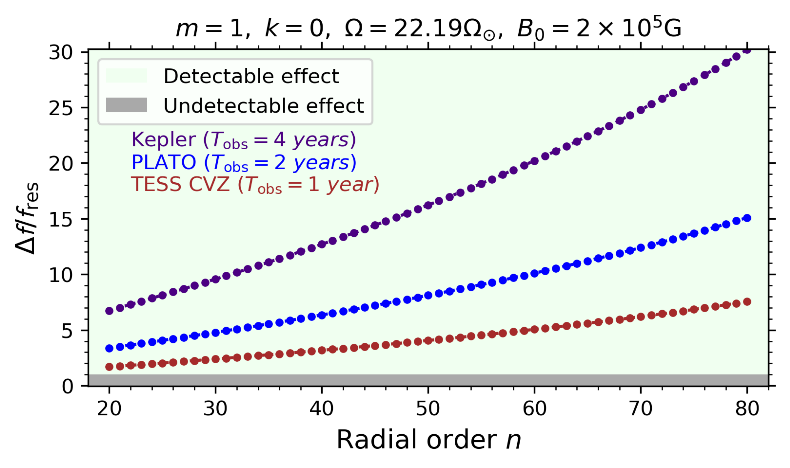
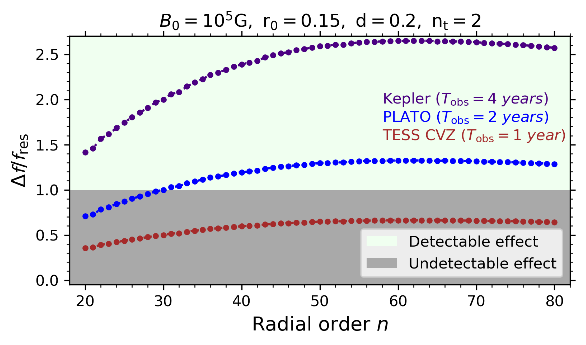

$\newcommand{\ensuremath}{}$
$\newcommand{\xspace}{}$
$\newcommand{\object}[1]{\texttt{#1}}$
$\newcommand{\farcs}{{.}''}$
$\newcommand{\farcm}{{.}'}$
$\newcommand{\arcsec}{''}$
$\newcommand{\arcmin}{'}$
$\newcommand{\ion}[2]{#1#2}$
$\newcommand{\textsc}[1]{\textrm{#1}}$
$\newcommand{\hl}[1]{\textrm{#1}}$
$\newcommand{\kms}{{\mathrm{km~s^{-1}}}}$
$\newcommand{\kpc}{{\mathrm{kpc}}}$
$\newcommand{\thefootnote}{\fnsymbol{footnote}}$
$\newcommand{\BibTeX}{{\rm B\kern-.05em{\sc i\kern-.025em b}$
$    T\kern-.1667em\lower.7ex\hbox{E}\kern-.125emX}}$

$\newcommand{$\ensuremath$}{}$
$\newcommand{$\xspace$}{}$
$\newcommand{$\object$}[1]{\texttt{#1}}$
$\newcommand{$\farcs$}{{.}''}$
$\newcommand{$\farcm$}{{.}'}$
$\newcommand{$\arcsec$}{''}$
$\newcommand{$\arcmin$}{'}$
$\newcommand{$\ion$}[2]{#1#2}$
$\newcommand{$\textsc$}[1]{\textrm{#1}}$
$\newcommand{$\hl$}[1]{\textrm{#1}}$
$\newcommand{$\kms$}{{\mathrm{km~s^{-1}}}}$
$\newcommand{$\kpc$}{{\mathrm{kpc}}}$
$\newcommand{$\thefootnote$}{\fnsymbol{footnote}}$
$\newcommand{\BibTeX}{{\rm B\kern-.05em{\sc i\kern-.025em b}$
$    T\kern-.1667em\lower.7ex\hbox{E}\kern-.125emX}}$

#  stars?

<mark>Appeared on: 2022-09-21</mark> - _4 pages, 2 figures. Proceeding of the Annual meeting of the French Society of Astronomy and Astrophysics (SF2A 2022)_

H. Dhouib, et al.

**Abstract:** One of the major discoveries of asteroseismology is the signature of a strong extraction of angular momentum (AM) in the radiative zones of stars across the entire Hertzsprung-Russell diagram, resulting in weak core-to-surface rotation contrasts. Despite all efforts, a consistent AM transport theory, which reproduces both the internal rotation and mixing probed thanks to the seismology of stars, remains one of the major open problems in modern stellar astrophysics.A possible key ingredient to figure out this puzzle is magnetic field with its various possible topologies. Among them, strong axisymmetric toroidal fields, which are subject to the so-called Tayler MHD instability, could play a major role. They could trigger a dynamo action in radiative layers while the resulting magnetic torque allows an efficient transport of AM.But is it possible to detect signatures of these deep toroidal magnetic fields?The only way to answer this question is asteroseismology and the best laboratories of study are intermediate-mass and massive stars because of their external radiative envelope. Since most of these are rapid rotators during their main-sequence, we have to study stellar pulsations propagating in stably stratified, rotating, and potentially strongly magnetised radiative zones.For that, we generalise the traditional approximation of rotation, which provides in its classic version a flexible treatment of the adiabatic propagation of gravito-inertial modes, by taking simultaneously general axisymmetric differential rotation and toroidal magnetic fields into account.Using this new non-perturbative formalism, we derive the asymptotic properties of magneto-gravito-inertial modes and we explore the different possible field configurations. We found that the magnetic effects should be detectable for equatorial fields using high-precision asteroseismic data.

**Figure 1. -** Equatorial {\bf (Left)} and hemispheric {\bf (Right)} toroidal magnetic configurations. (*fig:field*)

**Figure 2. -** Detectability of the effect of an equatorial {\bf (Left)} and hemispheric {\bf (Right)} toroidal magnetic fields on the $\{k=0,m=1\}$ mode as a function of the radial order  $n$ using a $1.6{\rm M}_\odot$$\gamma $Dor model near ZAMS. (*fig:detect*)

