

$\newcommand{\ensuremath}{}$
$\newcommand{\xspace}{}$
$\newcommand{\object}[1]{\texttt{#1}}$
$\newcommand{\farcs}{{.}''}$
$\newcommand{\farcm}{{.}'}$
$\newcommand{\arcsec}{''}$
$\newcommand{\arcmin}{'}$
$\newcommand{\ion}[2]{#1#2}$
$\newcommand{\textsc}[1]{\textrm{#1}}$
$\newcommand{\hl}[1]{\textrm{#1}}$
$\newcommand{\vdag}{(v)^\dagger}$
$\newcommand$
$\newcommand$
$\newcommand{\Rsun}{\hbox{R_\odot}}$
$\newcommand{\tr}{\hbox{t_{\rm relax}}}$
$\newcommand{\mv}{\hbox{M_{\rm V}}}$
$\newcommand{\lsun}{\hbox{L_\odot}}$
$\newcommand{\msun}{\hbox{M_\odot}}$
$\newcommand{\mstar}{\hbox{M_\star}}$
$\newcommand{\t4}{\hbox{t_{\rm 4}}}$
$\newcommand{\fmid}{\hbox{F_{\rm MID}}}$
$\newcommand{\reff}{\hbox{R_{\rm eff}}}$
$\newcommand{\dndt}{\hbox{\frac{d{\rm N}}{dt}}}$
$\newcommand{\cbound}{\hbox{C_{\rm bound}}}$
$\newcommand{\relation}{\hbox{SFR vs. M_{V}^{\rm brightest}}}$
$\newcommand{\clrelation}{\hbox{CFR vs. M_{V}^{\rm brightest}}}$
$\newcommand{\mvten}{\hbox{M_{\rm V}^{10{\rm Myr}}}}$
$\newcommand{\lir}{\hbox{L_{\rm IR}}}$
$\newcommand{\msunyr}{\hbox{M_\odotyr^{-1}}}$
$\newcommand{\dsfr}{\hbox{M_\odotyr^{-1}kpc^{-2}}}$
$\newcommand{\Ne}{\hbox{N_{\rm{e}}}}$
$\newcommand{\Te}{\hbox{T_{\rm{e}}}}$
$\newcommand{\kms}{\hbox{km s^{-1}}}$
$\newcommand{\cm3}{\hbox{cm^{-3}}}$
$\newcommand{\one}{ {\sc i}}$
$\newcommand{\two}{ {\sc ii}}$
$\newcommand{\three}{ {\sc iii}}$
$\newcommand{\four}{ {\sc iv}}$

$\newcommand{\ensuremath}{}$
$\newcommand{\xspace}{}$
$\newcommand{\object}[1]{\texttt{#1}}$
$\newcommand{\farcs}{{.}''}$
$\newcommand{\farcm}{{.}'}$
$\newcommand{\arcsec}{''}$
$\newcommand{\arcmin}{'}$
$\newcommand{\ion}[2]{#1#2}$
$\newcommand{\textsc}[1]{\textrm{#1}}$
$\newcommand{\hl}[1]{\textrm{#1}}$
$\newcommand{\vdag}{(v)^\dagger}$
$\newcommand$
$\newcommand$
$\newcommand{\Rsun}{\hbox{R_\odot}}$
$\newcommand{\tr}{\hbox{t_{\rm relax}}}$
$\newcommand{\mv}{\hbox{M_{\rm V}}}$
$\newcommand{\lsun}{\hbox{L_\odot}}$
$\newcommand{\msun}{\hbox{M_\odot}}$
$\newcommand{\mstar}{\hbox{M_\star}}$
$\newcommand{\t4}{\hbox{t_{\rm 4}}}$
$\newcommand{\fmid}{\hbox{F_{\rm MID}}}$
$\newcommand{\reff}{\hbox{R_{\rm eff}}}$
$\newcommand{\dndt}{\hbox{\frac{d{\rm N}}{dt}}}$
$\newcommand{\cbound}{\hbox{C_{\rm bound}}}$
$\newcommand{\relation}{\hbox{SFR vs. M_{V}^{\rm brightest}}}$
$\newcommand{\clrelation}{\hbox{CFR vs. M_{V}^{\rm brightest}}}$
$\newcommand{\mvten}{\hbox{M_{\rm V}^{10{\rm Myr}}}}$
$\newcommand{\lir}{\hbox{L_{\rm IR}}}$
$\newcommand{\msunyr}{\hbox{M_\odotyr^{-1}}}$
$\newcommand{\dsfr}{\hbox{M_\odotyr^{-1}kpc^{-2}}}$
$\newcommand{\Ne}{\hbox{N_{\rm{e}}}}$
$\newcommand{\Te}{\hbox{T_{\rm{e}}}}$
$\newcommand{\kms}{\hbox{km s^{-1}}}$
$\newcommand{\cm3}{\hbox{cm^{-3}}}$
$\newcommand{\one}{ {\sc i}}$
$\newcommand{\two}{ {\sc ii}}$
$\newcommand{\three}{ {\sc iii}}$
$\newcommand{\four}{ {\sc iv}}$

# CLusters in the Uv as EngineS (CLUES): I. Survey presentation \& FUV spectral analysis of the stellar light

<mark>Appeared on: 2022-09-20</mark> - _Accepted for publication on the Astronomical Journal on 16th September 2022. 26 pages, 12 figures_

M. Sirressi, et al. -- incl., <mark><mark>L. J. Smith</mark></mark>, <mark><mark>E. Schinnerer</mark></mark>

**Abstract:** The CLusters in the Uv as EngineS (CLUES) survey is a Cosmic Origins Spectrograph (COS) campaign aimed at acquiring the 1130 to 1770 Å  restframe spectroscopy of very young ( $<$ 20 Myr) and massive ( $>10^4$ \msun ) star clusters in galaxies that are part of the Hubble treasury program Legacy ExtraGalactic Uv Survey (LEGUS).In this first paper of a series, we describe the CLUES sample consisting of 20 young star clusters and report their physical properties as derived by both multi-wavelength photometry and far-UV (FUV) spectroscopy with Hubble Space Telescope (HST). Thanks to the synergy of the two different datasets we build a coherent picture of the diverse stellar populations found in each region (with sizes of 40 to 160 pc). We associate the FUV-brightest stellar population to the central targeted star cluster and the other modeled population to the diffuse stars that are included in the COS aperture. We observe better agreement between photometric and spectroscopic ages for star clusters younger than 5 Myr. For clusters older than 5 Myr, photometry and spectroscopy measurements deviate, with the latter producing older ages, due to the degeneracy of photometric models. FUV spectroscopy enables us to better constrain the stellar metallicities, a parameter that optical colors are insensitive to. Finally, the derived $E(B-V)$ are quite similar, with a tendency for FUV spectroscopy to favor solutions with higher extinctions. The recovered masses are in agreement within a factor of 2 for all the clusters.

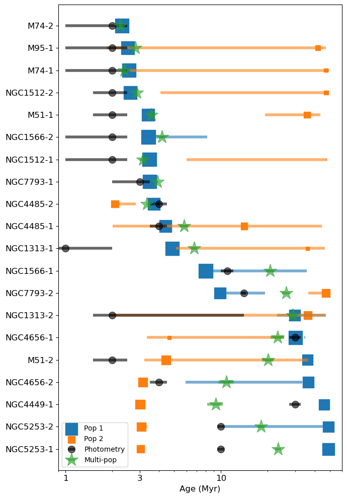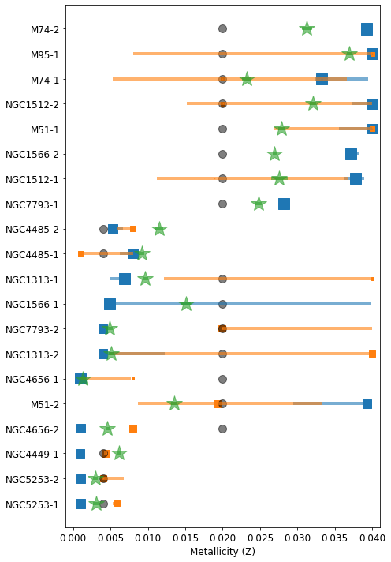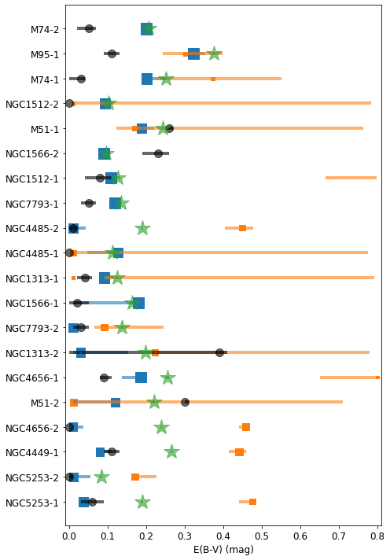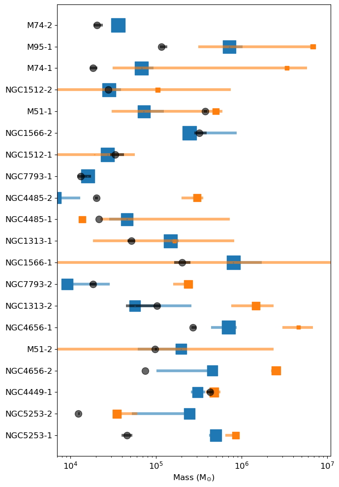

**Figure 7. -** Values of the best-fit parameters for ages, metallicities, reddening attenuations and masses of our different models. The grey dots represent the values derived from photometry. The blue and orange squares are the values for _Pop 1_ and _Pop 2_ respectively, of our double population model of the FUV spectroscopy, with their size proportional to their light flux contribution at 1270 Å. The green stars are the average values of our multiple population model. (*fig:parameters*)

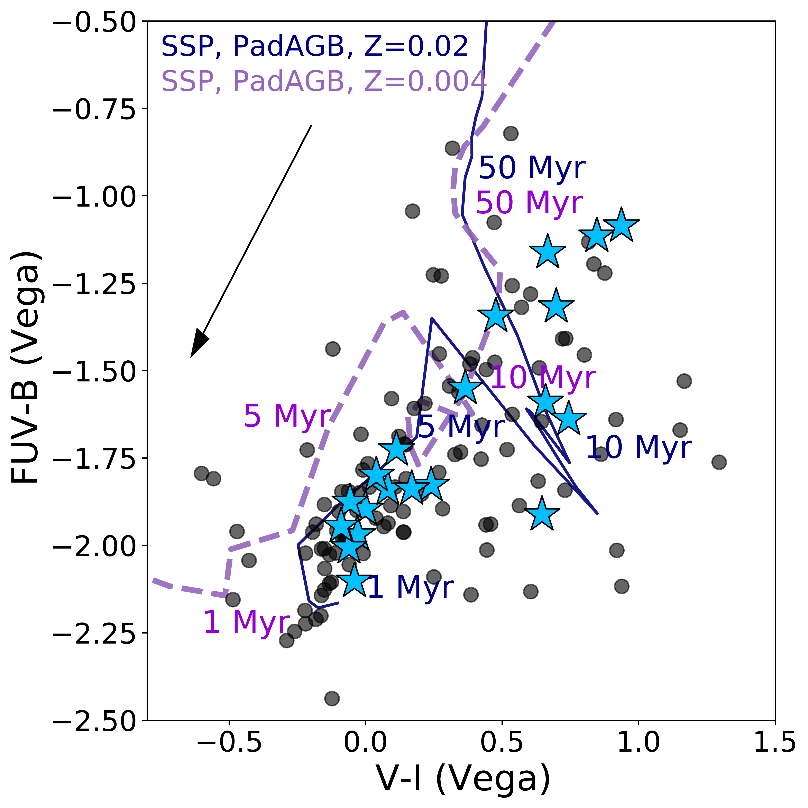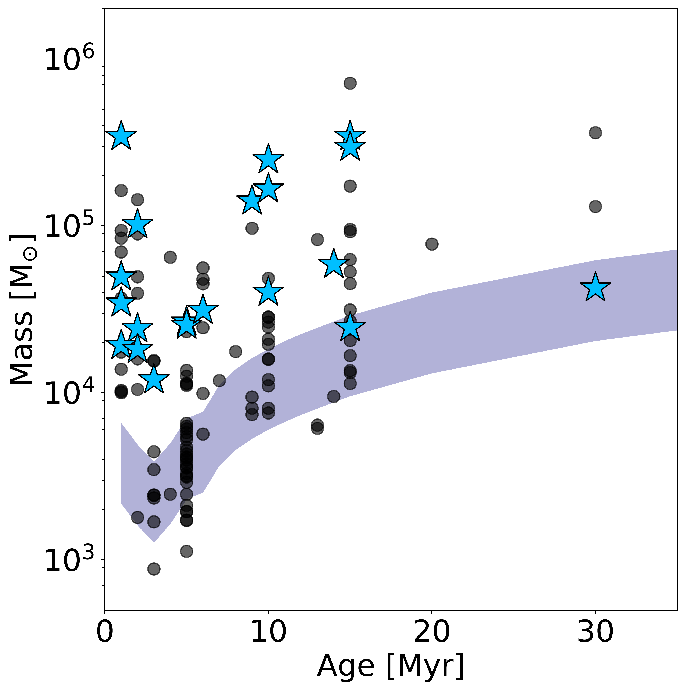

**Figure 2. -** Parameter space spanned by the clusters belonging to the CLUES sample (cyan stars). The clusters that pass the first selection (class 1 and 2 with m$_{F275W} <$ 18 mag, $E(B-V)\leq$ 0.3 mag, age $\leq$ 30 Myr) are shown in both panels as grey dots. The left panel shows the FUV color, F275W$-$F438W (or F435W) vs. the optical color, F555W (or F606W)$-$F814W, of the clusters. Yggdrasil evolutionary tracks spanning the metallicity range of the LEGUS sample are included and the main age steps outlined. The arrow shows in which direction clusters would move if corrected by an internal reddening corresponding to $E(B-V)=0.3$ mag. In the right panel, we show the age vs. mass diagram of the sample. The violet band shows the detection limit corresponding m$_{F275W}=$18 mag as function of the metallicity (Z$=0.004$ and 0.02) and distance range of the LEGUS galaxies. (*fig:selection*)

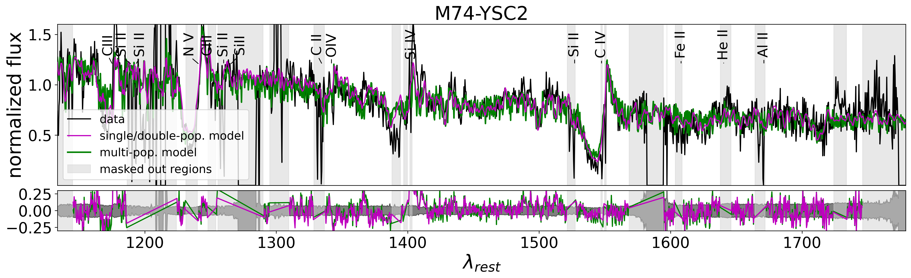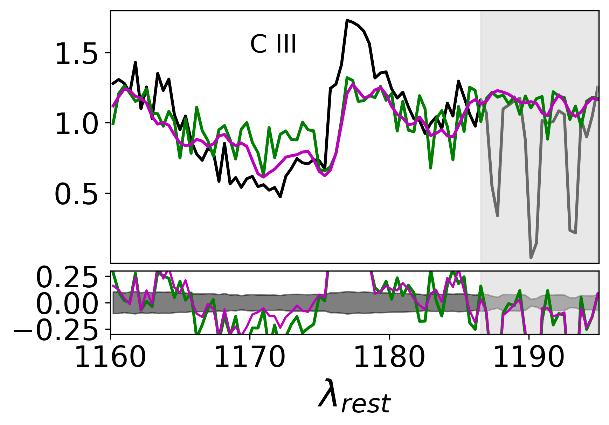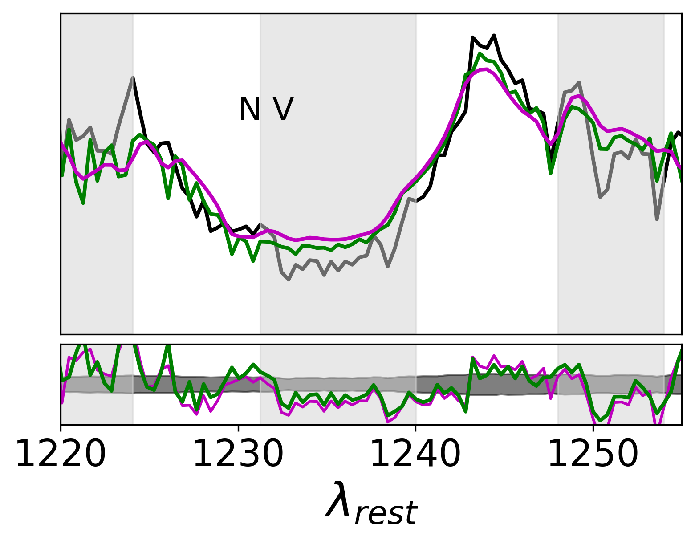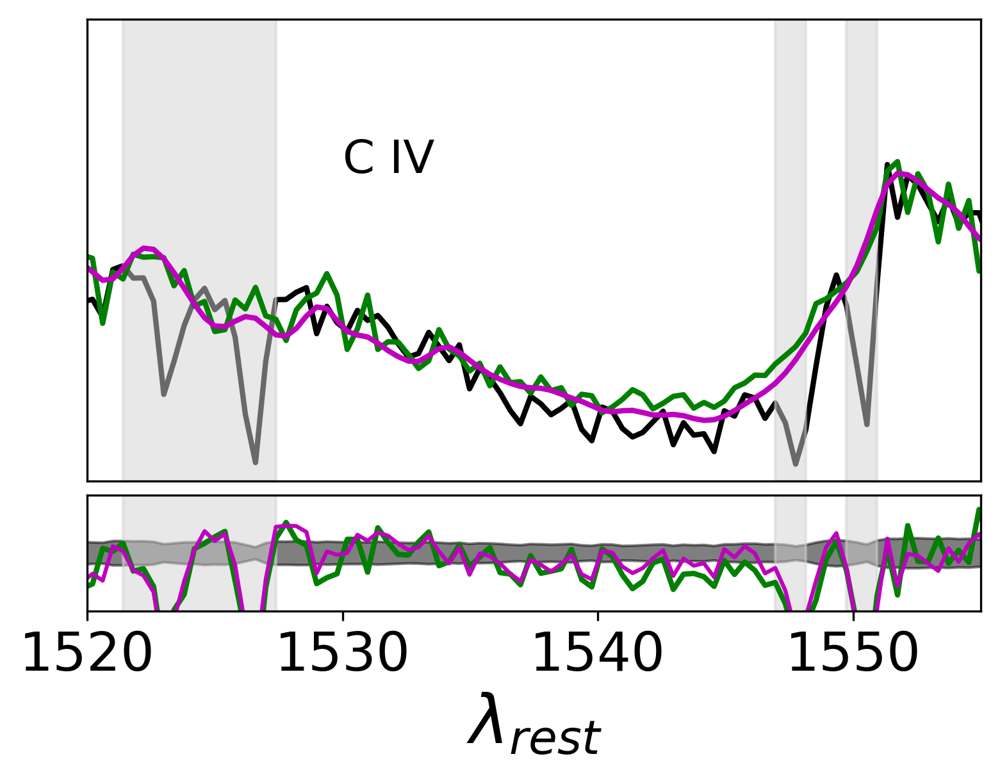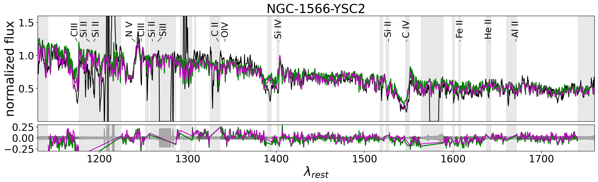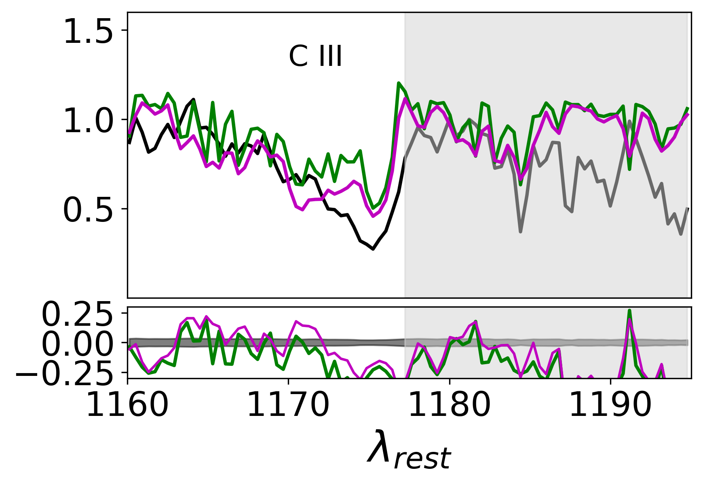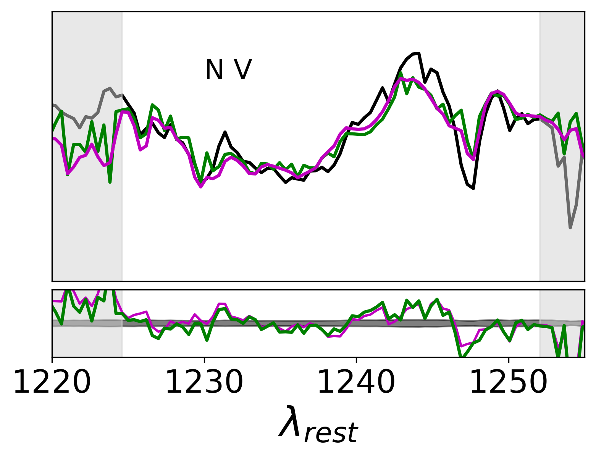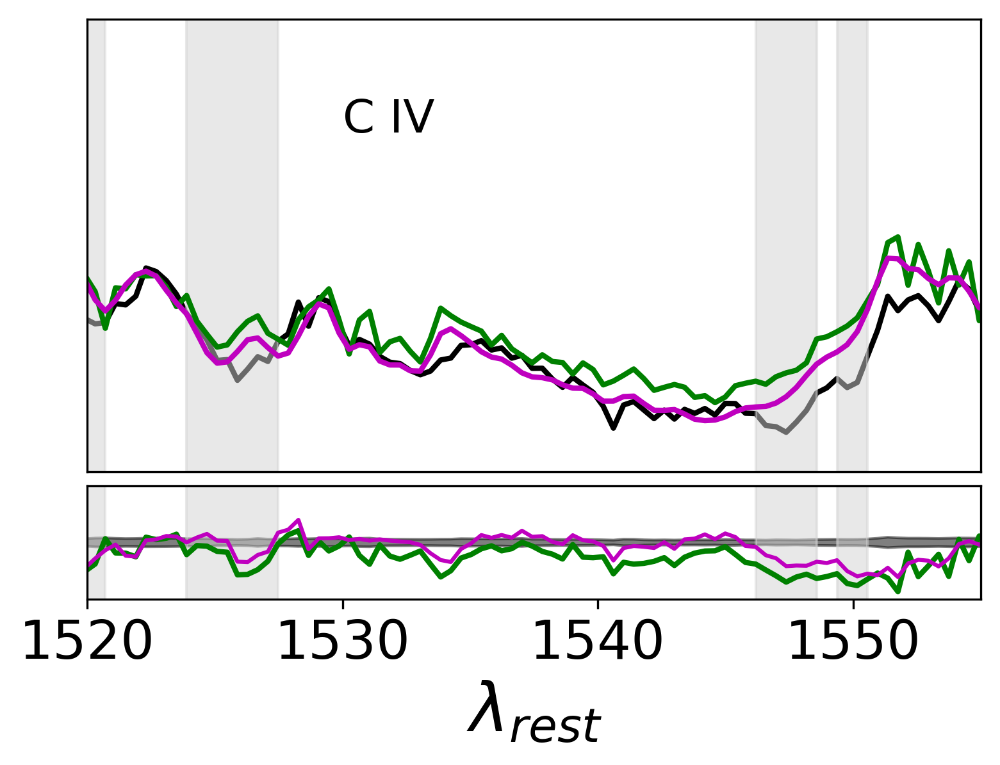

**Figure 6. -** Two targets (M-74-YSC2 and NGC-1566-YSC2) as examples of the fits to the FUV spectra (black line) with the single/double-population model and the multi-population model (purple and green lines respectively). The two panels below each target show a zoom into the P-Cygni lines C III, N V and C IV. The example targets chosen for this figure are a good and a poor agreement for the stellar age between single/double pop. model and multi-pop. model. (*fig:example*)

