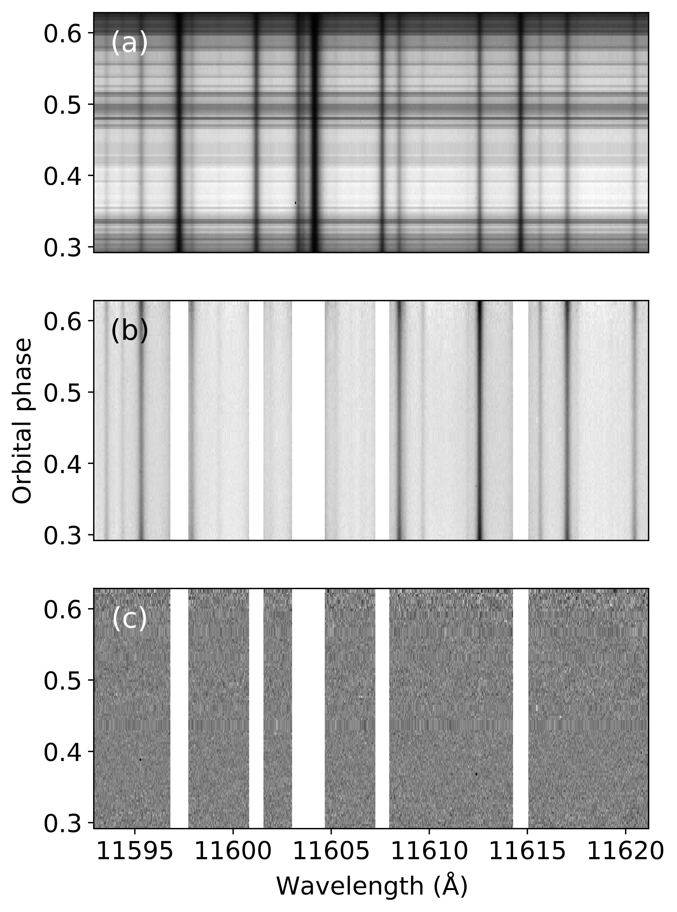
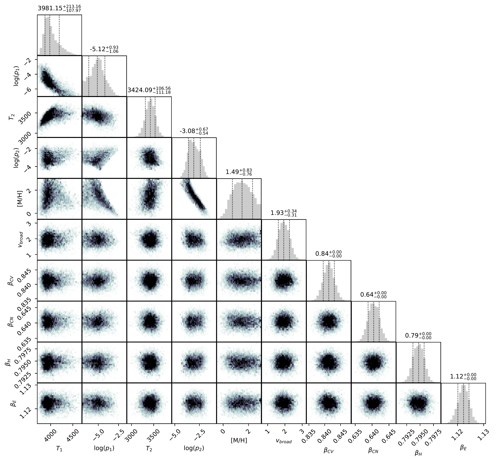
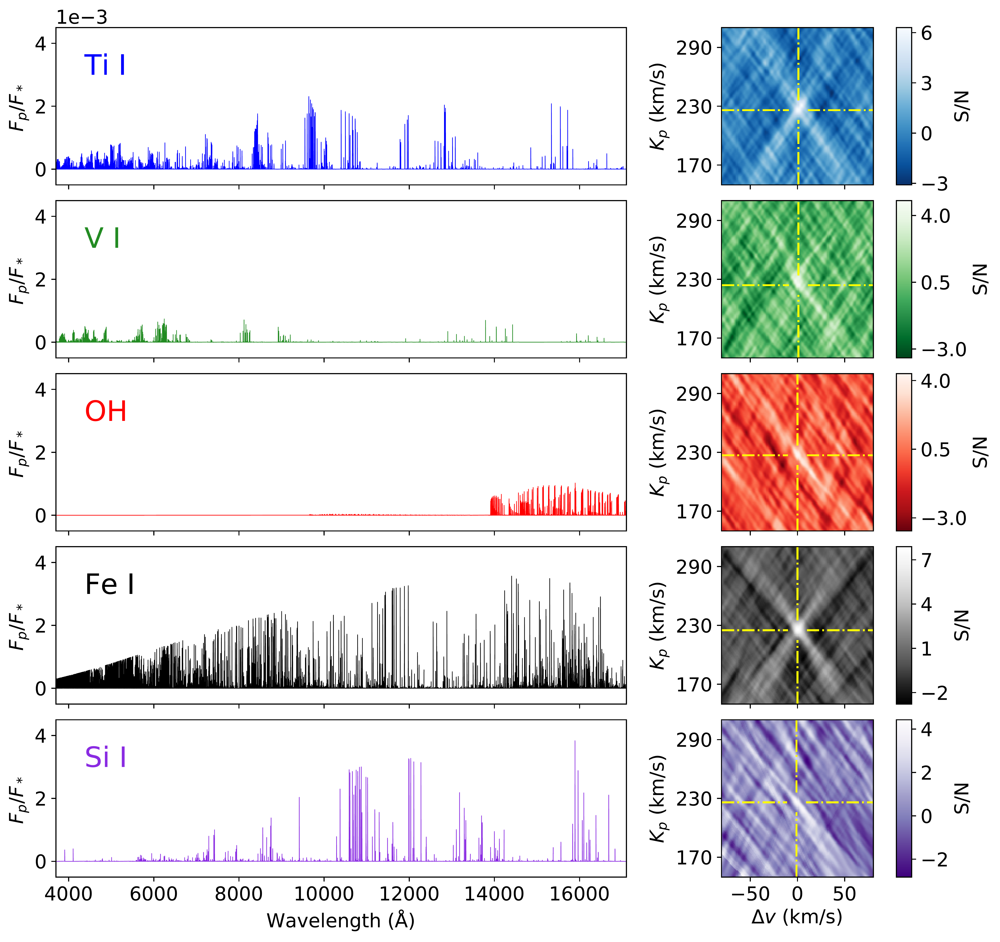

$\newcommand{\ensuremath}{}$
$\newcommand{\xspace}{}$
$\newcommand{\object}[1]{\texttt{#1}}$
$\newcommand{\farcs}{{.}''}$
$\newcommand{\farcm}{{.}'}$
$\newcommand{\arcsec}{''}$
$\newcommand{\arcmin}{'}$
$\newcommand{\ion}[2]{#1#2}$
$\newcommand{\textsc}[1]{\textrm{#1}}$
$\newcommand{\hl}[1]{\textrm{#1}}$
$\newcommand{\footnote}[1]{}$
$\newcommand{\arraystretch}{1.3}$
$\newcommand{\arraystretch}{1.3}$
$\newcommand{\arraystretch}{1.3}$
$\newcommand{\arraystretch}{1.3}$
$\newcommand{\arraystretch}{1.4}$

$\newcommand{\ensuremath}{}$
$\newcommand{\xspace}{}$
$\newcommand{\object}[1]{\texttt{#1}}$
$\newcommand{\farcs}{{.}''}$
$\newcommand{\farcm}{{.}'}$
$\newcommand{\arcsec}{''}$
$\newcommand{\arcmin}{'}$
$\newcommand{\ion}[2]{#1#2}$
$\newcommand{\textsc}[1]{\textrm{#1}}$
$\newcommand{\hl}[1]{\textrm{#1}}$
$\newcommand{\footnote}[1]{}$
$\newcommand{\arraystretch}{1.3}$
$\newcommand{\arraystretch}{1.3}$
$\newcommand{\arraystretch}{1.3}$
$\newcommand{\arraystretch}{1.3}$
$\newcommand{\arraystretch}{1.4}$

# Atmospheric characterization of the ultra-hot Jupiter WASP-33b

<mark>Appeared on: 2022-09-21</mark> - _Accepted for publication in A&A_

D. Cont, et al. -- incl., <mark>P. Mollière</mark>

**Abstract:** Ultra-hot Jupiters are highly irradiated gas giant exoplanets on close-in orbits around their host stars. The dayside atmospheres of these objects strongly emit thermal radiation due to their elevated temperatures, making them prime targets for characterization by emission spectroscopy. We analyzed high-resolution spectra from CARMENES, HARPS-N, and ESPaDOnS taken over eight observation nights to study the emission spectrum of WASP-33b and draw conclusions about its atmosphere. By applying the cross-correlation technique, we detected the spectral signatures of $\ion{Ti}{i}$ , $\ion{V}{i}$ , and a tentative signal of $\ion{Ti}{ii}$ for the first time via emission spectroscopy. These detections are an important finding because of the fundamental role of Ti- and V-bearing species in the planetary energy balance. Moreover, we assessed and confirm the presence of OH, $\ion{Fe}{i}$ , and $\ion{Si}{i}$ from previous studies. The spectral lines are all detected in emission, which unambiguously proves the presence of an inverted temperature profile in the planetary atmosphere. By performing retrievals on the emission lines of all the detected species, we determined a relatively weak atmospheric thermal inversion extending from approximately 3400 K to 4000 K. We infer a supersolar metallicity close to 1.5 dex in the planetary atmosphere, and find that its emission signature undergoes significant line broadening with a Gaussian FWHM of about 4.5 km s $^{-1}$ . Also, we find that the atmospheric temperature profile retrieved at orbital phases far from the secondary eclipse is about 300 K to 700 K cooler than that measured close to the secondary eclipse, which is consistent with different day- and nightside temperatures. Moreover, retrievals performed on the emission lines of the individual chemical species lead to consistent results, which gives additional confidence to our retrieval method. Increasing the number of species included in the retrieval and expanding the set of retrieved atmospheric parameters will further advance our understanding of exoplanet atmospheres.

**Figure 1. -** Data reduction steps for a representative CARMENES NIR wavelength range. _ Panel a_ shows the unprocessed spectral matrix. _ Panel b_ is the spectral matrix after normalization and outlier correction; we mask the strongest telluric lines in this step. _ Panel c_ shows the spectra reduced with \texttt{SYSREM} after telluric and stellar line removal. (*SYSREM*)

**Figure 7. -** Posterior distributions of the atmospheric parameters from our retrieval. We used the emission lines of all the detected species (i.e., $\ion${Ti}{i}, $\ion${V}{i}, OH, $\ion${Fe}{i}, $\ion${Si}{i}, and $\ion${Ti}{ii}). (*corner_plot_all*)

**Figure 11. -** Model spectra and S/N maps of the neutral chemical species investigated. The _left panels_ show the normalized model spectra of the detected species. The presented interval 3700--17 100 $Å$ corresponds to the combined wavelength coverage of the instruments used. The _right panels_ show the S/N maps of the neutral species that we searched for. For each species, the S/N map corresponds to the specific \texttt{SYSREM} iteration that maximizes the detection. The detection peaks are indicated by the yellow dash-dotted lines. (*SNmaps_and_template_spectra_neutral*)

