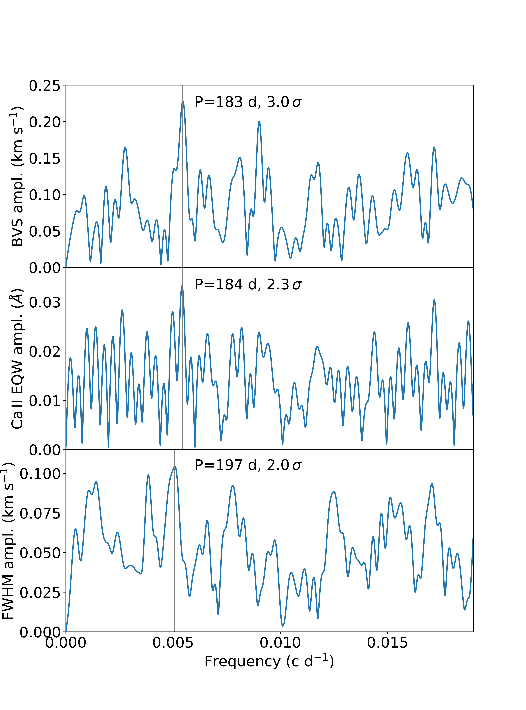
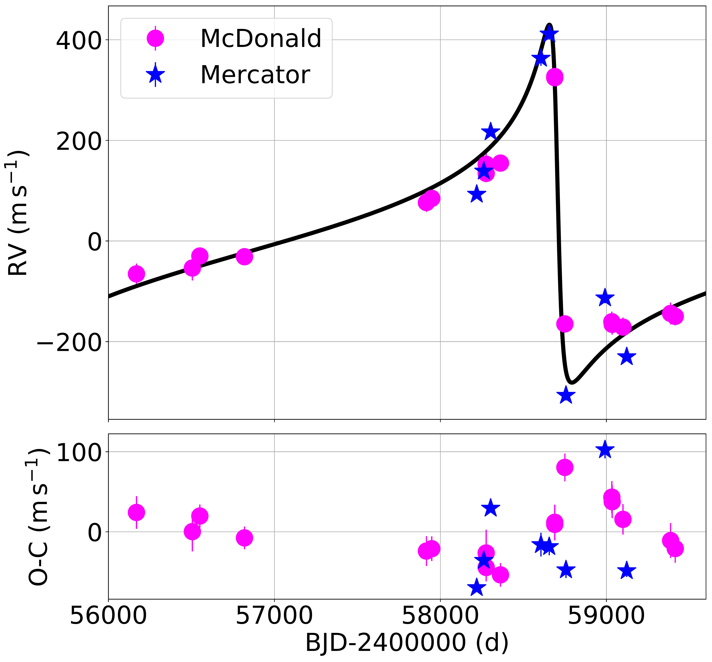
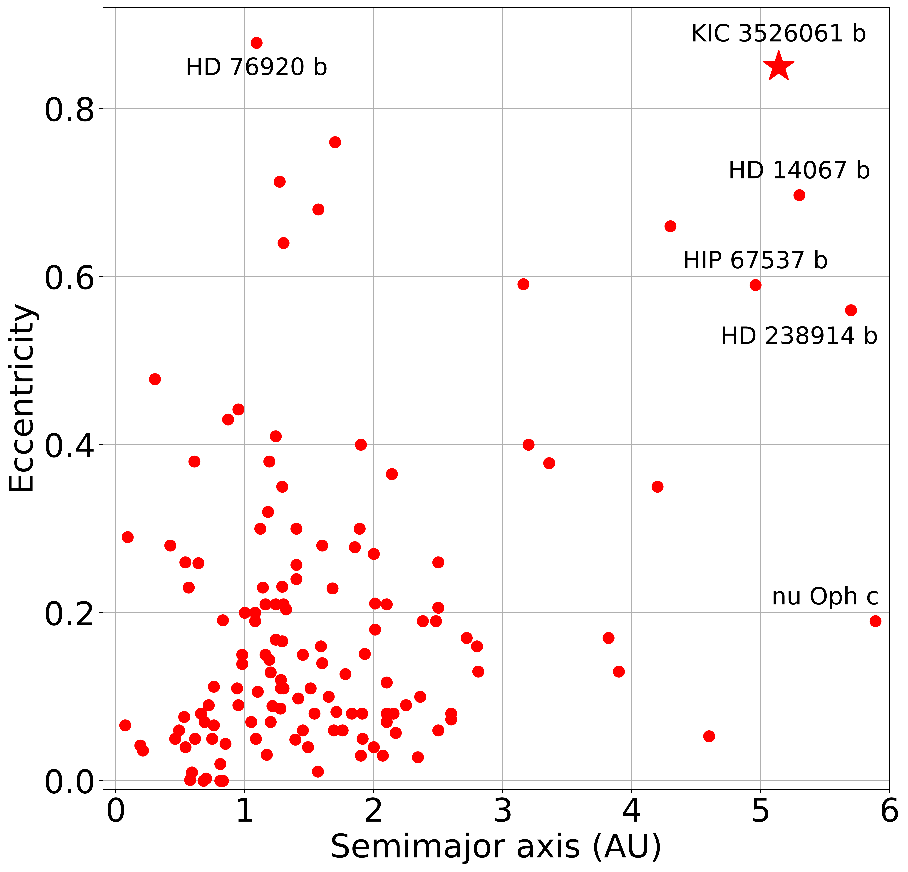

$\newcommand{\ensuremath}{}$
$\newcommand{\xspace}{}$
$\newcommand{\object}[1]{\texttt{#1}}$
$\newcommand{\farcs}{{.}''}$
$\newcommand{\farcm}{{.}'}$
$\newcommand{\arcsec}{''}$
$\newcommand{\arcmin}{'}$
$\newcommand{\ion}[2]{#1#2}$
$\newcommand{\textsc}[1]{\textrm{#1}}$
$\newcommand{\hl}[1]{\textrm{#1}}$

$\newcommand{$\ensuremath$}{}$
$\newcommand{$\xspace$}{}$
$\newcommand{$\object$}[1]{\texttt{#1}}$
$\newcommand{$\farcs$}{{.}''}$
$\newcommand{$\farcm$}{{.}'}$
$\newcommand{$\arcsec$}{''}$
$\newcommand{$\arcmin$}{'}$
$\newcommand{$\ion$}[2]{#1#2}$
$\newcommand{$\textsc$}[1]{\textrm{#1}}$
$\newcommand{$\hl$}[1]{\textrm{#1}}$

#  giant stars: A long-period eccentricsubstellar companion to KIC 3526061 and a stellar companion to HD 187878

<mark>Appeared on: 2022-09-23</mark> - _14 pages, 11 figures. Accepted to A&A_

Marie Karjalainen, et al. -- incl., <mark><mark>Saskia Hekker</mark></mark>

**Abstract:** Our knowledge of populations and occurrence of planets orbiting evolvedintermediate-mass stars is still incomplete. In 2010 westarted a planet-search program among 95 giant starsobserved by the\textit{Kepler}mission to increase the sampleof giant stars with planets and with reliable estimates of stellar massesand radii.We present the two systems KIC 3526061 and HD 187878from our planet-search program for which we could characterise theircompanions.We used precise stellar radial velocity measurements taken with fourdifferent echelle spectrographs to derive an orbital solution.We used\textit{Gaia}astrometric measurements to obtain the inclinationof the HD 187878 system and\textit{Kepler}photometric observations to estimate the stellarmass and radius.We report the discovery of a sub-stellar and a stellar companion around twointermediate-mass red giant branch stars. KIC 3526061 b is most likely a brown dwarf with aminimum mass of$18.15\pm 0.44 {\rm{M_{Jupiter}}}$in a long-periodeccentric orbit, with the orbital period$3552_{-135}^{+158}$d andorbital eccentricity$e=0.85\pm 0.01$. It is the most evolved system foundhaving a sub-stellar companion with such a large eccentricity and wide separation.HD 187878 B has a minimum mass of$78.4\pm 2.0 {\rm{M_{Jupiter}}}$.Combining the spectroscopic orbital parameters with the astrometric propermotion anomaly we derived an orbital inclination$i=9.8^{+0.4}_{-0.6}$deg, whichcorresponds to the companion's mass in the stellar regime of$0.51^{+0.04}_{-0.02} \rm{M_{\odot}}$.A sub-stellar companion of KIC 3526061 extends the sample of known red giantbranch stars with sub-stellar companions on very eccentric wide orbits andmight provide a probe of the dynamical evolution of such systems over time.

**Figure 7. -** Frequency amplitude spectra for KIC 3526061.
Top: Bisector velocity spans. Middle: Equivalent width of the $\ion${Ca}{ii}
triplet lines. Bottom: Full-width at half maximum of spectral line shapes.
For all three quantities we found variations on a similar time scale. (*Fig_BVS_FWHM_EQW*)

**Figure 2. -** RV measurements of KIC 3526061. Top: Data obtained from
August 2012 to July 2021 using the TS2 spectrograph at the McDonald
Observatory, Texas, and the HERMES spectrograph at Mercator,
La Palma. The solid curve represents the Keplerian orbital solution.
Bottom: RV residuals and error bars
after removing the brown dwarf's orbital solution. (*Fig_kic_orbital*)

**Figure 6. -** Eccentricity versus semi-major axis for all sub-stellar companions known around
giant host stars
(source: https://www.lsw.uni-heidelberg.de/users/sreffert/giantplanets/giantplanets.php).
The red asterisk shows the position of KIC 3526061 b. (*Fig_evsa*)

