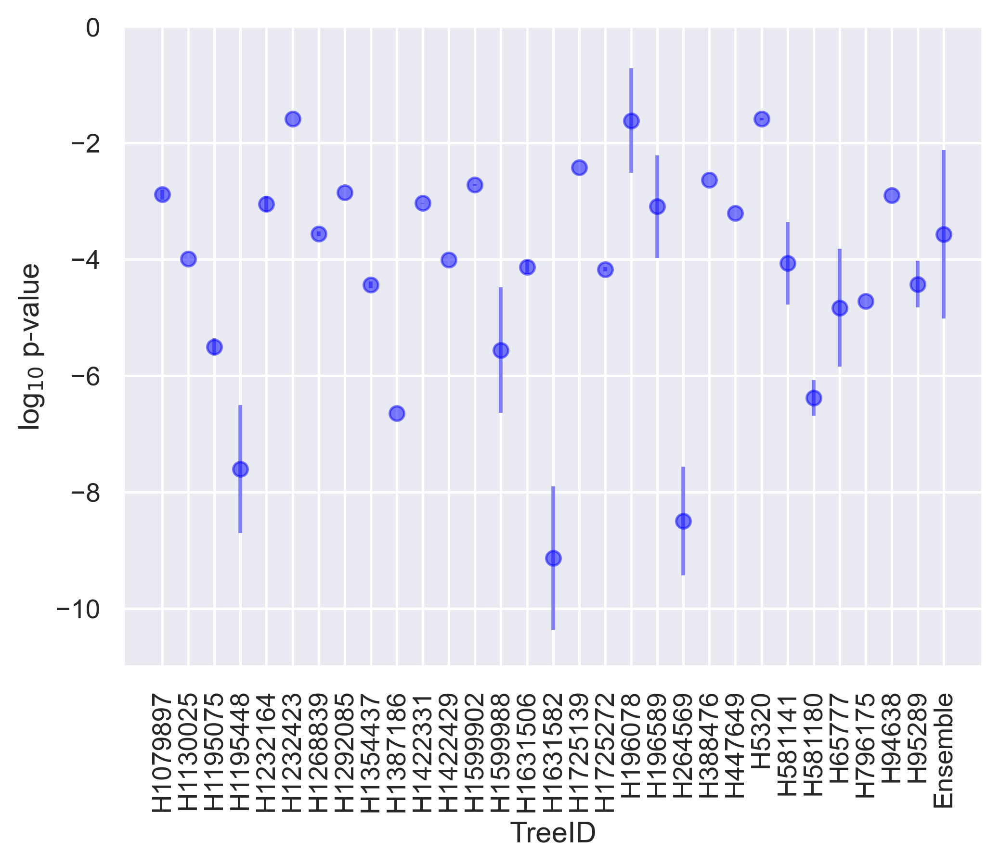

$\newcommand{\ensuremath}{}$
$\newcommand{\xspace}{}$
$\newcommand{\object}[1]{\texttt{#1}}$
$\newcommand{\farcs}{{.}''}$
$\newcommand{\farcm}{{.}'}$
$\newcommand{\arcsec}{''}$
$\newcommand{\arcmin}{'}$
$\newcommand{\ion}[2]{#1#2}$
$\newcommand{\textsc}[1]{\textrm{#1}}$
$\newcommand{\hl}[1]{\textrm{#1}}$
$\newcommand{\angstrom}{\textup{Å}}$
$\newcommand{\asloth}{\textsc{a-sloth}\xspace}$
$\newcommand{\ctp}{\textit{Caterpillar}\xspace}$
$\newcommand{\msun}{{\rm M}_\odot}$
$\newcommand{\feh}{\mathrm{[Fe/H]}}$
$\newcommand{\tilman}[1]{\textcolor{green}{{#1}}}$
$\newcommand{\lhnote}[1]{\textcolor{red}{{#1}}}$

$\newcommand{\ensuremath}{}$
$\newcommand{\xspace}{}$
$\newcommand{\object}[1]{\texttt{#1}}$
$\newcommand{\farcs}{{.}''}$
$\newcommand{\farcm}{{.}'}$
$\newcommand{\arcsec}{''}$
$\newcommand{\arcmin}{'}$
$\newcommand{\ion}[2]{#1#2}$
$\newcommand{\textsc}[1]{\textrm{#1}}$
$\newcommand{\hl}[1]{\textrm{#1}}$
$\newcommand{\angstrom}{\textup{Å}}$
$\newcommand{\asloth}{\textsc{a-sloth}\xspace}$
$\newcommand{\ctp}{\textit{Caterpillar}\xspace}$
$\newcommand{\msun}{{\rm M}_\odot}$
$\newcommand{\feh}{\mathrm{[Fe/H]}}$
$\newcommand{\tilman}[1]{\textcolor{green}{{#1}}}$
$\newcommand{\lhnote}[1]{\textcolor{red}{{#1}}}$

# Comparing simulated Milky Way satellite galaxies with observations using unsupervised clustering

<mark>Appeared on: 2022-09-22</mark> - _11 pages, 7 figures, 7 tables. Accepted version by MNRAS_

<mark><mark>Li-Hsin Chen</mark></mark>, Tilman Hartwig, Ralf S. Klessen, Simon C. O. Glover

**Abstract:** We develop a new analysis method that allows us to compare multi-dimensional observables to a theoretical model. The method is based on unsupervised clustering algorithms which assign the observational and simulated data to clusters in high dimensionality. From the clustering result, a goodness of fit (the p-value) is determined with the Fisher-Freeman-Halton test.We first show that this approach is robust for 2D Gaussian distributions. We then apply the method to the observed MW satellites and simulated satellites from the fiducial model of our semi-analytic code \asloth . We use the following 5 observables of the galaxies in the analysis: stellar mass, virial mass, heliocentric distance, mean stellar metallicity $\feh$ , and stellar metallicity dispersion $\sigma_\feh$ .A low p-value returned from the analysis tells us that our \asloth fiducial model does not reproduce the mean stellar metallicity of the observed MW satellites well. We implement an ad-hoc improvement to the physical model and show that the number of dark matter merger trees which have a p-value > 0.01 increases from 3 to 6.This method can be extended to data with higher dimensionality easily. We plan to further improve the physical model in \asloth using this method to study elemental abundances of stars in the observed MW satellites.

**Figure 4. -** Normalised, cumulative histogram of the five physical quantities used in the analysisNormalised, cumulative histogram of the five physical quantities used in the analysis from our fiducial model, improved model, and the observation. From top to bottom: stellar mass, helicocentric distance, mean stellar $\feh$, standard deviation of stellar $\feh$, and the virial mass of the halo. The observation is plotted in green, the $\asloth$ fiducial model is plotted in blue, and the improved model is plotted in brown.  (*fig:hist_fid*)

**Figure 1. -** Example of clustering results from $\asloth$ fiducial model An example of unsupervised clustering from the fiducial model of $\asloth$ and the observed satellites, which is projected onto the $\langle$\feh$\rangle$-${M_*}$ space. The data is normalised in each dimension before we apply the unsupervised clustering and the means are shown in bold font. In this analysis we use Agglomerative with 5 clusters. Galaxies that are classified in different clusters are plotted with different colours. Observed MW satellites are shown in squares and $\asloth$ simulated MW satellites are shown in circles. The p-value for this example is $10^{-2.2}$. (*fig:fid_clus*)

**Figure 2. -** The p-values from 30 $\ctp$ treesThe p-values from 30 Caterpillar trees as individual datasets and the p-value from the Ensemble (data from 30 trees combined before conducting the analysis). Mean and 1 standard deviation from 100 runs of the analysis are shown with error bars. (*fig:indi_pv*)

