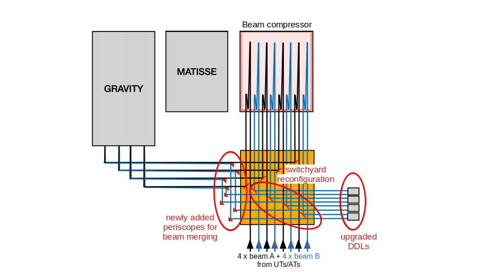
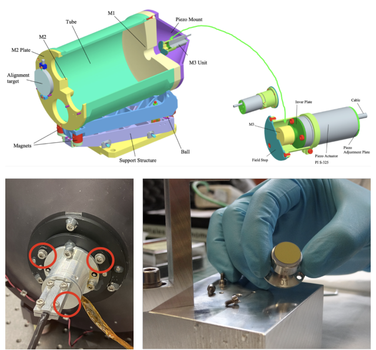
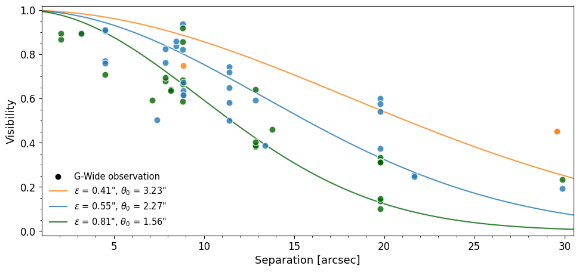

$\newcommand{\ensuremath}{}$
$\newcommand{\xspace}{}$
$\newcommand{\object}[1]{\texttt{#1}}$
$\newcommand{\farcs}{{.}''}$
$\newcommand{\farcm}{{.}'}$
$\newcommand{\arcsec}{''}$
$\newcommand{\arcmin}{'}$
$\newcommand{\ion}[2]{#1#2}$
$\newcommand{\textsc}[1]{\textrm{#1}}$
$\newcommand{\hl}[1]{\textrm{#1}}$
$\newcommand{\gp}{GRAVITY^+}$
$\newcommand{\gw}{GRAVITY Wide}$
$\newcommand{\baselinestretch}{1.0}$

$\newcommand{$\ensuremath$}{}$
$\newcommand{$\xspace$}{}$
$\newcommand{$\object$}[1]{\texttt{#1}}$
$\newcommand{$\farcs$}{{.}''}$
$\newcommand{$\farcm$}{{.}'}$
$\newcommand{$\arcsec$}{''}$
$\newcommand{$\arcmin$}{'}$
$\newcommand{$\ion$}[2]{#1#2}$
$\newcommand{$\textsc$}[1]{\textrm{#1}}$
$\newcommand{$\hl$}[1]{\textrm{#1}}$
$\newcommand{$\gp$}{GRAVITY^+}$
$\newcommand{$\gw$}{GRAVITY Wide}$
$\newcommand{$\baselinestretch$}{1.0}$

#  2 AGN

<mark>Appeared on: 2022-09-26</mark> - _Proceeding of SPIE Astronomical Telescopes + Instrumentation 2022_

A. Drescher, et al. -- incl., <mark><mark>L. Kreidberg</mark></mark>

**Abstract:** As part of the$\gp$project, the near-infrared beam combiner GRAVITY and the VLTI are currently undergoing a series of significant upgrades to further improve the performance and sky coverage. The instrumental changes will be transformational, and for instance uniquely position GRAVITY to observe the broad line region of hundreds of Active Galactic Nuclei (AGN) at a redshift of two and higher. The increased sky coverage is achieved by enlarging the maximum angular separation between the celestial science object (SC) and the off-axis fringe tracking (FT) star from currently 2 arcseconds (arcsec) up to unprecedented 30 arcsec, limited by the atmospheric conditions. This was successfully demonstrated at the VLTI for the first time.

**Figure 1. -** Schematic overview of the VLTI switchyard and beam routing towards GRAVITY. In total, eight beams from four telescopes arrive at the switchyward: four beams dedicated to the FT target (beam A, black) and four beams dedicated to the SC target (beam B, blue). The figure shows the configuration for $\gw$  observations with the periscopes in "IN" position. The switchyward reconfiguration relays the B beams coming from the beam compressors via the upgraded PRIMA DDLs to the periscopes to merge them into the A beams. (*fig:schematic-switchyard*)

**Figure 3. -** Replacement of the M3 mirrors of the PRIMA DDLs. The top figure shows a drawing of the PRIMA DDLs and the location of the M3 mirrors. The bottom left picture shows the piezo driven tip/tilt assembly that is accessible from the backside of the PRIMA DDLs. The red circles indicate the shim locations. The bottom right picture shows the newly fabricated M3 in the thermally clamped mount (here for a prototype, the final mounts were anodized black). (*fig:ddl_m3_replacement*)

**Figure 5. -** Observed contrast loss versus FT--SC separation. The three curves indicate the contrast loss for different seeing and isoplanatic angle values as expected from atmospheric turbulence following Ref. \citenum{elhalkouj2008} for the 1.8m ATs. Both the seeing, $\epsilon$, and the isoplanatic angle, $\theta_0$, are defined at 500 nm. (*fig:visloss_all_gwide*)

