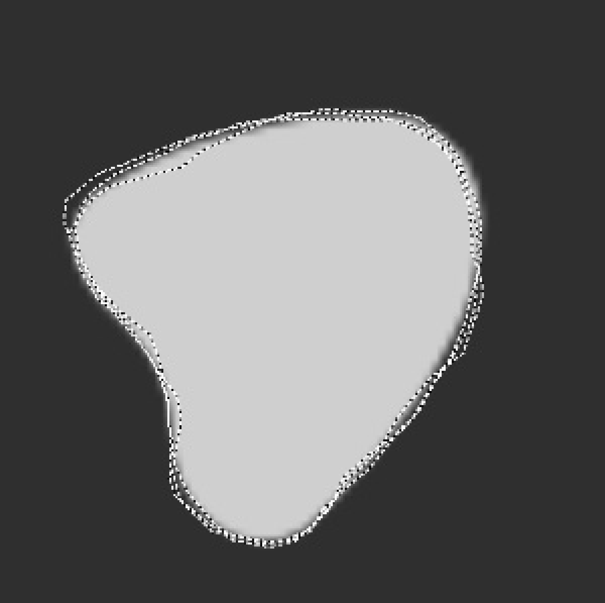

$\newcommand{\ensuremath}{}$
$\newcommand{\xspace}{}$
$\newcommand{\object}[1]{\texttt{#1}}$
$\newcommand{\farcs}{{.}''}$
$\newcommand{\farcm}{{.}'}$
$\newcommand{\arcsec}{''}$
$\newcommand{\arcmin}{'}$
$\newcommand{\ion}[2]{#1#2}$
$\newcommand{\textsc}[1]{\textrm{#1}}$
$\newcommand{\hl}[1]{\textrm{#1}}$
$\newcommand{\footnote}[1]{}$
$\newcommand{\gp}{GRAVITY^+}$
$\newcommand{\gw}{GRAVITY Wide}$
$\newcommand{\baselinestretch}{1.0}$

$\newcommand{\ensuremath}{}$
$\newcommand{\xspace}{}$
$\newcommand{\object}[1]{\texttt{#1}}$
$\newcommand{\farcs}{{.}''}$
$\newcommand{\farcm}{{.}'}$
$\newcommand{\arcsec}{''}$
$\newcommand{\arcmin}{'}$
$\newcommand{\ion}[2]{#1#2}$
$\newcommand{\textsc}[1]{\textrm{#1}}$
$\newcommand{\hl}[1]{\textrm{#1}}$
$\newcommand{\footnote}[1]{}$
$\newcommand{\gp}{GRAVITY^+}$
$\newcommand{\gw}{GRAVITY Wide}$
$\newcommand{\baselinestretch}{1.0}$

# GRAVITY+ Wide: Towards hundreds of z $\sim$ 2 AGN

<mark>Appeared on: 2022-09-23</mark> - _Proceeding of SPIE Astronomical Telescopes + Instrumentation 2022_

A. Drescher, et al. -- incl., <mark><mark>L. Kreidberg</mark></mark>

**Abstract:** As part of the $\gp$ project, GRAVITY and the VLTI are currently undergoing a series of significant upgrades to further improve the performance and sky coverage. The instrumental changes will be transformational, and for instance uniquely position GRAVITY to observe the broad line region of hundreds of $z\sim2$ Active Galactic Nuclei (AGN). The increased sky coverage is achieved by enlarging the maximum angular separation between the celestial science object (SC) and the off-axis fringe tracking (FT) object from currently 2 arcseconds (arcsec) up to unprecedented 30 arcseconds (limited by the atmospheric conditions), now demonstrated at the 8m telescopes for the first time.

**Figure 1. -** example
Figure captions are used to describe the figure and help the reader understand it's significance.  The caption should be centered underneath the figure and set in 9-point font.  It is preferable for figures and tables to be placed at the top or bottom of the page. LaTeX tends to adhere to this standard. (*fig:example*)

**Figure 2. -** example
A label of “Video/Audio 1, 2, …” should appear at the beginning of the caption to indicate to which multimedia file it is linked . Include this text at the end of the caption: \url{http://dx.doi.org/doi.number.goes.here} (*fig:video-example*)

