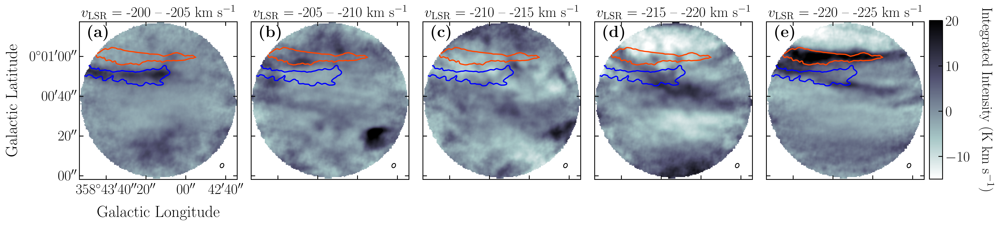
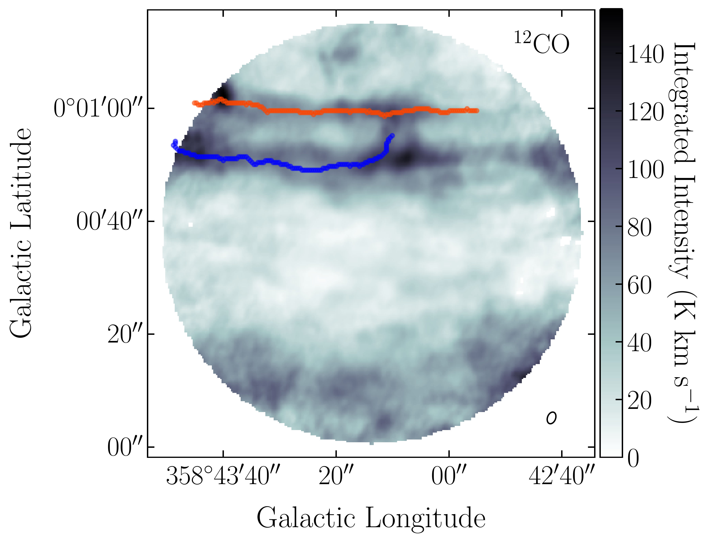
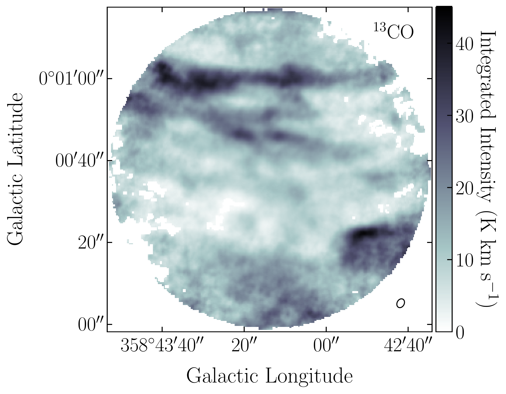
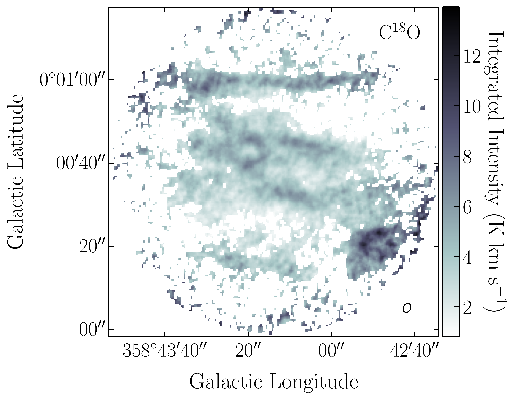
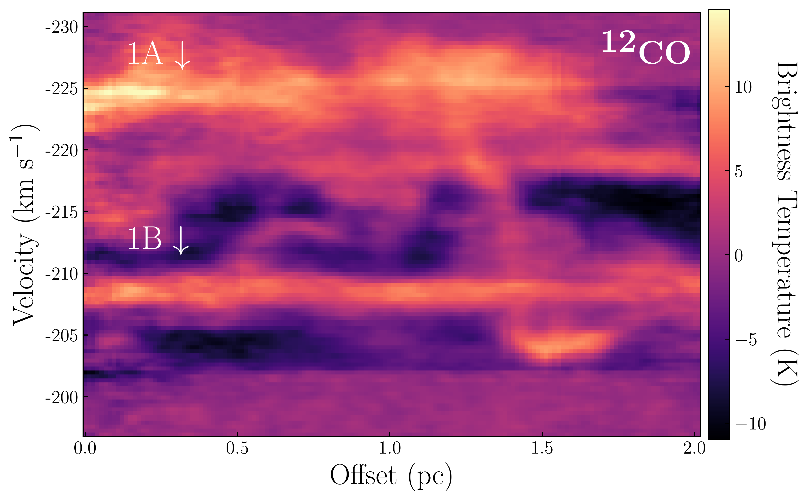
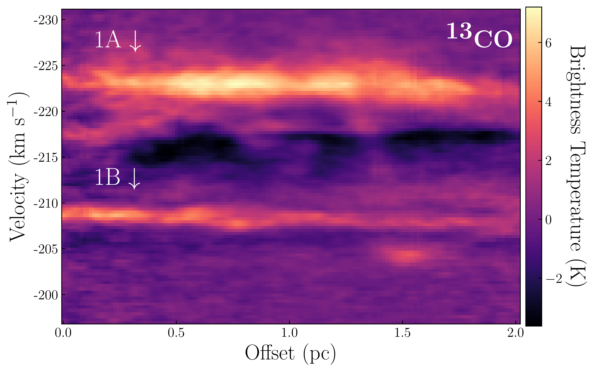
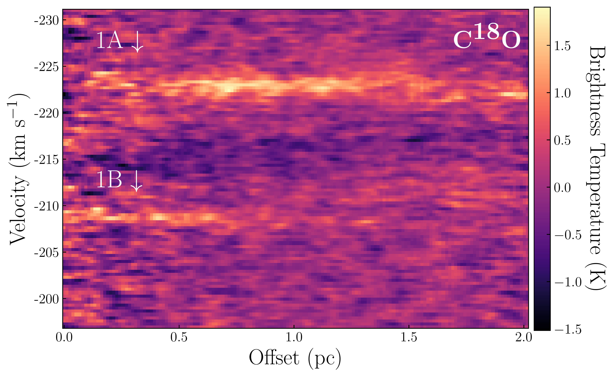

$\newcommand{\ensuremath}{}$
$\newcommand{\xspace}{}$
$\newcommand{\object}[1]{\texttt{#1}}$
$\newcommand{\farcs}{{.}''}$
$\newcommand{\farcm}{{.}'}$
$\newcommand{\arcsec}{''}$
$\newcommand{\arcmin}{'}$
$\newcommand{\ion}[2]{#1#2}$
$\newcommand{\textsc}[1]{\textrm{#1}}$
$\newcommand{\hl}[1]{\textrm{#1}}$
$\newcommand{\vdag}{(v)^\dagger}$
$\newcommand$
$\newcommand$

$\newcommand{$\ensuremath$}{}$
$\newcommand{$\xspace$}{}$
$\newcommand{$\object$}[1]{\texttt{#1}}$
$\newcommand{$\farcs$}{{.}''}$
$\newcommand{$\farcm$}{{.}'}$
$\newcommand{$\arcsec$}{''}$
$\newcommand{$\arcmin$}{'}$
$\newcommand{$\ion$}[2]{#1#2}$
$\newcommand{$\textsc$}[1]{\textrm{#1}}$
$\newcommand{$\hl$}[1]{\textrm{#1}}$
$\newcommand{$\vdag$}{(v)^\dagger}$
$\newcommand$
$\newcommand$

# ALMA uncovers highly filamentary structure towards the Sgr E region

<mark>Appeared on: 2022-09-27</mark> - _20 pages, 17 figures, accepted for publication in ApJ_

J. Wallace, et al. -- incl., <mark>J. D. Henshaw</mark>

**Abstract:** We report on the discovery of linear filaments observed in CO(1-0) emission for a$\sim2$\arcmin$$field of view toward the Sgr E star forming region centered at$(l,b)=(358.720\degree, 0.011\degree$). The Sgr E region is thought to be at the turbulent intersection of the "far dust lane" associated with the Galactic bar and the Central Molecular Zone (CMZ). This region is subject to strong accelerations which are generally thought to inhibit star formation, yet Sgr E contains a large number of HII regions.  We present$^{12}$CO(1-0),$^{13}$CO(1-0), and C$^{18}$O(1-0) spectral line observations from ALMA and provide measurements of the physical and kinematic properties for two of the brightest filaments. These filaments have widths (FWHM) of$\sim0.1$pc and are oriented nearly parallel to the Galactic plane, with angles from the Galactic plane of$\sim2\degree$. The filaments are elongated, with lower limit aspect ratios of$\sim$5:1. For both filaments we detect two distinct velocity components that are separated by about 15 km s$^{-1}$. In the C$^{18}$O spectral line data with$\sim$0.09 pc spatial resolution,  we find that these velocity components have relatively narrow ($\sim$1-2 km s$^{-1}$) FWHM linewidths when compared to other sources towards the Galactic center. The properties of these filaments suggest that the gas in the Sgr E complex is being "stretched" as it is rapidly accelerated by the gravitational field of the Galactic bar while falling towards the CMZ, a result that could provide insight into the extreme environment surrounding this region and the large-scale processes which fuel this environment.

**Figure 12. -** Integrated intensity (moment 0) maps from the $^{13}$CO data cube. Each image shows the integrated intensity over a range of 5 km s$^{-1}$. The specific velocity ranges are indicated above each image. The top, orange contour indicates the region we define for filament 1, while the bottom, blue contour indicates the filament 2 region. The beam is indicated in the lower right corner of each channel map.  (*fig:mini_mom0*)

**Figure 3. -** Spatially masked moment 0 maps generated from data in the velocity range of -197 km s$^{-1}$ to -231 km s$^{-1}$ for $^{12}$CO (\textit{top}), $^{13}$CO (\textit{middle}), and C$^{18}$O (\textit{bottom}). In the $^{12}$CO image, the orange line represents the filament 1 \textit{p-v} slice path,  while the blue line represents the filament 2 \textit{p-v} slice path. For each image, the beam is indicated in the lower right corner. (*fig:mom0*)

**Figure 6. -** The filament 1 position-velocity diagrams for $^{12}$CO (\textit{top)}, $^{13}$CO (\textit{middle}), and  C$^{18}$O (\textit{bottom)}, respectively. The $p-v$ slice starts on the end of the filament that is closer to the Galactic center, so the offset represents the distance along the $p-v$ slice as we move from left to right along the filament 1 spine (see Figure \ref{fig:mom0}). (*fig:PV_fil_1*)

