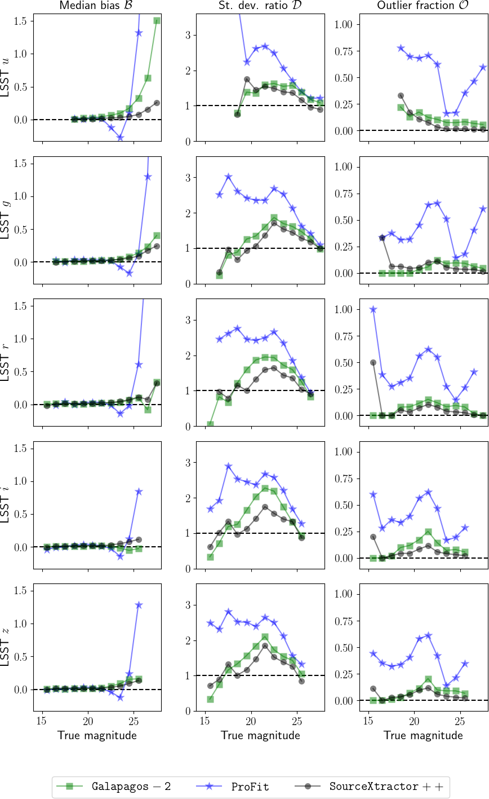
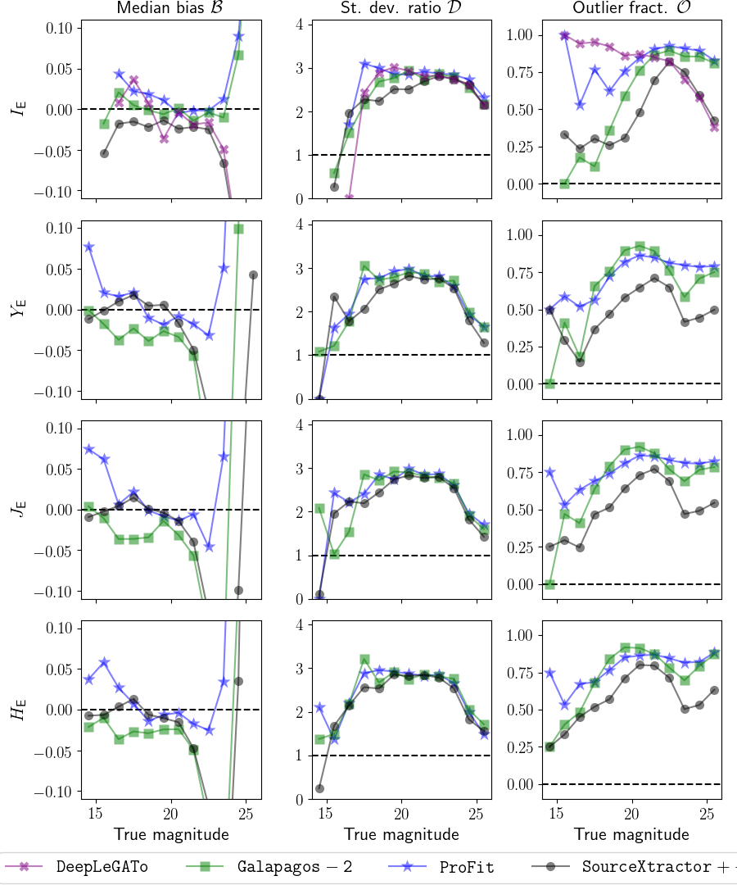
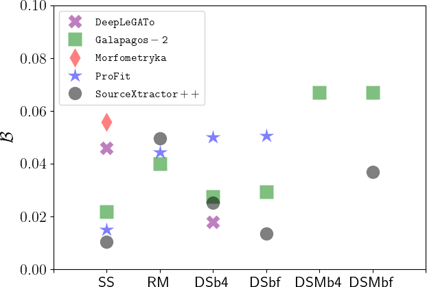
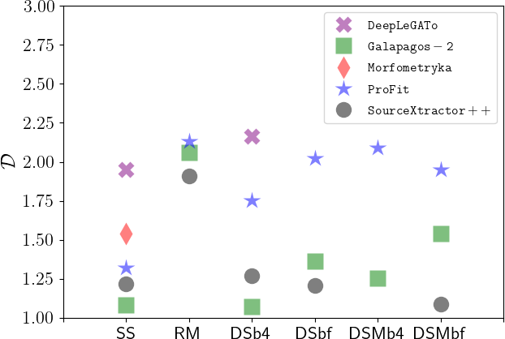
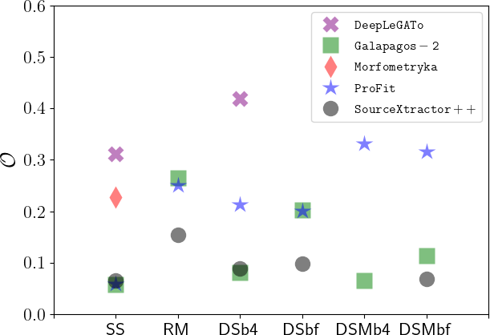

$\newcommand{\ensuremath}{}$
$\newcommand{\xspace}{}$
$\newcommand{\object}[1]{\texttt{#1}}$
$\newcommand{\farcs}{{.}''}$
$\newcommand{\farcm}{{.}'}$
$\newcommand{\arcsec}{''}$
$\newcommand{\arcmin}{'}$
$\newcommand{\ion}[2]{#1#2}$
$\newcommand{\textsc}[1]{\textrm{#1}}$
$\newcommand{\hl}[1]{\textrm{#1}}$
$\newcommand{\sersics}{Sérsic }$
$\newcommand{\bts}{{\rm b}/{\rm t} }$
$\newcommand{\bt}{{\rm b}/{\rm t}}$
$\newcommand{\btm}{{\rm b}/{\rm t}}$
$\newcommand{\sersic}{Sérsic}$

$\newcommand{\ensuremath}{}$
$\newcommand{\xspace}{}$
$\newcommand{\object}[1]{\texttt{#1}}$
$\newcommand{\farcs}{{.}''}$
$\newcommand{\farcm}{{.}'}$
$\newcommand{\arcsec}{''}$
$\newcommand{\arcmin}{'}$
$\newcommand{\ion}[2]{#1#2}$
$\newcommand{\textsc}[1]{\textrm{#1}}$
$\newcommand{\hl}[1]{\textrm{#1}}$
$\newcommand{\sersics}{Sérsic }$
$\newcommand{\bts}{{\rm b}/{\rm t} }$
$\newcommand{\bt}{{\rm b}/{\rm t}}$
$\newcommand{\btm}{{\rm b}/{\rm t}}$
$\newcommand{\sersic}{Sérsic}$

# \Euclid preparation. XXV. The \Euclid Morphology Challenge -- Towards model-fitting photometry for billions of galaxies

<mark>Appeared on: 2022-09-26</mark> - _29 pages, 33 figures. Euclid pre-launch key paper. Companion paper: Bretonniere et al. 2022_

Euclid Collaboration, et al. -- incl., <mark><mark>E. Franceschi</mark></mark>, <mark><mark>K. Jahnke</mark></mark>, <mark><mark>M. Schirmer</mark></mark>

**Abstract:** The European Space Agency's \Euclid mission will provide high-quality imaging for about $1.5$ billion galaxies. A software pipeline to automatically process and analyse such a huge amount of data in real time is being developed by the Science Ground Segment of the Euclid Consortium; this pipeline will include a model-fitting algorithm, which will provide photometric and morphological estimates of paramount importance for the core science goals of the mission and for legacy science.   The Euclid Morphology Challenge is a comparative investigation of the performance of five model-fitting software packages on simulated \Euclid data, aimed at providing the baseline to identify the best suited algorithm to be implemented in the pipeline. In this paper we describe the simulated data set, and we discuss the photometry results. A companion paper (Euclid Collaboration: Bretonnière et al. 2022) is focused on the structural and morphological estimates.   We created mock \Euclid images simulating five fields of view of 0.48 deg $^2$ each in the $I_{\scriptscriptstyle\rm E}$ band of the VIS instrument, containing a total of about one and a half million galaxies (of which 350 000 have nominal signal-to-noise ratio above $5$ ), each with three realisations of galaxy profiles (single and double \sersic , and `realistic' profiles obtained with a neural network); for one of the fields in the double \sersics realisation, we also simulated images for the three near-infrared $Y_{\scriptscriptstyle\rm E}$ , $J_{\scriptscriptstyle\rm E}$ and $H_{\scriptscriptstyle\rm E}$ bands of the NISP-P instrument, and five Rubin/LSST optical complementary bands ( $u$ , $g$ , $r$ , $i$ , and $z$ ), which together form a typical data set for a \Euclid observation. The images were simulated at the expected \Euclid Wide Survey depths. To analyse the results we created diagnostic plots and defined metrics to take into account the completeness of the provided catalogues, and the median biases, dispersions, and outlier fractions of their measured flux distributions.   Five model-fitting software packages ( \texttt{DeepLeGATo} , \texttt{Galapagos-2} , \texttt{Morfometryka} , \texttt{ProFit} , and \texttt{SourceXtractor++} ) were compared, all typically providing good results. Of the differences among them, some were  at least partly due to the distinct strategies adopted to perform the measurements. In the best case scenario, the median bias of the measured fluxes in the analytical profile realisations is below 1 \% at signal-to-noise ratio above 5 in $I_{\scriptscriptstyle\rm E}$ , and above 10 in all the other bands; the dispersion of the distribution is typically comparable to the theoretically expected one, with a small fraction of catastrophic outliers. However, we can expect that real observations will prove to be more demanding, since the results were found to be less accurate on the most realistic realisation.   We conclude that existing model-fitting software can provide accurate photometric measurements on \Euclid data sets. The results of the challenge are fully available and reproducible through an online plotting tool.

**Figure 6. -** Same as Fig. \ref{summ1}, for LSST bands. Top to bottom: $u$, $g$, $r$, $i$, $z$. Note the different $y$-- axis scales. (*summ2*)

**Figure 7. -** Trends for bulges only, in the multi-band DSb4 fit, for $I_{\scriptscriptstyle\rm E}$ and the NIR bands. Left to right: median bias $\mathcal{B}$; dispersion (standard deviation) $\mathcal{D}$; and fraction of outliers $\mathcal{O}$. Top to bottom: $I_{\scriptscriptstyle\rm E}$, $Y_{\scriptscriptstyle\rm E}$, $J_{\scriptscriptstyle\rm E}$, and $H_{\scriptscriptstyle\rm E}$. Each line and colour correspond to a different code as indicated in the legends; note the different $y$-axis scales. (*summ3a*)

**Figure 23. -** Visual summary of the diagnostic quantities: (left to right) absolute value of the median bias ($\mathcal{B}$), average ratio of $\sigma_{\rm meas}$ and $\sigma_{\rm true}$($\mathcal{D}$), and outlier fraction ($\mathcal{O}$). In the bias panel, the points corresponding to \texttt{ProFit} DS multi-band runs are not shown, being off the scale (their values are 0.49 and 0.44, respectively). See text for details. (*summaryb*)

