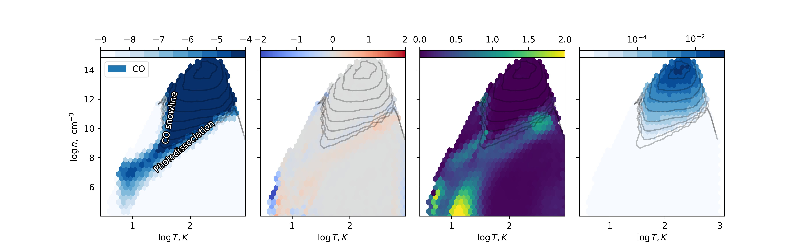
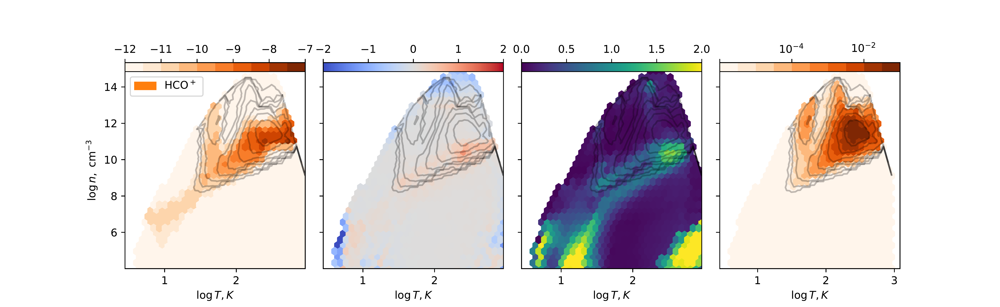
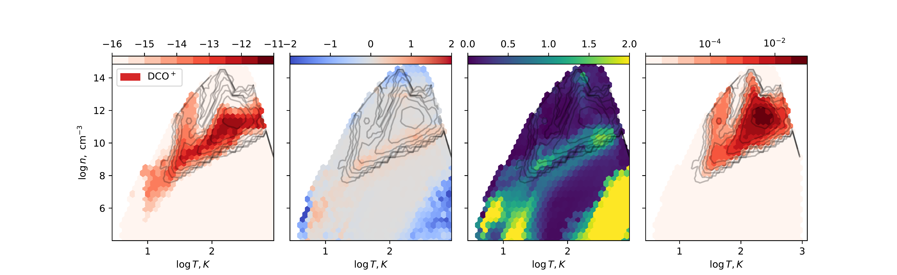
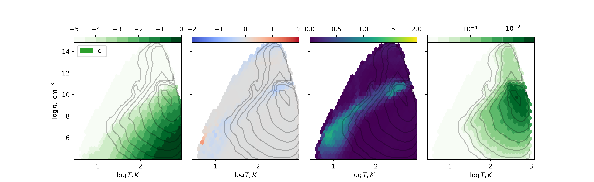
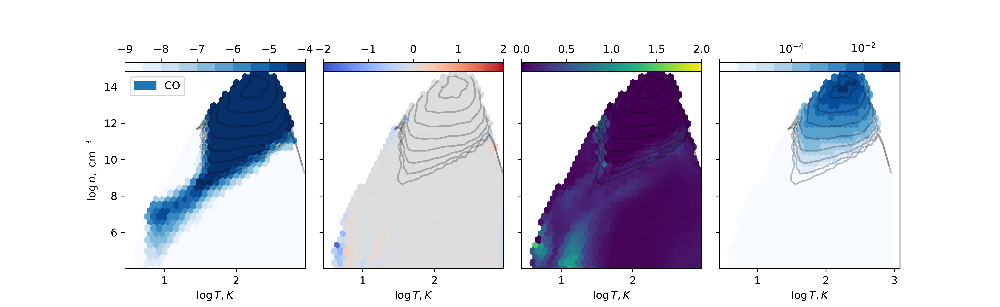
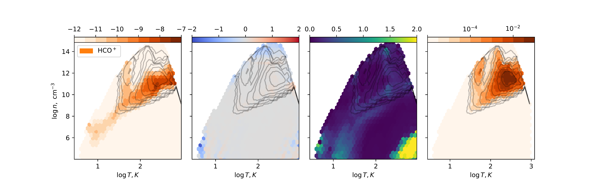
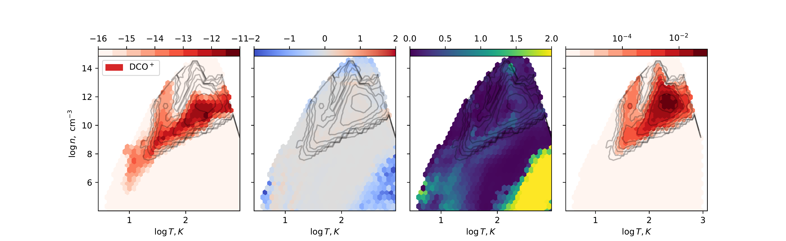

$\newcommand{\ensuremath}{}$
$\newcommand{\xspace}{}$
$\newcommand{\object}[1]{\texttt{#1}}$
$\newcommand{\farcs}{{.}''}$
$\newcommand{\farcm}{{.}'}$
$\newcommand{\arcsec}{''}$
$\newcommand{\arcmin}{'}$
$\newcommand{\ion}[2]{#1#2}$
$\newcommand{\textsc}[1]{\textrm{#1}}$
$\newcommand{\hl}[1]{\textrm{#1}}$
$\newcommand{\hcop}[0]{HCO^+}$
$\newcommand{\dcop}[0]{DCO^+}$
$\newcommand{\hncop}[0]{H^{13}CO^+}$
$\newcommand{\electr}[0]{e^-}$
$\newcommand{\co}[0]{CO}$
$\newcommand{\ico}[0]{^{13}CO}$
$\newcommand{\cio}[0]{C^{18}O}$

$\newcommand{\ensuremath}{}$
$\newcommand{\xspace}{}$
$\newcommand{\object}[1]{\texttt{#1}}$
$\newcommand{\farcs}{{.}''}$
$\newcommand{\farcm}{{.}'}$
$\newcommand{\arcsec}{''}$
$\newcommand{\arcmin}{'}$
$\newcommand{\ion}[2]{#1#2}$
$\newcommand{\textsc}[1]{\textrm{#1}}$
$\newcommand{\hl}[1]{\textrm{#1}}$
$\newcommand{\hcop}[0]{HCO^+}$
$\newcommand{\dcop}[0]{DCO^+}$
$\newcommand{\hncop}[0]{H^{13}CO^+}$
$\newcommand{\electr}[0]{e^-}$
$\newcommand{\co}[0]{CO}$
$\newcommand{\ico}[0]{^{13}CO}$
$\newcommand{\cio}[0]{C^{18}O}$

# Machine learning-accelerated chemistry modeling of protoplanetary disks

<mark>Appeared on: 2022-09-27</mark> - _11 pages, 5 figures_

Grigorii V. Smirnov-Pinchukov, et al. -- incl., <mark>Dmitry A. Semenov</mark>, <mark>Sierk van Terwisga</mark>

**Abstract:** Aims. With the large amount of molecular emission data from (sub)millimeterobservatories and incoming James Webb Space Telescope infrared spectroscopy,access to fast forward models of the chemical composition of protoplanetarydisks is of paramount importance.Methods. We used a thermo-chemical modeling code to generate a diversepopulation of protoplanetary disk models. We trained a K-nearest neighbors(KNN) regressor to instantly predict the chemistry of other disk models.Results. We show that it is possible to accurately reproduce chemistry usingjust a small subset of physical conditions, thanks to correlations between thelocal physical conditions in adopted protoplanetary disk models. We discuss theuncertainties and limitations of this method.Conclusions. The proposed method can be used for Bayesian fitting of the lineemission data to retrieve disk properties from observations. We present apipeline for reproducing the same approach on other disk chemical model sets.

**Figure 2. -** Performance of ML-accelerated chemistry predictions for CO. (a): mean $\log_{10}$ predicted relative abundance as a function of local temperature, gas density, and ionization rate. Darker areas correspond to larger relative (to H atoms) abundance. (b): median of the difference between the predicted values and test set data (bias, dex), in dex, as a function of temperature and density. Gray areas correspond to an unbiased fit. (c): the standard deviation between the predicted values and test set data, in dex (std, dex). (d): relative density (histogram) of species within the data points, with contours, which are also present on other panels. Various regions of the protoplanetary disk are described on panel (a). A detailed description of the processes leading to this figure is in the main text. Other molecules are shown in Fig. \ref{fig:ions}. (*fig:performance*)

**Figure 3. -** Performance of ML-accelerated chemistry predictions for $\hcop$ , $\dcop$ , and electrons. (*fig:ions*)

**Figure 4. -** Effect of adding UV radiation strength to the set of input features. The panels show the performance of ML-accelerated chemistry predictions, as in Fig. \ref{fig:performance}. Adding UV radiation strength increases the accuracy of the fit, but only slightly in the areas of the parameter space dominated by the selected molecules. Depending on the molecular species and constraints on calculation time, it is not necessary to use UV as a parameter. (*fig:ions4*)

