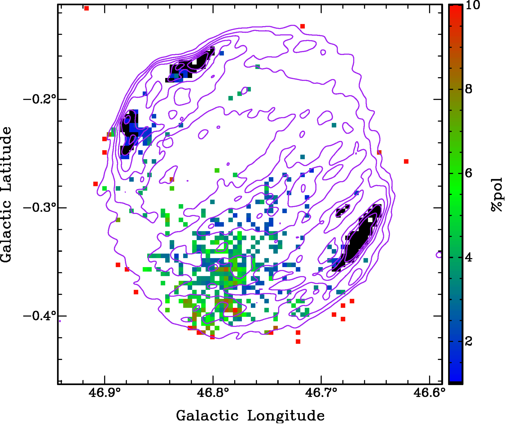
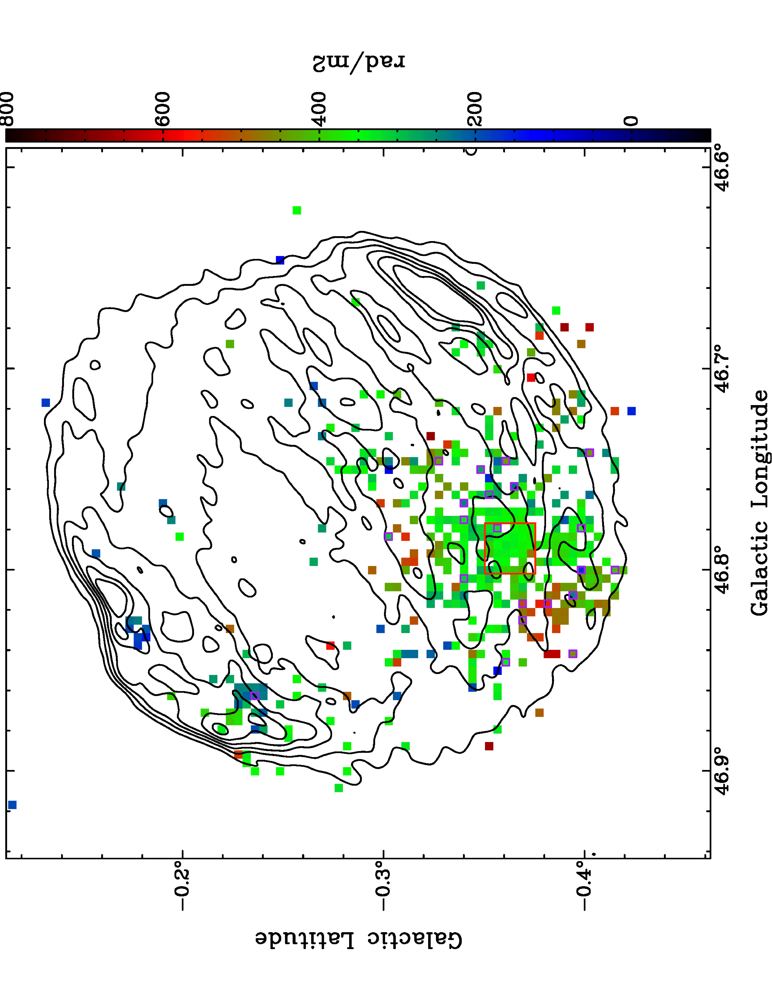

$\newcommand{\ensuremath}{}$
$\newcommand{\xspace}{}$
$\newcommand{\object}[1]{\texttt{#1}}$
$\newcommand{\farcs}{{.}''}$
$\newcommand{\farcm}{{.}'}$
$\newcommand{\arcsec}{''}$
$\newcommand{\arcmin}{'}$
$\newcommand{\ion}[2]{#1#2}$
$\newcommand{\textsc}[1]{\textrm{#1}}$
$\newcommand{\hl}[1]{\textrm{#1}}$
$\newcommand{\footnote}[1]{}$
$\newcommand{\vdag}{(v)^\dagger}$
$\newcommand$
$\newcommand$

$\newcommand{\ensuremath}{}$
$\newcommand{\xspace}{}$
$\newcommand{\object}[1]{\texttt{#1}}$
$\newcommand{\farcs}{{.}''}$
$\newcommand{\farcm}{{.}'}$
$\newcommand{\arcsec}{''}$
$\newcommand{\arcmin}{'}$
$\newcommand{\ion}[2]{#1#2}$
$\newcommand{\textsc}[1]{\textrm{#1}}$
$\newcommand{\hl}[1]{\textrm{#1}}$
$\newcommand{\footnote}[1]{}$
$\newcommand{\vdag}{(v)^\dagger}$
$\newcommand$
$\newcommand$

# Polarized Emission From Four Supernova Remnants In The THOR Survey

<mark>Appeared on: 2022-09-27</mark> - _Accepted for publication in the Astrophysical Journal. Figures 6, 19 and 20 may not be displayed in the browser pdf viewer, but the downloaded pdf is complete_

Russell Shanahan, et al. -- incl., <mark>Henrik Beuther</mark>, <mark>Jonas Syed</mark>

**Abstract:** We present polarization and Faraday rotation for the supernova remnants (SNRs) G46.8 $-$ 0.3, G43.3 $-$ 0.2, G41.1 $-$ 0.3, and G39.2 $-$ 0.3 in L-band (1-2 GHz) radio continuum in The HI/OH/Recombination line (THOR) survey.  We detect polarization from G46.8 $-$ 0.3, G43.3 $-$ 0.2 and G39.2 $-$ 0.3 but find upper limits at the 1 \% level of Stokes $I$ for G41.1 $-$ 0.3.  For G46.8 $-$ 0.3 and G39.2 $-$ 0.3 the fractional polarization varies on small scales from 1 \% to $\sim$ 6 \% .  G43.3 $-$ 0.2 is less polarized with fractional polarization $\lesssim$ 3 \% .  We find upper limits at the 1 \% level for the brighter regions in each SNR with no evidence for associated enhanced Faraday depolarization.  We observe significant variation in Faraday depth and fractional polarization on angular scales down to the resolution limit of 16 $\arcsec$ .  Approximately 6 \% of our polarization detections from G46.8 $-$ 0.3 and G39.2 $-$ 0.3 exhibit two-component Faraday rotation and 14 \% of polarization detections in G43.3 $-$ 0.2 are multi-component.  For G39.2 $-$ 0.3 we find a bimodal Faraday depth distribution with a narrow peak and a broad peak for all polarization detections as well as for the subset with two-component Faraday rotation.  We identify the narrow peak with the front side of the SNR and the broad peak with the back side.  Similarly, we interpret the observed Faraday depth distribution of G46.8 $-$ 0.3 as a superposition of the distributions from the front side and the back side.  We interpret our results as evidence for a partially filled shell with small-scale magnetic field structure and internal Faraday rotation.

**Figure 8. -** Grid plot of the Faraday depth spectra for the red box seen in Figure \ref{fig:G46.8-0.3_RM-Map}.  The horizontal limits are $-1500 \text{ rad m}^{-2} < \phi < 1500 \text{ rad m}^{-2}$ and vertical axis limits are $0 < P < 0.95$ mJy.  The grey region illustrates our Faraday depth rejection range.  The red horizontal line is our detection threshold where $P = 0.27$ mJy.  Colours indicate spectra where zero (black), one (blue) or two (purple) peaks satisfy our detection criteria (see Appendix \ref{appendix:DT}).  The coordinates of the bottom left and top right corners are $(\ell, b)=(46\fdg802, 0\fdg377)$ and $(\ell, b)=(46\fdg777, -0\fdg352)$.  The physical size of this region is $2.36$ pc on each side. (*fig:G46.8-0.3_RM_Grid2*)

**Figure 11. -** Fractional polarization map of SNR G46.8$-$0.3.  Contours are from the THOR+VGPS map at 14, 19, 24, 29, 34 and 39 mJy/beam.  The coloured subregions were calculated by $\Pi = P/(I - I_{\text{bg}})$ where $\Pi$ is the fractional polarization, $P$ is the peak from the Faraday depth spectrum, $I$ is the Stokes $I$ from the THOR+VGPS map and $I_{\text{bg}}$ is the average background Stokes $I$.  The black subregions are upper limits for regions where polarized signal is heavily affected by leakage.  The criteria for these subregions is that $\Pi_{\text{upper}} = P_{\text{limit}}/(I - I_{\text{bg}}) < 1\%$, where $P_{\text{limit}}$ is the maximum from the noise profiles. (*fig:G46.8-0.3_PP-Map*)

**Figure 6. -** Faraday depth map of SNR G46.8$-$0.3. The contour levels correspond to 14, 19, 24, 29, 34 and 39 mJy/beam. The subregions with a purple edge indicate the locations of two-component Faraday rotation.  The Faraday depth shown for subregions with two-component Faraday rotation is derived from the strongest peak.  The red box indicates the region where we present the individual Faraday depth spectra as a grid plot seen in Figure \ref{fig:G46.8-0.3_RM_Grid2}. (*fig:G46.8-0.3_RM-Map*)

