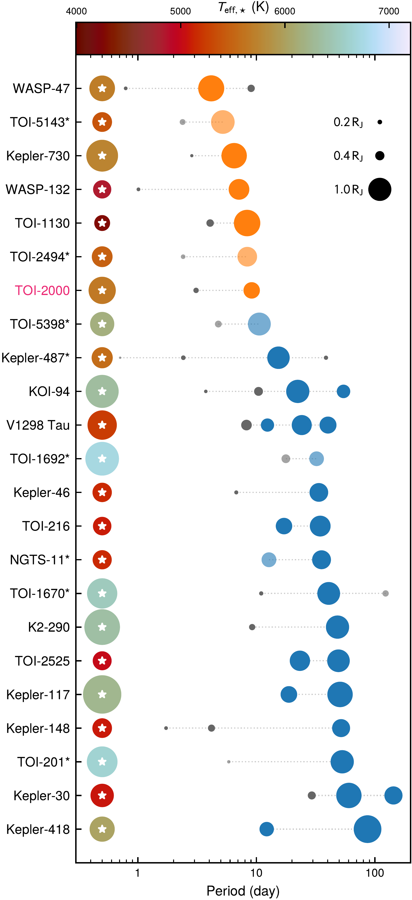

$\newcommand{\ensuremath}{}$
$\newcommand{\xspace}{}$
$\newcommand{\object}[1]{\texttt{#1}}$
$\newcommand{\farcs}{{.}''}$
$\newcommand{\farcm}{{.}'}$
$\newcommand{\arcsec}{''}$
$\newcommand{\arcmin}{'}$
$\newcommand{\ion}[2]{#1#2}$
$\newcommand{\textsc}[1]{\textrm{#1}}$
$\newcommand{\hl}[1]{\textrm{#1}}$
$\newcommand{\plusminus}[3]{#1^{+#2}_{-#3}}$
$\newcommand{\circa}{\ensuremath{{\sim}\mspace{2mu}}}$
$\newcommand{\ut}{\textsc{ut}}$
$\newcommand{\tablenotemark}[1]{\textsuperscript{\textit{#1}}}$
$\newcommand{\bjdtdb}{\ensuremath{\mathrm{BJD}_\text{TDB}}}$
$\newcommand{\feh}{\ensuremath{[\text{Fe}/\text{H}]}}$
$\newcommand{\logg}{\ensuremath{\log g}}$
$\newcommand{\tempeff}{\ensuremath{T_{\text{eff}}}}$
$\newcommand{\tempeq}{\ensuremath{T_{\text{eq}}}}$
$\newcommand{\vsini}{\ensuremath{v \sin i}}$
$\newcommand{\normaldist}{\mathcal{N}}$
$\newcommand{\uniformdist}{\mathcal{U}}$
$\newcommand{\gaiaG}{\ensuremath{G}}$
$\newcommand{\gaiaBP}{\ensuremath{G_\mathrm{BP}}}$
$\newcommand{\gaiaRP}{\ensuremath{G_\mathrm{RP}}}$
$\newcommand{\filterB}{\ensuremath{B}}$
$\newcommand{\filterIc}{\ensuremath{I_\mathrm{c}}}$
$\newcommand{\filterJ}{\ensuremath{J}}$
$\newcommand{\filterH}{\ensuremath{H}}$
$\newcommand{\filterK}{\ensuremath{K_\mathrm{s}}}$
$\newcommand{\filterR}{\ensuremath{R}}$
$\newcommand{\filterRc}{\ensuremath{R_\mathrm{c}}}$
$\newcommand{\filterV}{\ensuremath{V}}$
$\newcommand{\filterWone}{\ensuremath{W1}}$
$\newcommand{\filterWtwo}{\ensuremath{W2}}$
$\newcommand{\filterWthree}{\ensuremath{W3}}$
$\newcommand{\filterWfour}{\ensuremath{W4}}$
$\newcommand{\filtergp}{\ensuremath{g'}}$
$\newcommand{\filterip}{\ensuremath{i'}}$
$\newcommand{\filterrp}{\ensuremath{r'}}$
$\newcommand{\filterzs}{\ensuremath{z_\mathrm{s}}}$
$\newcommand{\ares}{\textsc{ares}}$
$\newcommand{\arviz}{\textsc{arviz}}$
$\newcommand{\astroimagej}{\textsc{AstroImageJ}}$
$\newcommand{\batman}{\textsc{batman}}$
$\newcommand{\celeritetwo}{\textsc{celerite2}}$
$\newcommand{\emcee}{\textsc{emcee}}$
$\newcommand{\exofast}{\textsc{exofast}}$
$\newcommand{\exoplanetpy}{\textsc{exoplanet}}$
$\newcommand{\isochrones}{\textsc{isochrones}}$
$\newcommand{\mist}{MIST}$
$\newcommand{\molusc}{\textsc{molusc}}$
$\newcommand{\moog}{\textsc{moog}}$
$\newcommand{\pymc}{\textsc{PyMC}}$
$\newcommand{\qlp}{\textsc{qlp}}$
$\newcommand{\radvel}{\textsc{radvel}}$
$\newcommand{\sklearn}{\textsc{Scikit-learn}}$
$\newcommand{\triceratops}{\textsc{triceratops}}$
$\newcommand{\vartools}{\textsc{Vartools}}$
$\newcommand{\planet}[2]{#1\thinspace #2}$
$\newcommand{\toitwothousand}{TOI-2000}$
$\newcommand{\toitwothousandtic}{371188886}$
$\newcommand{\planetinner}{\planet{\toitwothousand}{b}}$
$\newcommand{\planetouter}{\planet{\toitwothousand}{c}}$
$\newcommand{\waspfortyseven}{WASP-47}$
$\newcommand{\waspfortysevenhj}{\planet{\waspfortyseven}{b}}$
$\newcommand{\waspfortyseveninner}{\planet{\waspfortyseven}{e}}$
$\newcommand{\waspfortysevenneptune}{\planet{\waspfortyseven}{d}}$
$\newcommand{\keplerseventhirty}{Kepler-730}$
$\newcommand{\keplerseventhirtyhj}{\planet{Kepler-730}{b}}$
$\newcommand{\keplerseventhirtyinner}{\planet{Kepler-730}{c}}$
$\newcommand{\toieleventhirty}{TOI-1130}$
$\newcommand{\toieleventhirtyinner}{\planet{\toieleventhirty}{b}}$
$\newcommand{\toieleventhirtyhj}{\planet{\toieleventhirty}{c}}$
$\newcommand{\keplerthirty}{Kepler-30}$
$\newcommand{\keplerthirtyb}{\planet{\keplerthirty}{b}}$
$\newcommand{\keplereightynine}{KOI-94}$
$\newcommand{\keplereightynineb}{\planet{\keplereightynine}{b}}$
$\newcommand{\wasponethirtytwo}{WASP-132}$
$\newcommand{\wasponethirtytwohj}{\planet{WASP-132}{b}}$
$\newcommand{\wasponethirtytwoinner}{\planet{WASP-132}{c}}$
$\newcommand{\astep}{ASTEP}$
$\newcommand{\chiron}{CHI\-RON}$
$\newcommand{\edrthree}{EDR3}$
$\newcommand{\feros}{FEROS}$
$\newcommand{\gaia}{\emph{Gaia}}$
$\newcommand{\geminisouth}{Gemini South}$
$\newcommand{\harps}{HARPS}$
$\newcommand{\jwst}{\emph{JWST}}$
$\newcommand{\kepler}{\emph{Kepler}}$
$\newcommand{\ktwo}{\emph{K2}}$
$\newcommand{\lcogt}{LCOGT}$
$\newcommand{\pest}{PEST}$
$\newcommand{\soar}{SOAR}$
$\newcommand{\tess}{\emph{TESS}}$
$\newcommand{\twomass}{2MASS}$
$\newcommand{\wise}{\emph{WISE}}$
$\newcommand{\sysParamPeriodSubZero}{9.1270553}$
$\newcommand{\sysParamPeriodSubZeroUnc}{\pm 0.0000073}$
$\newcommand{\sysParamPeriodSubOne}{3.098331}$
$\newcommand{\sysParamPeriodSubOneUnc}{_{-0.000019}^{+0.000021}}$
$\newcommand{\sysParamTzeroSubZero}{2459110.06589}$
$\newcommand{\sysParamTzeroSubZeroUnc}{\pm 0.00027}$
$\newcommand{\sysParamTzeroSubOne}{2458901.7192}$
$\newcommand{\sysParamTzeroSubOneUnc}{_{-0.0020}^{+0.0021}}$
$\newcommand{\sysParamRpSubZero}{0.06564}$
$\newcommand{\sysParamRpSubZeroUnc}{\pm 0.00064}$
$\newcommand{\sysParamRpSubOne}{0.02178}$
$\newcommand{\sysParamRpSubOneUnc}{_{-0.00096}^{+0.00089}}$
$\newcommand{\sysParamBSubZero}{0.618}$
$\newcommand{\sysParamBSubZeroUnc}{_{-0.042}^{+0.037}}$
$\newcommand{\sysParamBSubOne}{0.763}$
$\newcommand{\sysParamBSubOneUnc}{_{-0.072}^{+0.033}}$
$\newcommand{\sysParamTdurSubZero}{3.90}$
$\newcommand{\sysParamTdurSubZeroUnc}{\pm 0.40}$
$\newcommand{\sysParamTdurSubOne}{1.957}$
$\newcommand{\sysParamTdurSubOneUnc}{_{-0.099}^{+0.208}}$
$\newcommand{\sysParamSqrtEccVecZeroSubZero}{-0.213}$
$\newcommand{\sysParamSqrtEccVecZeroSubZeroUnc}{_{-0.046}^{+0.060}}$
$\newcommand{\sysParamSqrtEccVecZeroSubOne}{-0.08}$
$\newcommand{\sysParamSqrtEccVecZeroSubOneUnc}{_{-0.11}^{+0.13}}$
$\newcommand{\sysParamEccSubZero}{0.064}$
$\newcommand{\sysParamEccSubZeroUnc}{_{-0.022}^{+0.023}}$
$\newcommand{\sysParamOmegaSubZero}{-2.43}$
$\newcommand{\sysParamOmegaSubZeroUnc}{_{-0.46}^{+5.19}}$
$\newcommand{\sysParamRPlanetEarthSubZero}{7.97}$
$\newcommand{\sysParamRPlanetEarthSubZeroUnc}{\pm 0.12}$
$\newcommand{\sysParamRPlanetEarthSubOne}{2.64}$
$\newcommand{\sysParamRPlanetEarthSubOneUnc}{_{-0.12}^{+0.11}}$
$\newcommand{\sysParamMPlanetEarthSubZero}{75.7}$
$\newcommand{\sysParamMPlanetEarthSubZeroUnc}{\pm 3.8}$
$\newcommand{\sysParamMPlanetEarthSubOne}{10.3}$
$\newcommand{\sysParamMPlanetEarthSubOneUnc}{\pm 2.2}$
$\newcommand{\sysParamMPlanetSubZero}{(2.27}$
$\newcommand{\sysParamMPlanetSubZeroUnc}{_{-0.12}^{+0.11}) \times 10^{-4}}$
$\newcommand{\sysParamMPlanetSubOne}{(3.09}$
$\newcommand{\sysParamMPlanetSubOneUnc}{_{-0.66}^{+0.67}) \times 10^{-5}}$
$\newcommand{\sysParamRhoPlanetSubZero}{0.822}$
$\newcommand{\sysParamRhoPlanetSubZeroUnc}{_{-0.056}^{+0.058}}$
$\newcommand{\sysParamRhoPlanetSubOne}{3.06}$
$\newcommand{\sysParamRhoPlanetSubOneUnc}{_{-0.72}^{+0.83}}$
$\newcommand{\sysParamKSubZero}{23.8}$
$\newcommand{\sysParamKSubZeroUnc}{\pm 1.1}$
$\newcommand{\sysParamKSubOne}{4.63}$
$\newcommand{\sysParamKSubOneUnc}{_{-0.99}^{+1.00}}$
$\newcommand{\sysParamASubZero}{0.0875}$
$\newcommand{\sysParamASubZeroUnc}{_{-0.0014}^{+0.0016}}$
$\newcommand{\sysParamASubOne}{0.04260}$
$\newcommand{\sysParamASubOneUnc}{_{-0.00067}^{+0.00076}}$
$\newcommand{\sysParamInclSubZero}{87.94}$
$\newcommand{\sysParamInclSubZeroUnc}{_{-0.11}^{+0.13}}$
$\newcommand{\sysParamInclSubOne}{84.73}$
$\newcommand{\sysParamInclSubOneUnc}{_{-0.33}^{+0.49}}$
$\newcommand{\sysParamAorSubZero}{16.92}$
$\newcommand{\sysParamAorSubZeroUnc}{_{-0.33}^{+0.37}}$
$\newcommand{\sysParamAorSubOne}{8.23}$
$\newcommand{\sysParamAorSubOneUnc}{_{-0.16}^{+0.18}}$
$\newcommand{\sysParamMStarZero}{1.074}$
$\newcommand{\sysParamMStarZeroUnc}{_{-0.050}^{+0.059}}$
$\newcommand{\sysParamFehZero}{0.414}$
$\newcommand{\sysParamFehZeroUnc}{_{-0.041}^{+0.040}}$
$\newcommand{\sysParamEep}{380}$
$\newcommand{\sysParamEepUnc}{_{-36}^{+25}}$
$\newcommand{\sysParamMStar}{1.074}$
$\newcommand{\sysParamMStarUnc}{_{-0.050}^{+0.059}}$
$\newcommand{\sysParamRStar}{1.113}$
$\newcommand{\sysParamRStarUnc}{\pm 0.011}$
$\newcommand{\sysParamRhoStar}{1.099}$
$\newcommand{\sysParamRhoStarUnc}{_{-0.063}^{+0.074}}$
$\newcommand{\sysParamLoggStar}{4.376}$
$\newcommand{\sysParamLoggStarUnc}{_{-0.023}^{+0.026}}$
$\newcommand{\sysParamTeff}{5607}$
$\newcommand{\sysParamTeffUnc}{_{-82}^{+86}}$
$\newcommand{\sysParamFeh}{0.438}$
$\newcommand{\sysParamFehUnc}{_{-0.042}^{+0.041}}$
$\newcommand{\sysParamAge}{5.1}$
$\newcommand{\sysParamAgeUnc}{\pm 2.7}$
$\newcommand{\sysParamParallax}{5.760}$
$\newcommand{\sysParamParallaxUnc}{\pm 0.010}$
$\newcommand{\sysParamAv}{0.156}$
$\newcommand{\sysParamAvUnc}{_{-0.072}^{+0.074}}$
$\newcommand{\sysParamMagBol}{4.634}$
$\newcommand{\sysParamMagBolUnc}{_{-0.054}^{+0.052}}$
$\newcommand{\sysParamLStar}{1.103}$
$\newcommand{\sysParamLStarUnc}{_{-0.051}^{+0.056}}$
$\newcommand{\sysParamDistance}{173.60}$
$\newcommand{\sysParamDistanceUnc}{\pm 0.31}$
$\newcommand{\sysParamSedUncScale}{1.30}$
$\newcommand{\sysParamSedUncScaleUnc}{_{-0.22}^{+0.41}}$
$\newcommand{\sysParamIrradiationSubZero}{(1.961}$
$\newcommand{\sysParamIrradiationSubZeroUnc}{_{-0.094}^{+0.101}) \times 10^{8}}$
$\newcommand{\sysParamIrradiationSubOne}{(8.26}$
$\newcommand{\sysParamIrradiationSubOneUnc}{_{-0.40}^{+0.43}) \times 10^{8}}$
$\newcommand{\sysParamUTessSubZero}{0.124}$
$\newcommand{\sysParamUTessSubZeroUnc}{_{-0.090}^{+0.163}}$
$\newcommand{\sysParamUTessSubOne}{0.34}$
$\newcommand{\sysParamUTessSubOneUnc}{_{-0.23}^{+0.16}}$
$\newcommand{\sysParamURcSubZero}{0.88}$
$\newcommand{\sysParamURcSubZeroUnc}{_{-0.28}^{+0.21}}$
$\newcommand{\sysParamURcSubOne}{-0.28}$
$\newcommand{\sysParamURcSubOneUnc}{_{-0.20}^{+0.33}}$
$\newcommand{\sysParamUZsSubZero}{0.42}$
$\newcommand{\sysParamUZsSubZeroUnc}{_{-0.28}^{+0.34}}$
$\newcommand{\sysParamUZsSubOne}{0.01}$
$\newcommand{\sysParamUZsSubOneUnc}{_{-0.27}^{+0.32}}$
$\newcommand{\sysParamMeanFluxZero}{(-1.3}$
$\newcommand{\sysParamMeanFluxZeroUnc}{\pm 1.2) \times 10^{-5}}$
$\newcommand{\sysParamMeanFluxOne}{(1.5}$
$\newcommand{\sysParamMeanFluxOneUnc}{\pm 1.2) \times 10^{-5}}$
$\newcommand{\sysParamLcJitterSubZero}{(9.2}$
$\newcommand{\sysParamLcJitterSubZeroUnc}{_{-4.2}^{+3.1}) \times 10^{-5}}$
$\newcommand{\sysParamLcJitterSubOne}{(2.08}$
$\newcommand{\sysParamLcJitterSubOneUnc}{_{-1.15}^{+0.86}) \times 10^{-4}}$
$\newcommand{\sysParamLcJitterSubTwo}{(1.26}$
$\newcommand{\sysParamLcJitterSubTwoUnc}{_{-0.88}^{+1.24}) \times 10^{-4}}$
$\newcommand{\sysParamLcJitterSubThree}{0.00124}$
$\newcommand{\sysParamLcJitterSubThreeUnc}{\pm 0.00014}$
$\newcommand{\sysParamRvGammaSubZero}{6648.3}$
$\newcommand{\sysParamRvGammaSubZeroUnc}{_{-13.1}^{+9.5}}$
$\newcommand{\sysParamRvGammaSubOne}{8114}$
$\newcommand{\sysParamRvGammaSubOneUnc}{_{-14}^{+11}}$
$\newcommand{\sysParamRvGammaSubTwo}{8118.5}$
$\newcommand{\sysParamRvGammaSubTwoUnc}{_{-12.7}^{+8.9}}$
$\newcommand{\sysParamRvJitterSubZero}{3.2}$
$\newcommand{\sysParamRvJitterSubZeroUnc}{_{-2.2}^{+3.1}}$
$\newcommand{\sysParamRvJitterSubOne}{14.1}$
$\newcommand{\sysParamRvJitterSubOneUnc}{_{-3.4}^{+4.4}}$
$\newcommand{\sysParamRvJitterSubTwo}{3.16}$
$\newcommand{\sysParamRvJitterSubTwoUnc}{_{-0.78}^{+0.83}}$
$\newcommand{\sysParamGpSigma}{22.0}$
$\newcommand{\sysParamGpSigmaUnc}{_{-7.9}^{+14.6}}$
$\newcommand{\sysParamGpRho}{118}$
$\newcommand{\sysParamGpRhoUnc}{_{-40}^{+54}}$
$\newcommand{\sysParamGpTau}{33}$
$\newcommand{\sysParamGpTauUnc}{_{-28}^{+94}}$
$\newcommand{\sysParamRPlanetJupiterSubZero}{0.711}$
$\newcommand{\sysParamRPlanetJupiterSubZeroUnc}{\pm 0.011}$
$\newcommand{\sysParamRPlanetJupiterSubOne}{0.236}$
$\newcommand{\sysParamRPlanetJupiterSubOneUnc}{_{-0.011}^{+0.010}}$
$\newcommand{\sysParamMPlanetJupiterSubZero}{0.238}$
$\newcommand{\sysParamMPlanetJupiterSubZeroUnc}{\pm 0.012}$
$\newcommand{\sysParamMPlanetJupiterSubOne}{0.0324}$
$\newcommand{\sysParamMPlanetJupiterSubOneUnc}{\pm 0.0070}$
$\newcommand{\sysParamTempEqSubZero}{1029}$
$\newcommand{\sysParamTempEqSubZeroUnc}{_{-111}^{+84}}$
$\newcommand{\sysParamTempEqSubOne}{1475}$
$\newcommand{\sysParamTempEqSubOneUnc}{_{-158}^{+120}}$
$\newcommand{\sysParamOmegaFoldSubZero}{200}$
$\newcommand{\sysParamOmegaFoldSubZeroUnc}{_{-34}^{+27}}$
$\newcommand{\arraystretch}{1.25}$
$\newcommand{\arraystretch}{1.25}$
$\newcommand{\arraystretch}{1.25}$
$\newcommand{\arraystretch}{1.25}$
$\newcommand{\arraystretch}{1.05}$

$\newcommand{$\ensuremath$}{}$
$\newcommand{$\xspace$}{}$
$\newcommand{$\object$}[1]{\texttt{#1}}$
$\newcommand{$\farcs$}{{.}''}$
$\newcommand{$\farcm$}{{.}'}$
$\newcommand{$\arcsec$}{''}$
$\newcommand{$\arcmin$}{'}$
$\newcommand{$\ion$}[2]{#1#2}$
$\newcommand{$\textsc$}[1]{\textrm{#1}}$
$\newcommand{$\hl$}[1]{\textrm{#1}}$
$\newcommand{$\plusminus$}[3]{#1^{+#2}_{-#3}}$
$\newcommand{$\circa$}{$\ensuremath${{\sim}\mspace{2mu}}}$
$\newcommand{$\ut$}{$\textsc${ut}}$
$\newcommand{$\tablenotemark$}[1]{\textsuperscript{\textit{#1}}}$
$\newcommand{$\bjdtdb$}{$\ensuremath${\mathrm{BJD}_\text{TDB}}}$
$\newcommand{$\feh$}{$\ensuremath${[\text{Fe}/\text{H}]}}$
$\newcommand{$\logg$}{$\ensuremath${\log g}}$
$\newcommand{$\tempeff$}{$\ensuremath${T_{\text{eff}}}}$
$\newcommand{$\tempeq$}{$\ensuremath${T_{\text{eq}}}}$
$\newcommand{$\vsini$}{$\ensuremath${v \sin i}}$
$\newcommand{$\normaldist$}{\mathcal{N}}$
$\newcommand{$\uniformdist$}{\mathcal{U}}$
$\newcommand{$\gaiaG$}{$\ensuremath${G}}$
$\newcommand{$\gaiaBP$}{$\ensuremath${G_\mathrm{BP}}}$
$\newcommand{$\gaiaRP$}{$\ensuremath${G_\mathrm{RP}}}$
$\newcommand{$\filterB$}{$\ensuremath${B}}$
$\newcommand{$\filterIc$}{$\ensuremath${I_\mathrm{c}}}$
$\newcommand{$\filterJ$}{$\ensuremath${J}}$
$\newcommand{$\filterH$}{$\ensuremath${H}}$
$\newcommand{$\filterK$}{$\ensuremath${K_\mathrm{s}}}$
$\newcommand{$\filterR$}{$\ensuremath${R}}$
$\newcommand{$\filterR$c}{$\ensuremath${R_\mathrm{c}}}$
$\newcommand{$\filterV$}{$\ensuremath${V}}$
$\newcommand{$\filterWone$}{$\ensuremath${W1}}$
$\newcommand{$\filterWtwo$}{$\ensuremath${W2}}$
$\newcommand{$\filterWthree$}{$\ensuremath${W3}}$
$\newcommand{$\filterWfour$}{$\ensuremath${W4}}$
$\newcommand{$\filtergp$}{$\ensuremath${g'}}$
$\newcommand{$\filterip$}{$\ensuremath${i'}}$
$\newcommand{$\filterrp$}{$\ensuremath${r'}}$
$\newcommand{$\filterzs$}{$\ensuremath${z_\mathrm{s}}}$
$\newcommand{$\ares$}{$\textsc${ares}}$
$\newcommand{$\arviz$}{$\textsc${arviz}}$
$\newcommand{$\astroimagej$}{$\textsc${AstroImageJ}}$
$\newcommand{$\batman$}{$\textsc${batman}}$
$\newcommand{$\celeritetwo$}{$\textsc${celerite2}}$
$\newcommand{$\emcee$}{$\textsc${emcee}}$
$\newcommand{$\exofast$}{$\textsc${exofast}}$
$\newcommand{$\exoplanetpy$}{$\textsc${exoplanet}}$
$\newcommand{$\isochrones$}{$\textsc${isochrones}}$
$\newcommand{$\mist$}{MIST}$
$\newcommand{$\molusc$}{$\textsc${molusc}}$
$\newcommand{$\moog$}{$\textsc${moog}}$
$\newcommand{$\pymc$}{$\textsc${PyMC}}$
$\newcommand{$\qlp$}{$\textsc${qlp}}$
$\newcommand{$\radvel$}{$\textsc${radvel}}$
$\newcommand{$\sklearn$}{$\textsc${Scikit-learn}}$
$\newcommand{$\triceratops$}{$\textsc${triceratops}}$
$\newcommand{$\vartools$}{$\textsc${Vartools}}$
$\newcommand{$\planet$}[2]{#1\thinspace #2}$
$\newcommand{$\toitwothousand$}{TOI-2000}$
$\newcommand{$\toitwothousand$tic}{371188886}$
$\newcommand{$\planet$inner}{$\planet${$\toitwothousand$}{b}}$
$\newcommand{$\planet$outer}{$\planet${$\toitwothousand$}{c}}$
$\newcommand{$\waspfortyseven$}{WASP-47}$
$\newcommand{$\waspfortyseven$hj}{$\planet${$\waspfortyseven$}{b}}$
$\newcommand{$\waspfortyseven$inner}{$\planet${$\waspfortyseven$}{e}}$
$\newcommand{$\waspfortyseven$neptune}{$\planet${$\waspfortyseven$}{d}}$
$\newcommand{$\keplerseventhirty$}{Kepler-730}$
$\newcommand{$\keplerseventhirty$hj}{$\planet${Kepler-730}{b}}$
$\newcommand{$\keplerseventhirty$inner}{$\planet${Kepler-730}{c}}$
$\newcommand{$\toieleventhirty$}{TOI-1130}$
$\newcommand{$\toieleventhirty$inner}{$\planet${$\toieleventhirty$}{b}}$
$\newcommand{$\toieleventhirty$hj}{$\planet${$\toieleventhirty$}{c}}$
$\newcommand{$\keplerthirty$}{Kepler-30}$
$\newcommand{$\keplerthirty$b}{$\planet${$\keplerthirty$}{b}}$
$\newcommand{$\keplereightynine$}{KOI-94}$
$\newcommand{$\keplereightynine$b}{$\planet${$\keplereightynine$}{b}}$
$\newcommand{$\wasponethirtytwo$}{WASP-132}$
$\newcommand{$\wasponethirtytwo$hj}{$\planet${WASP-132}{b}}$
$\newcommand{$\wasponethirtytwo$inner}{$\planet${WASP-132}{c}}$
$\newcommand{$\astep$}{ASTEP}$
$\newcommand{$\chiron$}{CHI\-RON}$
$\newcommand{$\edrthree$}{EDR3}$
$\newcommand{$\feros$}{FEROS}$
$\newcommand{$\gaia$}{\emph{Gaia}}$
$\newcommand{$\geminisouth$}{Gemini South}$
$\newcommand{$\harps$}{HARPS}$
$\newcommand{$\jwst$}{\emph{JWST}}$
$\newcommand{$\kepler$}{\emph{Kepler}}$
$\newcommand{$\ktwo$}{\emph{K2}}$
$\newcommand{$\lcogt$}{LCOGT}$
$\newcommand{$\pest$}{PEST}$
$\newcommand{$\soar$}{SOAR}$
$\newcommand{$\tess$}{\emph{TESS}}$
$\newcommand{$\twomass$}{2MASS}$
$\newcommand{$\wise$}{\emph{WISE}}$
$\newcommand{$\sysParamPeriodSubZero$}{9.1270553}$
$\newcommand{$\sysParamPeriodSubZero$Unc}{\pm 0.0000073}$
$\newcommand{$\sysParamPeriodSubOne$}{3.098331}$
$\newcommand{$\sysParamPeriodSubOne$Unc}{_{-0.000019}^{+0.000021}}$
$\newcommand{$\sysParamTzeroSubZero$}{2459110.06589}$
$\newcommand{$\sysParamTzeroSubZero$Unc}{\pm 0.00027}$
$\newcommand{$\sysParamTzeroSubOne$}{2458901.7192}$
$\newcommand{$\sysParamTzeroSubOne$Unc}{_{-0.0020}^{+0.0021}}$
$\newcommand{$\sysParamRpSubZero$}{0.06564}$
$\newcommand{$\sysParamRpSubZero$Unc}{\pm 0.00064}$
$\newcommand{$\sysParamRpSubOne$}{0.02178}$
$\newcommand{$\sysParamRpSubOne$Unc}{_{-0.00096}^{+0.00089}}$
$\newcommand{$\sysParamBSubZero$}{0.618}$
$\newcommand{$\sysParamBSubZero$Unc}{_{-0.042}^{+0.037}}$
$\newcommand{$\sysParamBSubOne$}{0.763}$
$\newcommand{$\sysParamBSubOne$Unc}{_{-0.072}^{+0.033}}$
$\newcommand{$\sysParamTdurSubZero$}{3.90}$
$\newcommand{$\sysParamTdurSubZero$Unc}{\pm 0.40}$
$\newcommand{$\sysParamTdurSubOne$}{1.957}$
$\newcommand{$\sysParamTdurSubOne$Unc}{_{-0.099}^{+0.208}}$
$\newcommand{$\sysParamSqrtEccVecZeroSubZero$}{-0.213}$
$\newcommand{$\sysParamSqrtEccVecZeroSubZero$Unc}{_{-0.046}^{+0.060}}$
$\newcommand{$\sysParamSqrtEccVecZeroSubOne$}{-0.08}$
$\newcommand{$\sysParamSqrtEccVecZeroSubOne$Unc}{_{-0.11}^{+0.13}}$
$\newcommand{$\sysParamEccSubZero$}{0.064}$
$\newcommand{$\sysParamEccSubZero$Unc}{_{-0.022}^{+0.023}}$
$\newcommand{$\sysParamOmegaSubZero$}{-2.43}$
$\newcommand{$\sysParamOmegaSubZero$Unc}{_{-0.46}^{+5.19}}$
$\newcommand{$\sysParamRPlanetEarthSubZero$}{7.97}$
$\newcommand{$\sysParamRPlanetEarthSubZero$Unc}{\pm 0.12}$
$\newcommand{$\sysParamRPlanetEarthSubOne$}{2.64}$
$\newcommand{$\sysParamRPlanetEarthSubOne$Unc}{_{-0.12}^{+0.11}}$
$\newcommand{$\sysParamMPlanetEarthSubZero$}{75.7}$
$\newcommand{$\sysParamMPlanetEarthSubZero$Unc}{\pm 3.8}$
$\newcommand{$\sysParamMPlanetEarthSubOne$}{10.3}$
$\newcommand{$\sysParamMPlanetEarthSubOne$Unc}{\pm 2.2}$
$\newcommand{$\sysParamMPlanetSubZero$}{(2.27}$
$\newcommand{$\sysParamMPlanetSubZero$Unc}{_{-0.12}^{+0.11}) \times 10^{-4}}$
$\newcommand{$\sysParamMPlanetSubOne$}{(3.09}$
$\newcommand{$\sysParamMPlanetSubOne$Unc}{_{-0.66}^{+0.67}) \times 10^{-5}}$
$\newcommand{$\sysParamRhoPlanetSubZero$}{0.822}$
$\newcommand{$\sysParamRhoPlanetSubZero$Unc}{_{-0.056}^{+0.058}}$
$\newcommand{$\sysParamRhoPlanetSubOne$}{3.06}$
$\newcommand{$\sysParamRhoPlanetSubOne$Unc}{_{-0.72}^{+0.83}}$
$\newcommand{$\sysParamKSubZero$}{23.8}$
$\newcommand{$\sysParamKSubZero$Unc}{\pm 1.1}$
$\newcommand{$\sysParamKSubOne$}{4.63}$
$\newcommand{$\sysParamKSubOne$Unc}{_{-0.99}^{+1.00}}$
$\newcommand{$\sysParamASubZero$}{0.0875}$
$\newcommand{$\sysParamASubZero$Unc}{_{-0.0014}^{+0.0016}}$
$\newcommand{$\sysParamASubOne$}{0.04260}$
$\newcommand{$\sysParamASubOne$Unc}{_{-0.00067}^{+0.00076}}$
$\newcommand{$\sysParamInclSubZero$}{87.94}$
$\newcommand{$\sysParamInclSubZero$Unc}{_{-0.11}^{+0.13}}$
$\newcommand{$\sysParamInclSubOne$}{84.73}$
$\newcommand{$\sysParamInclSubOne$Unc}{_{-0.33}^{+0.49}}$
$\newcommand{$\sysParamAorSubZero$}{16.92}$
$\newcommand{$\sysParamAorSubZero$Unc}{_{-0.33}^{+0.37}}$
$\newcommand{$\sysParamAorSubOne$}{8.23}$
$\newcommand{$\sysParamAorSubOne$Unc}{_{-0.16}^{+0.18}}$
$\newcommand{$\sysParamMStarZero$}{1.074}$
$\newcommand{$\sysParamMStarZero$Unc}{_{-0.050}^{+0.059}}$
$\newcommand{$\sysParamFehZero$}{0.414}$
$\newcommand{$\sysParamFehZero$Unc}{_{-0.041}^{+0.040}}$
$\newcommand{$\sysParamEep$}{380}$
$\newcommand{$\sysParamEep$Unc}{_{-36}^{+25}}$
$\newcommand{$\sysParamMStar$}{1.074}$
$\newcommand{$\sysParamMStar$Unc}{_{-0.050}^{+0.059}}$
$\newcommand{$\sysParamRStar$}{1.113}$
$\newcommand{$\sysParamRStar$Unc}{\pm 0.011}$
$\newcommand{$\sysParamRhoStar$}{1.099}$
$\newcommand{$\sysParamRhoStar$Unc}{_{-0.063}^{+0.074}}$
$\newcommand{$\sysParamLoggStar$}{4.376}$
$\newcommand{$\sysParamLoggStar$Unc}{_{-0.023}^{+0.026}}$
$\newcommand{$\sysParamTeff$}{5607}$
$\newcommand{$\sysParamTeff$Unc}{_{-82}^{+86}}$
$\newcommand{$\sysParamFeh$}{0.438}$
$\newcommand{$\sysParamFeh$Unc}{_{-0.042}^{+0.041}}$
$\newcommand{$\sysParamAge$}{5.1}$
$\newcommand{$\sysParamAge$Unc}{\pm 2.7}$
$\newcommand{$\sysParamParallax$}{5.760}$
$\newcommand{$\sysParamParallax$Unc}{\pm 0.010}$
$\newcommand{$\sysParamAv$}{0.156}$
$\newcommand{$\sysParamAv$Unc}{_{-0.072}^{+0.074}}$
$\newcommand{$\sysParamMagBol$}{4.634}$
$\newcommand{$\sysParamMagBol$Unc}{_{-0.054}^{+0.052}}$
$\newcommand{$\sysParamLStar$}{1.103}$
$\newcommand{$\sysParamLStar$Unc}{_{-0.051}^{+0.056}}$
$\newcommand{$\sysParamDistance$}{173.60}$
$\newcommand{$\sysParamDistance$Unc}{\pm 0.31}$
$\newcommand{$\sysParamSedUncScale$}{1.30}$
$\newcommand{$\sysParamSedUncScale$Unc}{_{-0.22}^{+0.41}}$
$\newcommand{$\sysParamIrradiationSubZero$}{(1.961}$
$\newcommand{$\sysParamIrradiationSubZero$Unc}{_{-0.094}^{+0.101}) \times 10^{8}}$
$\newcommand{$\sysParamIrradiationSubOne$}{(8.26}$
$\newcommand{$\sysParamIrradiationSubOne$Unc}{_{-0.40}^{+0.43}) \times 10^{8}}$
$\newcommand{$\sysParamUTessSubZero$}{0.124}$
$\newcommand{$\sysParamUTessSubZero$Unc}{_{-0.090}^{+0.163}}$
$\newcommand{$\sysParamUTessSubOne$}{0.34}$
$\newcommand{$\sysParamUTessSubOne$Unc}{_{-0.23}^{+0.16}}$
$\newcommand{$\sysParamURcSubZero$}{0.88}$
$\newcommand{$\sysParamURcSubZero$Unc}{_{-0.28}^{+0.21}}$
$\newcommand{$\sysParamURcSubOne$}{-0.28}$
$\newcommand{$\sysParamURcSubOne$Unc}{_{-0.20}^{+0.33}}$
$\newcommand{$\sysParamUZsSubZero$}{0.42}$
$\newcommand{$\sysParamUZsSubZero$Unc}{_{-0.28}^{+0.34}}$
$\newcommand{$\sysParamUZsSubOne$}{0.01}$
$\newcommand{$\sysParamUZsSubOne$Unc}{_{-0.27}^{+0.32}}$
$\newcommand{$\sysParamMeanFluxZero$}{(-1.3}$
$\newcommand{$\sysParamMeanFluxZero$Unc}{\pm 1.2) \times 10^{-5}}$
$\newcommand{$\sysParamMeanFluxOne$}{(1.5}$
$\newcommand{$\sysParamMeanFluxOne$Unc}{\pm 1.2) \times 10^{-5}}$
$\newcommand{$\sysParamLcJitterSubZero$}{(9.2}$
$\newcommand{$\sysParamLcJitterSubZero$Unc}{_{-4.2}^{+3.1}) \times 10^{-5}}$
$\newcommand{$\sysParamLcJitterSubOne$}{(2.08}$
$\newcommand{$\sysParamLcJitterSubOne$Unc}{_{-1.15}^{+0.86}) \times 10^{-4}}$
$\newcommand{$\sysParamLcJitterSubTwo$}{(1.26}$
$\newcommand{$\sysParamLcJitterSubTwo$Unc}{_{-0.88}^{+1.24}) \times 10^{-4}}$
$\newcommand{$\sysParamLcJitterSubThree$}{0.00124}$
$\newcommand{$\sysParamLcJitterSubThree$Unc}{\pm 0.00014}$
$\newcommand{$\sysParamRvGammaSubZero$}{6648.3}$
$\newcommand{$\sysParamRvGammaSubZero$Unc}{_{-13.1}^{+9.5}}$
$\newcommand{$\sysParamRvGammaSubOne$}{8114}$
$\newcommand{$\sysParamRvGammaSubOne$Unc}{_{-14}^{+11}}$
$\newcommand{$\sysParamRvGammaSubTwo$}{8118.5}$
$\newcommand{$\sysParamRvGammaSubTwo$Unc}{_{-12.7}^{+8.9}}$
$\newcommand{$\sysParamRvJitterSubZero$}{3.2}$
$\newcommand{$\sysParamRvJitterSubZero$Unc}{_{-2.2}^{+3.1}}$
$\newcommand{$\sysParamRvJitterSubOne$}{14.1}$
$\newcommand{$\sysParamRvJitterSubOne$Unc}{_{-3.4}^{+4.4}}$
$\newcommand{$\sysParamRvJitterSubTwo$}{3.16}$
$\newcommand{$\sysParamRvJitterSubTwo$Unc}{_{-0.78}^{+0.83}}$
$\newcommand{$\sysParamGpSigma$}{22.0}$
$\newcommand{$\sysParamGpSigma$Unc}{_{-7.9}^{+14.6}}$
$\newcommand{$\sysParamGpRho$}{118}$
$\newcommand{$\sysParamGpRho$Unc}{_{-40}^{+54}}$
$\newcommand{$\sysParamGpTau$}{33}$
$\newcommand{$\sysParamGpTau$Unc}{_{-28}^{+94}}$
$\newcommand{$\sysParamRPlanetJupiterSubZero$}{0.711}$
$\newcommand{$\sysParamRPlanetJupiterSubZero$Unc}{\pm 0.011}$
$\newcommand{$\sysParamRPlanetJupiterSubOne$}{0.236}$
$\newcommand{$\sysParamRPlanetJupiterSubOne$Unc}{_{-0.011}^{+0.010}}$
$\newcommand{$\sysParamMPlanetJupiterSubZero$}{0.238}$
$\newcommand{$\sysParamMPlanetJupiterSubZero$Unc}{\pm 0.012}$
$\newcommand{$\sysParamMPlanetJupiterSubOne$}{0.0324}$
$\newcommand{$\sysParamMPlanetJupiterSubOne$Unc}{\pm 0.0070}$
$\newcommand{$\sysParamTempEqSubZero$}{1029}$
$\newcommand{$\sysParamTempEqSubZero$Unc}{_{-111}^{+84}}$
$\newcommand{$\sysParamTempEqSubOne$}{1475}$
$\newcommand{$\sysParamTempEqSubOne$Unc}{_{-158}^{+120}}$
$\newcommand{$\sysParamOmegaFoldSubZero$}{200}$
$\newcommand{$\sysParamOmegaFoldSubZero$Unc}{_{-34}^{+27}}$
$\newcommand{$\arraystretch$}{1.25}$
$\newcommand{$\arraystretch$}{1.25}$
$\newcommand{$\arraystretch$}{1.25}$
$\newcommand{$\arraystretch$}{1.25}$
$\newcommand{$\arraystretch$}{1.05}$

#  spots a mini-neptune interior to a hot saturn in the TOI-2000 system

<mark>Appeared on: 2022-09-30</mark> - _20 pages, 7 figures, 13 tables; submitted to MNRAS; CSV tables available as ancillary files; posterior samples available from Zenodo at this https URL_

<mark><mark>Lizhou Sha</mark></mark>, et al. -- incl., <mark><mark>Melissa J. Hobson</mark></mark>, <mark><mark>Carl Ziegler</mark></mark>, <mark><mark>Pascal Torres-Miranda</mark></mark>, <mark><mark>Trifon Trifonov</mark></mark>, <mark><mark>Colin Littlefield</mark></mark>, <mark><mark>Jan Eberhardt</mark></mark>, <mark><mark>Richard P. Schwarz</mark></mark>, <mark><mark>Thomas Henning</mark></mark>, <mark><mark>Jack J. Lissauer</mark></mark>

**Abstract:** Hot jupiters ($P < 10 \text{d}, M > 60  \mathrm{M}_\oplus$)are almost always found alone around their stars,but four out of hundreds known have inner companion planets.These rare companions allow us to constrain the hot jupiter's formation historyby ruling out high-eccentricity tidal migration.Less is known about inner companions to hot Saturn-mass planets.We report here the discovery of the TOI-2000 system, which features a hot Saturn-mass planet with a smaller innercompanion.The mini-neptune TOI-2000\thinspaceb($\sysParamRPlanetEarthSubOne$$\sysParamRPlanetEarthSubOne$Unc$  \mathrm{R}_\oplus$,$\sysParamMPlanetEarthSubOne$$\sysParamMPlanetEarthSubOne$Unc$  \mathrm{M}_\oplus$)is in a3.10-day orbit,and the hot saturn TOI-2000\thinspacec($\sysParamRPlanetEarthSubZero$$\sysParamRPlanetEarthSubZero$Unc$  \mathrm{R}_\oplus$,$\sysParamMPlanetEarthSubZero$$\sysParamMPlanetEarthSubZero$Unc$  \mathrm{M}_\oplus$)is in a9.13-day orbit.Both planets transit their host star TOI-2000(TIC\thinspace371188886,$V = 10.98$,\textit{TESS}magnitude$= 10.36$),a metal-rich ($[\text{Fe}/\text{H}] =$\sysParamFeh$\sysParamFeh$Unc)G dwarf174\thinspacepc away.\emph{TESS}observed the two planets in sectors 9–11 and 36–38,and we followed up with ground-based photometry, spectroscopy, and speckle imaging.Radial velocities from HARPS allowed us to confirm both planets by direct mass measurement.In addition, we demonstrate constrainingplanetary and stellar parameterswith MIST stellar evolutionary tracksthrough Hamiltonian Monte Carlo under the PyMC framework,achieving higher sampling efficiency and shorter run timecompared to traditional Markov chain Monte Carlo.Having the brightest host star in the$V$band among similar systems,TOI-2000\thinspaceb and c are superb candidates for atmospheric characterization by the\emph{JWST},which can potentially distinguish whether they formed together orTOI-2000\thinspacec swept along material during migration to form TOI-2000\thinspaceb.

**Figure 4. -** Transiting planetary systems hosting small planets orbiting interior to giant planets ($P < 100 \text{d}$).
    Non-transiting planets in these systems are omitted.
    The leftmost circle in each row represent the host star,
    with the mark's linear size proportional to the stellar radius
    and fill colour indicating the effective temperature
    \citep[from TIC\thinspace 8.1;][]{tess_tic8}.
    The solid circles represent the transiting planets in the system,
    with their linear sizes proportional to planetary radii
    and fill colours indicating whether the planet is a
    giant planet (orange, $P < 10 \text{d}$; blue, $P \geq 10 \text{d}$)
    or a small planet (grey, $R < \SI{6}{\radius\earth}$).
    The relative mark sizes among either the stars or the planets are to scale,
    but not between a star and its planets.
    The slightly translucent marks are planet candidates,
    and systems that contain them are marked with an asterisk.
    The systems are sorted in ascending order of the period of the largest planet from top to bottom.
    \autoref{tab:giant_multi} contains the numbers and references underlying this figure.
     (*fig:family*)

**Figure 5. -** Light curves of $\toitwothousand$ .
    Top two panels: Detrended light curves from $\tess$  years 1 and 3.
    Year 1 points are from the 30-min full-frame images,
    whilst year 3 points are binned to 2 min from the 20-s time series,
    which results in higher scatter per cadence but lower scatter at 30 min.
    The upright triangles indicate transits of planet b (blue) and planet c (orange).
    Bottom panels:
    Phase-folded light curves zoomed in on the transits of planets b (third row)
    and c (last row).
    The purple line is the transit model using limb darkening parameters in the $\tess$  band.
    The faint grey marks are $\tess$  observations from both years,
    with year 3 observations binned to 30 min to be consistent with those from year 1.
    The orange marks are means within 12-min bins,
    with the error bars representing the standard error of the mean.
    The bottom right panel includes planet c full-transit light curves from ground observations,
    and the model shown uses a different set of limb darkening parameters in $\filterR$c .
    Because the ground observations have different uncertainties,
    the binned mean is weighted by inverse variance
    and the error bar is the standard error of the weighted mean.
     (*fig:lc*)

**Figure 7. -** Mass--radius relationship of small exoplanets ($< \SI{4}{\radius\earth}$).
    Only planets with mass determination better than 33\% have been included.
    The values used are the \enquote{default parameter set} of the Planetary Systems Table
    from the NASA Exoplanet Archive \citep[][accessed on 2022 August 19]{nasa_exoplanet_archive,nasa_exoplanet_archive_ps}.
    The mini-Neptune $\planet$inner ,
    together with four small planets
    $\planet${$\waspfortyseven$}{d} and e \citep{2022AJ....163..197B},
    $\toieleventhirty$inner(Korth et al., submitted),
    $\planet${Kepler-30}{b}\citep{2012Natur.487..449S},
    and $\planet${KOI-94}{b}\citep[also known as Kepler-89;][]{2013ApJ...768...14W},
    which are also found in systems with giant planets,
    are highlighted, with error bars representing quoted uncertainties.
    The single letters denote the Solar System planets Venus, Earth, Uranus, and Neptune.
    Three theoretical mass--radius curves by
    \citet[available online at \url{https://lweb.cfa.harvard.edu/ lzeng/planetmodels.html}]{2019PNAS..116.9723Z}
    are plotted for reference:
    solid brown for an Earth-like rocky core (32.5\% Fe and 67.5\%$\text{MgSiO}_3$),
    dotted-dash blue for an 100\% water world at \SI{1000}{\kelvin},
    and dotted teal for a planet with 1\% hydrogen envelope and 99\% Earth-like rocky core at \SI{1000}{\kelvin}.
     (*fig:massradius*)

