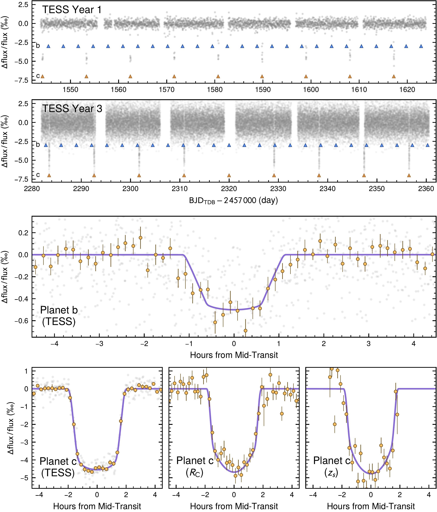

$\newcommand{\ensuremath}{}$
$\newcommand{\xspace}{}$
$\newcommand{\object}[1]{\texttt{#1}}$
$\newcommand{\farcs}{{.}''}$
$\newcommand{\farcm}{{.}'}$
$\newcommand{\arcsec}{''}$
$\newcommand{\arcmin}{'}$
$\newcommand{\ion}[2]{#1#2}$
$\newcommand{\textsc}[1]{\textrm{#1}}$
$\newcommand{\hl}[1]{\textrm{#1}}$
$\newcommand{\footnote}[1]{}$
$\newcommand{\plusminus}[3]{#1^{+#2}_{-#3}}$
$\newcommand{\circa}{\ensuremath{{\sim}\mspace{2mu}}}$
$\newcommand{\ut}{\textsc{ut}}$
$\newcommand{\tablenotemark}[1]{\textsuperscript{\textit{#1}}}$
$\newcommand{\bjdtdb}{\ensuremath{\mathrm{BJD}_\text{TDB}}}$
$\newcommand{\feh}{\ensuremath{[\text{Fe}/\text{H}]}}$
$\newcommand{\logg}{\ensuremath{\log g}}$
$\newcommand{\tempeff}{\ensuremath{T_{\text{eff}}}}$
$\newcommand{\tempeq}{\ensuremath{T_{\text{eq}}}}$
$\newcommand{\vsini}{\ensuremath{v \sin i}}$
$\newcommand{\normaldist}{\mathcal{N}}$
$\newcommand{\uniformdist}{\mathcal{U}}$
$\newcommand{\gaiaG}{\ensuremath{G}}$
$\newcommand{\gaiaBP}{\ensuremath{G_\mathrm{BP}}}$
$\newcommand{\gaiaRP}{\ensuremath{G_\mathrm{RP}}}$
$\newcommand{\filterB}{\ensuremath{B}}$
$\newcommand{\filterIc}{\ensuremath{I_\mathrm{c}}}$
$\newcommand{\filterJ}{\ensuremath{J}}$
$\newcommand{\filterH}{\ensuremath{H}}$
$\newcommand{\filterK}{\ensuremath{K_\mathrm{s}}}$
$\newcommand{\filterR}{\ensuremath{R}}$
$\newcommand{\filterRc}{\ensuremath{R_\mathrm{c}}}$
$\newcommand{\filterV}{\ensuremath{V}}$
$\newcommand{\filterWone}{\ensuremath{W1}}$
$\newcommand{\filterWtwo}{\ensuremath{W2}}$
$\newcommand{\filterWthree}{\ensuremath{W3}}$
$\newcommand{\filterWfour}{\ensuremath{W4}}$
$\newcommand{\filtergp}{\ensuremath{g'}}$
$\newcommand{\filterip}{\ensuremath{i'}}$
$\newcommand{\filterrp}{\ensuremath{r'}}$
$\newcommand{\filterzs}{\ensuremath{z_\mathrm{s}}}$
$\newcommand{\ares}{\textsc{ares}}$
$\newcommand{\arviz}{\textsc{arviz}}$
$\newcommand{\astroimagej}{\textsc{AstroImageJ}}$
$\newcommand{\batman}{\textsc{batman}}$
$\newcommand{\celeritetwo}{\textsc{celerite2}}$
$\newcommand{\emcee}{\textsc{emcee}}$
$\newcommand{\exofast}{\textsc{exofast}}$
$\newcommand{\exoplanetpy}{\textsc{exoplanet}}$
$\newcommand{\isochrones}{\textsc{isochrones}}$
$\newcommand{\mist}{MIST}$
$\newcommand{\molusc}{\textsc{molusc}}$
$\newcommand{\moog}{\textsc{moog}}$
$\newcommand{\pymc}{\textsc{PyMC}}$
$\newcommand{\qlp}{\textsc{qlp}}$
$\newcommand{\radvel}{\textsc{radvel}}$
$\newcommand{\sklearn}{\textsc{Scikit-learn}}$
$\newcommand{\triceratops}{\textsc{triceratops}}$
$\newcommand{\vartools}{\textsc{Vartools}}$
$\newcommand{\planet}[2]{#1\thinspace #2}$
$\newcommand{\toitwothousand}{TOI-2000}$
$\newcommand{\toitwothousandtic}{371188886}$
$\newcommand{\planetinner}{\planet{\toitwothousand}{b}}$
$\newcommand{\planetouter}{\planet{\toitwothousand}{c}}$
$\newcommand{\waspfortyseven}{WASP-47}$
$\newcommand{\waspfortysevenhj}{\planet{\waspfortyseven}{b}}$
$\newcommand{\waspfortyseveninner}{\planet{\waspfortyseven}{e}}$
$\newcommand{\waspfortysevenneptune}{\planet{\waspfortyseven}{d}}$
$\newcommand{\keplerseventhirty}{Kepler-730}$
$\newcommand{\keplerseventhirtyhj}{\planet{Kepler-730}{b}}$
$\newcommand{\keplerseventhirtyinner}{\planet{Kepler-730}{c}}$
$\newcommand{\toieleventhirty}{TOI-1130}$
$\newcommand{\toieleventhirtyinner}{\planet{\toieleventhirty}{b}}$
$\newcommand{\toieleventhirtyhj}{\planet{\toieleventhirty}{c}}$
$\newcommand{\keplerthirty}{Kepler-30}$
$\newcommand{\keplerthirtyb}{\planet{\keplerthirty}{b}}$
$\newcommand{\keplereightynine}{KOI-94}$
$\newcommand{\keplereightynineb}{\planet{\keplereightynine}{b}}$
$\newcommand{\wasponethirtytwo}{WASP-132}$
$\newcommand{\wasponethirtytwohj}{\planet{WASP-132}{b}}$
$\newcommand{\wasponethirtytwoinner}{\planet{WASP-132}{c}}$
$\newcommand{\astep}{ASTEP}$
$\newcommand{\chiron}{CHI\-RON}$
$\newcommand{\edrthree}{EDR3}$
$\newcommand{\feros}{FEROS}$
$\newcommand{\gaia}{\emph{Gaia}}$
$\newcommand{\geminisouth}{Gemini South}$
$\newcommand{\harps}{HARPS}$
$\newcommand{\jwst}{\emph{JWST}}$
$\newcommand{\kepler}{\emph{Kepler}}$
$\newcommand{\ktwo}{\emph{K2}}$
$\newcommand{\lcogt}{LCOGT}$
$\newcommand{\pest}{PEST}$
$\newcommand{\soar}{SOAR}$
$\newcommand{\tess}{\emph{TESS}}$
$\newcommand{\twomass}{2MASS}$
$\newcommand{\wise}{\emph{WISE}}$
$\newcommand{\sysParamPeriodSubZero}{9.1270550}$
$\newcommand{\sysParamPeriodSubZeroUnc}{_{-0.0000072}^{+0.0000073}}$
$\newcommand{\sysParamPeriodSubOne}{3.098330}$
$\newcommand{\sysParamPeriodSubOneUnc}{_{-0.000019}^{+0.000021}}$
$\newcommand{\sysParamTzeroSubZero}{2459110.06588}$
$\newcommand{\sysParamTzeroSubZeroUnc}{_{-0.00028}^{+0.00027}}$
$\newcommand{\sysParamTzeroSubOne}{2458855.2442}$
$\newcommand{\sysParamTzeroSubOneUnc}{_{-0.0021}^{+0.0022}}$
$\newcommand{\sysParamRpSubZero}{0.06581}$
$\newcommand{\sysParamRpSubZeroUnc}{\pm 0.00068}$
$\newcommand{\sysParamRpSubOne}{0.02182}$
$\newcommand{\sysParamRpSubOneUnc}{_{-0.00097}^{+0.00089}}$
$\newcommand{\sysParamRPlanetJupiterSubZero}{0.727}$
$\newcommand{\sysParamRPlanetJupiterSubZeroUnc}{_{-0.027}^{+0.028}}$
$\newcommand{\sysParamRPlanetJupiterSubOne}{0.241}$
$\newcommand{\sysParamRPlanetJupiterSubOneUnc}{\pm 0.014}$
$\newcommand{\sysParamBSubZero}{0.631}$
$\newcommand{\sysParamBSubZeroUnc}{_{-0.047}^{+0.039}}$
$\newcommand{\sysParamBSubOne}{0.770}$
$\newcommand{\sysParamBSubOneUnc}{_{-0.071}^{+0.038}}$
$\newcommand{\sysParamTdurSubZero}{3.654}$
$\newcommand{\sysParamTdurSubZeroUnc}{_{-0.028}^{+0.030}}$
$\newcommand{\sysParamTdurSubOne}{1.959}$
$\newcommand{\sysParamTdurSubOneUnc}{_{-0.098}^{+0.209}}$
$\newcommand{\sysParamSqrtEccVecZeroSubZero}{-0.215}$
$\newcommand{\sysParamSqrtEccVecZeroSubZeroUnc}{_{-0.046}^{+0.061}}$
$\newcommand{\sysParamSqrtEccVecZeroSubOne}{-0.06}$
$\newcommand{\sysParamSqrtEccVecZeroSubOneUnc}{_{-0.12}^{+0.14}}$
$\newcommand{\sysParamEccSubZero}{0.063}$
$\newcommand{\sysParamEccSubZeroUnc}{_{-0.022}^{+0.023}}$
$\newcommand{\sysParamEccSubOne}{0.0}$
$\newcommand{\sysParamEccSubOneUnc}{\pm 0.0}$
$\newcommand{\sysParamOmegaSubZero}{-2.40}$
$\newcommand{\sysParamOmegaSubZeroUnc}{_{-0.49}^{+5.22}}$
$\newcommand{\sysParamOmegaSubOne}{1.6}$
$\newcommand{\sysParamOmegaSubOneUnc}{\pm 0.0}$
$\newcommand{\sysParamRPlanetEarthSubZero}{8.14}$
$\newcommand{\sysParamRPlanetEarthSubZeroUnc}{_{-0.30}^{+0.31}}$
$\newcommand{\sysParamRPlanetEarthSubOne}{2.70}$
$\newcommand{\sysParamRPlanetEarthSubOneUnc}{\pm 0.15}$
$\newcommand{\sysParamMPlanetJupiterSubZero}{0.257}$
$\newcommand{\sysParamMPlanetJupiterSubZeroUnc}{_{-0.014}^{+0.015}}$
$\newcommand{\sysParamMPlanetJupiterSubOne}{0.0347}$
$\newcommand{\sysParamMPlanetJupiterSubOneUnc}{_{-0.0075}^{+0.0077}}$
$\newcommand{\sysParamMPlanetEarthSubZero}{81.7}$
$\newcommand{\sysParamMPlanetEarthSubZeroUnc}{_{-4.6}^{+4.7}}$
$\newcommand{\sysParamMPlanetEarthSubOne}{11.0}$
$\newcommand{\sysParamMPlanetEarthSubOneUnc}{\pm 2.4}$
$\newcommand{\sysParamRhoPlanetSubZero}{0.829}$
$\newcommand{\sysParamRhoPlanetSubZeroUnc}{_{-0.096}^{+0.111}}$
$\newcommand{\sysParamRhoPlanetSubOne}{3.07}$
$\newcommand{\sysParamRhoPlanetSubOneUnc}{_{-0.78}^{+0.94}}$
$\newcommand{\sysParamKSubZero}{23.7}$
$\newcommand{\sysParamKSubZeroUnc}{\pm 1.1}$
$\newcommand{\sysParamKSubOne}{4.59}$
$\newcommand{\sysParamKSubOneUnc}{_{-0.99}^{+1.00}}$
$\newcommand{\sysParamMStarZero}{1.083}$
$\newcommand{\sysParamMStarZeroUnc}{_{-0.050}^{+0.059}}$
$\newcommand{\sysParamFehZero}{0.417}$
$\newcommand{\sysParamFehZeroUnc}{_{-0.041}^{+0.039}}$
$\newcommand{\sysParamEep}{385}$
$\newcommand{\sysParamEepUnc}{_{-38}^{+24}}$
$\newcommand{\sysParamMStar}{1.082}$
$\newcommand{\sysParamMStarUnc}{_{-0.050}^{+0.059}}$
$\newcommand{\sysParamRStar}{1.134}$
$\newcommand{\sysParamRStarUnc}{_{-0.036}^{+0.037}}$
$\newcommand{\sysParamRhoStar}{1.047}$
$\newcommand{\sysParamRhoStarUnc}{_{-0.100}^{+0.114}}$
$\newcommand{\sysParamLoggStar}{4.363}$
$\newcommand{\sysParamLoggStarUnc}{_{-0.032}^{+0.034}}$
$\newcommand{\sysParamTeff}{5611}$
$\newcommand{\sysParamTeffUnc}{_{-82}^{+85}}$
$\newcommand{\sysParamFeh}{0.439}$
$\newcommand{\sysParamFehUnc}{_{-0.043}^{+0.041}}$
$\newcommand{\sysParamAge}{5.3}$
$\newcommand{\sysParamAgeUnc}{\pm 2.7}$
$\newcommand{\sysParamParallax}{5.773}$
$\newcommand{\sysParamParallaxUnc}{\pm 0.010}$
$\newcommand{\sysParamAv}{0.22}$
$\newcommand{\sysParamAvUnc}{\pm 0.11}$
$\newcommand{\sysParamLStar}{1.147}$
$\newcommand{\sysParamLStarUnc}{_{-0.084}^{+0.094}}$
$\newcommand{\sysParamRStarMist}{1.130}$
$\newcommand{\sysParamRStarMistUnc}{_{-0.047}^{+0.050}}$
$\newcommand{\sysParamTeffMist}{5611}$
$\newcommand{\sysParamTeffMistUnc}{_{-125}^{+145}}$
$\newcommand{\sysParamFehMist}{0.439}$
$\newcommand{\sysParamFehMistUnc}{_{-0.044}^{+0.043}}$
$\newcommand{\sysParamRStarSed}{1.103}$
$\newcommand{\sysParamRStarSedUnc}{\pm 0.014}$
$\newcommand{\sysParamTeffSed}{5687}$
$\newcommand{\sysParamTeffSedUnc}{_{-133}^{+142}}$
$\newcommand{\sysParamApMagBol}{10.784}$
$\newcommand{\sysParamApMagBolUnc}{_{-0.086}^{+0.083}}$
$\newcommand{\sysParamApMagBolSed}{10.784}$
$\newcommand{\sysParamApMagBolSedUnc}{_{-0.084}^{+0.081}}$
$\newcommand{\sysParamSedUncScale}{1.27}$
$\newcommand{\sysParamSedUncScaleUnc}{_{-0.20}^{+0.39}}$
$\newcommand{\sysParamUTessSubZero}{0.130}$
$\newcommand{\sysParamUTessSubZeroUnc}{_{-0.095}^{+0.170}}$
$\newcommand{\sysParamUTessSubOne}{0.32}$
$\newcommand{\sysParamUTessSubOneUnc}{_{-0.24}^{+0.16}}$
$\newcommand{\sysParamURcSubZero}{0.89}$
$\newcommand{\sysParamURcSubZeroUnc}{_{-0.28}^{+0.21}}$
$\newcommand{\sysParamURcSubOne}{-0.29}$
$\newcommand{\sysParamURcSubOneUnc}{_{-0.20}^{+0.33}}$
$\newcommand{\sysParamUZsSubZero}{0.41}$
$\newcommand{\sysParamUZsSubZeroUnc}{_{-0.28}^{+0.35}}$
$\newcommand{\sysParamUZsSubOne}{0.01}$
$\newcommand{\sysParamUZsSubOneUnc}{_{-0.27}^{+0.32}}$
$\newcommand{\sysParamMeanFluxZero}{(-1.3}$
$\newcommand{\sysParamMeanFluxZeroUnc}{\pm 1.2) \times 10^{-5}}$
$\newcommand{\sysParamMeanFluxOne}{(1.5}$
$\newcommand{\sysParamMeanFluxOneUnc}{\pm 1.2) \times 10^{-5}}$
$\newcommand{\sysParamLcDetrendCoeffsTwoSubZero}{(3.05}$
$\newcommand{\sysParamLcDetrendCoeffsTwoSubZeroUnc}{\pm 0.63) \times 10^{-4}}$
$\newcommand{\sysParamLcDetrendCoeffsTwoSubOne}{0.00114}$
$\newcommand{\sysParamLcDetrendCoeffsTwoSubOneUnc}{_{-0.00050}^{+0.00049}}$
$\newcommand{\sysParamLcDetrendCoeffsThreeSubZero}{0.00298}$
$\newcommand{\sysParamLcDetrendCoeffsThreeSubZeroUnc}{\pm 0.00016}$
$\newcommand{\sysParamLcDetrendCoeffsThreeSubOne}{(8.2}$
$\newcommand{\sysParamLcDetrendCoeffsThreeSubOneUnc}{\pm 4.8) \times 10^{-4}}$
$\newcommand{\sysParamLcJitterSubZero}{(9.2}$
$\newcommand{\sysParamLcJitterSubZeroUnc}{_{-4.2}^{+3.1}) \times 10^{-5}}$
$\newcommand{\sysParamLcJitterSubOne}{(2.06}$
$\newcommand{\sysParamLcJitterSubOneUnc}{_{-1.15}^{+0.87}) \times 10^{-4}}$
$\newcommand{\sysParamLcJitterSubTwo}{(1.25}$
$\newcommand{\sysParamLcJitterSubTwoUnc}{_{-0.87}^{+1.23}) \times 10^{-4}}$
$\newcommand{\sysParamLcJitterSubThree}{0.00123}$
$\newcommand{\sysParamLcJitterSubThreeUnc}{\pm 0.00014}$
$\newcommand{\sysParamRvGammaSubZero}{6647.7}$
$\newcommand{\sysParamRvGammaSubZeroUnc}{_{-12.8}^{+8.8}}$
$\newcommand{\sysParamRvGammaSubOne}{8116}$
$\newcommand{\sysParamRvGammaSubOneUnc}{_{-14}^{+11}}$
$\newcommand{\sysParamRvGammaSubTwo}{8118.1}$
$\newcommand{\sysParamRvGammaSubTwoUnc}{_{-12.2}^{+8.2}}$
$\newcommand{\sysParamRvJitterSubZero}{3.4}$
$\newcommand{\sysParamRvJitterSubZeroUnc}{_{-2.3}^{+3.2}}$
$\newcommand{\sysParamRvJitterSubOne}{14.0}$
$\newcommand{\sysParamRvJitterSubOneUnc}{_{-3.3}^{+4.5}}$
$\newcommand{\sysParamRvJitterSubTwo}{3.14}$
$\newcommand{\sysParamRvJitterSubTwoUnc}{_{-0.78}^{+0.82}}$
$\newcommand{\sysParamGpSigma}{21.4}$
$\newcommand{\sysParamGpSigmaUnc}{_{-7.6}^{+14.6}}$
$\newcommand{\sysParamGpRho}{111}$
$\newcommand{\sysParamGpRhoUnc}{_{-37}^{+57}}$
$\newcommand{\sysParamGpTau}{37}$
$\newcommand{\sysParamGpTauUnc}{_{-31}^{+95}}$
$\newcommand{\sysParamASubZero}{0.0878}$
$\newcommand{\sysParamASubZeroUnc}{_{-0.0014}^{+0.0016}}$
$\newcommand{\sysParamASubOne}{0.04271}$
$\newcommand{\sysParamASubOneUnc}{_{-0.00067}^{+0.00076}}$
$\newcommand{\sysParamAorSubZero}{16.64}$
$\newcommand{\sysParamAorSubZeroUnc}{_{-0.55}^{+0.59}}$
$\newcommand{\sysParamAorSubOne}{8.10}$
$\newcommand{\sysParamAorSubOneUnc}{_{-0.27}^{+0.28}}$
$\newcommand{\sysParamInclSubZero}{87.86}$
$\newcommand{\sysParamInclSubZeroUnc}{_{-0.18}^{+0.19}}$
$\newcommand{\sysParamInclSubOne}{84.59}$
$\newcommand{\sysParamInclSubOneUnc}{_{-0.43}^{+0.54}}$
$\newcommand{\sysParamDistance}{173.22}$
$\newcommand{\sysParamDistanceUnc}{\pm 0.31}$
$\newcommand{\sysParamMPlanetSubZero}{(2.26}$
$\newcommand{\sysParamMPlanetSubZeroUnc}{_{-0.12}^{+0.11}) \times 10^{-4}}$
$\newcommand{\sysParamMPlanetSubOne}{(3.06}$
$\newcommand{\sysParamMPlanetSubOneUnc}{\pm 0.66) \times 10^{-5}}$
$\newcommand{\sysParamIrradiationSubZero}{(2.03}$
$\newcommand{\sysParamIrradiationSubZeroUnc}{_{-0.14}^{+0.16}) \times 10^{8}}$
$\newcommand{\sysParamIrradiationSubOne}{(8.55}$
$\newcommand{\sysParamIrradiationSubOneUnc}{_{-0.59}^{+0.66}) \times 10^{8}}$
$\newcommand{\sysParamTempEqSubZero}{1038}$
$\newcommand{\sysParamTempEqSubZeroUnc}{_{-111}^{+84}}$
$\newcommand{\sysParamTempEqSubOne}{1488}$
$\newcommand{\sysParamTempEqSubOneUnc}{_{-160}^{+122}}$
$\newcommand{\sysParamOmegaFoldSubZero}{196}$
$\newcommand{\sysParamOmegaFoldSubZeroUnc}{_{-34}^{+29}}$
$\newcommand{\arraystretch}{1.25}$
$\newcommand{\arraystretch}{1.25}$
$\newcommand{\arraystretch}{1.25}$
$\newcommand{\arraystretch}{1.25}$
$\newcommand{\arraystretch}{1.05}$

$\newcommand{\ensuremath}{}$
$\newcommand{\xspace}{}$
$\newcommand{\object}[1]{\texttt{#1}}$
$\newcommand{\farcs}{{.}''}$
$\newcommand{\farcm}{{.}'}$
$\newcommand{\arcsec}{''}$
$\newcommand{\arcmin}{'}$
$\newcommand{\ion}[2]{#1#2}$
$\newcommand{\textsc}[1]{\textrm{#1}}$
$\newcommand{\hl}[1]{\textrm{#1}}$
$\newcommand{\footnote}[1]{}$
$\newcommand{\plusminus}[3]{#1^{+#2}_{-#3}}$
$\newcommand{\circa}{\ensuremath{{\sim}\mspace{2mu}}}$
$\newcommand{\ut}{\textsc{ut}}$
$\newcommand{\tablenotemark}[1]{\textsuperscript{\textit{#1}}}$
$\newcommand{\bjdtdb}{\ensuremath{\mathrm{BJD}_\text{TDB}}}$
$\newcommand{\feh}{\ensuremath{[\text{Fe}/\text{H}]}}$
$\newcommand{\logg}{\ensuremath{\log g}}$
$\newcommand{\tempeff}{\ensuremath{T_{\text{eff}}}}$
$\newcommand{\tempeq}{\ensuremath{T_{\text{eq}}}}$
$\newcommand{\vsini}{\ensuremath{v \sin i}}$
$\newcommand{\normaldist}{\mathcal{N}}$
$\newcommand{\uniformdist}{\mathcal{U}}$
$\newcommand{\gaiaG}{\ensuremath{G}}$
$\newcommand{\gaiaBP}{\ensuremath{G_\mathrm{BP}}}$
$\newcommand{\gaiaRP}{\ensuremath{G_\mathrm{RP}}}$
$\newcommand{\filterB}{\ensuremath{B}}$
$\newcommand{\filterIc}{\ensuremath{I_\mathrm{c}}}$
$\newcommand{\filterJ}{\ensuremath{J}}$
$\newcommand{\filterH}{\ensuremath{H}}$
$\newcommand{\filterK}{\ensuremath{K_\mathrm{s}}}$
$\newcommand{\filterR}{\ensuremath{R}}$
$\newcommand{\filterRc}{\ensuremath{R_\mathrm{c}}}$
$\newcommand{\filterV}{\ensuremath{V}}$
$\newcommand{\filterWone}{\ensuremath{W1}}$
$\newcommand{\filterWtwo}{\ensuremath{W2}}$
$\newcommand{\filterWthree}{\ensuremath{W3}}$
$\newcommand{\filterWfour}{\ensuremath{W4}}$
$\newcommand{\filtergp}{\ensuremath{g'}}$
$\newcommand{\filterip}{\ensuremath{i'}}$
$\newcommand{\filterrp}{\ensuremath{r'}}$
$\newcommand{\filterzs}{\ensuremath{z_\mathrm{s}}}$
$\newcommand{\ares}{\textsc{ares}}$
$\newcommand{\arviz}{\textsc{arviz}}$
$\newcommand{\astroimagej}{\textsc{AstroImageJ}}$
$\newcommand{\batman}{\textsc{batman}}$
$\newcommand{\celeritetwo}{\textsc{celerite2}}$
$\newcommand{\emcee}{\textsc{emcee}}$
$\newcommand{\exofast}{\textsc{exofast}}$
$\newcommand{\exoplanetpy}{\textsc{exoplanet}}$
$\newcommand{\isochrones}{\textsc{isochrones}}$
$\newcommand{\mist}{MIST}$
$\newcommand{\molusc}{\textsc{molusc}}$
$\newcommand{\moog}{\textsc{moog}}$
$\newcommand{\pymc}{\textsc{PyMC}}$
$\newcommand{\qlp}{\textsc{qlp}}$
$\newcommand{\radvel}{\textsc{radvel}}$
$\newcommand{\sklearn}{\textsc{Scikit-learn}}$
$\newcommand{\triceratops}{\textsc{triceratops}}$
$\newcommand{\vartools}{\textsc{Vartools}}$
$\newcommand{\planet}[2]{#1\thinspace #2}$
$\newcommand{\toitwothousand}{TOI-2000}$
$\newcommand{\toitwothousandtic}{371188886}$
$\newcommand{\planetinner}{\planet{\toitwothousand}{b}}$
$\newcommand{\planetouter}{\planet{\toitwothousand}{c}}$
$\newcommand{\waspfortyseven}{WASP-47}$
$\newcommand{\waspfortysevenhj}{\planet{\waspfortyseven}{b}}$
$\newcommand{\waspfortyseveninner}{\planet{\waspfortyseven}{e}}$
$\newcommand{\waspfortysevenneptune}{\planet{\waspfortyseven}{d}}$
$\newcommand{\keplerseventhirty}{Kepler-730}$
$\newcommand{\keplerseventhirtyhj}{\planet{Kepler-730}{b}}$
$\newcommand{\keplerseventhirtyinner}{\planet{Kepler-730}{c}}$
$\newcommand{\toieleventhirty}{TOI-1130}$
$\newcommand{\toieleventhirtyinner}{\planet{\toieleventhirty}{b}}$
$\newcommand{\toieleventhirtyhj}{\planet{\toieleventhirty}{c}}$
$\newcommand{\keplerthirty}{Kepler-30}$
$\newcommand{\keplerthirtyb}{\planet{\keplerthirty}{b}}$
$\newcommand{\keplereightynine}{KOI-94}$
$\newcommand{\keplereightynineb}{\planet{\keplereightynine}{b}}$
$\newcommand{\wasponethirtytwo}{WASP-132}$
$\newcommand{\wasponethirtytwohj}{\planet{WASP-132}{b}}$
$\newcommand{\wasponethirtytwoinner}{\planet{WASP-132}{c}}$
$\newcommand{\astep}{ASTEP}$
$\newcommand{\chiron}{CHI\-RON}$
$\newcommand{\edrthree}{EDR3}$
$\newcommand{\feros}{FEROS}$
$\newcommand{\gaia}{\emph{Gaia}}$
$\newcommand{\geminisouth}{Gemini South}$
$\newcommand{\harps}{HARPS}$
$\newcommand{\jwst}{\emph{JWST}}$
$\newcommand{\kepler}{\emph{Kepler}}$
$\newcommand{\ktwo}{\emph{K2}}$
$\newcommand{\lcogt}{LCOGT}$
$\newcommand{\pest}{PEST}$
$\newcommand{\soar}{SOAR}$
$\newcommand{\tess}{\emph{TESS}}$
$\newcommand{\twomass}{2MASS}$
$\newcommand{\wise}{\emph{WISE}}$
$\newcommand{\sysParamPeriodSubZero}{9.1270550}$
$\newcommand{\sysParamPeriodSubZeroUnc}{_{-0.0000072}^{+0.0000073}}$
$\newcommand{\sysParamPeriodSubOne}{3.098330}$
$\newcommand{\sysParamPeriodSubOneUnc}{_{-0.000019}^{+0.000021}}$
$\newcommand{\sysParamTzeroSubZero}{2459110.06588}$
$\newcommand{\sysParamTzeroSubZeroUnc}{_{-0.00028}^{+0.00027}}$
$\newcommand{\sysParamTzeroSubOne}{2458855.2442}$
$\newcommand{\sysParamTzeroSubOneUnc}{_{-0.0021}^{+0.0022}}$
$\newcommand{\sysParamRpSubZero}{0.06581}$
$\newcommand{\sysParamRpSubZeroUnc}{\pm 0.00068}$
$\newcommand{\sysParamRpSubOne}{0.02182}$
$\newcommand{\sysParamRpSubOneUnc}{_{-0.00097}^{+0.00089}}$
$\newcommand{\sysParamRPlanetJupiterSubZero}{0.727}$
$\newcommand{\sysParamRPlanetJupiterSubZeroUnc}{_{-0.027}^{+0.028}}$
$\newcommand{\sysParamRPlanetJupiterSubOne}{0.241}$
$\newcommand{\sysParamRPlanetJupiterSubOneUnc}{\pm 0.014}$
$\newcommand{\sysParamBSubZero}{0.631}$
$\newcommand{\sysParamBSubZeroUnc}{_{-0.047}^{+0.039}}$
$\newcommand{\sysParamBSubOne}{0.770}$
$\newcommand{\sysParamBSubOneUnc}{_{-0.071}^{+0.038}}$
$\newcommand{\sysParamTdurSubZero}{3.654}$
$\newcommand{\sysParamTdurSubZeroUnc}{_{-0.028}^{+0.030}}$
$\newcommand{\sysParamTdurSubOne}{1.959}$
$\newcommand{\sysParamTdurSubOneUnc}{_{-0.098}^{+0.209}}$
$\newcommand{\sysParamSqrtEccVecZeroSubZero}{-0.215}$
$\newcommand{\sysParamSqrtEccVecZeroSubZeroUnc}{_{-0.046}^{+0.061}}$
$\newcommand{\sysParamSqrtEccVecZeroSubOne}{-0.06}$
$\newcommand{\sysParamSqrtEccVecZeroSubOneUnc}{_{-0.12}^{+0.14}}$
$\newcommand{\sysParamEccSubZero}{0.063}$
$\newcommand{\sysParamEccSubZeroUnc}{_{-0.022}^{+0.023}}$
$\newcommand{\sysParamEccSubOne}{0.0}$
$\newcommand{\sysParamEccSubOneUnc}{\pm 0.0}$
$\newcommand{\sysParamOmegaSubZero}{-2.40}$
$\newcommand{\sysParamOmegaSubZeroUnc}{_{-0.49}^{+5.22}}$
$\newcommand{\sysParamOmegaSubOne}{1.6}$
$\newcommand{\sysParamOmegaSubOneUnc}{\pm 0.0}$
$\newcommand{\sysParamRPlanetEarthSubZero}{8.14}$
$\newcommand{\sysParamRPlanetEarthSubZeroUnc}{_{-0.30}^{+0.31}}$
$\newcommand{\sysParamRPlanetEarthSubOne}{2.70}$
$\newcommand{\sysParamRPlanetEarthSubOneUnc}{\pm 0.15}$
$\newcommand{\sysParamMPlanetJupiterSubZero}{0.257}$
$\newcommand{\sysParamMPlanetJupiterSubZeroUnc}{_{-0.014}^{+0.015}}$
$\newcommand{\sysParamMPlanetJupiterSubOne}{0.0347}$
$\newcommand{\sysParamMPlanetJupiterSubOneUnc}{_{-0.0075}^{+0.0077}}$
$\newcommand{\sysParamMPlanetEarthSubZero}{81.7}$
$\newcommand{\sysParamMPlanetEarthSubZeroUnc}{_{-4.6}^{+4.7}}$
$\newcommand{\sysParamMPlanetEarthSubOne}{11.0}$
$\newcommand{\sysParamMPlanetEarthSubOneUnc}{\pm 2.4}$
$\newcommand{\sysParamRhoPlanetSubZero}{0.829}$
$\newcommand{\sysParamRhoPlanetSubZeroUnc}{_{-0.096}^{+0.111}}$
$\newcommand{\sysParamRhoPlanetSubOne}{3.07}$
$\newcommand{\sysParamRhoPlanetSubOneUnc}{_{-0.78}^{+0.94}}$
$\newcommand{\sysParamKSubZero}{23.7}$
$\newcommand{\sysParamKSubZeroUnc}{\pm 1.1}$
$\newcommand{\sysParamKSubOne}{4.59}$
$\newcommand{\sysParamKSubOneUnc}{_{-0.99}^{+1.00}}$
$\newcommand{\sysParamMStarZero}{1.083}$
$\newcommand{\sysParamMStarZeroUnc}{_{-0.050}^{+0.059}}$
$\newcommand{\sysParamFehZero}{0.417}$
$\newcommand{\sysParamFehZeroUnc}{_{-0.041}^{+0.039}}$
$\newcommand{\sysParamEep}{385}$
$\newcommand{\sysParamEepUnc}{_{-38}^{+24}}$
$\newcommand{\sysParamMStar}{1.082}$
$\newcommand{\sysParamMStarUnc}{_{-0.050}^{+0.059}}$
$\newcommand{\sysParamRStar}{1.134}$
$\newcommand{\sysParamRStarUnc}{_{-0.036}^{+0.037}}$
$\newcommand{\sysParamRhoStar}{1.047}$
$\newcommand{\sysParamRhoStarUnc}{_{-0.100}^{+0.114}}$
$\newcommand{\sysParamLoggStar}{4.363}$
$\newcommand{\sysParamLoggStarUnc}{_{-0.032}^{+0.034}}$
$\newcommand{\sysParamTeff}{5611}$
$\newcommand{\sysParamTeffUnc}{_{-82}^{+85}}$
$\newcommand{\sysParamFeh}{0.439}$
$\newcommand{\sysParamFehUnc}{_{-0.043}^{+0.041}}$
$\newcommand{\sysParamAge}{5.3}$
$\newcommand{\sysParamAgeUnc}{\pm 2.7}$
$\newcommand{\sysParamParallax}{5.773}$
$\newcommand{\sysParamParallaxUnc}{\pm 0.010}$
$\newcommand{\sysParamAv}{0.22}$
$\newcommand{\sysParamAvUnc}{\pm 0.11}$
$\newcommand{\sysParamLStar}{1.147}$
$\newcommand{\sysParamLStarUnc}{_{-0.084}^{+0.094}}$
$\newcommand{\sysParamRStarMist}{1.130}$
$\newcommand{\sysParamRStarMistUnc}{_{-0.047}^{+0.050}}$
$\newcommand{\sysParamTeffMist}{5611}$
$\newcommand{\sysParamTeffMistUnc}{_{-125}^{+145}}$
$\newcommand{\sysParamFehMist}{0.439}$
$\newcommand{\sysParamFehMistUnc}{_{-0.044}^{+0.043}}$
$\newcommand{\sysParamRStarSed}{1.103}$
$\newcommand{\sysParamRStarSedUnc}{\pm 0.014}$
$\newcommand{\sysParamTeffSed}{5687}$
$\newcommand{\sysParamTeffSedUnc}{_{-133}^{+142}}$
$\newcommand{\sysParamApMagBol}{10.784}$
$\newcommand{\sysParamApMagBolUnc}{_{-0.086}^{+0.083}}$
$\newcommand{\sysParamApMagBolSed}{10.784}$
$\newcommand{\sysParamApMagBolSedUnc}{_{-0.084}^{+0.081}}$
$\newcommand{\sysParamSedUncScale}{1.27}$
$\newcommand{\sysParamSedUncScaleUnc}{_{-0.20}^{+0.39}}$
$\newcommand{\sysParamUTessSubZero}{0.130}$
$\newcommand{\sysParamUTessSubZeroUnc}{_{-0.095}^{+0.170}}$
$\newcommand{\sysParamUTessSubOne}{0.32}$
$\newcommand{\sysParamUTessSubOneUnc}{_{-0.24}^{+0.16}}$
$\newcommand{\sysParamURcSubZero}{0.89}$
$\newcommand{\sysParamURcSubZeroUnc}{_{-0.28}^{+0.21}}$
$\newcommand{\sysParamURcSubOne}{-0.29}$
$\newcommand{\sysParamURcSubOneUnc}{_{-0.20}^{+0.33}}$
$\newcommand{\sysParamUZsSubZero}{0.41}$
$\newcommand{\sysParamUZsSubZeroUnc}{_{-0.28}^{+0.35}}$
$\newcommand{\sysParamUZsSubOne}{0.01}$
$\newcommand{\sysParamUZsSubOneUnc}{_{-0.27}^{+0.32}}$
$\newcommand{\sysParamMeanFluxZero}{(-1.3}$
$\newcommand{\sysParamMeanFluxZeroUnc}{\pm 1.2) \times 10^{-5}}$
$\newcommand{\sysParamMeanFluxOne}{(1.5}$
$\newcommand{\sysParamMeanFluxOneUnc}{\pm 1.2) \times 10^{-5}}$
$\newcommand{\sysParamLcDetrendCoeffsTwoSubZero}{(3.05}$
$\newcommand{\sysParamLcDetrendCoeffsTwoSubZeroUnc}{\pm 0.63) \times 10^{-4}}$
$\newcommand{\sysParamLcDetrendCoeffsTwoSubOne}{0.00114}$
$\newcommand{\sysParamLcDetrendCoeffsTwoSubOneUnc}{_{-0.00050}^{+0.00049}}$
$\newcommand{\sysParamLcDetrendCoeffsThreeSubZero}{0.00298}$
$\newcommand{\sysParamLcDetrendCoeffsThreeSubZeroUnc}{\pm 0.00016}$
$\newcommand{\sysParamLcDetrendCoeffsThreeSubOne}{(8.2}$
$\newcommand{\sysParamLcDetrendCoeffsThreeSubOneUnc}{\pm 4.8) \times 10^{-4}}$
$\newcommand{\sysParamLcJitterSubZero}{(9.2}$
$\newcommand{\sysParamLcJitterSubZeroUnc}{_{-4.2}^{+3.1}) \times 10^{-5}}$
$\newcommand{\sysParamLcJitterSubOne}{(2.06}$
$\newcommand{\sysParamLcJitterSubOneUnc}{_{-1.15}^{+0.87}) \times 10^{-4}}$
$\newcommand{\sysParamLcJitterSubTwo}{(1.25}$
$\newcommand{\sysParamLcJitterSubTwoUnc}{_{-0.87}^{+1.23}) \times 10^{-4}}$
$\newcommand{\sysParamLcJitterSubThree}{0.00123}$
$\newcommand{\sysParamLcJitterSubThreeUnc}{\pm 0.00014}$
$\newcommand{\sysParamRvGammaSubZero}{6647.7}$
$\newcommand{\sysParamRvGammaSubZeroUnc}{_{-12.8}^{+8.8}}$
$\newcommand{\sysParamRvGammaSubOne}{8116}$
$\newcommand{\sysParamRvGammaSubOneUnc}{_{-14}^{+11}}$
$\newcommand{\sysParamRvGammaSubTwo}{8118.1}$
$\newcommand{\sysParamRvGammaSubTwoUnc}{_{-12.2}^{+8.2}}$
$\newcommand{\sysParamRvJitterSubZero}{3.4}$
$\newcommand{\sysParamRvJitterSubZeroUnc}{_{-2.3}^{+3.2}}$
$\newcommand{\sysParamRvJitterSubOne}{14.0}$
$\newcommand{\sysParamRvJitterSubOneUnc}{_{-3.3}^{+4.5}}$
$\newcommand{\sysParamRvJitterSubTwo}{3.14}$
$\newcommand{\sysParamRvJitterSubTwoUnc}{_{-0.78}^{+0.82}}$
$\newcommand{\sysParamGpSigma}{21.4}$
$\newcommand{\sysParamGpSigmaUnc}{_{-7.6}^{+14.6}}$
$\newcommand{\sysParamGpRho}{111}$
$\newcommand{\sysParamGpRhoUnc}{_{-37}^{+57}}$
$\newcommand{\sysParamGpTau}{37}$
$\newcommand{\sysParamGpTauUnc}{_{-31}^{+95}}$
$\newcommand{\sysParamASubZero}{0.0878}$
$\newcommand{\sysParamASubZeroUnc}{_{-0.0014}^{+0.0016}}$
$\newcommand{\sysParamASubOne}{0.04271}$
$\newcommand{\sysParamASubOneUnc}{_{-0.00067}^{+0.00076}}$
$\newcommand{\sysParamAorSubZero}{16.64}$
$\newcommand{\sysParamAorSubZeroUnc}{_{-0.55}^{+0.59}}$
$\newcommand{\sysParamAorSubOne}{8.10}$
$\newcommand{\sysParamAorSubOneUnc}{_{-0.27}^{+0.28}}$
$\newcommand{\sysParamInclSubZero}{87.86}$
$\newcommand{\sysParamInclSubZeroUnc}{_{-0.18}^{+0.19}}$
$\newcommand{\sysParamInclSubOne}{84.59}$
$\newcommand{\sysParamInclSubOneUnc}{_{-0.43}^{+0.54}}$
$\newcommand{\sysParamDistance}{173.22}$
$\newcommand{\sysParamDistanceUnc}{\pm 0.31}$
$\newcommand{\sysParamMPlanetSubZero}{(2.26}$
$\newcommand{\sysParamMPlanetSubZeroUnc}{_{-0.12}^{+0.11}) \times 10^{-4}}$
$\newcommand{\sysParamMPlanetSubOne}{(3.06}$
$\newcommand{\sysParamMPlanetSubOneUnc}{\pm 0.66) \times 10^{-5}}$
$\newcommand{\sysParamIrradiationSubZero}{(2.03}$
$\newcommand{\sysParamIrradiationSubZeroUnc}{_{-0.14}^{+0.16}) \times 10^{8}}$
$\newcommand{\sysParamIrradiationSubOne}{(8.55}$
$\newcommand{\sysParamIrradiationSubOneUnc}{_{-0.59}^{+0.66}) \times 10^{8}}$
$\newcommand{\sysParamTempEqSubZero}{1038}$
$\newcommand{\sysParamTempEqSubZeroUnc}{_{-111}^{+84}}$
$\newcommand{\sysParamTempEqSubOne}{1488}$
$\newcommand{\sysParamTempEqSubOneUnc}{_{-160}^{+122}}$
$\newcommand{\sysParamOmegaFoldSubZero}{196}$
$\newcommand{\sysParamOmegaFoldSubZeroUnc}{_{-34}^{+29}}$
$\newcommand{\arraystretch}{1.25}$
$\newcommand{\arraystretch}{1.25}$
$\newcommand{\arraystretch}{1.25}$
$\newcommand{\arraystretch}{1.25}$
$\newcommand{\arraystretch}{1.05}$

# $_TESS_$ spots a mini-neptune interior to a hot saturn in the TOI-2000 system

<mark>Appeared on: 2022-09-28</mark> - _23 pages, 7 figures, 13 tables; submitted to MNRAS; CSV tables available as ancillary files; posterior samples available from Zenodo at this https URL and source code at this https URL_

Lizhou Sha, et al. -- incl., <mark><mark>Melissa J. Hobson</mark></mark>, <mark><mark>Carl Ziegler</mark></mark>, <mark><mark>Pascal Torres-Miranda</mark></mark>, <mark><mark>Trifon Trifonov</mark></mark>, <mark><mark>Jan Eberhardt</mark></mark>, <mark><mark>Richard P. Schwarz</mark></mark>

**Abstract:** Hot jupiters ( $P < 10 \text{d}, M > 60  \mathrm{M}_\oplus$ )are almost always found alone around their stars,but four out of hundreds known have inner companion planets.These rare companions allow us to constrain the hot jupiter's formation historyby ruling out high-eccentricity tidal migration.Less is known about inner companions to hot Saturn-mass planets.We report here the discovery of the TOI-2000 system, which features a hot Saturn-mass planet with a smaller innercompanion.The mini-neptune TOI-2000 $\thinspace$ b( $\sysParamRPlanetEarthSubOne$ $\sysParamRPlanetEarthSubOneUnc$ $  \mathrm{R}_\oplus$ , $\sysParamMPlanetEarthSubOne$ $\sysParamMPlanetEarthSubOneUnc$ $  \mathrm{M}_\oplus$ )is in a3.10-day orbit,and the hot saturn TOI-2000 $\thinspace$ c( $\sysParamRPlanetEarthSubZero$ $\sysParamRPlanetEarthSubZeroUnc$ $  \mathrm{R}_\oplus$ , $\sysParamMPlanetEarthSubZero$ $\sysParamMPlanetEarthSubZeroUnc$ $  \mathrm{M}_\oplus$ )is in a9.13-day orbit.Both planets transit their host star TOI-2000(TIC $\thinspace$ 371188886, $V = 10.98$ , $_TESS_$ magnitude $= 10.36$ ),a metal-rich ( $[\text{Fe}/\text{H}] =$ $\sysParamFeh$ $\sysParamFehUnc$ )G dwarf174 $\thinspace$ pc away. $*TESS*$ observed the two planets in sectors 9–11 and 36–38,and we followed up with ground-based photometry, spectroscopy, and speckle imaging.Radial velocities from $\added[id=s]{CHIRON, FEROS, and}$ HARPS allowed us to confirm both planets by direct mass measurement.In addition, we demonstrate constrainingplanetary and stellar parameterswith MIST stellar evolutionary tracksthrough Hamiltonian Monte Carlo under the PyMC framework,achieving higher sampling efficiency and shorter run timecompared to traditional Markov chain Monte Carlo.Having the brightest host star in the $V$ band among similar systems,TOI-2000 $\thinspace$ b and c are superb candidates for atmospheric characterization by the $*JWST*$ ,which can potentially distinguish whether they formed together orTOI-2000 $\thinspace$ c swept along material during migration to form TOI-2000 $\thinspace$ b.

**Figure 4. -** Transiting planetary systems hosting small planets orbiting interior to giant planets ($P < 100 \text{d}$).
    Non-transiting planets in these systems are omitted.
    The leftmost circle in each row represent the host star,
    with the mark's linear size proportional to the stellar radius
    and fill colour indicating the effective temperature
    \citep[from TIC\thinspace 8.1;][]{tess_tic8}.
    The solid circles represent the transiting planets in the system,
    with their linear sizes proportional to planetary radii
    and fill colours indicating whether the planet is a
    giant planet (orange, $P < 10 \text{d}$; blue, $P \geq 10 \text{d}$)
    or a small planet (grey, $R < \SI{6}{\radius\earth}$).
    The relative mark sizes among either the stars or the planets are to scale,
    but not between a star and its planets.
    The slightly translucent marks are planet candidates.
    \added[id=s]{Systems with an asterisk appended to their names contain planet candidates.}\deleted[id=s]{and systems that contain them are marked with an asterisk.}
    The systems are sorted in ascending order of the period of the largest planet from top to bottom.
    \autoref{tab:giant_multi} contains the numbers and references underlying this figure.
     (*fig:family*)

**Figure 5. -** Light curves of $\toitwothousand$ .
    Top two rows: Detrended light curves from $\tess$  years 1 and 3.
    Year 1 points are from the 30-min full-frame images,
    whilst year 3 points are binned to 2 min from the 20-s time series,
    which results in higher scatter per cadence but lower scatter at 30 min.
    The upright triangles indicate transits of planet b (blue) and planet c (orange).
    Bottom two rows:
    Phase-folded light curves zoomed in on the transits of planets b (third row)
    and c (last row).
    The purple line is the transit model,
    \added[id=s]{and the label in each panel indicates the passband of the limb darkening parameters.}
    For the $\tess$  light curves,
    the faint grey marks are observations both years,
    with year 3 observations binned to 30 min to be consistent with those from year 1.
    \added[id=s]{The orange marks of the $\tess$  light curves are binned means (15-min bins for planet b and 10 min for planet c),}
    with the error bars representing the standard error of the mean.
    \added[id=s]{The middle and right panels of the bottom row show planet c transit light curves from ground observations
    ($\astep$  in the $\filterR$c  band, $\lcogt$  SSO in $\filterzs$ )}.
    For the ground observations,
    the orange marks are 12-min binned means weighted by inverse variance
    and the error bars are the standard error of the weighted mean.
     (*fig:lc*)

**Figure 6. -** RV measurements of $\toitwothousand$ .
    The shapes and colours of each mark indicate which spectrograph it corresponds to,
    and its error bar is the quadrature sum of uncertainty and an instrumental jitter term (\autoref{sec:globalmodel}).
    Solid purple lines represent the best-fitting RV model.
    Top: The best-fitting RV and Gaussian process (GP) model.
    The dashed grey line represents the inferred GP model of residuals in excess of known planet-induced variations.
    The purple-shaded interval represent the $1\sigma$ uncertainty of the GP model.
    Middle: Residual of the RV measurements with respect to the best-fitting RV and GP model.
    Bottom left: Phase-folded RV variations due to planet b only.
    Bottom right: Phase-folded RV variations due to planet c only. (*fig:rv*)

