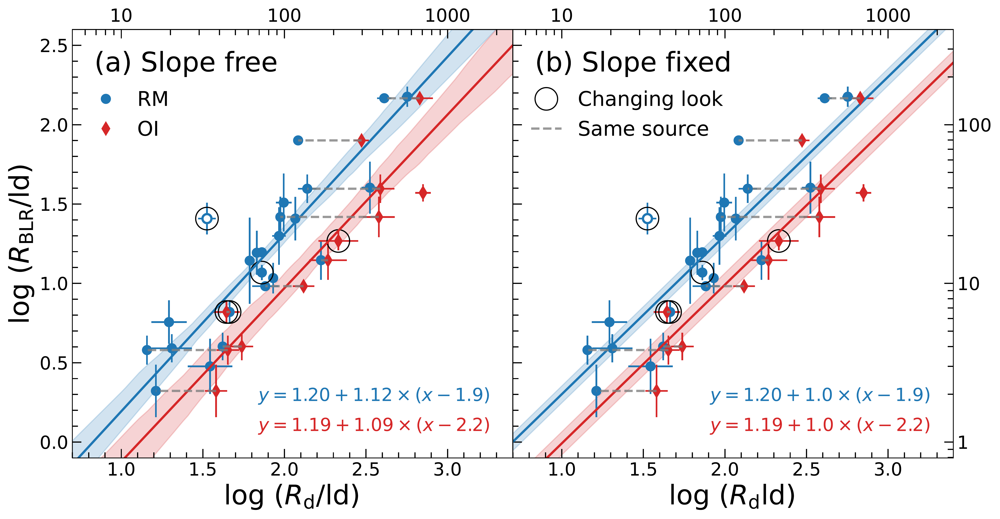
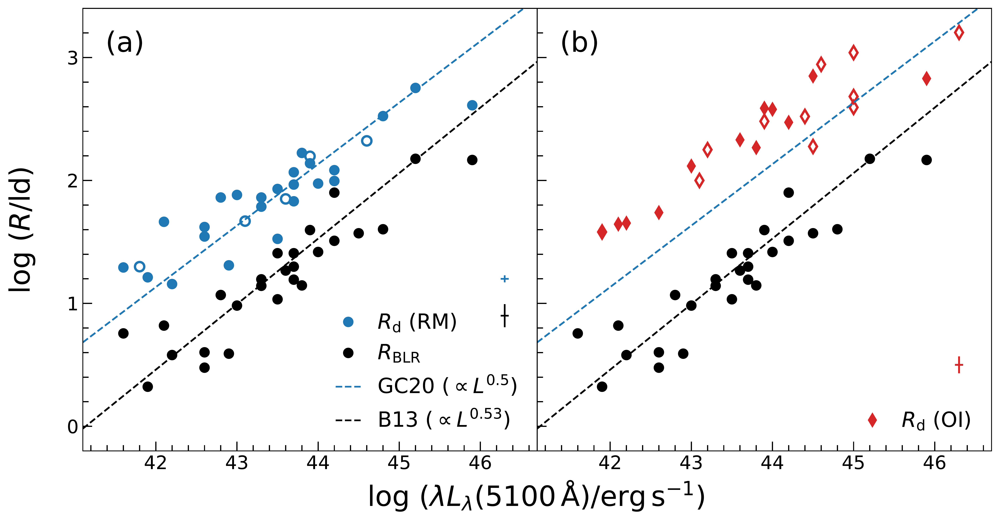
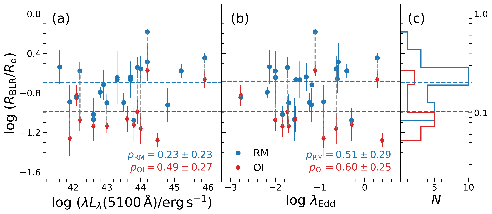

$\newcommand{\ensuremath}{}$
$\newcommand{\xspace}{}$
$\newcommand{\object}[1]{\texttt{#1}}$
$\newcommand{\farcs}{{.}''}$
$\newcommand{\farcm}{{.}'}$
$\newcommand{\arcsec}{''}$
$\newcommand{\arcmin}{'}$
$\newcommand{\ion}[2]{#1#2}$
$\newcommand{\textsc}[1]{\textrm{#1}}$
$\newcommand{\hl}[1]{\textrm{#1}}$
$\newcommand{\mbh}{{\mbox{M_\mathrm{BH}}}}$
$\newcommand{\hii}{\mbox{H{\sevenrm II}}}$
$\newcommand{\ha}{{\mbox{H\alpha}}}$
$\newcommand{\hb}{{\mbox{H\beta}}}$
$\newcommand{\brg}{{\mbox{Br\gamma}}}$
$\newcommand{\paa}{{\mbox{Pa\alpha}}}$
$\newcommand{\civ}{[C{\sevenrm IV}]}$
$\newcommand{\heiia}{He{\sevenrm II} \lambda4686}$
$\newcommand{\heii}{He{\sevenrm II}}$
$\newcommand{\hei}{He{\sevenrm I}}$
$\newcommand{\feii}{Fe{\sevenrm II}}$
$\newcommand{\OIIIa}{[O{\sevenrm III}] \lambda4959}$
$\newcommand{\OIIIb}{[O{\sevenrm III}] \lambda5007}$
$\newcommand{\OIIIc}{[O{\sevenrm III}] \lambda\lambda4959,5007}$
$\newcommand{\OIII}{[O{\sevenrm III}]}$
$\newcommand{\NI}{[N{\sevenrm I}]}$
$\newcommand{\uas}{\mbox{\muas}}$
$\newcommand{\lopt}{\mbox{\lambda L_\lambda (5100 \AA)}}$
$\newcommand{\Rd}{\mbox{R_\mathrm{d}}}$
$\newcommand{\Rb}{\mbox{R_\mathrm{BLR}}}$
$\newcommand{\rEdd}{\mbox{\lambda_\mathrm{Edd}}}$
$\newcommand{\rl}{\mbox{R--L}}$
$\newcommand{\nodata}{{...}}$
$\newcommand{\mcl}{\multicolumn}$
$\newcommand{\um}{{\mbox{\mum}}}$
$\newcommand{\kms}{{\mbox{\mathrm{km s^{-1}}}}}$
$\newcommand{\ergs}{{\mbox{\mathrm{erg s^{-1}}}}}$
$\newcommand{\msun}{{\mbox{M_\odot}}}$
$\newcommand{\uhc}{{\mbox{\mathrm{km s^{-1}~Mpc^{-1}}}}}$
$\newcommand{\degree}{{\mbox{^\circ}}}$
$\newcommand{\hi}{H{\sevenrm I}}$
$\newcommand{\arraystretch}{1.2}$
$\newcommand{\arraystretch}{1.5}$
$\newcommand{\arraystretch}{1.2}$

$\newcommand{$\ensuremath$}{}$
$\newcommand{$\xspace$}{}$
$\newcommand{$\object$}[1]{\texttt{#1}}$
$\newcommand{$\farcs$}{{.}''}$
$\newcommand{$\farcm$}{{.}'}$
$\newcommand{$\arcsec$}{''}$
$\newcommand{$\arcmin$}{'}$
$\newcommand{$\ion$}[2]{#1#2}$
$\newcommand{$\textsc$}[1]{\textrm{#1}}$
$\newcommand{$\hl$}[1]{\textrm{#1}}$
$\newcommand{$\mbh$}{{\mbox{M_\mathrm{BH}}}}$
$\newcommand{$\hii$}{\mbox{H{\sevenrm II}}}$
$\newcommand{$\ha$}{{\mbox{H\alpha}}}$
$\newcommand{$\hb$}{{\mbox{H\beta}}}$
$\newcommand{$\brg$}{{\mbox{Br\gamma}}}$
$\newcommand{$\paa$}{{\mbox{Pa\alpha}}}$
$\newcommand{$\civ$}{[C{\sevenrm IV}]}$
$\newcommand{$\heiia$}{He{\sevenrm II} \lambda4686}$
$\newcommand{$\heii$}{He{\sevenrm II}}$
$\newcommand{$\hei$}{He{\sevenrm I}}$
$\newcommand{$\feii$}{Fe{\sevenrm II}}$
$\newcommand{$\OIIIa$}{[O{\sevenrm III}] \lambda4959}$
$\newcommand{$\OIIIb$}{[O{\sevenrm III}] \lambda5007}$
$\newcommand{$\OIIIc$}{[O{\sevenrm III}] \lambda\lambda4959,5007}$
$\newcommand{$\OIII$}{[O{\sevenrm III}]}$
$\newcommand{$\NI$}{[N{\sevenrm I}]}$
$\newcommand{$\uas$}{\mbox{\muas}}$
$\newcommand{$\lopt$}{\mbox{\lambda L_\lambda (5100 \AA)}}$
$\newcommand{$\Rd$}{\mbox{R_\mathrm{d}}}$
$\newcommand{$\Rb$}{\mbox{R_\mathrm{BLR}}}$
$\newcommand{$\rEdd$}{\mbox{\lambda_\mathrm{Edd}}}$
$\newcommand{$\rl$}{\mbox{R--L}}$
$\newcommand{$\nodata$}{{...}}$
$\newcommand{$\mcl$}{\multicolumn}$
$\newcommand{$\um$}{{\mbox{\mum}}}$
$\newcommand{$\kms$}{{\mbox{\mathrm{km s^{-1}}}}}$
$\newcommand{$\ergs$}{{\mbox{\mathrm{erg s^{-1}}}}}$
$\newcommand{$\msun$}{{\mbox{M_\odot}}}$
$\newcommand{$\uhc$}{{\mbox{\mathrm{km s^{-1}~Mpc^{-1}}}}}$
$\newcommand{$\degree$}{{\mbox{^\circ}}}$
$\newcommand{$\hi$}{H{\sevenrm I}}$
$\newcommand{$\arraystretch$}{1.2}$
$\newcommand{$\arraystretch$}{1.5}$
$\newcommand{$\arraystretch$}{1.2}$

# Towards measuring supermassive black hole masses with interferometric observations of the dust continuum

<mark>Appeared on: 2022-09-30</mark> - _Accepted for publication in A&A; 11 pages, 5 figures, 3 tables_

GRAVITY Collaboration, et al. -- incl., <mark><mark>R. Davies</mark></mark>, <mark><mark>N. M. Förster Schreiber</mark></mark>

**Abstract:** This work focuses on active galactic nuclei (AGNs), and the relationbetween the sizes of the hot dust continuum and the broad-line region (BLR).We find that the continuum size measured using optical/near-infraredinterferometry (OI) is roughly twice that measured by reverberation mapping (RM).Both OI and RM continuum sizes show a tight relation with the$\hb$BLRsize with only an intrinsic scatter of 0.25 dex.  The massesof supermassive black holes (BHs) can hence be simply derived from a dust sizein combination with a broad line width and virial factor. Since the primaryuncertainty of these BH masses comes from the virial factor, the accuracy ofthe continuum-based BH masses is close to those based on the RM measurement ofthe broad emission line.Moreover, the necessary continuum measurements can be obtained on a much shortertimescale than those required monitoring for RM, and are also more time efficientthan those needed to resolve the BLR with OI.  The primary goal of thiswork is to demonstrate measuring the BH mass based on the dust continuum sizewith our first calibration of the$\Rb$--$\Rd$relation.  The current limitationand caveats are discussed in detail.  Future GRAVITY observations are expectedto improve the continuum-based method and have the potential to measure BHmasses for a large sample of AGNs in the low-redshift Universe.

**Figure 3. -** Tight relations between the radii of the BLR and the dust continuum.
The blue circles are AGNs measured by RM, and the red diamonds are the targets
measured by OI.  The gray dashed lines connect the same sources with
both RM and OI measured $\Rd$.  The best-fit $\Rb$--$\Rd$ relations of RM and OI
datasets (formula in the lower right corner of each panel) are shown as the blue
and red lines, respectively.  The black circles enclose the known changing-look
AGNs.  We only exclude Mrk 590, denoted as the empty blue circle, in our
analysis.  The best-fit results with the slope free (a) or fixed to unity (b)
are almost the same, so we mainly adopt the results of (b) in the discussion.
The linear scale is indicated on the top and right axes. (*fig:sc*)

**Figure 2. -** Size--luminosity relations of the dust continuum measured by
(a) RM (blue circles) and (b) OI (red diamonds) are systematically above
that of the BLR (black circles; same in both panels).
The open-colored circles indicate sources without BLR measurements.
The dashed lines in both panels are based on RM-measured $\rl$ relations of the dust continuum \citep[blue;][]{GC2020cont} and
the BLR \citep[black;][]{Bentz2013}.  The typical uncertainties are shown on
the lower right of each panel. (*fig:sample*)

**Figure 4. -** Ratio of BLR and dust continuum sizes as a function of (a) the AGN
luminosity and (b) the Eddington ratio.  The $p$-values of Spearman's rank
correlation coefficient are reported in the lower right corner of each panel for
RM- and OI-measured samples.  The notations are the same as in
Figure \ref{fig:sc}.  The error bars are the quadrature sum of the uncertainties
of $\Rb$ and $\Rd$.  Panel (c) displays the histograms of the ratios.  The dashed
lines indicate the averaged $\Rb/$\Rd$$ based on the fitting of the $\Rb$--$\Rd$ relations with $\beta$ fixed to unity (see also Equation (\ref{eq:rst})).
$\Rb/$\Rd$$ does not show a statistically significant correlation with the $\lopt$ nor the Eddington ratio.  The linear scale of $\Rb/$\Rd$$ is indicated on
the right. (*fig:rat*)

