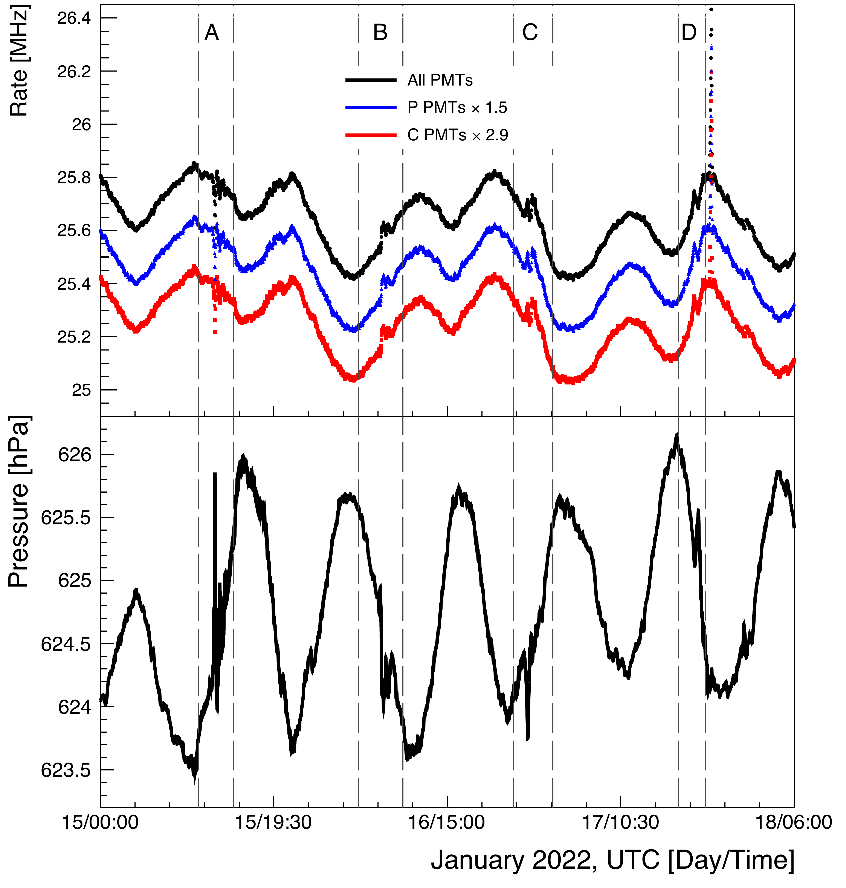

$\newcommand{\ensuremath}{}$
$\newcommand{\xspace}{}$
$\newcommand{\object}[1]{\texttt{#1}}$
$\newcommand{\farcs}{{.}''}$
$\newcommand{\farcm}{{.}'}$
$\newcommand{\arcsec}{''}$
$\newcommand{\arcmin}{'}$
$\newcommand{\ion}[2]{#1#2}$
$\newcommand{\textsc}[1]{\textrm{#1}}$
$\newcommand{\hl}[1]{\textrm{#1}}$

$\newcommand{$\ensuremath$}{}$
$\newcommand{$\xspace$}{}$
$\newcommand{$\object$}[1]{\texttt{#1}}$
$\newcommand{$\farcs$}{{.}''}$
$\newcommand{$\farcm$}{{.}'}$
$\newcommand{$\arcsec$}{''}$
$\newcommand{$\arcmin$}{'}$
$\newcommand{$\ion$}[2]{#1#2}$
$\newcommand{$\textsc$}[1]{\textrm{#1}}$
$\newcommand{$\hl$}[1]{\textrm{#1}}$

# High Altitude characterization of the Hunga Pressure Wave with Cosmic Rays by the HAWC Observatory

<mark>Appeared on: 2022-10-03</mark> - _Contact about this analysis: A. Sandoval (asandoval@fisica.unam.mx), A. Lara (alara@igeofisica.unam.mx) & H. Le\'on Vargas (hleonvar@fisica.unam.mx)_

<mark><mark>R. Alfaro</mark></mark>, et al. -- incl., <mark><mark>R. Diaz Hernandez</mark></mark>, <mark><mark>S. Hernandez</mark></mark>, <mark><mark>A. Lara</mark></mark>, <mark><mark>J.T. Linnemann</mark></mark>

**Abstract:** High-energy cosmic rays that hit the Earth can be used to study large-scale atmospheric perturbations. After a first interaction in the upper parts of the atmosphere, cosmic rays produce a shower of particles that sample the atmosphere down to the detector level. The HAWC (High-Altitude Water Cherenkov) cosmic-ray observatory in Central Mexico at 4,100 m elevation detects air shower particles continuously with 300 water Cherenkov detectors with an active area of 12,500 m$^{2}$. On January 15th, 2022, HAWC detected the passage of the pressure wave created by the explosion of the Hunga volcano in the Tonga islands, 9,000 km away, as an anomaly in the measured rate of shower particles. The HAWC measurements are used to characterize the shape of four pressure wave passages, determine the propagation speed of each one, and correlate the variations of the shower particle rates with the barometric pressure changes, extracting a barometric parameter. The profile of the shower particle rate and atmospheric pressure variations for the first transit of the pressure wave at HAWC is compared to the pressure measurements at Tonga island, near the volcanic explosion. This work opens the possibility of using large particle cosmic-ray air shower detectors to trace large atmospheric transient waves. 

**Figure 6. -** Top panel: Variations on the fractional rate of detected shower particles after the effect of the daily oscillation has been subtracted for the time of the first passage of the Hunga pressure wave. The black line shows the data for all photosensors, and the red and blue lines correspond to each tank's two subsets of central and peripheral sensors. The horizontal dashed line marks the fractional rate of the most significant fluctuation before the pressure wave's arrival. The point where the signal crosses this line defines the arrival time of the wave. It is indicated by the location of the arrow. Bottom panel: The black line shows the measured barometric pressure variations, with the arrival of the pressure wave indicated with the vertical arrow. The pressure variations calculated from the HAWC measured rate variations (top panel) using Eq. \ref{eq:deltar} is shown by the red line. \label{fig:Fluctuations} (*fig:Fluctuations*)

**Figure 3. -** Top panel: Traces of the shower particle rates from the HAWC array as a function of time from January 15th, 00:00 UTC to January 18th, 06:00 UTC. Shown in black are the rates for all considered photosensors; in blue, the subset of peripheral detectors of each tank is scaled up by a 1.5 factor; in red, the subset of central detectors is scaled up by a 2.9 factor. The scale factors were used to display all the data with similar rate values. One sees the bi-diurnal oscillations and superimposed on them the signature of 4 passes of the Hunga explosion pressure wave delimited by the vertical lines in regions A-D. The spike after the D pass is due to an electric storm at the site. Bottom panel: Pressure variations from January 15th, 2022, 0:00 UTC to January 18th, 2022, 6:00 UTC. One sees the twice-daily oscillations are anti-correlated to the particle rate, and superimposed on them the pressure changes due to the passage of the pressure wave (A-D). The short path wave passages are (A) and (C), and the long path passages are (B) and (D).\label{fig:Traces} (*fig:Traces*)

**Figure 1. -** The HAWC gamma- and cosmic-ray observatory on the slopes of the Sierra Negra Volcano, Puebla, Mexico, at 4,100 m elevation. Air shower particles are detected in the 300 water tanks by the Cherenkov light they emit when passing through the water. The picture also shows the detector upgrade that consists of smaller WCDs that surround the main array.\label{fig:HAWCObs} (*fig:HAWCObs*)

