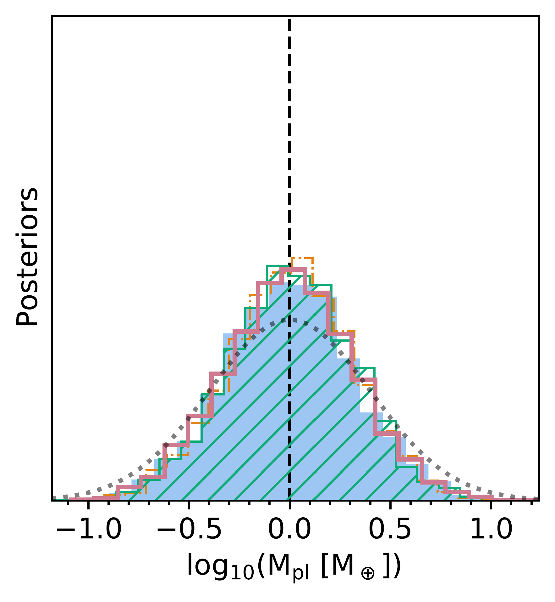

$\newcommand{\ensuremath}{}$
$\newcommand{\xspace}{}$
$\newcommand{\object}[1]{\texttt{#1}}$
$\newcommand{\farcs}{{.}''}$
$\newcommand{\farcm}{{.}'}$
$\newcommand{\arcsec}{''}$
$\newcommand{\arcmin}{'}$
$\newcommand{\ion}[2]{#1#2}$
$\newcommand{\textsc}[1]{\textrm{#1}}$
$\newcommand{\hl}[1]{\textrm{#1}}$
$\newcommand$
$\newcommand{\baselinestretch}{1.0}$

$\newcommand{\ensuremath}{}$
$\newcommand{\xspace}{}$
$\newcommand{\object}[1]{\texttt{#1}}$
$\newcommand{\farcs}{{.}''}$
$\newcommand{\farcm}{{.}'}$
$\newcommand{\arcsec}{''}$
$\newcommand{\arcmin}{'}$
$\newcommand{\ion}[2]{#1#2}$
$\newcommand{\textsc}[1]{\textrm{#1}}$
$\newcommand{\hl}[1]{\textrm{#1}}$
$\newcommand$
$\newcommand{\baselinestretch}{1.0}$

# Atmospheric retrievals for LIFE and other future space missions: the importance of mitigating systematic effects

<mark>Appeared on: 2022-09-30</mark> - _24 pages, 12 figures. Proceedings SPIE Volume 12180, Space Telescopes and Instrumentation 2022: Optical, Infrared, and Millimeter Wave; 121803L (2022)_

Eleonora Alei, et al. -- incl., <mark>Paul Mollière</mark>

**Abstract:** Atmospheric retrieval studies are essential to determine the science requirements for future generation missions, such as the Large Interferometer for Exoplanets (LIFE). The use of heterogeneous absorption cross-sections might be the cause of systematic effects in retrievals, which could bias a correct characterization of the atmosphere.  In this contribution we quantified the impact of differences in line list provenance, broadening coefficients, and line wing cut-offs in the retrieval of an Earth twin exoplanet orbiting a Sun-like star at 10 pc from the observer, as it would be observed with LIFE. We ran four different retrievals on the same input spectrum, by varying the opacity tables that the Bayesian retrieval framework was allowed to use. We found that the systematics introduced by the opacity tables could bias the correct estimation of the atmospheric pressure at the surface level, as well as an accurate retrieval of the abundance of some species in the atmosphere (such as \ce{CO2} and \ce{N2O} ). We argue that differences in the line wing cut-off might be the major source of errors. We highlight the need for more laboratory and modeling efforts, as well as inter-model comparisons of the main radiative transfer models and Bayesian retrieval frameworks. This is especially relevant in the context of LIFE and future generation missions, to identify issues and critical points for the community to jointly work together to prepare for the analysis of the upcoming observations.

**Figure 6. -** example Corner plot for the posterior distributions from the retrievals of Run 1 (color-coded according to Table \ref{tab:setups}). The black lines indicate the expected values for every parameter. On the diagonal, we show the marginalized posteriors for each parameter, with median and 1-$\sigma$ uncertainties as dashed gray lines.
 (*fig:corner_1*)

**Figure 1. -** Spectra
Retrieved spectra compared to the input spectrum (black line) for the various runs. The gray error bars indicate the LIFEsim uncertainty. The color-shaded areas represent the confidence envelopes
(darker shading corresponds to higher confidence). (*fig:spectra*)

**Figure 4. -** Posteriors
 Posterior density distributions for the retrieved bulk parameters (planet radius, planet mass, ground pressure) for the four runs. The vertical, dashed lines mark the expected values for each parameter. For $R_{pl}$ and $\mathrm{log_{10}(M_{pl})}$, dotted lines show the corresponding priors for comparison. (*fig:posteriors_bulk*)

