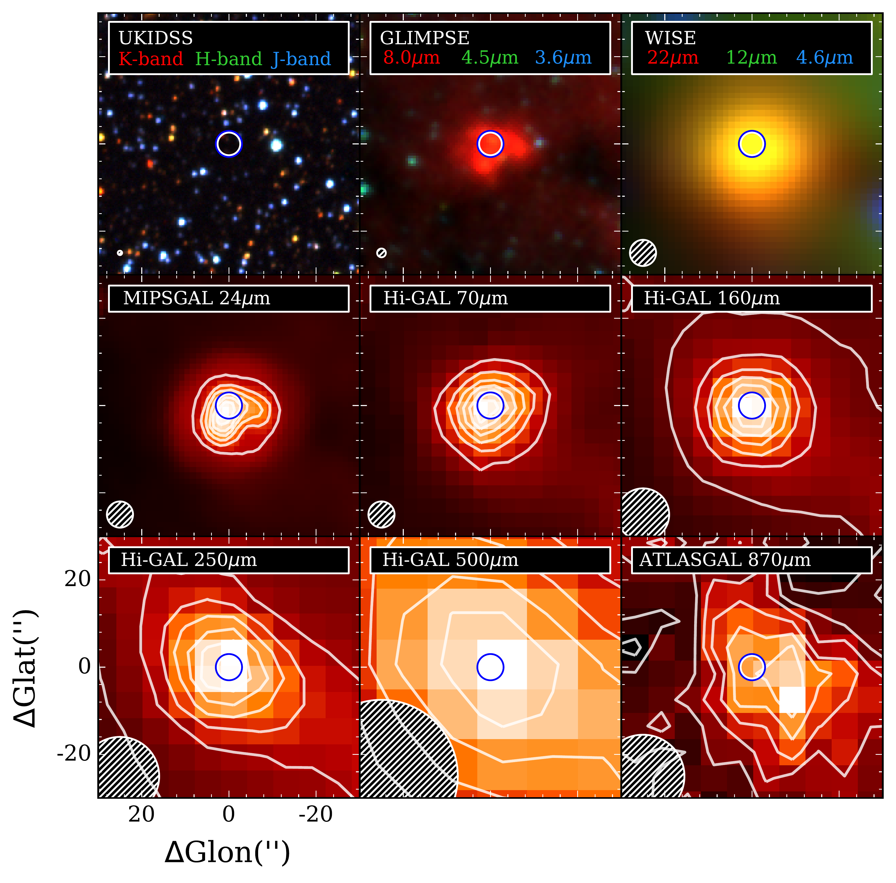
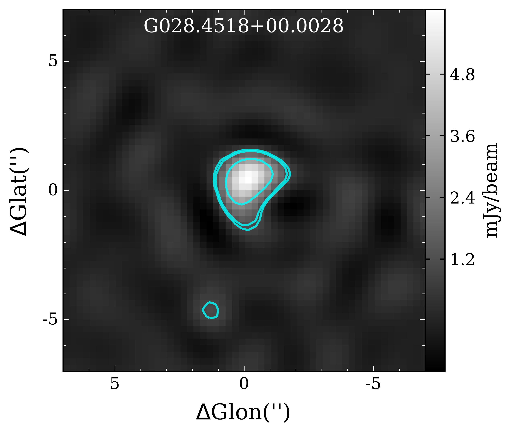
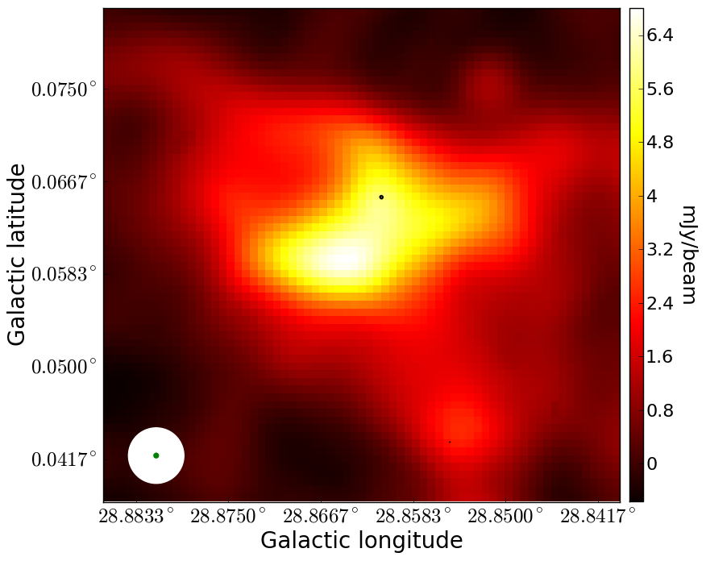
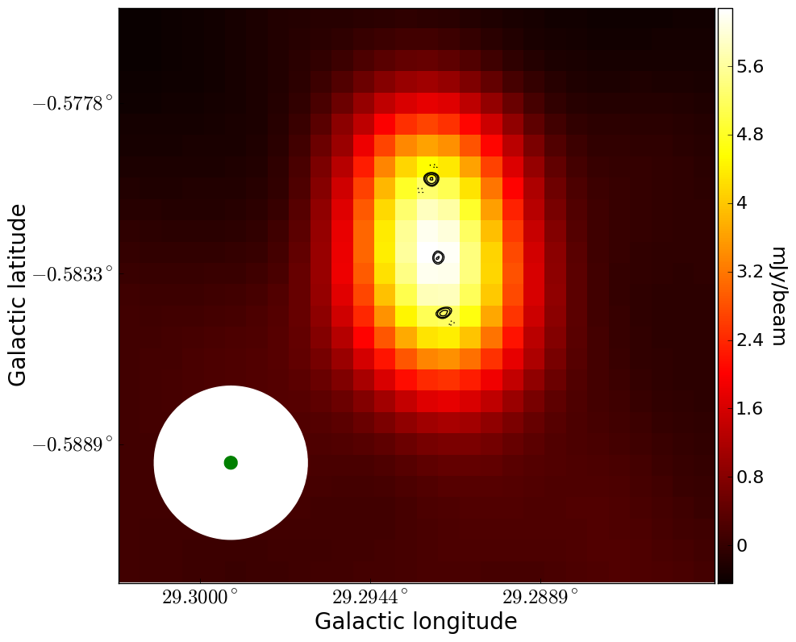
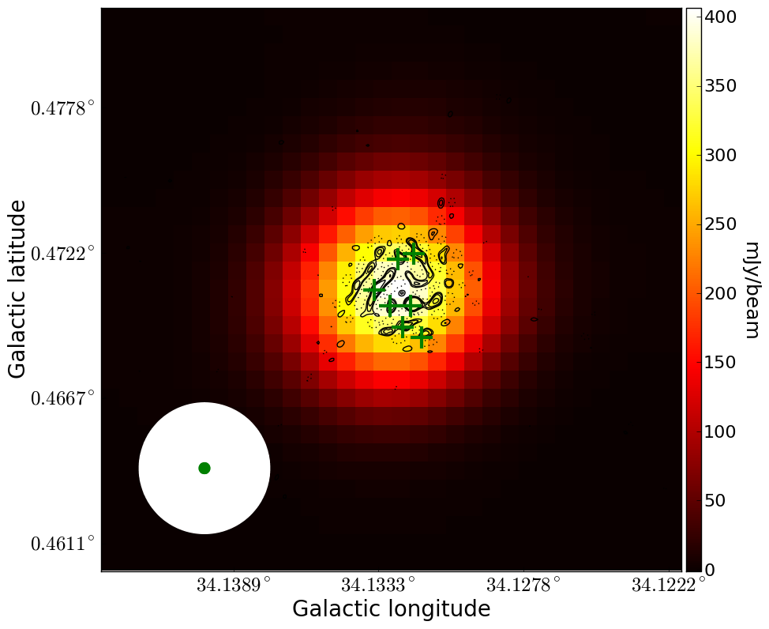
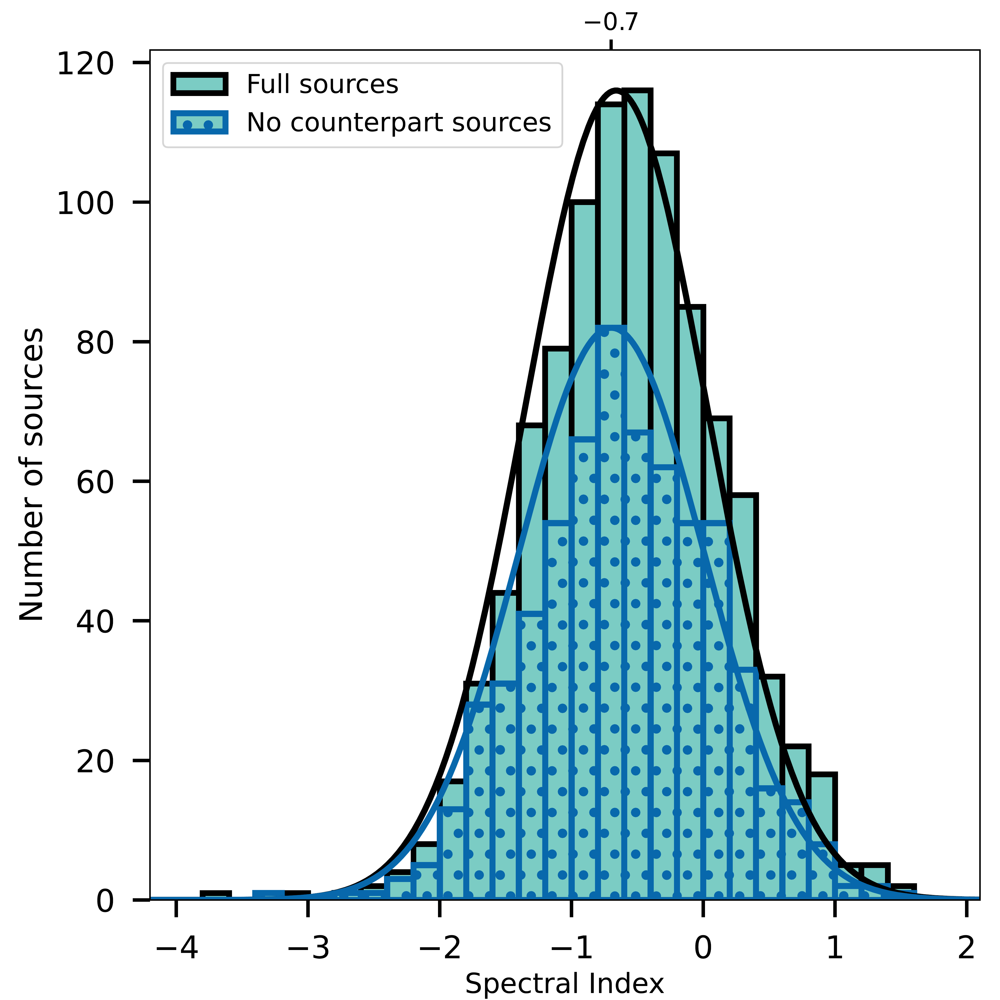

$\newcommand{\ensuremath}{}$
$\newcommand{\xspace}{}$
$\newcommand{\object}[1]{\texttt{#1}}$
$\newcommand{\farcs}{{.}''}$
$\newcommand{\farcm}{{.}'}$
$\newcommand{\arcsec}{''}$
$\newcommand{\arcmin}{'}$
$\newcommand{\ion}[2]{#1#2}$
$\newcommand{\textsc}[1]{\textrm{#1}}$
$\newcommand{\hl}[1]{\textrm{#1}}$
$\newcommand{\ie}{i.e., }$
$\newcommand{\lsun}{L_\odot}$
$\newcommand{\msun}{M_\odot}$
$\newcommand{\rsun}{R_\odot}$
$\newcommand{\hi}{H~{\sc i}}$
$\newcommand{\hii}{H~{\sc ii}}$
$\newcommand{\uchii}{UC H~{\sc ii}}$
$\newcommand{\hchii}{HC H~{\sc ii}}$
$\newcommand{\sex}{\texttt{SExtractor}}$
$\newcommand{\blobcat}{\texttt{BLOBCAT}}$
$\newcommand{\rms}{r.m.s.}$
$\newcommand{\submm}{submillimetre}$
$\newcommand{\Submm}{Submillimetre}$
$\newcommand{\glo}{GLOSTAR}$
$\newcommand{\atlas}{ATLASGAL}$
$\newcommand{\fstblobs}{3880}$
$\newcommand{\Rblobs}{3325}$
$\newcommand{\Spblobs}{555}$
$\newcommand{\HRC}{1457}$
$\newcommand{\LRC}{1866}$
$\newcommand{\Plike}{904}$
$\newcommand{\Clike}{455}$
$\newcommand{\Elike}{100}$
$\newcommand{\arraystretch}{1.1}$
$\newcommand{\arraystretch}{1.1}$
$\newcommand{\arraystretch}{1.4}$
$\newcommand{\arraystretch}{1.4}$
$\newcommand{\arraystretch}{1.1}$
$\newcommand{\arraystretch}{1.1}$

$\newcommand{\ensuremath}{}$
$\newcommand{\xspace}{}$
$\newcommand{\object}[1]{\texttt{#1}}$
$\newcommand{\farcs}{{.}''}$
$\newcommand{\farcm}{{.}'}$
$\newcommand{\arcsec}{''}$
$\newcommand{\arcmin}{'}$
$\newcommand{\ion}[2]{#1#2}$
$\newcommand{\textsc}[1]{\textrm{#1}}$
$\newcommand{\hl}[1]{\textrm{#1}}$
$\newcommand{\ie}{i.e., }$
$\newcommand{\lsun}{L_\odot}$
$\newcommand{\msun}{M_\odot}$
$\newcommand{\rsun}{R_\odot}$
$\newcommand{\hi}{H~{\sc i}}$
$\newcommand{\hii}{H~{\sc ii}}$
$\newcommand{\uchii}{UC H~{\sc ii}}$
$\newcommand{\hchii}{HC H~{\sc ii}}$
$\newcommand{\sex}{\texttt{SExtractor}}$
$\newcommand{\blobcat}{\texttt{BLOBCAT}}$
$\newcommand{\rms}{r.m.s.}$
$\newcommand{\submm}{submillimetre}$
$\newcommand{\Submm}{Submillimetre}$
$\newcommand{\glo}{GLOSTAR}$
$\newcommand{\atlas}{ATLASGAL}$
$\newcommand{\fstblobs}{3880}$
$\newcommand{\Rblobs}{3325}$
$\newcommand{\Spblobs}{555}$
$\newcommand{\HRC}{1457}$
$\newcommand{\LRC}{1866}$
$\newcommand{\Plike}{904}$
$\newcommand{\Clike}{455}$
$\newcommand{\Elike}{100}$
$\newcommand{\arraystretch}{1.1}$
$\newcommand{\arraystretch}{1.1}$
$\newcommand{\arraystretch}{1.4}$
$\newcommand{\arraystretch}{1.4}$
$\newcommand{\arraystretch}{1.1}$
$\newcommand{\arraystretch}{1.1}$

# A global view on star formation: The GLOSTAR Galactic plane survey. VI. Radio Source Catalog II: $28\degr < \ell < 36\degr$ and $|b| < 1$\degr, VLA B-configuration.

<mark>Appeared on: 2022-10-02</mark> - _25 pages, 15 figures, and 6 tables, Accepted for publication in the Astronomy \& Astrophysics_

S. A. Dzib, et al. -- incl., <mark><mark>H. Beuther</mark></mark>

**Abstract:** As part of the Global View on Star Formation (GLOSTAR) surveywe have used the Karl G. Jansky Very Large Array (VLA) in itsB-configuration to observe thepart of the Galacticplane between   longitudes of $28^\circ$ and $36^\circ$ and  latitudes from $-1^\circ$ to $+1^\circ$ at the C-band (4--8 GHz). { To reduce the contamination ofextended sources that are not well recovered by our coverage of the($u, v$)-plane we discarded short baselines that are sensitiveto emission on angular scales $<4"$.} The resultingradio continuum images have an angular resolution of ${1\rlap{.}"0}$ ,and a sensitivity of {${\sim60 \mu}$Jy beam$^{-1}$;} making it the mostsensitive radio survey covering a large area of the Galacticplane with this angular resolution.An automatic source extraction algorithm was used in combination withvisual inspection toidentify a total of { \Rblobs} radio sources.A total of {\HRC} radio sources are $\geq7\sigma$ and compriseour highlyreliable catalog; {72} of these are grouped as {22} fragmented sources,e.g., multiple components of an extended and resolved source.To explore the natureof the catalogued radio sources we searched for counterparts at millimeterand infrared wavelengths. Our classification attempts resulted in 93 \hii region candidates,  104  radio stars,  64  planetary nebulae, while most of theremaining radio sources are suggested to be extragalactic sources.We investigated the spectral indices ( $\alpha$ , $S_\nu\propto\nu^{\alpha}$ )of radio sources classified as \hii region candidates and found that manyhave negative values. This may imply that these radio sources represent young  stellarobjects that are members of the star clusters around the high mass stars thatexcite the \hii regions, but not these \hii regionsthemselves. By comparing the {peak flux densities} from the GLOSTARand CORNISH surveys we have identified {49} variable radio sources,most of them with an unknown nature.Additionally, we provide the list of {\LRC} radio sources detected within 5 to 7 $\sigma$ levels.

**Figure 11. -** Radio source classified as HII region. _ Left:_ Panels are from top-left to
    bottom right: RGB image of UKIDSS three observed bands, RGB image of GLIMPSE
    three observed bands, WISE 12 $\mu$m, Hi-GAL 70 $\mu$m, Hi-GAL 160 $\mu$m,
    Hi-GAL 250 $\mu$m, Hi-GAL 500 $\mu$m, and ATLASGAL 870 $\mu$m. _ Right:_
    Radio source detected in the GLOSTAR B-configuration image. (*fig:eHII*)

**Figure 2. -** Source examples of the differences between the two sets of VLA images, D-configuration (_ background_) and
    B-configuration (_ contours_). Contour levels are $-5$, 5, 7, 10 and 15 times 60 $\mu$Jy beam$^{-1}$, the mean noise level of the images. Circles at the bottom-left side indicate the beam sizes of D-configuration ($18"$, white) and B-configuration ($1\rlap{.}"5$, green) images. _ Top: _ B-configuration compact radio source seen in projection in the area of a D-configuration extended radio source. _ Middle: _ D-configuration compact source that is resolved in three individual compact radio sources in the B-configuration images. _ Bottom:_ D-configuration compact source that is resolved as a fragmented radio source. The position of fragments considered in the final catalog are indicated with green crosses.   (*fig:DB*)

**Figure 5. -** Distribution of the in-band determined spectral indices. Blue dotted bars
    show the spectral index distribution of sources with {no counterparts} at any other
    wavelength. (*fig:hsi*)

