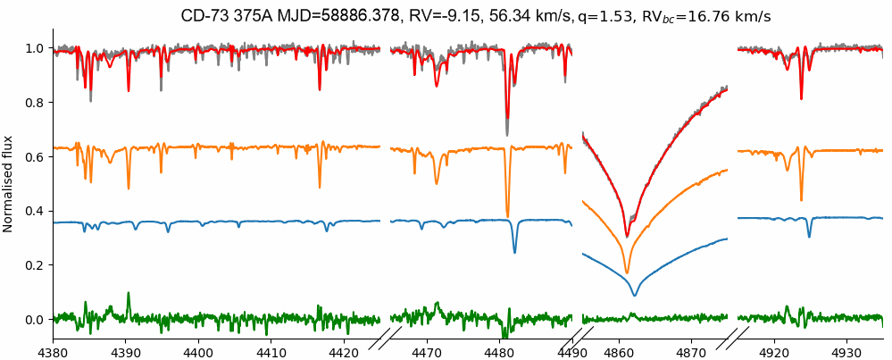
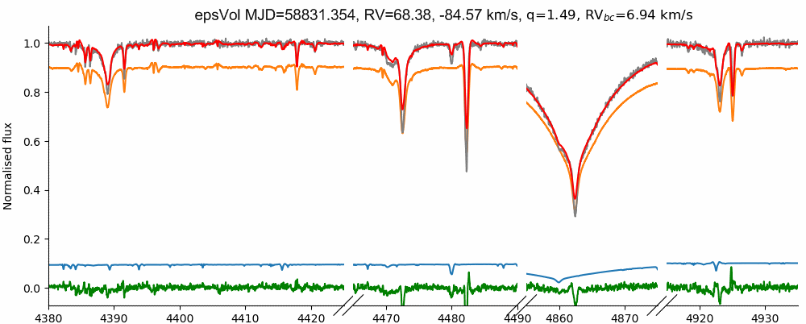
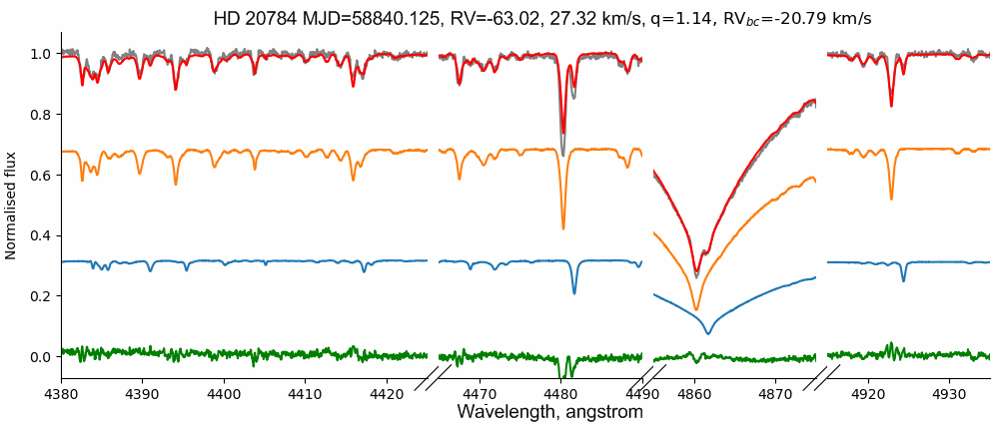
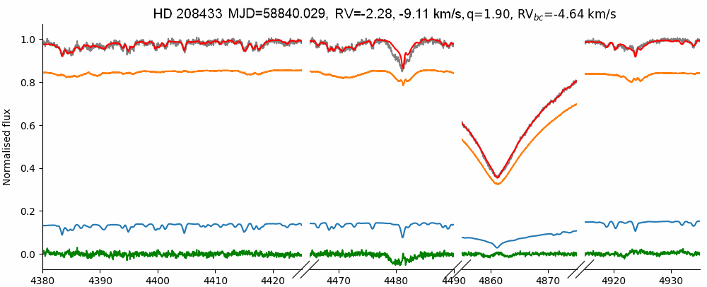
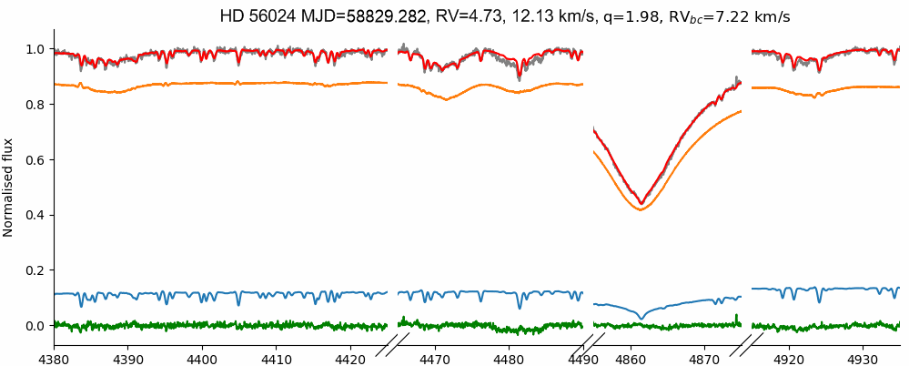
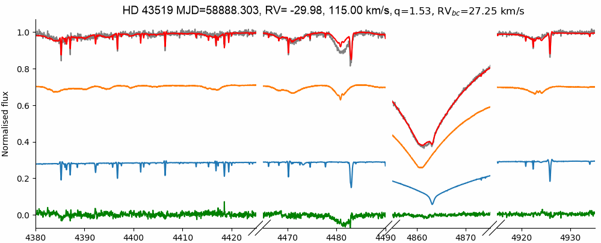
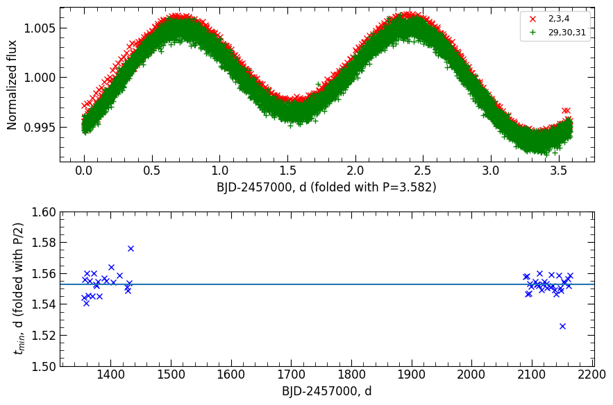

$\newcommand{\ensuremath}{}$
$\newcommand{\xspace}{}$
$\newcommand{\object}[1]{\texttt{#1}}$
$\newcommand{\farcs}{{.}''}$
$\newcommand{\farcm}{{.}'}$
$\newcommand{\arcsec}{''}$
$\newcommand{\arcmin}{'}$
$\newcommand{\ion}[2]{#1#2}$
$\newcommand{\textsc}[1]{\textrm{#1}}$
$\newcommand{\hl}[1]{\textrm{#1}}$
$\newcommand{\teff}{T_{\rm eff}}$
$\newcommand{\rv}{{\rm RV}}$
$\newcommand{\ha}{\hbox{H\alpha}}$
$\newcommand{\thebibliography}{\DeclareRobustCommand{\VAN}[3]{##3}\VANthebibliography}$
$\newcommand{\kms}{ {\rm km} {\rm s}^{-1}}$
$\newcommand{\Msun}{ {\rm M}_\odot}$
$\newcommand{\feh}{\hbox{[M/H]}}$
$\newcommand{\mgfe}{\hbox{[Mg/Fe]}}$
$\newcommand{\tife}{\hbox{[Ti/Fe]}}$
$\newcommand{\mnfe}{\hbox{[Mn/Fe]}}$
$\newcommand{\Vmic}{V_{\rm mic}}$
$\newcommand{\Vmac}{V_{\rm mac}}$
$\newcommand{\vsini}{V \sin{i}}$
$\newcommand{\logg}{\log{\rm (g)}}$
$\newcommand{\snr}{\hbox{S/N}}$
$\newcommand{\}{mn}$
$\newcommand{\}{mn}$
$\newcommand{\}{mn}$
$\newcommand{\}{mn}$
$\newcommand{\}{mn}$
$\newcommand{\}{mn}$
$\newcommand{\}{mn}$
$\newcommand{\@}{tempa}$
$\newcommand{\@}{tempa }$
$\newcommand{\@}{tempb }$
$\newcommand{\@}{tempc$
$  }$
$\newcommand{\@}{tempb }$

$\newcommand{$\ensuremath$}{}$
$\newcommand{$\xspace$}{}$
$\newcommand{$\object$}[1]{\texttt{#1}}$
$\newcommand{$\farcs$}{{.}''}$
$\newcommand{$\farcm$}{{.}'}$
$\newcommand{$\arcsec$}{''}$
$\newcommand{$\arcmin$}{'}$
$\newcommand{$\ion$}[2]{#1#2}$
$\newcommand{$\textsc$}[1]{\textrm{#1}}$
$\newcommand{$\hl$}[1]{\textrm{#1}}$
$\newcommand{$\teff$}{T_{\rm eff}}$
$\newcommand{$\rv$}{{\rm RV}}$
$\newcommand{$\ha$}{\hbox{H\alpha}}$
$\newcommand{$\thebibliography$}{\DeclareRobustCommand{\VAN}[3]{##3}\VANthebibliography}$
$\newcommand{$\kms$}{ {\rm km} {\rm s}^{-1}}$
$\newcommand{$\Msun$}{ {\rm M}_\odot}$
$\newcommand{$\feh$}{\hbox{[M/H]}}$
$\newcommand{$\mgfe$}{\hbox{[Mg/Fe]}}$
$\newcommand{$\tife$}{\hbox{[Ti/Fe]}}$
$\newcommand{$\mnfe$}{\hbox{[Mn/Fe]}}$
$\newcommand{$\Vmic$}{V_{\rm mic}}$
$\newcommand{$\Vmac$}{V_{\rm mac}}$
$\newcommand{$\vsini$}{V \sin{i}}$
$\newcommand{$\logg$}{\log{\rm (g)}}$
$\newcommand{$\snr$}{\hbox{S/N}}$
$\newcommand{\}{mn}$
$\newcommand{\}{mn}$
$\newcommand{\}{mn}$
$\newcommand{\}{mn}$
$\newcommand{\}{mn}$
$\newcommand{\}{mn}$
$\newcommand{\}{mn}$
$\newcommand{\@}{tempa}$
$\newcommand{\@}{tempa }$
$\newcommand{\@}{tempb }$
$\newcommand{\@}{tempc$
$  }$
$\newcommand{\@}{tempb }$

# Test of binary spectral model on FEROS spectra. First estimation of the fundamental parameters for HD 20784.

<mark>Appeared on: 2022-10-04</mark> - _11 pages, 10 figures, submitted to MNRAS. arXiv admin note: text overlap with arXiv:2204.10680, arXiv:2209.12548_

Mikhail Kovalev, <mark><mark>Sarah Gebruers</mark></mark>, Ilya Straumit

**Abstract:** We analyse spectra of 26 early-type stars, with suspected binarity, using a binary spectral model adapted for high-resolution FEROS spectra. We confirm seven SB2 candidates (AE Pic,$\epsilon$Vol, HD 20784, HD 208433, HD 43519, HD 56024, CD-73 375A) and derive mass ratios and spectroscopic parameters for them. We find good agreement with theoretical models. For slightly evolved system HD 20784 we made the first estimation of the fundamental parameters and age$\log{t}=8.5$yr.

**Figure 7. -** Example of the multi-epoch spectra fitting for three stars with slow rotation. The observed spectrum is shown as a gray line, the best fit is shown as a red line. The primary component is shown as the orange line, the secondary as a blue line. The difference O-C is shown as a green line. (*fig:spfit*)

**Figure 9. -** Same as Figure \protect\ref{fig:spfit} for three stars with a fast rotating primary and a slow rotating secondary. (*fig:spfit2*)

**Figure 5. -** Folded TESS LC for HD 20784 from different sectors shown as green and red crosses respectively (top panel). $t_{min}$ folded with $P/2$ versus observation time are shown on lower panel. $t_0$ computed as median is shown as horizontal line. (*fig:period*)

