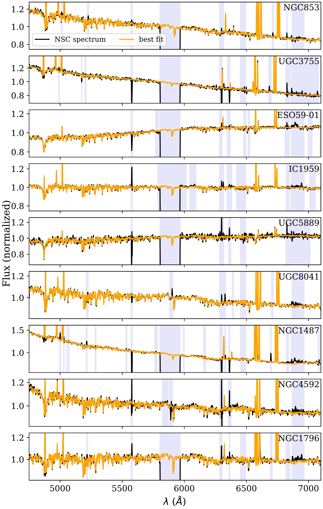

$\newcommand{\ensuremath}{}$
$\newcommand{\xspace}{}$
$\newcommand{\object}[1]{\texttt{#1}}$
$\newcommand{\farcs}{{.}''}$
$\newcommand{\farcm}{{.}'}$
$\newcommand{\arcsec}{''}$
$\newcommand{\arcmin}{'}$
$\newcommand{\ion}[2]{#1#2}$
$\newcommand{\textsc}[1]{\textrm{#1}}$
$\newcommand{\hl}[1]{\textrm{#1}}$
$\newcommand$

$\newcommand{$\ensuremath$}{}$
$\newcommand{$\xspace$}{}$
$\newcommand{$\object$}[1]{\texttt{#1}}$
$\newcommand{$\farcs$}{{.}''}$
$\newcommand{$\farcm$}{{.}'}$
$\newcommand{$\arcsec$}{''}$
$\newcommand{$\arcmin$}{'}$
$\newcommand{$\ion$}[2]{#1#2}$
$\newcommand{$\textsc$}[1]{\textrm{#1}}$
$\newcommand{$\hl$}[1]{\textrm{#1}}$
$\newcommand$

# Based on observations collected at the ESO Paranal La Silla Observatory, Chile, Prog. ID 108.220K.001, 0104.D-0503, 0100.B-0116, and 095.B-0.532.

<mark>Appeared on: 2022-10-05</mark> - _13 pages, 6 figures, accepted for publication in Astronomy & Astrophysics_

Katja Fahrion, et al. -- incl., <mark><mark>Oliver Müller</mark></mark>, <mark><mark>Nadine Neumayer</mark></mark>, <mark><mark>Francesca Pinna</mark></mark>

**Abstract:** Nuclear star clusters (NSCs) are massive star clusters found in all types of galaxies from dwarfs to massive galaxies. Recent studies show that while low-mass NSCs in dwarf galaxies ($M_\text{gal} < 10^{9} M_\odot$) form predominantly out of the merger of globular clusters (GCs), high-mass NSCs in massive galaxies have assembled most of their mass through central enriched star formation. So far, these results of a transition in the dominant NSC formation channel have been based on studies of early-type galaxies and massive late-type galaxies. Here, we present the first spectroscopic analysis of a sample of nine nucleated late-type dwarf galaxies with the aim of identifying the dominant NSC formation pathway. We use integral-field spectroscopy data obtained with the Multi Unit Spectroscopic Explorer (MUSE) instrument to analyse the ages, metallicities, star formation histories, and star formation rates of the NSCs and their surroundings. Our sample includes galaxies with stellar masses$M_\text{gal} = 10^7 - 10^9 M_\odot$and NSC masses$M_\text{NSC} = 6 \times 10^4 - 6 \times 10^{6} M_\odot$. Although all NSC spectra show emission lines, this emission is not always connected to star formation within the NSC, but rather to other regions along the line of sight. The NSC star formation histories reveal that metal-poor and old populations dominate the stellar populations in five NSCs, possibly stemming from the inspiral of GCs. The NSCs of the most massive galaxies in our sample show significant contributions from young and enriched populations that indicate additional mass growth through central star formation. Our results support previous findings of a transition in the dominant NSC formation channel with galaxy mass, showing that the NSCs in low-mass galaxies predominantly grow through the inspiral of GCs, while central star formation can contribute to NSC growth in more massive galaxies.

**Figure 3. -** Star formation rate surface densities $\Sigma_{\text{SFR}}$ for the different galaxies. Each panel shows the 10$\arcsec$$\times$ 10$\arcsec$  zoom to the region around the NSCs. The positions of the NSCs are highlighted by the circles. Each circle has a radius corresponding to the PSF FWHM. The dashed circles highlight the circumnuclear region at 2$\arcsec$, defined by an annulus with inner radius of 8 pixel = 1.6$\arcsec$ and outer radius of 13 pixel = 2.6$\arcsec$. Regions with low signal-to-noise in the H$\alpha$ flux were masked. (*fig:SFRs*)

**Figure 4. -** RGB images of the sample galaxies based on synthetic $V$, $I$, and $R$ band images obtained from the MUSE cubes. The inset shows a zoom to a 10$\arcsec$$\times$ 10$\arcsec$ region around each NSC. The conversion from arcseconds to kpc is shown in white. North is up, east is to the left. (*fig:galaxy_sample*)

**Figure 1. -** NSC spectra in black with $\textsc${pPXF} fit in orange, showing a fit of both the absorption and emission lines. The light purple regions were masked during the fits. Each panel corresponds to one galaxy. We note that the y-axis scale is not the same in all panels. The range is chosen to highlight the absorption line features. For observations acquired with AO, the region around the Na D line is blocked. (*fig:NSC_spectra*)

