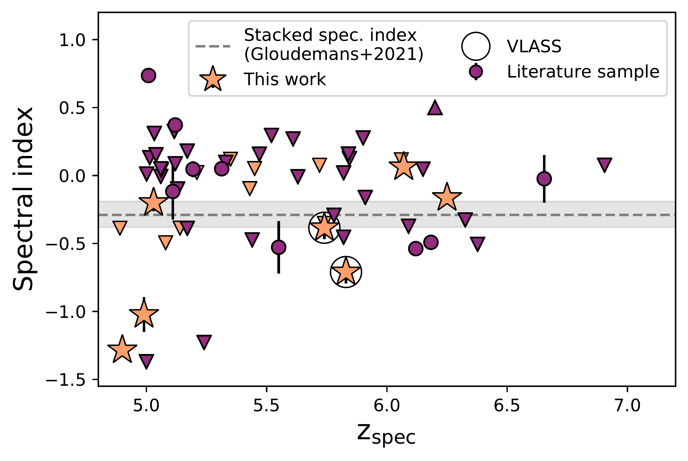
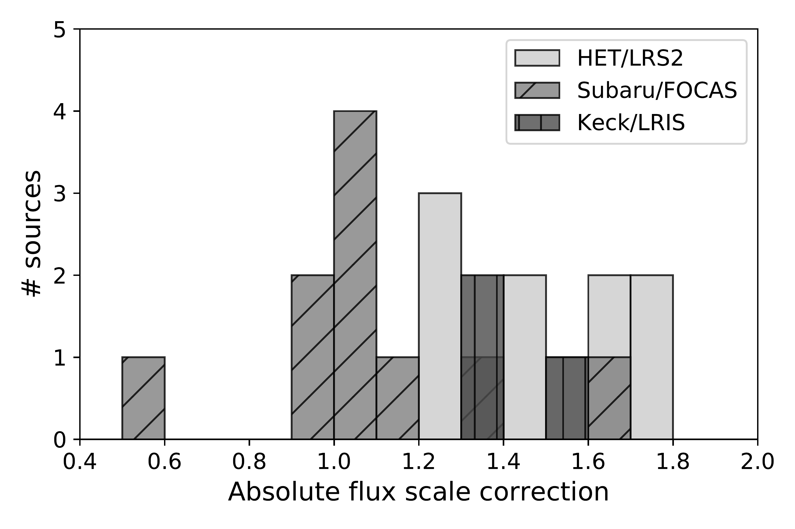
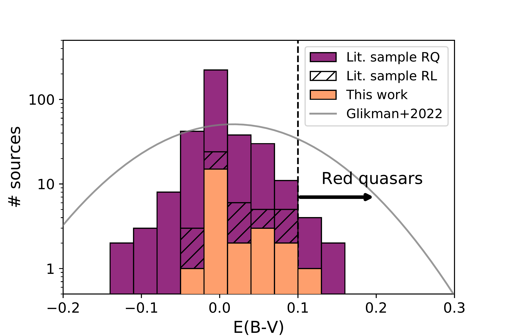

$\newcommand{\ensuremath}{}$
$\newcommand{\xspace}{}$
$\newcommand{\object}[1]{\texttt{#1}}$
$\newcommand{\farcs}{{.}''}$
$\newcommand{\farcm}{{.}'}$
$\newcommand{\arcsec}{''}$
$\newcommand{\arcmin}{'}$
$\newcommand{\ion}[2]{#1#2}$
$\newcommand{\textsc}[1]{\textrm{#1}}$
$\newcommand{\hl}[1]{\textrm{#1}}$
$\newcommand{\RNum}[1]{\uppercase\expandafter{\romannumeral #1\relax}}$

$\newcommand{\ensuremath}{}$
$\newcommand{\xspace}{}$
$\newcommand{\object}[1]{\texttt{#1}}$
$\newcommand{\farcs}{{.}''}$
$\newcommand{\farcm}{{.}'}$
$\newcommand{\arcsec}{''}$
$\newcommand{\arcmin}{'}$
$\newcommand{\ion}[2]{#1#2}$
$\newcommand{\textsc}[1]{\textrm{#1}}$
$\newcommand{\hl}[1]{\textrm{#1}}$
$\newcommand{\RNum}[1]{\uppercase\expandafter{\romannumeral #1\relax}}$

# Discovery of 24 radio-bright quasars at $4.9 \leq z \leq6.6$ using low-frequency radio observations \thanks{Based on observations obtained with the Hobby-Eberly Telescope (HET), which is a joint project of the University of Texas at Austin, Pennsylvania State University, Ludwig-Maximillians-Universitaet Muenchen, and Georg-August Universitaet Goettingen. The HET is named in honor of its principal benefactors, William P. Hobby and Robert E. Eberly.}

<mark>Appeared on: 2022-10-04</mark> - _19 pages, 11 figures, Tab A1 corrected, accepted for publication in A&A_

A. J. Gloudemans, et al. -- incl., <mark>D. J. B. Smith</mark>

**Abstract:** High redshift quasars ( $z>5$ ) that also shine brightly at radio wavelengths are unique signposts of supermassive black hole activity in the early universe. However, bright radio sources at $z \ge 5$ are extremely rare and therefore we have started a campaign to search for new high- $z$ quasars by combining an optical dropout selection driven by the $g$ , $r$ , and $z$ bands from the Dark Energy Spectroscopic Instrument (DESI) Legacy Imaging Surveys with low-frequency radio observations from the LOFAR Two-metre Sky Survey (LoTSS). Currently, LoTSS covers a large fraction of the northern sky ( $\sim$ 5720 deg $^2$ ) to such a depth (median noise level $\sim83$ $\mu$ Jy beam $^{-1}$ ) that about 30 \% of the general quasar population is detected $-$ which is a factor of 5-10 more than previous large sky radio surveys such as NVSS and FIRST, respectively. In this paper, we present the discovery of 20 new quasars (and the independent confirmation of four) between $4.9 \leq z \leq6.6$ . Out of the 24 quasars, 21 satisfy the traditional radio-loudness criterion of $R=f_{5\text{GHz}}/f_{4400 \text{Å}} > 10$ , with the full sample spanning $R\sim$ 6-1000, thereby more than doubling the sample of known radio-loud quasars at $z \ge 5$ . Our radio detection requirement strongly decreases the contamination of stellar sources and allows one to select these quasars in a broad redshift range. Despite selecting our quasar candidates using fewer and less conservative colour restrictions, both the optical and near-infrared colours, Ly $\alpha$ emission line properties, and dust reddening, $E(B-V)$ , measurements of our quasar sample do not deviate from the known radio-quiet quasar population, suggesting similar optical quasar properties of the radio-loud and radio-quiet quasar population at high- $z$ . Our campaign demonstrates the potential for discovering new high- $z$ quasar populations through next generation radio continuum surveys.

**Figure 3. -** Radio spectral index between 144 MHz (LoTSS-DR2) and 1.4 GHz (VLA FIRST) for the discovered quasars in the FIRST and VLASS survey area. Upper limits (indicated by downward-pointing triangles) are given for the quasars non-detected in FIRST. The dashed grey line shows the stacked spectral index obtained by \cite{Gloudemans2021A&A...656A.137G} using a sample of 115 known quasars at $z>5$. ILTJ2201+2338 is outside of the FIRST footprint, but is detected in VLASS at 2-4 GHz, which enables a spectral index measurement. ILTJ1523+2935 is only marginally detected in FIRST (S/N$\sim$2), but is more securely detected in VLASS (S/N$=3.4$). (*fig:radio_spectral_index*)

**Figure 2. -** Absolute flux scale correction factors between the quasar spectra and PS1 $i$-band and Legacy $z$-band photometry. A correction factor of $>1$ means the spectrum continuum is lower than the photometric measurement. These corrections do not affect the redshift and Ly$\alpha$ EW estimates, but do decrease or increase the measured Ly$\alpha$ emission line flux. (*fig:abs_flux_scale*)

**Figure 5. -** Distribution of $E(B-V)$ for the discovered quasars in this work and the literature sample determined by fitting the composite quasars spectrum of \cite{Selsing2016A&A...585A..87S} together with the SMC extinction law \citep{Pei1992ApJ...395..130P}. The radio-loud quasars from the literature sample are stacked on top of quasars from this work. We do not find a significant deviation between the E(B-V) distribution of the RL and RQ quasar sample. For comparison we also plot the $E(B-V)$ Gaussian distribution found by \cite{Glikman2022ApJ...934..119G} of SDSS QSOs at $0.1 < z \lesssim 3$ using a similar template fitting method.  (*fig:e_b_v_plot*)

